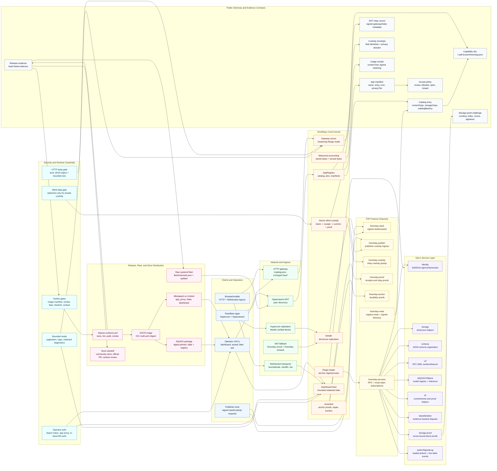

# HiveRelay

**Core3 blind relay infrastructure for Pear/Holepunch apps, packaged as Blindspark for home servers and operated as a live release-gated fleet.**

HiveRelay keeps Hypercore/Hyperdrive applications available after the original
publisher goes offline. It joins the same Hyperswarm DHT as the app, stores and
serves the app's drives, exposes browser/mobile-friendly HTTP ingress, and can
run optional service plugins on top of the relay kernel. For encrypted
workloads, the relay stays blind: private data remains ciphertext on disk,
private catalog metadata is redacted, and the custody plane rejects plaintext
and key-material fields at the schema boundary.

**Blindspark** is the appliance packaging of HiveRelay for Umbrel and StartOS:
a one-page dashboard, first-run setup, wallet destination, service selection,
and persistent identity behind each platform's authenticated app proxy.

**Open source (Apache 2.0)** | **[GitHub](https://github.com/bigdestiny2/P2P-Hiverelay)** | **[npm](https://www.npmjs.com/package/p2p-hiverelay)** | **Status: v0.21.0**

The four packages are versioned in lockstep:

| Package | Role |
|---|---|
| `p2p-hiverelay` | Core relay, CLI, HTTP API, dashboard, gateway |
| `p2p-hiveservices` | Optional service providers and poker/SignedLog substrate |
| `p2p-hiverelay-client` | App/client SDK |
| `p2p-hiverelay-verifier` | Verification helpers |

Release-by-release notes live in [CHANGELOG.md](./CHANGELOG.md). This README is
structured for GitHub `main`: before a tag is cut, `npm run release:prepare`
rewrites the status badge, package manifests, fleet channels, Umbrel metadata,
and StartOS metadata so the published release surfaces agree.

### Current Publication Status

| Surface | Current source state | Publication/evidence boundary |
|---|---|---|
| Core3 packages | Monorepo and package manifests are aligned at `v0.20.2` | A tag/release must run `npm run release:prepare` so versions, fleet channels, Umbrel, and StartOS metadata move together |
| Blindspark on Umbrel | In-repo package uses app proxy, persistent `/data`, review-mode default, and guarded setup/add-wallet/service-manager smoke paths with visible in-flight state | Official App Store inclusion still needs the upstream `getumbrel/umbrel-apps` PR/review plus real-device `umbrel-runtime-review-evidence.json` |
| StartOS | Source can build and verify a digest-pinned `.s9pk` from a published GHCR release image and publish to a configured registry | Current `v0.20.2` package proof is blocked until `ghcr.io/bigdestiny2/p2p-hiverelay:0.20.2` resolves to a multi-arch digest; registry proof requires `startos-registry-evidence.json`; marketplace/community inclusion remains Start9 review-controlled |
| Raw fleet | Pull updater, channel metadata, health gate, rollback, and rollout verifier are in-repo | A release is live on the selected fleet only when `fleet-rollout-evidence.json` proves target SHA, package version, `/health.version`, and relay health |
| Release evidence | Image-manifest, image-smoke, Umbrel-smoke, fleet, official-Umbrel, StartOS-registry, and final handoff verifiers are wired | Sidecars must hash-match `release-evidence.json`; smoke sidecars must not predate the multi-arch image-manifest proof |

---

## What Changed Recently

The repo has moved from a relay prototype into a Core3 infrastructure stack:

- **Application-agnostic Pear app availability**: hand the relay a Hyperdrive key
  plus an accept-mode policy; it keeps the app online and discoverable from the
  DHT without app-specific code or privileged knowledge of what is hosted.
- **Blind substrate for encrypted workloads**: atomic custody processes
  ciphertext only, rejects plaintext/key-material fields at the schema boundary,
  and can prove non-serving after expiry without decrypting content.
- **Verified durability and repair**: Ed25519 anchor proofs decide whether a
  peer counts toward archive replication; AutoHeal recruits diverse relays and
  repairs missing blocks peer-to-peer once a publisher has been online once.
- **Blindspark appliance UI**: a one-page Umbrel/StartOS dashboard with setup,
  add-wallet, service management, restart, live status, apps held, measured
  storage, measured bytes served, and running providers.
- **Umbrel UX fixes**: setup/add-wallet controls no longer submit-refresh the
  page, wallet/setup writes share bounded timeouts and rollback semantics,
  service selection is a flattened card manager instead of a raw checkbox list,
  the `poker` preset enables the poker provider plus required support services,
  restart shows a pending state until selected providers are running, and
  persistence failures return explicit `persist-failed` responses instead of
  pretending the save worked.
- **Measured accounting**: `StorageAccounting` reports real on-disk bytes;
  `ServedAccounting` counts upload bytes from every opened core, fixing the old
  undercounted "stored/served" dashboard blind spots.
- **Disk pressure and corruption hardening**: eviction, purge, tombstones,
  reconcile, corrupt-core timeouts, and manual purge paths make full-disk fleet
  recovery practical.
- **Management API hardening**: timing-safe bearer comparisons, strict
  `application/json` content-type parsing, bounded oversized JSON handling, and
  clean HTTP/WebSocket teardown.
- **Bounded operator/status reads**: public `/status`, catalogs, peer lists,
  router/service discovery, and registry status now share extracted helpers
  with bounded pagination or caps; `/status` exposes shaped liveness and safe
  aggregate counters instead of raw node stats, `/api/peers` is capped at 1000
  entries, and `/api/registry` enriches at most 500 active requests with 100
  relays per request while returning shaped fields instead of raw registry
  records.
- **Operator diagnostics without raw internals**: health detail, storage top,
  AutoHeal status, and metrics history reads are management-only, payload-shaped
  helpers; metrics history filters malformed timestamps and metrics history
  snapshots are capped and shaped; health actions, measured storage rows, and
  AutoHeal drives are also capped and sanitized, and the dashboard WebSocket
  feed reuses that AutoHeal shape before applying its smaller frame cap while
  emitting only custody aggregate counters, relay/seeder counters, transport
  status booleans, and shaped payment/reputation telemetry instead of letting
  bad, raw, or credential-bearing snapshots crash or leak through operator
  dashboards.
- **Startup and release performance**: DHT startup flush is bounded so local
  health/UI endpoints come up while public bootstrap continues; generated
  StartOS artifacts and nested dependencies are excluded from Docker contexts.
- **Delta app-catalog sync**: peers receive a full app catalog on connect, then
  live seed/unseed churn is sent as signed added-entry deltas plus remove hints
  so large catalogs do not re-broadcast wholesale for one-app changes.
- **Services hardening**: remote service pub/sub subscriptions reject wildcard
  firehose topics and enforce per-peer caps.
- **Protocol and SDK expansion, Current-main v0.17-v0.20 surfaces**:
  appliance app seeding, app icons, paid pin leases, durable bare-core
  pinning, signed `catalogBeeKey` catalogs, optional `indexRoom`
  schema-sheets sidecar, DHT relay records, superseded-app dedup/reclaim,
  poker usage receipts, P2P service subscriptions, `verifySeeded`, and
  `proveSeeded`/`storage-proof`.
- **Browser and NAT ingress**: streaming gateway reads with HTTP Range support,
  Hypercore-over-WS replication, optional DHT-over-WS for browser/mobile DHT
  lookups, and `hiverelay-circuit` fallback for NAT-constrained peers.
- **Release surfaces**: GHCR image smoke, Umbrel package smoke, StartOS build
  and verify, multi-arch release-image manifest proof, authenticated telemetry
  smoke, runtime-version proof, packaged dashboard/setup UI-hardening proof, raw
  fleet rollout verification, release evidence, and stable release credential
  preflight are wired into the release workflow.
  Smoke sidecars are accepted only after the pinned multi-arch image manifest
  has been proven.

---

## Architecture

HiveRelay is four connected layers:

1. **Core3 relay kernel**: DHT peer, seeder, app registry, gateway, custody,
   AutoHeal, accounting, eviction, dashboard feed.
2. **Discovery and ingress layer**: HTTP catalog/gateway with streaming Range
   reads, Hypercore-over-WS replication, optional DHT-over-WS for browsers,
   signed Hyperbee catalogs via `catalogBeeKey`, optional signed query sidecar
   via `indexRoom`, and DHT-resolvable relay records for pubkey-to-gateway
   lookup.
3. **Services layer**: opt-in providers for identity, storage, schema, VRF, AI,
   ZK, SLA, arbitration, `storage-proof`, plus the poker/SignedLog substrate.
4. **Distribution layer**: raw systemd fleet, GHCR image, Umbrel package,
   StartOS package, release evidence, and app-store/registry automation.

### Relay System Graph

For the graph-first technical map of the relay, protocol channels, APIs,
security boundaries, and live distribution path, see
[docs/HIVERELAY-ARCHITECTURE-GRAPH.md](docs/HIVERELAY-ARCHITECTURE-GRAPH.md).
That graph now calls out PearBrowser, PearPaste, and anonGPT as live ecosystem
consumers that must stay on the newest HiveRelay line by default.
For the full runtime, protocol, storage, services, trust-boundary, and fleet
deployment diagram, see
[docs/HIVERELAY-DETAILED-ARCHITECTURE-DIAGRAM.md](docs/HIVERELAY-DETAILED-ARCHITECTURE-DIAGRAM.md).
The graph page also includes a printable 2200x1500 SVG asset for release notes,
store handoff, and offline technical review:
[docs/assets/hiverelay-core3-architecture.svg](docs/assets/hiverelay-core3-architecture.svg).



```text
                  Pear / Bare apps
                  browsers / mobile
                         |
             +-----------+-----------+
             |                       |
       Hyperswarm DHT          HTTP gateway
       Protomux channels       /catalog.json
       Hypercore repl          /v1/hyper/:key/*
       Circuit relay           /ws/replicate + /ws/dht
             |                       |
             +-----------+-----------+
                         |
                 HiveRelay Core3
  +------------------------------------------------+
  | AppRegistry  Seeder  Gateway  Dashboard /ws    |
  | AutoHeal     Anchor proofs   Reputation        |
  | StorageAccounting  ServedAccounting  Eviction  |
  | Atomic custody registry + witness tombstones   |
  +-------------------+----------------------------+
                      |
          +-----------+------------+
          |                        |
 Persistent availability      Atomic blind custody
 apps, drives, catalogs       encrypted handoff,
 public gateway content       PVSS recovery shares
          |
          +---------------------------+
                                      |
                    Discovery / index surfaces
           catalog.json  catalogBeeKey  indexRoom  DHT relay record
                                      |
                                      v
                              Services layer
              identity storage schema vrf ai zk sla arbitration
              poker/SignedLog storage-proof + QVAC/Ollama/HTTP
                                      |
                                      v
                       Operators and packaged relays
             npm/Docker | Blindspark on Umbrel | StartOS .s9pk
                                      |
                                      v
                      Release/fleet automation
        GHCR digest -> fleet/channels.json -> raw relays
        Umbrel community/official PR -> StartOS package/registry
```

Core Protomux and Hypercore surfaces run over the same Hyperswarm peer
connections:

| Surface | Purpose |
|---|---|
| Hypercore replication | Registry log and seeded app/drive cores |
| `hiverelay-seed` | Publisher/operator seed requests |
| `hiverelay-publish` | Publisher-signed custody pipeline submissions over P2P |
| `hiverelay-custody` | Relay-to-relay custody entry gossip |
| `hiverelay-proof` | Proof-of-relay and receipt signaling |
| `hiverelay-anchor` | Signed anchor proofs for durability accounting |
| `hiverelay-circuit` | Circuit-relay fallback for NAT-constrained peers |
| `hiverelay-forward` | Forwarded streams through a relay peer |
| `hiverelay-services` | Service discovery, RPC, and pub/sub |
| `hiverelay-registry-meta` | Registry metadata exchange |
| `hiverelay-meta` | Relay metadata/network discovery |
| `hiverelay-signed-directory` | Optional signed-record directory replication |

Browser/mobile clients that cannot speak UDP can still participate through
operator-enabled WebSocket transports:

| Transport | Default bind | Reverse-proxy path | Purpose |
|---|---|---|---|
| Hypercore-over-WS | `127.0.0.1:8765` | `/ws/replicate` | Browser replication streams |
| DHT-over-WS | `127.0.0.1:8766` | `/ws/dht` | Browser HyperDHT lookups through `@hyperswarm/dht-relay` |
| Circuit relay | Protomux `hiverelay-circuit` | P2P channel | Opaque byte forwarding when direct hole-punching fails |

The same source tree supports three deployment shapes:

| Shape | Runtime | Primary user |
|---|---|---|
| Node relay | Node.js 20+, CLI, HTTP API, dashboard | VPS or workstation operators |
| Pear/Bare relay | Bare runtime entrypoint | Pear-native relay distribution |
| Blindspark appliance | Docker package behind platform proxy | Umbrel and StartOS users |

The relay core stays useful without services enabled. Services are loaded only
when configured, while app availability, custody, catalog, gateway, accounting,
and release evidence remain part of the core operational surface.

Three control planes stay deliberately separate:

| Plane | Who uses it | Guardrail |
|---|---|---|
| Public read plane | Apps, browsers, mobile clients | Cacheable catalogs/gateway reads expose only declared-public content |
| Signed publisher plane | App authors and custody clients | Seed, unseed, custody, proof, and directory writes are signed by the relevant key |
| Operator plane | Relay owners and packaged app UIs | Bearer auth, platform proxy auth, strict JSON parsing, bounded bodies, and rollback on persistence failure |

---

## Core Concepts

### Persistent Availability Plane

For public Pear apps, package mirrors, catalogs, datasets, and browser-served
content.

- `storageClass: "persistent"`
- `availabilityClass: "always-on"`
- `durability: 1` archive tier
- AutoHeal keeps replicas across regions/operators.
- Anchor proofs determine whether a peer counts toward durability.
- Measured storage/served-byte accounting feeds dashboards, CLI, metrics, and
  release smoke tests.

### Atomic Blind Custody Plane

For encrypted handoffs, social recovery shares, dead drops, and time-bounded
private transfers.

- `storageClass: "temporary"`
- `availabilityClass: "atomic-handoff"`
- `privacyTier: "p2p-only"` or blind/private equivalents in custody docs
- Signed custody state machine: intent -> receipt -> commit -> source-retired
  -> proof -> non-serving-proof, with expiry witnesses layered on top.
- The validator enforces per-type allowlists and blocks known plaintext/key
  fields such as `plaintext`, `dataKey`, `fileName`, PVSS scalars, and paths.
- Publisher-signed seed ingress uses a fixed field allowlist too; operator
  catalog metadata belongs on authenticated operator seed/catalog paths.
- At `retainUntil`, relays unseed and sign non-serving proofs; independent
  witnesses can sign tombstones.

### Blind Social Recovery

The client SDK can split a secret into publicly-verifiable encrypted shares
using `pvss-secp256k1-v1`. Relays store opaque shares and verify they are
well-formed without decrypting them; any threshold of guardians reconstructs
client-side. See [docs/PVSS-BLIND-CUSTODY.md](docs/PVSS-BLIND-CUSTODY.md).

### Catalog, Index, And Discovery

The public HTTP catalog remains the lowest-friction browser/app-store surface.
Current main also supports stronger Pear-native discovery:

- `catalogBeeKey`: a relay can advertise a signed Hyperbee catalog from
  `/catalog.json` so clients replicate and verify the catalog over P2P.
- `indexRoom`: an optional schema-sheets sidecar mirrors catalog, pin, relay,
  and verification rows into a signed, queryable room, proxied through
  `/index/*` and `/api/index/room` when configured.
- DHT relay records: a relay pubkey can resolve to signed gateway/index-room
  metadata without a trusted central directory.

### Trustless Seed Verification

Clients do not have to trust a relay's catalog claim. Current main exposes two
verification tiers:

- `verifySeeded(driveKey, { relay })`: replicate both drive cores from the
  relay so Hypercore validates content against the signed Merkle root.
- `proveSeeded(driveKey, { relay, samples })`: challenge sampled metadata
  blocks and verify signed proof-of-retrievability responses with nonce
  freshness and relay attribution. The SDK sampling driver prefers the
  kernel-compatible `POST /api/proof/retrievability` route when a cached or
  fetched capability doc advertises `retrievability-proof-http`, can opt into
  the RelayKernel `retrievability-proof-v1` domain-separated signature profile,
  and falls back to the legacy `storage-proof.prove` service RPC for
  compatibility.

The proof provider is privacy-gated: blind or redacted drives return the same
shape as not-held content, avoiding a possession oracle. It also has global
proof-work rate limits, per-caller buckets, and a phantom-core guard.

### Paid Pinning And Reclaim

Paid pin leases are off by default. When enabled by an operator, publishers can
quote/pay for time-bounded seed windows through `/api/lease`. The lease manager
supports direct payment proofs, bearer vouchers, and Cashu NUT-00/01/02 blind
tokens so issue/redeem can be unlinkable while replay guards survive restarts.
Self-hosted operator pins and verified custody intents remain exempt. Bare
Hypercores can be pinned durably through `POST /seed-core`, which is what
signed Hyperbee catalogs need. Superseded app versions can be reclaimed through
`/api/dedup/reclaim`; blind entries, archive pins, custody entries, and active
leases stay protected.

### Services Layer

Services are opt-in. A relay with `enableServices: false` runs only the relay
kernel. The built-in service names are:

| Service | Status | What it adds |
|---|---|---|
| `identity` | core service | Ed25519 identity, sign/verify/resolve |
| `storage` | core service | Service RPC helpers for drives/cores |
| `schema` | core service | Versioned JSON schema registration/validation |
| `vrf` | production-ready | RFC 9381 VRF, sortition, shuffle, beacon |
| `ai` | experimental | Model registry, local/HTTP inference, QVAC/Ollama paths |
| `zk` | experimental | Commitments, membership/range proof helpers |
| `sla` | experimental | Service-level agreements and violation tracking |
| `arbitration` | experimental | Evidence-backed dispute resolution |
| `storage-proof` | opt-in | Signed per-block proof-of-retrievability challenges |
| `signed-directory` | opt-in | Openly writable signed-record directory with TTL, signature, and rate-limit checks |

For RelayKernel compatibility testing, `mode: "relaykernel"` narrows the
runtime to seed/proof/circuit/meta/accounting surfaces: service plugins,
custody, federation, legacy signed-directory discovery, payment settlement,
leases, and subsidy claims are profile-locked off, including constructor
overrides and persisted `services.json` toggles. The public gateway/API, core
proof-of-retrievability route, and review-mode seed ingress stay available.
The browser bootstrap surfaces are pinned in
[docs/RELAYKERNEL-GATEWAY-COMPATIBILITY.md](docs/RELAYKERNEL-GATEWAY-COMPATIBILITY.md)
and checked by `npm run audit:relaykernel-gateway`, so a future extraction
cannot silently drop PearBrowser's `/.well-known/hiverelay.json`,
`/catalog.json`, or `/v1/hyper/:driveKey/*path` contract. The same matrix is
also pinned as the `relaykernel-http-route-matrix-v1-blindspark-compat`
profile vector and verified by `node scripts/verify-profile-vectors.mjs`,
whose default fixture-directory mode requires the full supported vector
inventory exactly once. The vector inventory also includes
`relaykernel-profile-v1-app-module-boundary`, which proves QVAC, poker,
custody, and service plugins are detected as outside-kernel modules instead of
being silently absorbed into the RelayKernel contract.

The Blindspark dashboard exposes a service manager for these plugins. The
`poker` preset enables the `poker` provider plus `vrf`, `arbitration`, and
`zk`; AI model registration is available when `ai` is selected, with inline
status/error feedback, polling-safe form state, and duplicate-submit protection
for appliance operators.

---

## Schemas And Contracts

These are the current public contracts other projects should build against.
They are intended to grow additively; check [CHANGELOG.md](./CHANGELOG.md) and
the package version before treating a field as available on older relays.

### App Manifest

Browser-friendly drives should include `manifest.json` at the root:

```json
{
  "name": "My App",
  "version": "1.0.0",
  "description": "Short one-line description",
  "author": "your-name",
  "entry": "/index.html",
  "icon": "/icon.png",
  "categories": ["utilities"],
  "privacyTier": "public"
}
```

Without a manifest, the relay can still serve a drive by key, but catalog and
browser UX degrade.

### Catalog Entry

Catalog entries and seed requests use these normalized fields:

| Field | Values |
|---|---|
| `contentType` | `app`, `drive`, `dataset`, `media` |
| `privacyTier` | `public`, `local-first`, `p2p-only` |
| `storageClass` | `persistent`, `temporary` |
| `availabilityClass` | `always-on`, `best-effort`, `atomic-handoff` |
| `catalogBeeKey` | optional 64-hex signed Hyperbee catalog key in envelopes |

The HTTP catalog remains the easiest bootstrap path:

- `GET /catalog.json`
- `GET /v1/hyper/:driveKey/*path`

Pear-native clients can also consume signed Hyperbee catalogs when a relay
advertises `catalogBeeKey`.

### DHT Relay Record

Current main can publish a signed HyperDHT mutable relay record keyed by the
relay identity. It maps relay pubkey to public gateway metadata and optional
`indexRoom`, giving clients a DHT-native way to resolve a relay without a
trusted HTTP directory.

### Accept Policy

Relays decide whether to accept new seed requests with a small, public policy
schema:

| Mode | Behavior |
|---|---|
| `review` | Queue signed requests for operator approval |
| `allowlist` | Auto-accept only publisher pubkeys in `acceptAllowlist` |
| `open` | Auto-accept valid signed requests |
| `closed` | Reject inbound seed requests |

`HIVERELAY_ACCEPT_MODE=review` is the first-boot default for fresh Umbrel and
StartOS installs. Once an operator has saved a mode in config, the persisted
choice wins over the environment. The legacy `registryAutoAccept` flag is still
read for compatibility, but new management APIs write `acceptMode` and
`acceptAllowlist`.

### Capability Document

Relays advertise machine-readable state at:

- `GET /.well-known/hiverelay.json`
- `GET /api/capabilities`

The document is additive (`schemaVersion: 1`) and includes relay pubkey,
runtime (`node` or `bare`), version, region, supported transports, feature
flags, limits, federation summary, catalog counts, optional `catalogBeeKey` and
`indexRoom`, and a signed envelope when the relay identity key is available.

### Seeding Manifest

Authors can publish preferred relay sets using signed seeding manifests:

- `POST /api/authors/seeding.json`
- `GET /api/authors/:pubkey/seeding.json`

The client SDK exposes `createSeedingManifest`, `publishSeedingManifest`, and
verified fetch helpers.

### Custody Envelopes

Custody entries are signed Ed25519 envelopes. The relay validates signer
binding, allowed fields, privacy invariants, expiry, share verification, and
commit quorum. Read the full protocol in
[docs/ATOMIC-BLIND-CUSTODY.md](docs/ATOMIC-BLIND-CUSTODY.md).

### Service Manifests

Every service provider exposes:

```js
{
  name: 'service-name',
  version: '1.0.0',
  capabilities: ['method-a', 'method-b']
}
```

Peers discover services with `GET /api/v1/services` or the
`hiverelay-services` Protomux catalog exchange, then call `service.method`
routes through the router. Discovery payloads are shaped before publication:
service rows, capabilities, descriptions, and router pub/sub topics are capped
and sanitized with total/truncated metadata.

### Signed Directory Record

The optional `hiverelay-signed-directory` service stores short signed records
keyed by author pubkey. Records carry author, timestamp, payload, and detached
Ed25519 signature; relays may omit or reorder records but cannot forge them.
The service enforces record size, TTL, timestamp skew, newest-wins updates, and
publish rate limits before single-hop replication.

### Storage Proof Challenge

The `storage-proof.prove` method accepts a challenged core key, block index, and
nonce, reads only locally held app-registry cores, and returns a relay-signed
proof bound to `coreKey`, `index`, `nonce`, and block hash. Clients verify the
proof in an isolated verifier core, so fake content, replayed nonces, wrong
indices, and forged signatures fail independently of catalog trust. The
`StorageProofService` implementation is the opt-in `storage-proof` service
behind that route.

### Usage Receipt

Usage receipts are content-free, counterparty-signed metering records. The
relay verifies receipts, rejects replay, aggregates usage, and exposes
payout-eligible counters separately from self-reported service statistics.

### Dashboard State

The operator dashboard consumes `GET /api/overview` and `/ws`. The summary is
designed for appliance UIs and smoke tests: liveness, peers, apps held, measured
storage, measured served bytes, custody/AutoHeal snapshots, running service
providers, wallet destination state, and pending operator actions.

### Release Evidence

Every release-surface workflow run that gets past checkout writes
`release-evidence.json`. It is the release certificate tying the tag SHA,
metadata commit SHA, GHCR digest, StartOS `.s9pk` SHA-256, distribution
preflight result, smoke gates, fleet rollout channel, store handoff facts, and
sidecar hashes together.

| Evidence file | What it proves |
|---|---|
| `release-image-manifest-evidence.json` | The pinned GHCR digest is an OCI/Docker image index with `linux/amd64` and `linux/arm64` platform manifests before smoke evidence or package metadata is accepted |
| `release-image-smoke-evidence.json` | The exact release image boots and passes `/health.version`, dashboard, setup, review-mode default, wallet, services, in-band dashboard WebSocket auth, usage telemetry, wallet/service/AI action-state, app-proxy-safe seed/lease writes, bounded lease polling, and setup wizard status/action-link smoke checks after image-manifest proof |
| `umbrel-package-smoke-evidence.json` | The in-repo Umbrel package boots through `app_proxy` and preserves setup, wallet, service config, selected providers, dashboard WebSocket auth, health version, telemetry, app-proxy-safe dashboard writes, bounded lease polling, dashboard UI-hardening, and setup wizard link/UI-hardening across restart after image-manifest proof |
| `fleet-rollout-evidence.json` | The selected raw fleet channel converges on the target tag SHA and expected `/health.version` with bounded `timeoutMs`, `intervalMs`, and `sshTimeoutMs` probe timing; `release-evidence.json` stores its SHA-256 |
| `official-umbrel-pr-evidence.json` | The official Umbrel draft PR was refreshed with release, fleet, StartOS package, StartOS registry, and smoke links, plus `runtimeReview.status: pending-real-device-review` |
| `umbrel-runtime-review-evidence.json` | A separate real-device Umbrel lifecycle pass verified install, app-proxy dashboard loading, in-band WebSocket auth, setup, add-wallet, management actions, setup/wallet/service/restart/AI action-state behavior, review-mode default, `/data` writability, and reinstall-preserves-key behavior |
| `startos-registry-evidence.json` | A full-release StartOS registry publish records registry URL, package URL, package id, `.s9pk` hash, release asset links, and StartOS registry evidence SHA-256 |

The workflow runs `npm run release:verify-evidence` before upload so the
release certificate, image-manifest sidecar, smoke sidecars, StartOS artifact,
fleet rollout sidecar, and StartOS registry sidecar agree. Both release and
handoff verification enforce chronology: the image-manifest proof must not be
newer than `release-evidence.json`, and release-image/Umbrel-package smoke
sidecars must not be older than the image-manifest proof they depend on.

The smoke sidecars also prove the Blindspark UI contracts that caused the
Umbrel no-op regressions: wallet/setup actions expose in-flight state, setup
actions are locked while pending, service saves have action state, restart
pending state is visible, and AI model add cannot double-submit.

Finally, `npm run release:verify-handoff-evidence` checks the downloaded
handoff assets against the published release evidence, image-manifest sidecar,
smoke
sidecars, upstream Umbrel PR URL/state/draft/base/head branch, release workflow
URL, StartOS package hash, fleet rollout sidecar/link, StartOS registry/package
links, and the optional real Umbrel runtime-review sidecar when present. Add
`--require-umbrel-runtime-review` for the final review-ready Umbrel handoff so
the check fails until the real-device setup/add-wallet/service lifecycle proof
is attached; `npm run release:verify-review-ready-handoff -- --bundle-dir <dir>`
is the convenience command for that stricter final pass.

---

## HTTP And P2P API Surface

The HTTP API is intentionally split by trust boundary. Public reads remain easy
to cache and proxy; publisher/operator mutations require signatures or
management bearer auth.

| Surface | Endpoint examples | Auth |
|---|---|---|
| Liveness | `GET /health`, `GET /status`, `GET /metrics` | public; `/health` is a bounded runtime/disk-gate response without filesystem paths, `/status` is a bounded liveness/aggregate summary, not raw node stats, and `/metrics` exports redacted finite, no-sniff, no-store Prometheus samples |
| Catalog/gateway | `GET /catalog.json`, legacy `GET /api/apps` / `GET /api/drives`, `GET /v1/hyper/:key/*path` with streaming, `Range`, `Accept-Ranges` | public bounded catalog on Node, Bare, and data-plane gateway surfaces with sanitized top-level metadata and federation snapshot; legacy typed arrays are capped and paginated; gateway streams public content and redacts unexpected drive/read/seed errors behind hardened JSON responses |
| Index sidecar | `GET /index/*`, `GET /api/index/room`, `POST /api/manage/index-room` | public read / management write |
| Browser transports | WSS `/ws/replicate`, WSS `/ws/dht` via reverse proxy | public WS with operator rate limits |
| Gateway stats | `GET /api/gateway` | public |
| Dashboard overview | `GET /api/overview` | public bounded relay/seeder/storage/reputation summary; management auth only adds shaped Tor/Holesail operator details |
| Peer state | `GET /api/peers`, legacy `GET /peers` | public bounded list with total/truncated metadata, malformed peer metadata redacted, and salted peer-key digests by default |
| Capabilities | `GET /.well-known/hiverelay.json`, `GET /api/capabilities` | public |
| Reputation/fork proof reads | `GET /api/reputation`, `GET /api/reputation/:pubkey`, `GET /api/forks/proofs` | public |
| Anchor status | `GET /api/anchors`, `GET /api/anchors?detailed=1`, `GET /api/anchors/:appKey/proof` | public bounded aggregate/proof on Node and Bare, management auth for detailed diagnostics |
| Proof-of-retrievability | `POST /api/proof/retrievability` | public bounded per-block challenge proof; privacy-gated so blind/private/not-held keys are indistinguishable |
| Network discovery | `GET /api/network`, `GET /api/network?detailed=1` | public redacted state, management auth for bounded host/API/Tor/Holesail details |
| Dashboard | `/dashboard`, `/wizard`, `/ws` | local/API token/platform proxy; live WebSocket frames use redacted node stats plus bounded relay/seeder, AutoHeal, custody, transport, payment, and reputation summaries |
| Publisher seed | `POST /api/v1/seed`, `POST /api/v1/unseed` | publisher signature |
| Operator seed | `POST /seed`, `POST /unseed`, `POST /seed-core` | management auth |
| Custody | `/api/v1/custody/*`, `/api/custody/*` | signature or management auth, route-specific |
| Fork proof write | `POST /api/forks/proof` | signed observer proof |
| Registry/catalog management | `GET /api/registry`, `/api/manage/catalog/*`, `/api/registry/*` | management auth; registry status is bounded and sanitized before relay enrichment |
| Federation management | `/api/manage/federation/*` | management auth |
| Delegation/device management | `/api/manage/delegation/*`, `/api/manage/devices`, `/api/manage/pairing` | management auth |
| Config/service management | `/api/manage/config`, `/api/manage/services/available`, `/api/manage/services/config`, `POST /api/manage/services` for live disable/restart | management auth |
| Mode/transport management | `/api/manage/mode`, `/api/manage/transports`, `/api/manage/transport` | management auth |
| Operator diagnostics | `/api/health-detail`, `/api/storage/top`, `/api/auto-heal`, `/api/history` | management auth; shaped health/actions, storage, AutoHeal, and bounded metrics history payloads; health actions, storage rows, AutoHeal drives, and metrics history snapshots are capped and shaped |
| Service RPC | `GET /api/v1/services`, `GET /api/v1/router`, `POST /api/v1/dispatch` | public bounded discovery; dispatch requires management auth for HTTP |
| AI/QVAC models | `/api/manage/ai/models`, `/api/manage/ai/models/remove` | management auth; preserves fixed `AI_*` operator errors and redacts unexpected provider failures |
| Poker/SignedLog | `/api/poker/*`, `/api/poker/:table/events`, P2P `poker/<tableKey>` events | route-specific; public Poker table routes use hardened JSON responses, an exact JSON POST body gate, in-band WS auth, and redacted unexpected HTTP/WS provider errors |
| Paid leases | `GET /api/lease`, `POST /api/lease/config`, seed-request payment proof bodies | public status / management config; direct proofs, bearer vouchers, and Cashu blind-token redemption |
| Dedup/reclaim | `POST /api/dedup/reclaim` | management auth |
| Accounting receipt | `GET /api/accounting/receipt` | management auth; returns a signed OS-grounded storage/served-byte receipt |
| Service/accounting telemetry | `POST /api/usage/receipt`, `GET /api/usage`, `GET /api/poker/usage` | signed receipt / management reads |
| Wallet destination | `GET /api/subsidy`, `POST /api/subsidy/destination` | management auth |
| Fleet/ops controls | `/api/manage/restart`, `/api/manage/shutdown`, `/api/eviction/purge` | management auth |

Management auth accepts `Authorization: Bearer <api-key>` and uses
timing-safe comparison. Localhost-only fallback is available for local binds.
Umbrel and StartOS use `HIVERELAY_UI_EXPOSE_TOKEN` behind their authenticated
app proxies: the relay derives a stable token from the platform seed, embeds it
in served dashboard/wizard HTML, and the bundled UI sends it back as bearer
auth.

POST bodies must be `Content-Type: application/json` and top-level JSON
payloads must be objects; arrays and primitives return a stable JSON 400.
Oversized bodies return a stable JSON 413 with `Connection: close`.

The P2P APIs ride the relay's Hyperswarm peer connection. They are used by
Pear/Bare clients and other relays when HTTP should be bypassed or independently
verified:

| P2P surface | Channel/API | Purpose |
|---|---|---|
| Replication | Hypercore replication | Registry logs, app drives, catalog Bees, bare pinned cores |
| Seed requests | `hiverelay-seed` | Publisher/operator seed requests with signed policy metadata |
| Custody | `hiverelay-publish`, `hiverelay-custody` | Signed blind-custody submissions and relay-to-relay gossip |
| Proofs | `hiverelay-proof`, `hiverelay-anchor`, `storage-proof.prove` | Relay receipts, anchor proofs, sampled retrievability challenges |
| Services | `hiverelay-services`, `callService`, `subscribeService` | P2P service RPC, bounded catalogs, live exact-topic event subscriptions, and redacted unexpected provider errors |
| Poker/SignedLog | `client.subscribeService('poker', tableKey, ...)` | Per-table sealed-action events and SignedLog append streams |
| Discovery | `hiverelay-meta`, `hiverelay-registry-meta`, DHT relay records | Relay metadata, registry summaries, gateway/index-room lookup |

---

## Client SDK And Verification

Most apps should use `p2p-hiverelay-client` instead of calling every endpoint
directly.

| SDK surface | Examples | Purpose |
|---|---|---|
| Content | `publish`, `open`, `get`, `put`, `list` | Create and read Hyperdrives |
| Seeding | `seed`, `unseed`, `getDurableStatus`, `waitForDurable` | Request relay persistence and wait for real replication |
| Reader replicas | `mirror`, `unmirror`, `registerCommunityReplicas`, `enableCommunityReplicas`, `disableCommunityReplicas` | Let readers opt in to serving app-declared drives |
| Custody | `publishCustodyIntent`, `publishCustodyCommit`, `publishSourceRetired` | Drive the signed blind-custody state machine |
| PVSS recovery | `splitForCustody`, `reconstructFromCustody` | Store opaque guardian-encrypted shares on relays |
| Relay selection | `fetchCapabilities`, `refreshCapabilityCache`, `selectQuorum` | Choose diverse/pinned relays from signed capability docs |
| Cross-relay reads | `queryQuorum`, `queryQuorumWithComparison` | Compare relay responses and surface divergence |
| Identity and devices | `exportIdentity`, `importIdentity`, `createDeviceAttestation`, `verifyDeviceAttestation`, `createCertRevocation`, `createPairingCode`, `claimPairingCode` | Move identities across devices and delegate/revoke device keys |
| Accounting | `fetchAccountingReceipt(relayUrl, { apiKey, expectedPubkey })` | Fetch and verify signed OS-grounded relay accounting receipts |
| Services | `callService`, `subscribeService(service, event, onEvent, opts?)` | Call providers and receive live P2P service events |
| Seed verification | `verifySeeded(driveKey, { relay })`, `proveSeeded(driveKey, { relay, samples })` | Verify relay-served content through replication or signed proof-of-retrievability challenges |

Capability documents include a signed `directory_privacy` posture. Clients can
tell whether a relay is merely exposing public catalog/gateway reads
(`catalog-public`) or has explicitly opted into global enumerability through
the signed-directory surface (`global-directory-opt-in`). RelayKernel-profile
relays advertise `relaykernel-private` unless that explicit directory opt-in is
added.

They also advertise `seed-signature-domain-v3` when publisher seed requests can
use the preferred `hiverelay.seed-request.v3` domain-separated signature
preimage; SDK producers keep legacy v2 by default for mixed relay fleets.
Relays with circuit support advertise `circuit-limits-profile-v1` and sign the
effective RelayKernel-compatible circuit caps in
`protocol_profile.circuit_limits`.

For independent HTTP verification, install `p2p-hiverelay-verifier` and run
`hive-verify` against two or more relays. It compares capability documents,
catalogs, and optional drive state without importing the main SDK.

---

## Use Cases

| Use case | What HiveRelay provides |
|---|---|
| Keep a Pear app online | Replicate the app Hyperdrive and advertise it through DHT/catalog |
| Browser/mobile first load | HTTP gateway for `/v1/hyper/:key/*` while P2P sync catches up |
| Browser DHT participation | DHT-over-WS and Hypercore-over-WS behind `/ws/dht` and `/ws/replicate` |
| NAT fallback | `hiverelay-circuit` opaque byte forwarding when direct connections fail |
| App store/catalog source | `/catalog.json`, signed Hyperbee catalog, `catalogBeeKey`, app manifests |
| Queryable relay index | `indexRoom` sidecar, `/index/*`, and DHT relay records |
| Reader-supported replicas | `mirror` and community replica helpers for opt-in reader seeding |
| Blind social recovery | PVSS shares stored as opaque, publicly-verifiable custody data |
| Encrypted handoff/dead drop | Time-bounded atomic custody with non-serving proofs |
| Home relay appliance | Blindspark on Umbrel/StartOS with setup, wallet, services, dashboard |
| Service operator | VRF, schema, identity, storage, AI/QVAC, ZK, SLA, arbitration, storage-proof |
| Card-blind games | Poker/SignedLog substrate with VRF hand seeds, per-table P2P events, and opaque payloads |
| Paid publisher pins | Off-by-default lease quotes and paid seed windows via direct proofs, bearer vouchers, or Cashu blind tokens |
| Raw fleet relay | systemd updater, health-gated release channels, rollback |

---

## Quick Start

> Requirements: Node.js 20+ for the Node runtime. Pear/Bare support is available
> through the Pear entrypoint and `npm run test:bare` coverage.

### App Developer

```bash
npm install p2p-hiverelay-client
```

```js
import { HiveRelayClient } from 'p2p-hiverelay-client'

const app = new HiveRelayClient('./my-app-storage')
await app.start()

const drive = await app.publish('./my-app')
await app.seed(drive.key, {
  durability: 1,
  privacyTier: 'public',
  contentType: 'app',
  storageClass: 'persistent',
  availabilityClass: 'always-on'
})
```

### Operator

```bash
npm install -g p2p-hiverelay
p2p-hiverelay setup
```

Or start directly:

```bash
p2p-hiverelay start \
  --region NA \
  --operator your-org-name \
  --max-storage 50GB
```

### Docker

```bash
docker run -d --name hiverelay \
  -v hiverelay-data:/data \
  -v hiverelay-config:/config \
  -e HIVERELAY_OPERATOR=your-org-name \
  -p 9100:9100 \
  ghcr.io/bigdestiny2/p2p-hiverelay:latest
```

### Pear / Bare

```bash
pear run pear://<key>
pear run pear://<key> -- --region EU --port 9200 --no-updates
```

The Pear/Bare relay speaks the same wire protocol as the Node fleet and is
tested with the real Bare runtime via `npm run test:bare`.

### Local Testnet

```bash
npx p2p-hiverelay testnet --nodes 5
```

---

## Blindspark On Umbrel And StartOS

Blindspark is the home-server UX for HiveRelay.

### Umbrel

The in-repo package lives in [umbrel-app/](umbrel-app/):

- `manifestVersion: 1.1`
- app id: `blindspark`
- app name: `Blindspark`
- digest-pinned GHCR image
- `app_proxy` only; no raw host ports, host networking, privileged mode, or
  Docker socket mount
- persistent `${APP_DATA_DIR}/data:/data`
- identity and dashboard token derived from Umbrel `APP_SEED`
- `HIVERELAY_ACCEPT_MODE=review` so fresh installs queue incoming seed
  requests until the operator switches modes
- `HIVERELAY_MAX_STORAGE=10GB` as a conservative first-boot cap; saved
  operator config wins on later restarts

Official Umbrel App Store publication still requires the upstream
`getumbrel/umbrel-apps` PR/review flow. The release workflow can export the
package and open/update a draft PR when credentials are configured for a full
release.

### StartOS

The StartOS package lives in [startos/](startos/):

- service id: `blindspark`
- `.s9pk` built from the same GHCR digest
- multi-arch x86_64/aarch64 image tarballs
- `/data/.app-seed` identity persistence
- dashboard behind the StartOS service UI/proxy
- `HIVERELAY_ACCEPT_MODE=review` and `HIVERELAY_MAX_STORAGE=10GB` as
  first-boot home-server defaults; saved operator config wins later

Build and verify locally:

```bash
cd startos
make verify IMAGE_DIGEST=sha256:<multi-arch-digest>
```

Official Start9 marketplace/community registry inclusion still requires Start9
review. Full releases can publish to a configured StartOS registry after the
verified `.s9pk` is built.

---

## Live Fleet And Release Automation

HiveRelay also has a raw systemd fleet automation path managed by this repo.
The authoritative inventory is [fleet/relays.json](fleet/relays.json); this
checkout tracks a canary relay plus stable relays across North America, APAC,
and Europe.

The channel targets live in [fleet/channels.json](fleet/channels.json). The
fleet README documents the current box names, roles, and one-time installer.

The model is pull-based. Each box runs `hiverelay-updater` on a systemd timer,
reads [fleet/channels.json](fleet/channels.json), checks out the target release
tag, restarts, health-gates `/health`, and rolls back automatically if the
release does not come up green. Published full releases and pushed `v*` tags
default to `channel=both`, so canary and stable fleet metadata move in the same
verified release run; manual dispatch can still stage canary or stable
separately. A specific release is considered proven on the fleet only when
`fleet-rollout-evidence.json` records the selected inventory digest, target tag
SHA, remote package version, live `/health.version`, bounded probe timing
(`timeoutMs`, `intervalMs`, `sshTimeoutMs`), and healthy result for every
selected relay. Release and handoff verifiers reject missing, malformed, too
short, or too long probe timing so a rollout sidecar cannot stand in for a real
live-fleet convergence window.

### Live Vs Review-Gated Distribution

| Surface | What moves on a full release | Gate |
|---|---|---|
| GHCR image | Multi-arch image tag plus pinned digest | Manifest proof and image smoke |
| Raw fleet | `fleet/channels.json` promotes canary/stable targets; each relay pulls, restarts, health-checks, and rolls back on failure | `fleet-rollout-evidence.json` |
| In-repo Umbrel package | `umbrel-app/` metadata and compose image pin are synchronized | Umbrel package smoke |
| Umbrel community store | The community-store checkout is updated when credentials are configured | Store validation plus package smoke |
| Official Umbrel App Store | A draft `getumbrel/umbrel-apps` PR can be opened or refreshed with release, fleet, StartOS, and smoke links | Umbrel review plus real-device runtime evidence before review-ready handoff |
| StartOS package | A verified `.s9pk` is built from the same digest and uploaded to the GitHub Release | `start-sdk verify` and package hash checks |
| Configured StartOS registry | The verified `.s9pk` is published when registry credentials are configured | `startos-registry-evidence.json` |
| Official Start9 marketplace | Marketplace/community inclusion remains review-controlled | Start9 review |

```text
GitHub release/tag
      |
      v
GHCR multi-arch image + digest
      |
      +--> image manifest proof: linux/amd64 + linux/arm64
      |    + release-image-manifest-evidence.json
      |
      +--> release smoke: /health, dashboard, setup, review-mode default,
      |    wallet, services, dashboard WebSocket auth, usage telemetry
      |    + release-image-smoke-evidence.json
      |
      +--> release:prepare updates package versions, ecosystem app
      |    defaults, fleet channels, Umbrel metadata, StartOS metadata
      |
      +--> Umbrel package smoke: app_proxy, setup, wallet, service
      |    persistence across restart, dashboard WebSocket auth
      |    + umbrel-package-smoke-evidence.json
      |
      +--> StartOS build + verify + GitHub Release asset
      |
      +--> raw fleet rollout check: fleet inventory digest + tag SHA
      |    + /health.version on every selected relay
      |
      +--> release-evidence.json + smoke/fleet sidecar hash verification
      |
      +--> startos-registry-evidence.json after registry publish
      |
      +--> official-umbrel-pr-evidence.json after PR body refresh
      |    with fleet rollout + StartOS package/registry links
      |
      +--> umbrel-runtime-review-evidence.json after real-device
           Umbrel UI lifecycle review, then optional handoff validation
```

Important release commands:

| Command | Purpose |
|---|---|
| `npm run release:prepare` | Sync package versions, ecosystem app defaults, fleet channels, Umbrel, and StartOS |
| `npm run release:check-blockers` | Read-only closure board for the public full-release blockers: clean worktree, distribution env, npm latest, GHCR image proof, Umbrel PR/runtime proof, StartOS registry proof, fleet rollout, and final handoff bundle |
| `npm run release:check-distribution-env` | Fail stable releases missing or malformed npm, fleet, Umbrel, or StartOS credentials; use `--env-file` to validate local candidate secrets before setting GitHub Secrets |
| `npm run release:check-github-setup` | Verify the repo exposes release secret/variable names before tagging and print the safe secret-rotation repair path when names are missing; values are validated by the Actions preflight |
| `npm run release:apply-github-secrets` | Validate a local release secret env-file, then apply those exact values to GitHub Secrets through `gh` stdin |
| `npm run release:check-npm-packages` | Dry-run pack the four publishable npm workspaces and fail missing README/license metadata or unsafe tarball paths before publish |
| `npm run audit:relaykernel-gateway` | Verify the RelayKernel-profile gateway compatibility matrix against the concrete Node/Bare/data-plane route handlers |
| `npm run audit:release-promise` | Verify public release notes and official PR body templates stay scoped to Core Availability / Blindspark instead of overbroad service claims |
| `npm run audit:owned-diff` | Verify a dirty development checkout is composed only of explicitly named audit-owned slices; full release closure still requires a clean worktree |
| `npm run release:check-image-manifest` | Verify the pinned GHCR digest exposes `linux/amd64` and `linux/arm64` manifests |
| `npm run release:smoke-image` | Boot exact GHCR digest and test dashboard/API writes, in-band dashboard WebSocket auth, and usage telemetry |
| `npm run umbrel:smoke-package` | Boot package compose and verify WebSocket auth, telemetry, and persistence |
| `npm run fleet:check-rollout` | Wait for relays to run the target tag SHA and `/health.version` |
| `npm run release:write-evidence` | Emit durable release proof |
| `npm run release:verify-evidence` | Verify release proof and sidecar hashes |
| `npm run release:verify-handoff-evidence` | Verify Umbrel PR, fleet rollout, StartOS registry, and optional real Umbrel runtime-review handoff sidecars; add `--require-umbrel-runtime-review` for review-ready Umbrel handoff |
| `npm run release:verify-review-ready-handoff` | Verify the final Umbrel reviewer handoff and require real runtime-review evidence |
| `HIVERELAY_IMAGE_DIGEST=sha256:<digest> npm run startos:verify` | Build and verify the release `.s9pk` from an exact GHCR digest |
| `npm run startos:verify:local` | Local StartOS mechanics check that explicitly allows the tag-only image path; still requires the current GHCR `:VERSION` tag to resolve and is not release evidence |

Stable releases are distribution-complete by default in the release workflow:
if the fleet SSH key, Umbrel community-store token, official Umbrel PR
credentials, StartOS developer key, or StartOS registry URL are missing, the
release workflow fails before it can silently skip that surface. Prereleases stay isolated with `channel=none`.

See [docs/RELEASE_AUTOMATION.md](docs/RELEASE_AUTOMATION.md) and
[fleet/README.md](fleet/README.md).

---

## Security And Privacy

Key properties:

- **Blind-by-default private workloads**: non-public data is ciphertext; private
  gateway reads are blocked unless the app explicitly declares public content.
- **Schema-level privacy enforcement**: custody envelopes reject unknown fields
  and known plaintext/key-material names; publisher-signed seed ingress rejects
  unknown top-level fields before seeding.
- **Signed control planes**: seed requests, custody entries, manifests,
  capability docs, VRF proofs, and signed-directory records are cryptographically
  verifiable. Seed-request verification accepts the preferred
  `hiverelay.seed-request.v3` domain-separated preimage while retaining legacy
  v2/v1 compatibility.
- **Management API hardening**: bearer tokens are timing-safe, JSON media types
  are exact, body limits are bounded, and persistence failures roll back
  in-memory UI changes before returning `persist-failed`.
- **Live-feed hardening**: token-protected dashboard and Poker event
  WebSockets reject URL tokens and send live updates only after timing-safe
  in-band auth.
- **Release provenance**: full releases are built from the tag SHA, pinned by
  GHCR digest in app packages, smoke-tested, and summarized in release evidence.
- **Operational recovery**: accounting, eviction, tombstones, manual purge, and
  rollback reduce the blast radius of full disks and corrupt cores.

Read more:

- [docs/THREAT-MODEL.md](docs/THREAT-MODEL.md)
- [docs/SECURITY-STRATEGY.md](docs/SECURITY-STRATEGY.md)
- [docs/CRYPTO-GUARANTEES.md](docs/CRYPTO-GUARANTEES.md)
- [docs/AUDIT-2026-06-22.md](docs/AUDIT-2026-06-22.md)

---

## Test Coverage

The test suite covers the core trust stack: custody signing, registry custody,
anchor/custody channels, AutoHeal, WebSocket feed payloads, client custody,
seed revocability, seeding-registry hardening, PVSS split/verify/reconstruct,
SignedDirectory, service supervision, VRF, arbitration, router behavior,
storage-proof verification, service subscriptions, poker usage receipts,
release evidence, release image manifest platform proof, fleet rollout
verification, Blindspark service config, and Umbrel wallet/service persistence
regressions.

```bash
npm audit
npm run lint
npm run audit:workspace
npm run ecosystem:sync -- --check
npm run ecosystem:sync:release -- --check
npm run audit:ecosystem-consumers
npm run audit:ecosystem-consumers:release
npm run ecosystem:sync:local -- --check
npm run test:unit
npm run test:bare
npm test
```

`ecosystem:sync` is the published-app default gate: it refuses to switch
PearBrowser, PearPaste, anonGPT, or other tracked app consumers to npm `latest`
unless the full HiveRelay npm package line (`p2p-hiverelay`,
`p2p-hiverelay-client`, `p2p-hiverelay-verifier`, and `p2p-hiveservices`)
already resolves to the release version.
Use `ecosystem:sync:release` and `audit:ecosystem-consumers:release` for the
remotely managed app repos the release workflow can checkout and push. Use
`ecosystem:sync:local` for checkout-to-checkout development links across every
tracked local app.

The current local ship-loop evidence is tracked in
[docs/TEST-COMMAND-MATRIX-2026-06-27.md](docs/TEST-COMMAND-MATRIX-2026-06-27.md).

Release/package smoke tests:

```bash
npm run release:smoke-image -- ghcr.io/bigdestiny2/p2p-hiverelay:<version>@sha256:<digest>
npm run umbrel:smoke-package -- --image-ref ghcr.io/bigdestiny2/p2p-hiverelay:<version>@sha256:<digest>
npm run fleet:check-rollout -- --target v<version> --channel both
```

---

## Documentation

### Start Here

- [docs/HIVERELAY_OVERVIEW.md](docs/HIVERELAY_OVERVIEW.md) - mental model
- [docs/HIVERELAY-ARCHITECTURE-GRAPH.md](docs/HIVERELAY-ARCHITECTURE-GRAPH.md) -
  graph-first relay, protocol, API, security, and release/fleet map
- [docs/HIVERELAY-DETAILED-ARCHITECTURE-DIAGRAM.md](docs/HIVERELAY-DETAILED-ARCHITECTURE-DIAGRAM.md) -
  detailed runtime, storage, services, trust-boundary, and fleet deployment map
- [docs/PEAR-INTEGRATION.md](docs/PEAR-INTEGRATION.md) - Pear/Bare integration
- [docs/PEARBROWSER-INTEGRATION.md](docs/PEARBROWSER-INTEGRATION.md) - browser contracts
- [docs/ECOSYSTEM-UPGRADE-0.20.2.md](docs/ECOSYSTEM-UPGRADE-0.20.2.md) -
  app-by-app upgrade notes for stale non-bundled Hiverelay consumers
- [docs/DEVELOPER.md](docs/DEVELOPER.md) - broad developer reference; this
  README, the changelog, and current source are authoritative for newer
  Core/Services and release-evidence surfaces
- [docs/TUTORIAL-QUICKSTART.md](docs/TUTORIAL-QUICKSTART.md) - first app tutorial
- [CHANGELOG.md](./CHANGELOG.md) - release notes

### Protocol And Services

- [docs/SERVICES.md](docs/SERVICES.md) - services layer and built-ins
- [docs/WHATS-IN-THE-RELAY.md](docs/WHATS-IN-THE-RELAY.md) - component tour
- [docs/PROTOCOL-SPEC.md](docs/PROTOCOL-SPEC.md) - older protocol draft; check
  the changelog and current code for the latest Core/Services split

### Custody

- [docs/ATOMIC-BLIND-CUSTODY.md](docs/ATOMIC-BLIND-CUSTODY.md)
- [docs/PVSS-BLIND-CUSTODY.md](docs/PVSS-BLIND-CUSTODY.md)
- [docs/TUTORIAL-CUSTODY-QUICKSTART.md](docs/TUTORIAL-CUSTODY-QUICKSTART.md)
- [docs/ATOMIC-CUSTODY-SIMULATION.md](docs/ATOMIC-CUSTODY-SIMULATION.md)

### Operators And Packages

- [PRODUCTION.md](./PRODUCTION.md)
- [docs/REVERSE-PROXY.md](docs/REVERSE-PROXY.md)
- [fleet/README.md](fleet/README.md)
- [umbrel-app/README.md](umbrel-app/README.md)
- [startos/README.md](startos/README.md)
- [docs/RELEASE_AUTOMATION.md](docs/RELEASE_AUTOMATION.md)

---

## Links

- **GitHub**: [github.com/bigdestiny2/P2P-Hiverelay](https://github.com/bigdestiny2/P2P-Hiverelay)
- **npm (core)**: [p2p-hiverelay](https://www.npmjs.com/package/p2p-hiverelay)
- **npm (client)**: [p2p-hiverelay-client](https://www.npmjs.com/package/p2p-hiverelay-client)
- **npm (verifier)**: [p2p-hiverelay-verifier](https://www.npmjs.com/package/p2p-hiverelay-verifier)
- **Docker image**: `ghcr.io/bigdestiny2/p2p-hiverelay:latest`
- **Live dashboard**: `http://{relay}:9100/dashboard`
- **Catalog**: `http://{relay}:9100/catalog.json`

---

## License

Apache 2.0 - full text in [LICENSE](LICENSE).

The protocol, SDK, and reference implementation are open. Alternative
implementations are welcome and encouraged; the protocol is independent of any
specific implementation.
