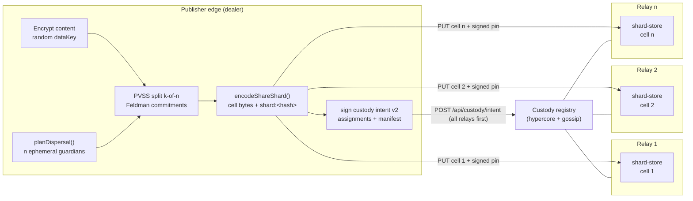
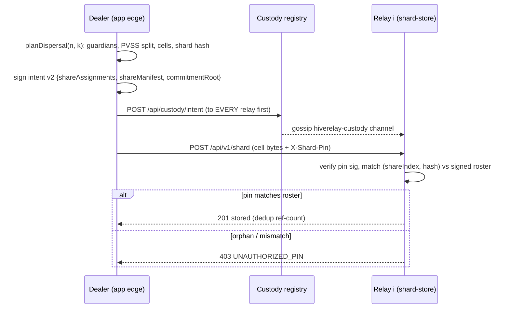
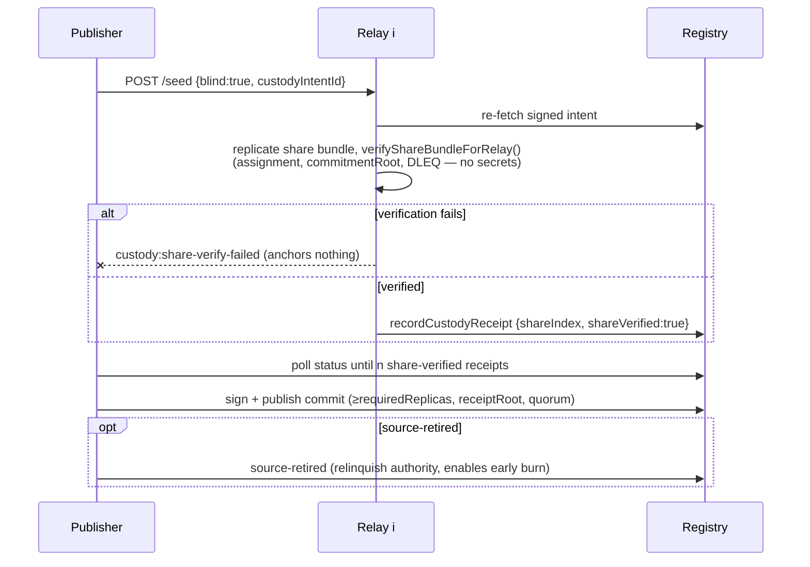
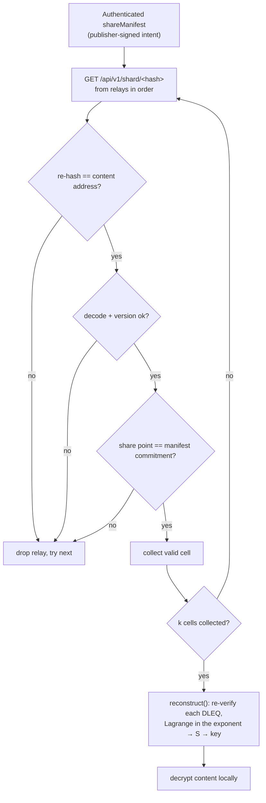
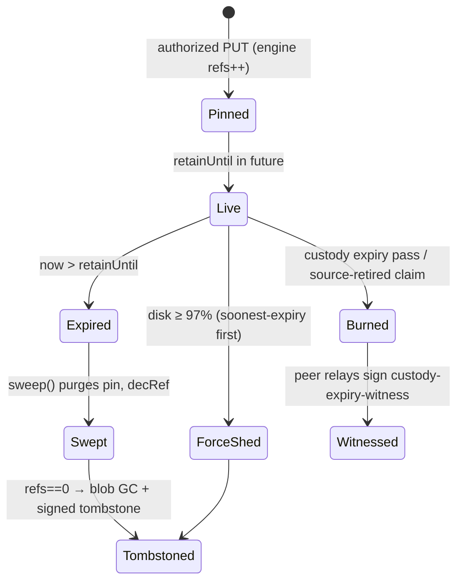
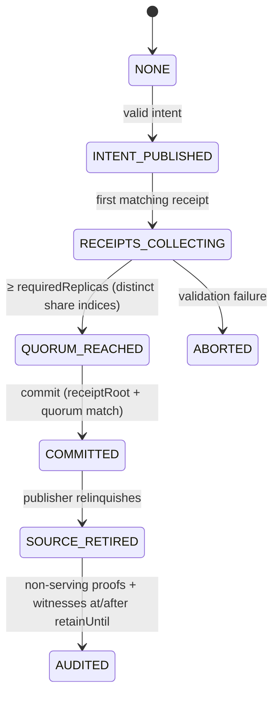

# Blind Cells — Verifiable Threshold Custody of Encrypted Secrets

**Status:** shipped (v0.22–0.24.x line) · **Code:** `packages/client/blind-shards.js`, `packages/services/builtin/shard-store/`, `packages/core/core/pvss.js`, `packages/core/core/custody-signing.js`

> **Naming note:** there is no `cell` symbol in the code. In this document, **one cell = one blind shard blob** — a self-contained, content-addressed (`shard:<blake2b-256>`), independently placeable, publicly verifiable unit of an encrypted whole. The subsystem that produces and custodies cells is the *blind-shard dispersal* machinery, the third generation of HiveRelay's blind custody line.

## 1. What it is

A publisher encrypts content at its own edge, splits the decryption key into **n opaque shares** with publicly-verifiable threshold secret sharing (PVSS), and places **exactly one cell on each of n independent relays**, bound by a signed custody intent so each relay can only store the share assigned to it.

- No single relay — and no *k−1* colluding relays — can reconstruct the key.
- Any reader gathering *k* of *n* cells reconstructs the key entirely client-side.
- Relays store opaque blobs, **publicly verify** share well-formedness *without decrypting anything*, sign custody receipts, and later sign proofs of possession and of post-expiry non-serving (provable **BURNED**).

This solves: custody handoff without trusting any operator, threshold-destroyed keys for timed/handoff drops, and social-recovery-grade secret custody.

**Three generations coexist** and share one custody state machine:

| Generation | Since | What relays custody |
|---|---|---|
| Atomic Blind Custody | v0.8.0 | encrypted **content** (drives) |
| PVSS Blind Key Custody | v0.9.x | PVSS **share bundles** (one hypercore per secret) |
| Blind-shard dispersal (cells) | v0.22+ | per-share **content-addressed blobs** |

## 2. Architecture

The hard rule of the design: **the signed intent is published to every relay BEFORE any cell is uploaded.** A cell that arrives without a matching roster entry is rejected as an orphan (`UNAUTHORIZED_PIN`).

## 3. The crypto, briefly

Scheme `pvss-secp256k1-v1` (Schoenmakers PVSS over secp256k1; confidentiality is computational — DDH — not information-theoretic Shamir):

- Dealer picks a degree `k−1` polynomial `p(x)` with `p(0) = s`. Feldman commitments `C_j = a_j·C_GEN` are published under a **second, nothing-up-my-sleeve generator** `C_GEN` (with one generator, `C_0 = G^s` would leak the secret point — two generators are load-bearing).
- Share *i* is the public point `X_i = C_GEN^{p(i)}`, ElGamal-encrypted to ephemeral guardian `y_i` as `Y_i`, with a Fiat–Shamir **DLEQ proof** that the same exponent underlies both — anyone can verify, nobody learns `p(i)`.
- A **cell** carries the *decrypted share point* `S_i = p(i)·G`, the shareholder point, `Y_i`, and the decryption DLEQ. Anyone can verify a cell is well-formed; only ≥ *k* cells reconstruct.
- Key derivation: `key = blake2b-256('hiverelay-pvss-key-v1:' || S)`. Content address: `shard:` + blake2b-256(cell bytes).
- All authorization is Ed25519 with domain separation: custody entries `hiverelay-<type>-v1:`, shard pins `hiverelay.shard-pin.v1\0`, possession proofs `hiverelay.shard-possession.v1` (modes R/A/T).

| Relay sees | Relay never sees |
|---|---|
| opaque cells + hashes, commitments, `Y_i`, DLEQ proofs | the secret, derived key, share scalars `p(i)` |
| signed intents/receipts, pubkeys, timing/size metadata | plaintext, `dataKey` (18 field names hard-blocked by the validator) |

## 4. Flows

### 4.1 Disperse (dealer path)

Steps, with the code behind them:

1. `planDispersal({count, threshold, secret?})` (`packages/client/blind-shards.js:162`) — keygen guardians, PVSS `split()`, decrypt each share to its cell payload with DLEQ, `encodeShareShard()` + `shardAddressOf()`.
2. `createCustodyIntent(fields, publisherKeyPair)` (`packages/core/core/custody-signing.js:218`) — v2 intent: `shareScheme`, `shareThreshold`, `commitmentRoot`, `shareAssignments: [{relayPubkey, shareIndex}]`, `shareManifest: [{shareIndex, shard, shareCommitment}]`.
3. Publish the intent to **every** relay — `POST /api/custody/intent` → `seedingRegistry.publishCustodyIntent()` → validated, appended to the local hypercore log, gossiped on the `hiverelay-custody` Protomux channel.
4. PUT each cell to **its assigned relay only** — `createHttpShardPut()` (`packages/client/shard-transport.js:47`) signs a custody pin and posts bytes with `X-Shard-Pin`.
5. Relay authorization — `ShardStoreService.put()` → `authorizeShardPin()`: pin signature, custody assignment lookup (`RelayNode._resolveShardCustodyAssignment()`), **both** `shareIndex` and `hash` must match the signed roster. Storage: `ShardEngine.put()` — hash-check, dedup ref-count, bytes to hyperblobs, index row to Hyperbee, pin journaled.

The convenience orchestrator `disperse()` (`packages/client/blind-custody.js:56`) runs steps 1–4 with injected signers — **keys never leave the app**. Note: it deliberately stops before receipts/commit; completing the state machine is the app's job (or the seedApp-driven path in §4.2).

### 4.2 Custody commit (receipt quorum)

Receipts are anchored **only** from inside the seeding pipeline (`app-lifecycle._recordCustodyReceipt()`), fail-closed on any verification error. The commit re-checks quorum size, recomputed `receiptRoot`, matching `relayQuorum`, and **distinct share indices**.

### 4.3 Retrieve and reconstruct (reader path)

The relay is trusted for **nothing**: content-address re-hash, shape validation, manifest commitment binding, and per-share DLEQ re-verification are all client-side gates. Below threshold → `INSUFFICIENT_SHARDS`. The one thing that must be authentic is the manifest itself — it travels inside the publisher-signed intent.

### 4.4 Retention, expiry, burn

- A cell lives while ≥1 live pin; `sweep()` purges expired pins and GCs unreferenced blobs with signed tombstones.
- Disk pressure: expired-only at ≥85%, force-shed live pins at ≥97% (256/sweep cap).
- Custody expiry monitor (60 s tick) unseeds expired custody entries and auto-signs `custody-non-serving-proof` (throws `STILL_SERVING` if anything remains); a valid `source-retired` triggers an **immediate** burn. Peer relays then witness each non-serving proof with `custody-expiry-witness` tombstones (self-witness refused).

## 5. Custody state machine

Transition guards (`validateCustodyTransition()`): receipts must match the intent (`blindContentId`, `ciphertextRoot`, version), arrive before `deadline`, carry `retainUntil ≥ intent.retainUntil`, and — for PVSS — echo the scheme, match assignments **and** manifest, and have `shareVerified: true`. Commits stay pending (not rejected) when quorum data hasn't arrived yet. Entry freshness: ±10 min skew, 180-day max age.

## 6. Data structures (wire formats)

- **Cell**: canonical JSON `{v:1, scheme, index, share, shareholder, encryptedShare, proof:{e,s}}` — 66-hex points / 64-hex scalars, fixed key order.
- **Intent v2 share fields**: `shareScheme, shareThreshold, commitmentRoot, shareAssignments[], shareManifest[]` (+ optional `shareBundleKey` for the bundle generation).
- **Receipt v2 share fields**: `shareScheme, commitmentRoot, shareIndex, shareCommitment, shareVerified`.
- **Pin** (7 signed fields): `{reason, hash, pinner, custodyIntentId, shareIndex, retainUntil, nonce}` — identical pins collapse to one `pinRef` (retry-safe).
- **Proofs**: Mode R (bytes+nonce), Mode A (claim+nonce), Mode T (tombstone), each with an explicit `limitation` field.

## 7. Config and limits

- Relay custody block: `custody.{defaultMode:'blind', requireEncryptedPayload, metadataVisibility:'redacted', proofTarget:'ciphertext', defaultRetainMs:30d}`, expiry tick 60 s.
- Shard-store is opt-in: `plugins: ['shard-store']`; relay narrows `putAuth` to `['custody']` by default.
- Limits: 4 MiB/cell, ≤255 shares, proof token bucket 600/h, 1200 req/min/IP on the shard HTTP surface, custody gossip frames ≤256 KB.
- Simulation-recommended production profile: **16 cells, 10-of-16 reconstruct, 13-of-16 receipt quorum, 7 diverse witnesses**.

## 8. Honest gaps (do not overclaim)

1. "Cells" is team slang for shard blobs — this doc defines the mapping; the code has no `cell` symbol.
2. `disperse()` publishes intents and PUTs cells; it does **not** drive receipts/commit (app or seedApp path does).
3. Cell **repair/re-replication is spec-only** (M4 roadmap): client-side recovery helpers ship, but no relay-side DHT announce or AutoHeal integration for cells exists.
4. Two share transports coexist: whole-bundle hypercore (`shareBundleKey`) and per-share cells (`shareManifest`); both validate as v2 intents.
5. No provable physical deletion; no confidentiality against a malicious dealer; witness collusion is possible — all documented non-claims.

## 9. Where it plugs in

- **Registry/gossip**: custody entries live in hypercore multi-writer logs and the `hiverelay-custody` Protomux channel.
- **Seeding pipeline**: receipts anchor only inside `seedApp`/re-pin.
- **Accounting**: cell bytes register as external source `'shard-store'` for eviction/adoption guards.
- **Reads**: cells are fetched per-hash over HTTP; content reads of decrypted payloads never touch relays.

Related docs: `ATOMIC-BLIND-CUSTODY.md`, `PVSS-BLIND-CUSTODY.md`, `BLIND-SHARD-STORE-SPEC.md`, `BLIND-SHARD-DEALER-CONTRACT.md`, `CRYPTO-GUARANTEES.md`.
