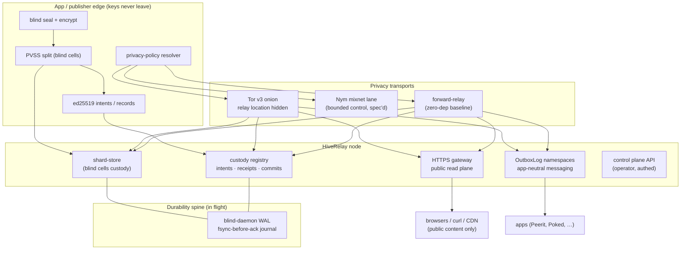
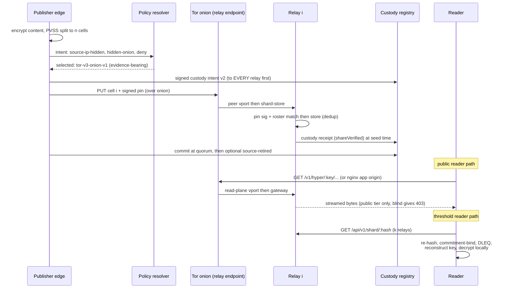
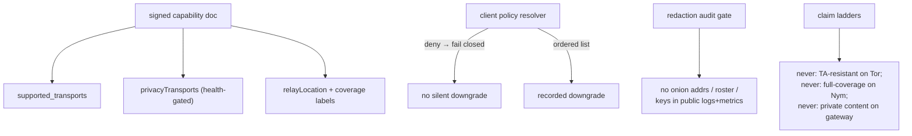
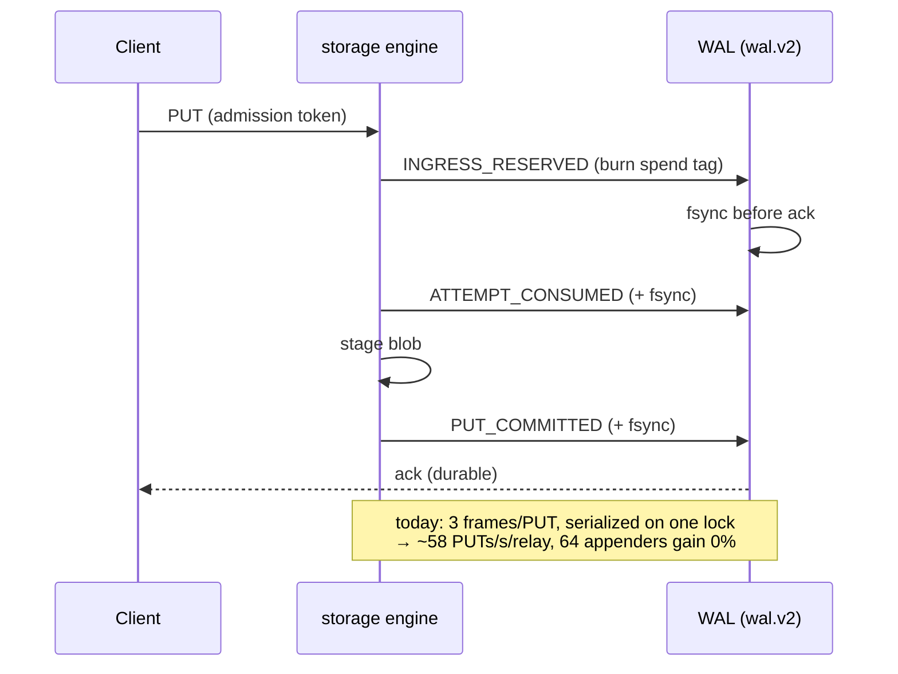

# Giga Release Architecture — How the Features Fit Together

**Date:** 2026-07-17 · **Status:** composition map for the giga release; four features shipped, one (WAL) in flight · **Feature docs:** [BLIND-CELLS](./BLIND-CELLS.md) · [TOR-ONION-TRANSPORT](./TOR-ONION-TRANSPORT.md) · [HTTPS-GATEWAY](./HTTPS-GATEWAY.md) · [NAMESPACE](./NAMESPACE.md) · WAL (this doc §5)

> This is the map of how the release's five subsystems compose into one product: **blind cells** (verifiable threshold custody), **Tor v3 onion transport** (relay location privacy), **HTTPS gateway** (public read plane), **namespace** (app-neutral messaging), and the **WAL** (durability spine, in flight). Each feature has its own deep-dive doc; this one exists to answer "how do they fit, and what still gates the release."

## 1. The stack in one diagram

The design invariant across all five: **relays are blind** (content and keys stay at the edge), **authorization is signature-based at every layer** (no transport grants authority), and **privacy claims stay on their ladders** (each lane advertises exactly what it proves — no more).

## 2. What each feature contributes

| Feature | Job | Trust it removes | Deep dive |
|---|---|---|---|
| **Blind cells** | k-of-n verifiable custody of encrypted secrets across independent relays | trusting any single operator with the key; unverifiable custody claims | [BLIND-CELLS](./BLIND-CELLS.md) |
| **Tor v3 onion transport** | hides the relay's network location; restricted discovery for private relays | relay IP exposure; open enumeration of private endpoints | [TOR-ONION-TRANSPORT](./TOR-ONION-TRANSPORT.md) |
| **HTTPS gateway** | serves declared-public drives to HTTP clients (browsers, mobile, CDN) | "you must speak Hyperswarm to read anything" | [HTTPS-GATEWAY](./HTTPS-GATEWAY.md) |
| **Namespace** | one relay hosts many apps' outbox logs, operator-admitted, with blind mode + takedown | relay-per-app coupling; content exposure in moderation | [NAMESPACE](./NAMESPACE.md) |
| **WAL** | atomic one-use spend, fsync-before-ack durability, fail-closed recovery for the blind store | torn writes, replayed spend tokens, unverifiable recovery | §5 below |

## 3. One full journey, end to end

Read it as three independent compositions:

1. **Custody composition** — blind cells + registry + (soon) WAL: intent → cells → receipts → commit → burn/witness. The Tor/Nym lanes hide *who submitted* and *where the relay is*; the custody layer proves *what is stored* and *that it was burned*.
2. **Read composition** — HTTPS gateway + Tor read plane + capability doc: one read plane, multiple ingresses (clearnet nginx, onion vport), with the signed capability doc advertising each ingress and its honest coverage labels.
3. **Messaging composition** — namespaces + wake hints + privacy transports: app-neutral signed logs at the relay, with bounded encrypted wake/head hints as the exact messages the Tor/Nym control lanes were built to carry.

## 4. The honesty layer (shared across features)

Every feature reports its properties through the same vocabulary (the orthogonal privacy axes), and every claim that cannot be evidenced is deliberately *not* made. This is a product feature in itself.

## 5. WAL — the gate that ties the release

**What it is:** the blind custody store's write-ahead log, living in the blind-daemon line (`packages/blind-daemon/` in the vnext/hq lanes — **not** in the main hiverelay checkout). A hash-chained, fsync-before-ack journal (`wal.v2`, magic `HRWL`) providing:

- **atomic one-use spend** — admission tokens burn exactly once (`SPEND_REPLAY` guard),
- **durability** — every frame write + `sync()` before ack,
- **fail-closed recovery** — full re-verification, torn-tail truncation, hard error on interior breaks,
- writer fencing + `durabilityContinuityHash` + monotone epoch floor.

**Why the release waits on it (status verified 2026-07-17):**

| Phase | Content | Status |
|---|---|---|
| 0 — measure | capacity model + portable harnesses | **done** (macOS upper bounds; Linux fleet rerun required for release-grade evidence) |
| 1 — group commit | batching in the `'\0wal'` mutex + fdatasync + preallocation | **not implemented** |
| 2 — single-commit PUT | 3 frames → 1 | **not implemented** |
| 3 — segmented WAL | pruning + checkpoint-anchored recovery, one format rev paired with the D-6 `K_partition` decision | **not implemented** (`walPruningSupported: false`) |
| 4 — model rerun | scenarios with measured constants | partially done in Phase 0 |

Phase 3 **must** land before the blind store-format authority and protocol hashes freeze — it shares one migration with D-6 and therefore gates the giga release's freeze. Invariants every phase must preserve: atomic one-use spend, fsync-before-ack (group fsync allowed), 15-min canonical retry, O(1) drop-wins, fail-closed recovery, writer fence + continuity hash, epoch floor, spent-marker horizon.

**Do-not-overclaim flags:** no WAL code exists in the main hiverelay repo (it lives in the blind line); phases 1–3 do not exist anywhere as of 2026-07-17; Phase 0 numbers are macOS-only upper bounds.

## 6. Release readiness map

| Feature | Lane | Code | Tests | Gate to release |
|---|---|---|---|---|
| Drift cleanup | hiverelay | merged | full unit suite green | — done |
| Blind cells | hiverelay | shipped v0.22+ | e2e fleet tests green | repair/AutoHeal is roadmap (not a gate) |
| Tor onion transport | hiverelay | shipped 2026-07-17 | 48 unit + live-tor e2e green | follow-ups: pairing hookup, peer-vport listener, 100 MB gate measurement |
| HTTPS gateway (path) | hiverelay | shipped | streaming integration green | — done |
| HTTPS gateway (app origins) | hr-https-gateway | Phase-1 canary | canary suites | **not merged**; readiness gates G1-G13; staging only |
| Namespace | hiverelay | shipped v0.24.1 | unit + config/env green | bytesPerDay enforcement (minor) |
| WAL | blind line (vnext/hq) | v2 shipped; phases 1–3 pending | Phase-0 evidence | **the freeze gate** (Phase 3 + D-6 pairing + Linux rerun) |

## 7. The final test matrix (what "test everything out" means)

1. **Per-feature suites** — all green today (unit suites incl. 48 new tor tests; custody/dispersal fleet e2e; gateway streaming; namespace config).
2. **Cross-feature journeys** —
   - disperse k-of-n cells over Tor onion endpoints; receipts commit; reconstruct client-side (blind × tor);
   - public app served via gateway while custody entries hard-403; same relay reachable over onion (gateway × tor);
   - two apps sharing one relay's outboxlog under distinct blind namespaces, with takedown (namespace × blind);
   - wake hints over the onion control path into namespaced outboxes (namespace × tor/nym).
3. **Adversarial/privacy gates** — fail-closed downgrade suites, redaction audit sweeps on public payloads, negative-probe on private onion endpoints, orphan-pin and cross-namespace replay rejection.
4. **Release-gate holdouts** — WAL phases 1–3 + Linux Phase-0 rerun (durability/throughput), app-origin gateway readiness checklist, 100 MB bulk-over-onion measurement.

## 8. Sources of truth

- Feature docs: [BLIND-CELLS](./BLIND-CELLS.md), [TOR-ONION-TRANSPORT](./TOR-ONION-TRANSPORT.md), [HTTPS-GATEWAY](./HTTPS-GATEWAY.md), [NAMESPACE](./NAMESPACE.md), plus `docs/tor-transport.md` (operator guide).
- Research vault (`00-brain/research/`): Nym × HiveRelay spec, Nym economics deep dive, relay-anonymity decision matrix, Tor v3 spec, M0 evidence pack.
- WAL: `00-core/WAL-DESIGN-ATTACK-2026-07-13.md`, `00-core/wal-phase0-evidence-2026-07-13/`, blind line (`hr-blind-review`, vnext/hq lanes).
- Gateway canary: `00-core/hr-https-gateway/docs/PUBLIC-HTTPS-HIVE-GATEWAY-SPEC.md` and canary runbook.
