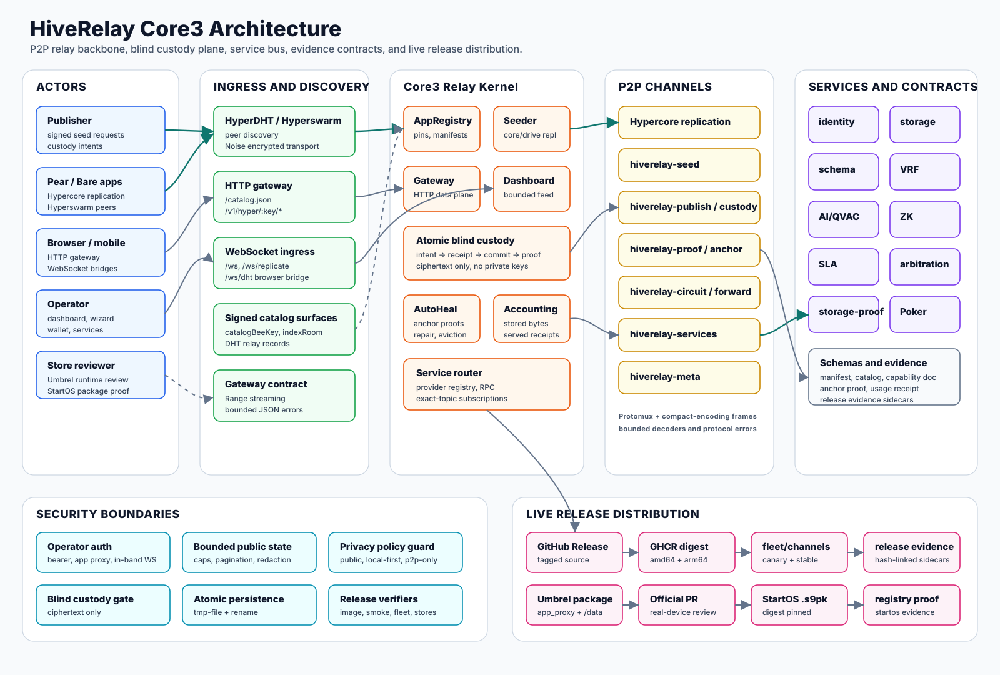
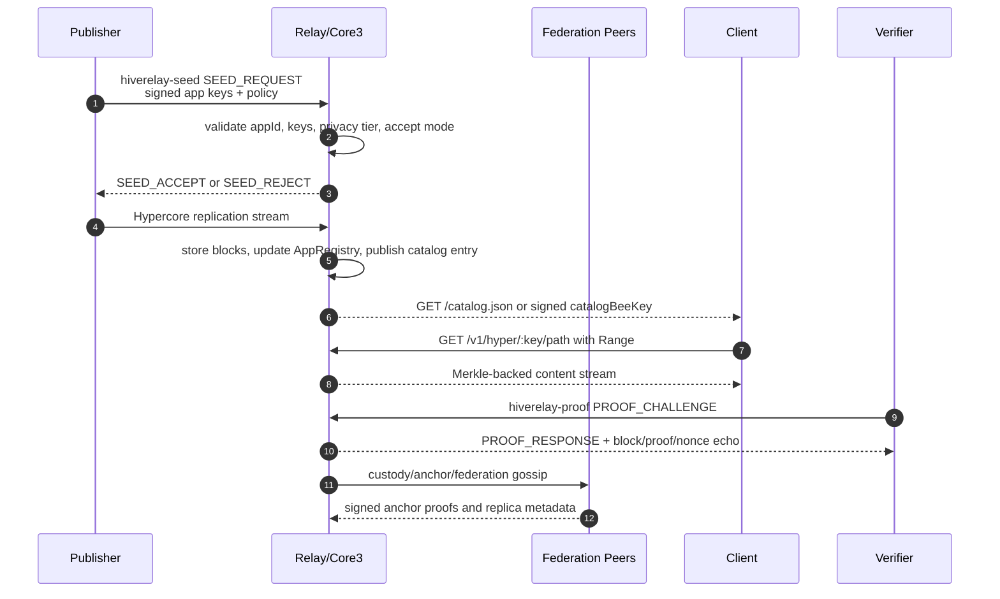
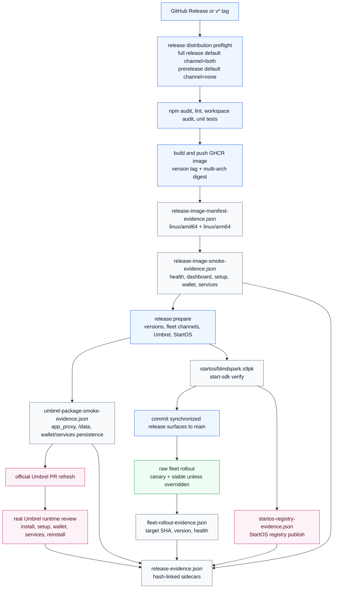

# HiveRelay Core3 Architecture Graph

This page is the graph-first technical map of HiveRelay/Core3. The static SVG
is the high-fidelity review asset for release notes, store handoff, and
offline technical review; it includes the standards rail, API surfaces,
protocol channels, schemas, trust boundaries, and live fleet/store release
path in one printable graph. It complements the detailed runtime map in
[HIVERELAY-DETAILED-ARCHITECTURE-DIAGRAM.md](HIVERELAY-DETAILED-ARCHITECTURE-DIAGRAM.md)
and the prose specs in [PROTOCOL-SPEC.md](PROTOCOL-SPEC.md),
[HIVERELAY_OVERVIEW.md](HIVERELAY_OVERVIEW.md), and
[RELEASE_AUTOMATION.md](RELEASE_AUTOMATION.md).

The Mermaid diagrams below keep the same model editable in Markdown.

## System Graph

```mermaid
flowchart LR
  classDef actor fill:#eef7ff,stroke:#2563eb,color:#0f172a
  classDef ingress fill:#f0fdf4,stroke:#16a34a,color:#052e16
  classDef core fill:#fff7ed,stroke:#ea580c,color:#431407
  classDef protocol fill:#fefce8,stroke:#ca8a04,color:#422006
  classDef service fill:#f5f3ff,stroke:#7c3aed,color:#1e1b4b
  classDef contract fill:#f8fafc,stroke:#64748b,color:#0f172a
  classDef guard fill:#ecfeff,stroke:#0891b2,color:#083344
  classDef distro fill:#fdf2f8,stroke:#db2777,color:#500724

  subgraph Actors["Actors"]
    Publisher["Publisher<br/>signs seed/custody intents"]:::actor
    PearApp["Pear/Bare app<br/>Hypercore + Hyperswarm"]:::actor
    Browser["Browser/mobile<br/>HTTP + WebSocket"]:::actor
    Operator["Operator<br/>dashboard, CLI, fleet"]:::actor
    StoreReviewer["Store reviewer<br/>Umbrel / StartOS"]:::actor
  end

  subgraph Ingress["Ingress And Discovery"]
    DHT["HyperDHT / Hyperswarm<br/>peer discovery + Noise transport"]:::ingress
    HTTP["HTTP gateway<br/>/catalog.json, /v1/hyper/:key/*"]:::ingress
    WS["WebSocket gateway<br/>/ws, /ws/replicate, /ws/dht"]:::ingress
    CatalogBee["Signed catalog surfaces<br/>catalogBeeKey, indexRoom, relay records"]:::ingress
  end

  subgraph Core["Core3 Relay Kernel"]
    Registry["AppRegistry<br/>app manifests, pins, catalog"]:::core
    Seeder["Seeder<br/>Hypercore/Hyperdrive replication"]:::core
    Gateway["Gateway server<br/>streaming reads + Range"]:::core
    Custody["Atomic blind custody<br/>intent -> receipt -> commit -> proof"]:::core
    AutoHeal["AutoHeal<br/>replica diversity + anchor proof checks"]:::core
    Accounting["Accounting<br/>stored bytes, served bytes, signed usage"]:::core
    LeaseMint["Lease + Cashu mint<br/>paid pins, NUT-00 blind tokens"]:::core
    Dashboard["Dashboard feed<br/>bounded redacted operator state"]:::core
    ServiceRouter["Service router<br/>providers + exact-topic subscriptions"]:::core
  end

  subgraph Channels["P2P Protocol Channels"]
    HypercoreRepl["Hypercore replication<br/>Merkle-verified data"]:::protocol
    Seed["hiverelay-seed<br/>SEED_REQUEST, ACCEPT, REJECT, CANCEL"]:::protocol
    Publish["hiverelay-publish<br/>publisher custody submissions"]:::protocol
    CustodyGossip["hiverelay-custody<br/>relay-to-relay custody gossip"]:::protocol
    Proof["hiverelay-proof<br/>PROOF_CHALLENGE, RESPONSE, receipts"]:::protocol
    Anchor["hiverelay-anchor<br/>signed anchor proof request/response"]:::protocol
    Circuit["hiverelay-circuit<br/>reservation + opaque data forwarding"]:::protocol
    Forward["hiverelay-forward<br/>bounded forward-open/data/status/close"]:::protocol
    Services["hiverelay-services<br/>service catalog, RPC, subscriptions"]:::protocol
    Meta["hiverelay-meta<br/>registry metadata + signed directory"]:::protocol
  end

  subgraph ServicesLayer["Opt-In Services"]
    Identity["identity<br/>Ed25519 sign/verify/resolve"]:::service
    Storage["storage<br/>drive/core helpers"]:::service
    Schema["schema<br/>JSON schema registration"]:::service
    VRF["vrf<br/>RFC 9381 sortition/beacon"]:::service
    AI["ai<br/>QVAC, Ollama, HTTP inference"]:::service
    ZK["zk<br/>commitments and proof helpers"]:::service
    SLA["sla / arbitration<br/>evidence-backed disputes"]:::service
    StorageProof["storage-proof<br/>nonce-bound block proofs"]:::service
    Poker["Poker / SignedLog<br/>sealed actions + table events"]:::service
  end

  subgraph Contracts["Schemas And Evidence Contracts"]
    AppManifest["App manifest<br/>name, entry, icon, privacyTier"]:::contract
    CatalogEntry["Catalog entry<br/>contentType, storageClass, catalogBeeKey"]:::contract
    CapabilityDoc["Capability doc<br/>/.well-known/hiverelay.json"]:::contract
    CustodyEnvelope["Custody envelope<br/>field allowlists + plaintext denylist"]:::contract
    AnchorProof["Anchor proof<br/>signed appKey, anchored, attestedAt"]:::contract
    UsageReceipt["Usage receipt<br/>content-free signed metering"]:::contract
    CashuToken["Cashu lease token<br/>NUT-00 proof, NUT-01 key, NUT-02 keyset"]:::contract
    ReleaseEvidence["Release evidence<br/>hash-linked JSON sidecars"]:::contract
  end

  subgraph Guardrails["Security And Runtime Guardrails"]
    Auth["Operator auth<br/>bearer token, app proxy, in-band WS auth"]:::guard
    Bounds["Bounded reads<br/>caps, pagination, redaction"]:::guard
    Policy["Privacy policy guard<br/>public, local-first, p2p-only"]:::guard
    Blind["Blind custody gate<br/>ciphertext only, no plaintext payloads"]:::guard
    Minimize["Metadata minimization<br/>epoch topics + salted public peer IDs"]:::guard
    AtomicWrite["Atomic persistence<br/>tmp-file + rename"]:::guard
    ReleaseGate["Release verifiers<br/>manifest, smoke, fleet, stores"]:::guard
  end

  subgraph Distribution["Live Distribution"]
    GitHubRelease["GitHub Release<br/>tagged source + assets"]:::distro
    GHCR["GHCR image<br/>multi-arch OCI digest"]:::distro
    Fleet["Raw fleet<br/>fleet/channels.json + pull updater"]:::distro
    Umbrel["Umbrel package<br/>app_proxy + persistent /data"]:::distro
    StartOS["StartOS package<br/>digest-pinned .s9pk + registry"]:::distro
    Handoff["Reviewer handoff<br/>official Umbrel PR + runtime review"]:::distro
  end

  Publisher --> Seed
  Publisher --> Publish
  PearApp --> DHT
  PearApp --> HypercoreRepl
  PearApp --> Circuit
  Browser --> HTTP
  Browser --> WS
  Operator --> HTTP
  Operator --> Dashboard
  StoreReviewer --> Handoff

  DHT --> Seed
  DHT --> Proof
  DHT --> Anchor
  DHT --> Services
  HTTP --> Gateway
  HTTP --> Dashboard
  WS --> Dashboard
  WS --> HypercoreRepl
  WS --> DHT
  CatalogBee --> Registry

  Seed --> Registry
  Publish --> Custody
  CustodyGossip --> Custody
  HypercoreRepl --> Seeder
  Seeder --> Registry
  Seeder --> Gateway
  Gateway --> HTTP
  Proof --> Accounting
  Accounting --> LeaseMint
  Anchor --> AutoHeal
  AutoHeal --> Registry
  ServiceRouter --> Services
  Meta --> CatalogBee

  Services --> Identity
  Services --> Storage
  Services --> Schema
  Services --> VRF
  Services --> AI
  Services --> ZK
  Services --> SLA
  Services --> StorageProof
  Services --> Poker

  Registry --> AppManifest
  Registry --> CatalogEntry
  Gateway --> CapabilityDoc
  Custody --> CustodyEnvelope
  AutoHeal --> AnchorProof
  Accounting --> UsageReceipt
  LeaseMint --> CashuToken
  GitHubRelease --> ReleaseEvidence

  Auth --> Operator
  Auth --> Dashboard
  Bounds --> Gateway
  Bounds --> Dashboard
  Policy --> Registry
  Blind --> Custody
  Minimize --> DHT
  Minimize --> Dashboard
  AtomicWrite --> Registry
  AtomicWrite --> Custody
  ReleaseGate --> GitHubRelease
  ReleaseGate --> ReleaseEvidence

  GitHubRelease --> GHCR
  GHCR --> Umbrel
  GHCR --> StartOS
  ReleaseEvidence --> Fleet
  ReleaseEvidence --> Handoff
  Fleet --> DHT
  Umbrel --> Operator
  StartOS --> Operator
```

## Relay Conversation Graph

## Release And Live Fleet Graph

## Standards And Primitives

| Layer | Standard or primitive | Where it is used |
|---|---|---|
| Peer discovery | HyperDHT / Hyperswarm | Relay discovery, peer connections, replication rendezvous |
| Transport security | Noise via HyperDHT | Encrypted P2P connections |
| Multiplexing | Protomux | `hiverelay-*` protocol channels over one peer stream |
| Binary framing | `compact-encoding` | Seed, circuit, proof, forward-relay, and shared message schemas |
| Data integrity | Hypercore Merkle trees | Replicated app drives, registry logs, gateway reads, proof responses |
| HTTP integrity path | Range-aware streaming | `/v1/hyper/:key/*path` serves public app content without buffering whole files |
| Identity and signatures | Ed25519 | Relay identity, signed seed/custody/usage/anchor artifacts |
| Discovery privacy | Epoch-rotating topics and salted public peer-key digests | Metadata-minimized discovery and `/api/peers` output |
| Hashing/KDF | BLAKE2b and HKDF-style derivation | Storage proofs, local encrypted storage key derivation |
| Blind lease tokens | Cashu NUT-00/01/02 BDHKE over secp256k1 | Optional paid pin leases with unlinkable token issue/redeem flow |
| Local encryption | XChaCha20-Poly1305 | Platform local storage encryption |
| Randomness | RFC 9381 VRF | Sortition, shuffle, poker and service randomness |
| Web ingress | HTTP JSON + WebSocket | Dashboards, management APIs, replication bridge, DHT bridge |
| Release artifact | OCI/Docker image index | GHCR multi-arch image for `linux/amd64` and `linux/arm64` |
| Store packages | Umbrel app metadata, StartOS `.s9pk` | Home-server distribution and reviewer handoff |

## API And Contract Map

| Surface | Public or controlled | Contract |
|---|---|---|
| `GET /health`, `GET /status`, `GET /metrics` | Public bounded status | Redacted health, version, counters, and metrics |
| `GET /catalog.json` | Public catalog | Sanitized app catalog with manifest fields and optional signed catalog references |
| `GET /v1/hyper/:key/*path` | Public gateway for public apps | Streaming Hyperdrive reads, `Range`, bounded error shaping |
| `GET /api/overview`, `/api/apps`, `/api/peers`, `/api/network` | Public by default, detailed views require auth | Operator and network state with caps, redaction, and default peer-key digests |
| `/api/manage/*` | Management auth | Catalog, service, AI model, restart, and configuration actions |
| `/api/wizard/*` | Management auth or app proxy path | First-run relay setup, relay name, payout wallet, accept mode |
| `POST /api/subsidy/destination` | Management auth | Payout destination save/clear with guarded dashboard state |
| `/ws` | Dashboard WebSocket | In-band auth, no URL-token exposure |
| `/ws/replicate`, `/ws/dht` | Browser/Pear bridge | Hypercore replication and optional browser DHT over WebSocket |
| `hiverelay-services` | P2P service channel | Service catalog, RPC, and exact-topic subscriptions |
| Paid leases | Seed-request gate and `/api/lease` management surfaces | Quotes, bearer vouchers, Cashu blind tokens, persistent replay guards |
| Evidence sidecars | Release-controlled | JSON proof files hash-linked into `release-evidence.json` |

## Security Boundaries

| Boundary | Rule |
|---|---|
| Blind app data | Relays may store and serve ciphertext, but not plaintext payloads, keys, filenames, or private directory data. |
| Privacy tiers | `public` can use relay storage/gateway; `local-first` and `p2p-only` block relay exposure through PolicyGuard. |
| Operator controls | Wallet, wizard, service, restart, and AI model actions require management auth or protected app-proxy context. |
| Dashboard WebSocket | Tokens are not accepted in URLs; dashboard auth is in-band. |
| Public state | Catalogs, peer lists, federation rows, diagnostics, and metrics are bounded and redacted before exposure. |
| Lease privacy | Cashu blind-token issuance sees blinded points; redemption sees only the final proof and persistent spent marker. |
| P2P frames | Decoders cap declared lengths before allocating large buffers and degrade malformed messages to protocol errors. |
| Persistence | Critical state uses atomic tmp-file plus rename writes. |
| Release claims | A release is live only when evidence proves the exact digest, stores/packages, and selected fleet channels. |

## Primary Use Cases

| Use case | Path through the graph |
|---|---|
| Keep a Pear app online | Publisher signs seed request -> relay replicates Hypercore/Hyperdrive -> catalog/gateway exposes public app -> proof checks verify storage. |
| Browser/mobile app delivery | Browser reads `/catalog.json` then streams `/v1/hyper/:key/*path`; WebSocket bridges can replicate or perform DHT lookups. |
| Private encrypted availability | Publisher submits blind custody intent -> relay accepts ciphertext only -> receipts and anchor proofs account for durability. |
| NAT fallback | Peers reserve/connect through `hiverelay-circuit` or `hiverelay-forward`; relay forwards opaque bounded bytes. |
| Service marketplace | Clients discover service manifests over `hiverelay-services`, call opt-in providers, and receive signed usage receipts. |
| Paid publisher pins | Operators enable leases; publishers buy byte-day windows through direct proofs, bearer vouchers, or Cashu blind tokens without linking issue and redeem. |
| Home-server install | Umbrel or StartOS consumes the digest-pinned package, persists data under `/data`, and exposes guarded dashboard/setup flows. |
| Live fleet promotion | Full release defaults to both canary and stable, updates `fleet/channels.json`, and waits for relay health/version convergence. |
