# HiveRelay Detailed Architecture Diagram

Last updated: 2026-06-27

This document maps the current HiveRelay implementation as a detailed runtime
architecture reference. It complements the graph-first overview in
[HIVERELAY-ARCHITECTURE-GRAPH.md](HIVERELAY-ARCHITECTURE-GRAPH.md), the product
mental model in [HIVERELAY_OVERVIEW.md](HIVERELAY_OVERVIEW.md), and the protocol
contracts in [PROTOCOL-SPEC.md](PROTOCOL-SPEC.md).

HiveRelay is an always-on Hyperswarm peer for Pear and Hypercore applications.
It keeps public Hyperdrives available, accepts signed seed and custody requests,
serves browser/mobile gateway reads, runs optional service plugins, and emits
evidence that operators, clients, and package reviewers can verify.

## 1. System Overview

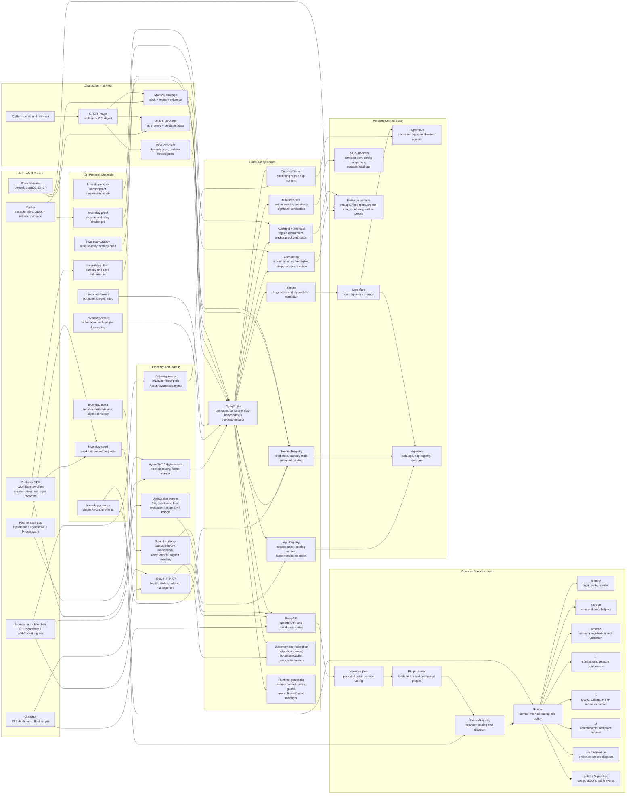

The important split is between durable public availability and temporary blind
custody. Public apps flow through the catalog and gateway. Blind custody entries
flow through redacted catalogs, signed receipts, quorum commits, and proof
channels without exposing plaintext or decryption keys to the relay.

## 2. Runtime Boot Sequence

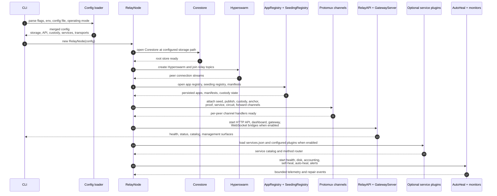

Boot rules:

- Corestore, Hyperswarm, registry state, and protocol channel setup are core
  relay dependencies.
- The HTTP API is enabled by default for operator and gateway surfaces unless a
  mode or config disables it.
- Optional services are disabled by default. Enabling poker expands the runtime
  bundle to the poker service plus its supporting VRF, arbitration, and ZK
  services.
- Federation, Tor, Holesail, DHT-over-WebSocket, and service plugins are
  opt-in or mode-dependent extension points.
- Runtime state is bounded and redacted before it reaches dashboard feeds or
  unauthenticated read endpoints.

## 3. Persistent Availability Flow

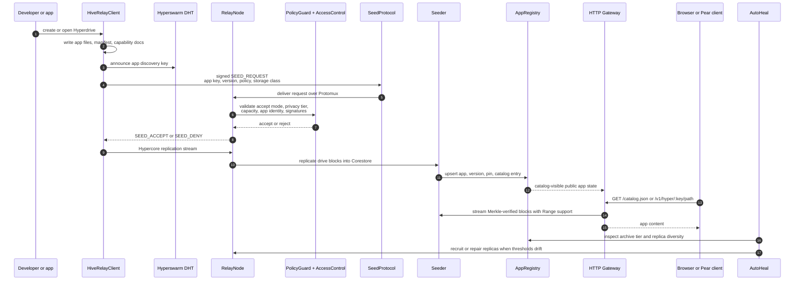

Persistent availability is the normal app-hosting path. The relay can serve
public content over HTTP, but the content itself still originates from Hypercore
data structures. For private or `p2p-only` content, the relay may store and
replicate opaque encrypted blocks while keeping gateway access blocked or
redacted according to policy.

## 4. Atomic Blind Custody Flow

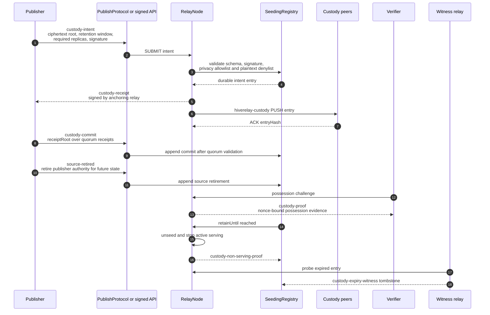

Custody messages are durable through registry replication and fast through the
relay-to-relay custody channel. The custody channel is a latency optimization;
the safety property comes from signed entries, deterministic receipt roots,
retirement semantics, possession proofs, and expiry witnesses.

## 5. HTTP API And Gateway Surface

```mermaid
flowchart TD
  Client["Browser, SDK, operator, reviewer"] --> HTTP["HTTP server\napi.js + route modules"]

  HTTP --> Public["Public read surfaces"]
  HTTP --> Gateway["Gateway surfaces"]
  HTTP --> Manage["Management surfaces"]
  HTTP --> Realtime["Realtime surfaces"]

  Public --> Health["/health\n/api/health\nliveness, readiness"]
  Public --> Status["/status\n/api/status\nbounded relay state"]
  Public --> Catalog["/catalog.json\n/api/catalog\npublic or redacted app catalog"]
  Public --> Capability["/.well-known/hiverelay.json\ncapability document"]

  Gateway --> Hyper["/v1/hyper/:key/*path\nstreamed Hyperdrive file reads"]
  Gateway --> Range["Range requests\npartial content, bounded reads"]
  Gateway --> DHTWS["/ws/dht\nDHT-over-WebSocket bridge"]
  Gateway --> ReplWS["/ws/replicate\nHypercore-over-WebSocket replication"]

  Manage --> Config["/api/manage/config\nsafe config updates"]
  Manage --> Services["/api/manage/services/config\nservice enablement and plugins"]
  Manage --> Custody["/api/manage/custody\ncustody status and actions"]
  Manage --> Federation["/api/manage/federation\nfederation state"]
  Manage --> Lifecycle["/api/manage/lifecycle\nstart, stop, restart actions"]
  Manage --> Alerts["/api/manage/alerts\noperator alerts"]
  Manage --> Unseed["/api/manage/unseed\nseed removal actions"]

  Realtime --> Dash["/dashboard\nHTML dashboard"]
  Realtime --> Feed["/ws\noperator event feed"]
  Realtime --> PokerFeed["poker WebSocket feed\nwhen poker service is enabled"]

  Auth["Auth and guardrails\nbearer token, app proxy auth,\nCORS, rate limits, redaction"]
  Auth --> Manage
  Auth --> Realtime
  Auth --> Gateway
```

Route implementation is split by responsibility under
`packages/core/core/relay-node/api-*.js`. The top-level dispatcher composes
small route modules for health, status, catalog, service configuration, custody,
federation, peer state, dashboard feeds, safe config updates, and lifecycle
actions.

## 6. P2P Protocol Channel Matrix

| Channel | Direction | Main implementation | Purpose | Persistence path |
|---|---|---|---|---|
| `hiverelay-seed` | Publisher to relay | `packages/core/core/protocol/seed-request.js` | Request seed or unseed of Hypercore/Hyperdrive content | App registry and seeding registry |
| `hiverelay-publish` | Publisher to relay | `packages/core/core/protocol/publish-channel.js` | Submit signed custody, source-retired, commit, and seed messages without HTTPS dependency | Registry entries and custody state |
| `hiverelay-custody` | Relay to relay | `packages/core/core/protocol/custody-channel.js` | Push custody entries between connected relays for low-latency convergence | Registry log remains durable source |
| `hiverelay-anchor` | Relay to relay or verifier to relay | `packages/core/core/protocol/anchor-channel.js` | Request and return signed anchor proofs for replica verification | Anchor proof evidence |
| `hiverelay-proof` | Verifier to relay | `packages/core/core/protocol/proof-of-storage.js`, `proof-of-relay.js` | Challenge storage or relay behavior with nonce-bound responses | Proof evidence and accounting |
| `hiverelay-circuit` | Peer to relay to peer | `packages/core/core/protocol/relay-circuit.js` | Reserve relay slots and forward opaque encrypted data when direct connectivity fails | Ephemeral reservation state |
| `hiverelay-forward` | Peer to relay | `packages/core/core/protocol/forward-relay.js` | Bounded forward-open, data, status, and close messages | Ephemeral forwarding state |
| `hiverelay-services` | Peer to service host | `packages/core/core/services/protocol.js` | Service catalog, request/response RPC, exact-topic subscriptions, events | Service provider state |
| `hiverelay-meta` | Relay to relay | `packages/core/core/services/signed-directory.js` and relay metadata helpers | Exchange signed directory and registry metadata | Signed directory and catalog surfaces |

All of these ride over Hyperswarm streams and Protomux channels. Hypercore
replication itself stays on the standard Hypercore replication stream, so app
data integrity continues to be Merkle-tree based even when the request that
started replication came from a HiveRelay-specific channel.

## 7. Services Layer

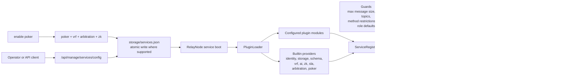

Service messages are JSON frames with bounded length. The protocol supports
catalog exchange, request/response RPC, errors, subscriptions, unsubscriptions,
events, app catalog snapshots, and app catalog deltas. Remote subscriptions are
exact-topic only, wildcard metacharacters are rejected, and peers are capped by
topic count.

Restricted service methods such as identity signing and AI model registration
are not generally exposed to anonymous peers. The default peer role is
anonymous unless the operator config or a pairing/delegation flow grants a
stronger role.

## 8. Storage And Persistence Map

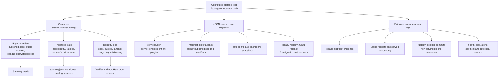

Important persistence properties:

- App registry state is backed by Hyperbee when Corestore is available and has
  migration/fallback paths for JSON state.
- ManifestStore verifies author signatures, keeps newest author manifests, and
  uses atomic tmp-file plus rename writes where the platform supports it.
- Service configuration persists at `<storage>/services.json`, so API toggles
  survive process restarts and fleet updates.
- Custody and registry data are stored as signed entries. HTTP and dashboard
  views are derived projections, not the root of trust.
- Eviction and accounting operate on bounded state so a relay can enforce
  capacity without losing the ability to explain what happened.

## 9. Fleet And Release Topology

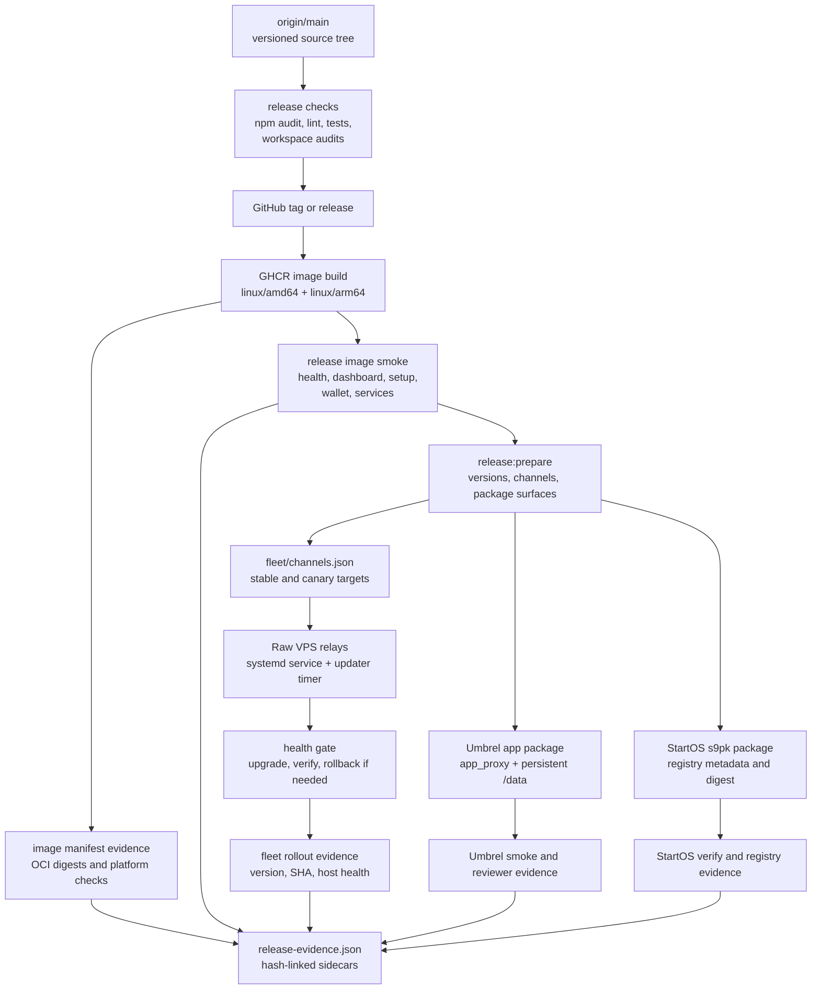

The release surface intentionally fans out from one source/version into three
deployment forms:

- Raw VPS relays consume `fleet/channels.json` through the systemd updater path.
- Umbrel consumes the GHCR image through app package metadata and app proxy
  configuration.
- StartOS consumes the same image digest through the `.s9pk` packaging and
  registry evidence path.

## 10. Operating Modes

| Mode | Primary behavior | Typical API surface | Notes |
|---|---|---|---|
| `relay-core` | General relay with seeding, gateway, dashboard, custody-capable core | Health, catalog, gateway, dashboard, management | Default production mental model |
| `custody-relay` | Emphasizes blind custody, receipts, commits, expiry witnesses | Custody status, proof, redacted catalog | Requires strict plaintext-deny validation |
| `homehive` | Home-server style relay for Umbrel/StartOS users | Dashboard, setup wizard, services config | Persistent local storage and app proxy matter most |
| `seed-only` | Replicate and keep content available without broad gateway behavior | Seed requests, health, limited status | Useful for private or fleet helper nodes |
| `relay-only` | Forwarding and relay transport without app hosting emphasis | Circuit/forward relay, health | Used for connectivity/NAT assistance |
| `gateway` | HTTP gateway first, with catalog and public Hyperdrive reads | `/catalog.json`, `/v1/hyper`, WebSocket ingress | Browser/mobile friendliness path |
| `private` or `stealth` | Reduced public surfaces and tighter discovery | Authenticated management only | Useful for controlled fleets |
| `hybrid` | Mixed seeding, gateway, services, custody, and federation | Most surfaces enabled by policy | Powerful but needs clear operator configuration |

Modes are presets over config, not separate binaries. The same RelayNode boot
path constructs the needed transports, protocol channels, registries, and API
routes based on merged config.

## 11. Client SDK Shape

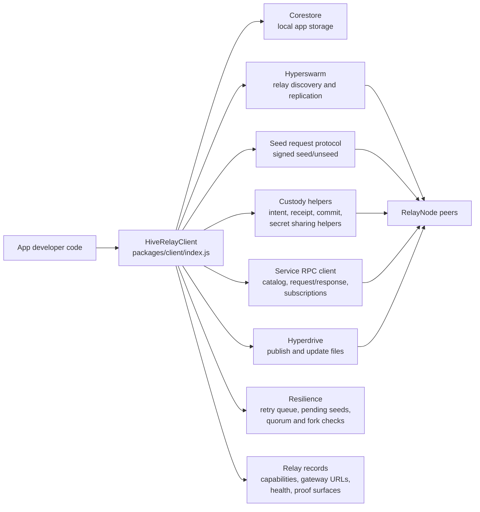

The client SDK is deliberately close to the Hypercore stack. It creates or opens
drives, discovers relay peers through Hyperswarm, signs protocol messages,
replicates with accepting relays, and tracks relay state so app code does not
need to know which transport path succeeded.

## 12. Live Consumer Integration Paths

These are the current ecosystem consumers that must keep pulling the newest
HiveRelay line by default. The local guard is
`npm run audit:ecosystem-consumers`, which checks package manifests and nearest
lockfiles for direct `p2p-hiverelay*` drift.

| Consumer | HiveRelay surface | Current default |
|---|---|---|
| PearBrowser desktop | Bundled `p2p-hiverelay`, client, and verifier packages; HTTP catalog/gateway bridge | Local `file:` workspace links to the `0.20.2` packages |
| PearBrowser mobile | HTTP catalog, capability-doc, and gateway contracts over HTTPS relay transport | Wire-contract consumer; not a direct package pin |
| PearPaste | Encrypted availability through split core/client packages and custody-safe relay paths | Local `file:` links to core/client `0.20.2` |
| anonGPT native | Relay/onion AI app importing current core services subpaths | Local `file:` link to core `0.20.2` |
| POS, Tickets, p2pbuilders, Opengit bridge, hiverelay-test | Direct app/site/experiment consumers | Local `file:` links checked with lockfile metadata |

## 13. Module Inventory

| Subsystem | Key files |
|---|---|
| CLI and process entry | `packages/core/cli/index.js` |
| Relay boot orchestrator | `packages/core/core/relay-node/index.js` |
| HTTP API dispatch | `packages/core/core/relay-node/api.js`, `api-dispatch.js`, `api-request.js`, `api-response.js` |
| Health and status | `api-health.js`, `api-status-read.js`, `api-overview.js`, `health-monitor.js`, `disk-monitor.js` |
| Gateway | `gateway-server.js`, `api-catalog-read.js`, `api-gateway-stats.js` |
| Dashboard and WebSocket feeds | `api-dashboard-routes.js`, `api-dashboard-html.js`, `ws-feed.js`, `ws-feed-poker.js` |
| Seed and app registry | `seeder.js`, `app-registry.js`, `api-seed-publish.js`, `api-catalog-management.js` |
| Custody | `api-custody-status.js`, `api-custody-management.js`, `protocol/custody-channel.js`, `protocol/publish-channel.js` |
| Proofs and anchors | `api-anchor-status.js`, `api-fork-proofs.js`, `protocol/anchor-channel.js`, `protocol/proof-of-storage.js`, `protocol/proof-of-relay.js` |
| Relay transport | `relay.js`, `bare-relay.js`, `relay-tunnel.js`, `distributed-drive-bridge.js`, `protocol/relay-circuit.js`, `protocol/forward-relay.js` |
| Services | `core/services/protocol.js`, `core/services/registry.js`, `core/services/provider.js`, `api-service-config.js`, `api-service-management.js`, `api-service-read.js` |
| Policy and auth | `access-control.js`, `swarm-firewall.js`, `api-auth-helpers.js`, `api-auth-failures.js`, `api-cors.js`, `api-rate-limit.js` |
| Accounting and eviction | `storage-accounting.js`, `served-accounting.js`, `eviction.js`, `api-usage-telemetry.js`, `api-eviction-purge.js` |
| Repair and operations | `auto-heal.js`, `self-heal.js`, `alert-manager.js`, `api-alert-management.js`, `api-lifecycle-actions.js` |
| Client SDK | `packages/client/index.js`, `custody.js`, `pairing.js`, `secret-sharing.js` |
| Services package | `packages/services/builtin/*`, including poker provider code |
| Release and fleet | `fleet/`, `scripts/`, `umbrel-app/`, `startos/`, release evidence docs |

## 14. Trust Boundaries

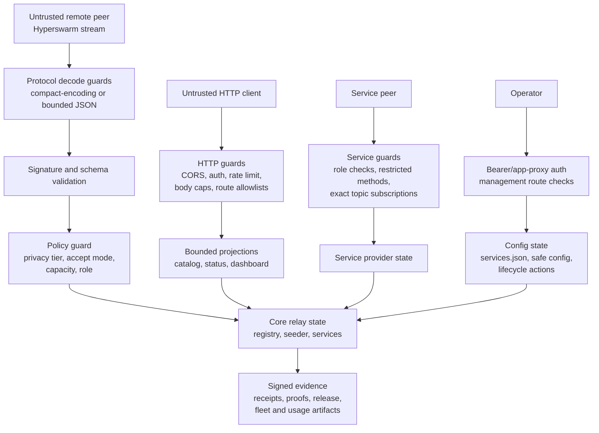

Boundary summary:

- Remote P2P streams are untrusted until decoded, bounded, schema-checked, and
  signature-verified.
- HTTP management routes are privileged. Public read routes expose bounded,
  redacted projections.
- Service plugins are opt-in and run behind router policy; anonymous peers do
  not automatically receive privileged methods.
- Blind custody rejects plaintext-looking fields before signed custody entries
  become accepted state.
- Dashboard and fleet outputs are operational projections. Signed protocol
  entries and release evidence are the audit roots.

## 15. End-To-End Mental Model

```mermaid
flowchart LR
  Create["Create app or custody payload"] --> Sign["Sign request\nseed, publish, custody"]
  Sign --> Discover["Discover relays\nDHT, relay records, gateway URLs"]
  Discover --> Negotiate["Negotiate acceptance\npolicy, capacity, privacy tier"]
  Negotiate --> Replicate["Replicate or store\nHypercore blocks or ciphertext"]
  Replicate --> Index["Index relay state\nregistry, catalog, signed surfaces"]
  Index --> Serve["Serve or prove\nHTTP gateway, P2P replication,\nproof channels"]
  Serve --> Repair["Repair and account\nAutoHeal, SelfHeal,\nusage, eviction"]
  Repair --> Release["Operate fleet\nchannels, package surfaces,\nevidence"]
```

HiveRelay is not a single server API wrapped around storage. It is a peer that
speaks the same replication language as the apps it hosts, plus a set of signed
coordination channels that make relay promises auditable. The HTTP gateway,
dashboard, package surfaces, and fleet updater are all operational views on top
of that peer-first substrate.
