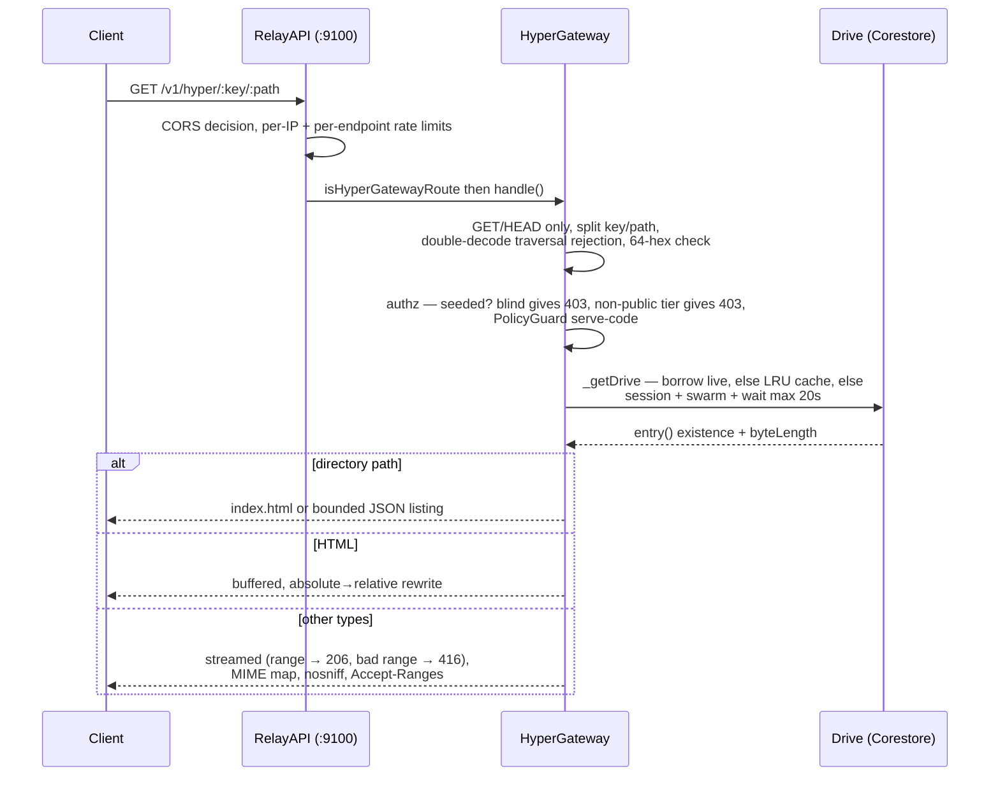
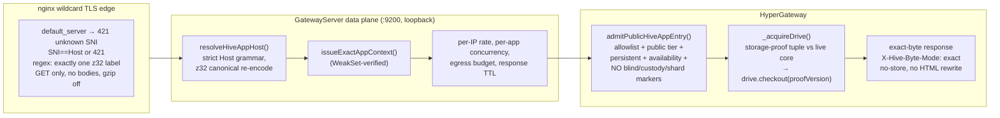
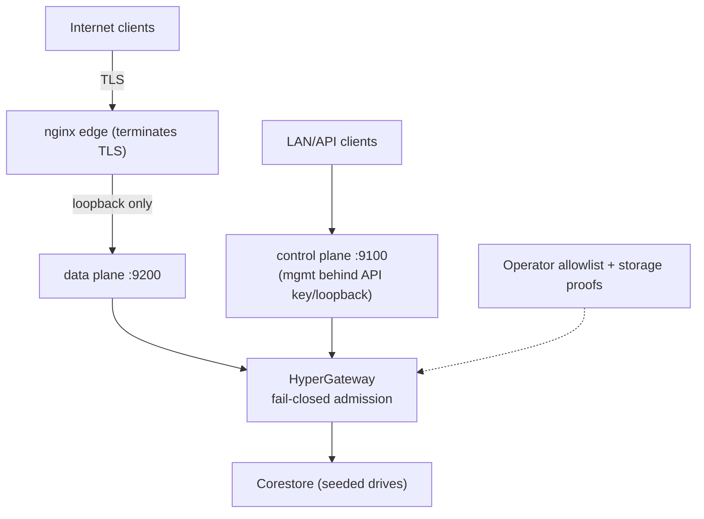
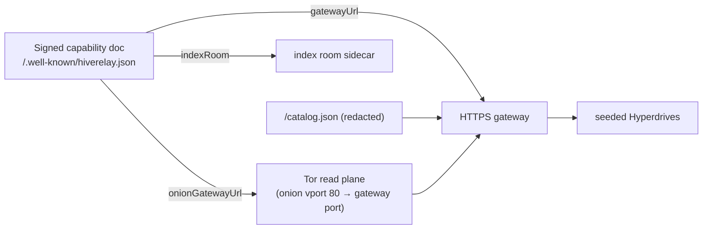

# HTTPS Gateway — The HTTP(S) Read Plane over P2P Storage

**Status:** path gateway shipped (release lane, v0.24.x) · app-origin gateway in Phase-1 canary (`hr-https-gateway` lane, staging-only) · **Code:** `packages/core/gateway/hyper-gateway.js`, `packages/core/core/relay-node/api.js`, `packages/core/core/relay-node/gateway-server.js`

> The gateway re-serves seeded Hyperdrives over ordinary HTTP so clients that can't (yet) speak Hyperswarm — browsers, mobile apps, curl, CDNs — can fetch content immediately: *"open the app/site now, keep P2P syncing in the background."* It is also the **Tor read plane**: the onion read-plane vport forwards to the same gateway port, giving the same three public routes over Tor with genuine client-IP privacy.

## 1. Two maturity states (be precise)

| | Path gateway (shipped) | App-origin gateway (Phase 1 canary) |
|---|---|---|
| URL shape | `GET /v1/hyper/<64-hex-key>/<path>` | `https://<52-char-z32-key>.<gateway-domain>/<path>` |
| Origin model | shared origin, HTML rewritten for relative paths | per-app origins, **exact untransformed bytes** |
| Admission | seeded + `public` tier + PolicyGuard | + operator allowlist + storage-proof pin |
| TLS edge | reverse proxy of your choice | strict nginx wildcard edge (SNI==Host, 421 default) |
| Deployment | in relay (port 9100) or split data plane (port 9200) | loopback-only behind the wildcard edge |

The app-origin lane lives in the `hr-https-gateway` worktree and is **not merged**; its own spec gates live-fleet use. Everything below marks which state each behavior belongs to. The gateway is **not a privacy upgrade** for content: blind/custody data stays on encrypted P2P paths (blind entries are hard-403).

## 2. Request lifecycle — path gateway (shipped)



Steps and the code behind them:

1. **Ingress** — CORS (`api-cors.js`), global + per-endpoint rate limits (`api.js`), route dispatch via `isHyperGatewayRoute`.
2. **Validation** — methods, key/path split, **double-decode path-traversal rejection** (`..`, NUL, drive letters, double-encoded), 64-hex key check.
3. **Authorization chain** — must be in `seededApps`; `blind` → 403 "P2P access only"; non-`public` tier → 403 (default); `PolicyGuard.check(..., 'serve-code')`.
4. **Drive resolution** — borrow the live seeded drive → 20-entry LRU cache with refresh-in-background → else a **per-drive Corestore session** (avoids the root-store-close cascade bug), join swarm, wait ≤20 s for content, background full download.
5. **Response** — directories resolve to `index.html` or a ≤1000-entry JSON listing; HTML is buffered and rewritten (`href="/x"` → `href="./x"`) so bundles resolve on the shared origin; everything else streams via `drive.createReadStream().pipe(res)` with strict single-range support (206/416), client-disconnect teardown, `X-Hyper-Key`, `Cache-Control: public, max-age=60`, `nosniff`. Every admitted response also carries `Link: <hive://<key>/<path>>; rel="canonical"` and the R6 edge headers (§6b); `Service-Worker-Allowed` is structurally stripped on this lane (§6b).

**Optional split data plane:** setting `gatewayPort ≠ apiPort` starts `GatewayServer` on `0.0.0.0:9200`, sharing the same `HyperGateway` but serving only `/v1/hyper/*`, `/catalog.json`, `/health` with its own 600 req/min/IP limiter — *"so heavy file traffic cannot starve management endpoints."*

## 3. App-origin gateway (Phase 1 canary)



Key properties of the canary:

- **Fail-closed admission** happens *before* any existence-revealing response: the key must be in the operator allowlist with an explicit `public` tier, `persistent` storage class, declared availability, and no blind/custody/shard markers. With `requireLifecycleDriveAuthority`, the seeded entry must carry a persisted storage-proof `driveVersion` matching the configured pin.
- **Immutable reads**: responses are served from `drive.checkout(proof.driveVersion)` with the lifecycle-owned blob snapshot — bytes cannot shift mid-response (`X-Hive-Drive-Version`).
- **Exact bytes**: no HTML rewriting, `X-Hive-Byte-Mode: exact`, `Cache-Control: no-store`, `Vary: Host`, `Origin-Agent-Cluster: ?1`, canonical `Link:` headers to `hive://<key>/<path>`.
- **Edge discipline**: TLS default server → 421 for unknown SNI; SNI==Host enforcement; app origins never inherit compatibility CORS; no request bodies; forwarded-SNI attestation header verified when `gatewayRequireForwardedSNI`.
- `/.well-known/hiverelay-app.json` returns a bounded descriptor (`hiverelay-public-app-v1`) with the honest limitation: *"HTTPS transport does not prove Hypercore content provenance."*

## 4. Trust boundaries



- The relay process **never terminates TLS**; Node binds loopback only in the hardened topology.
- Management routes live only on the control plane behind bearer/loopback auth (loopback bypass is disabled when `trustProxy` is on).
- Blind/custody content is structurally unreachable: the `blind` flag and custody/shard markers are hard gates evaluated before existence is revealed.

## 5. Route inventory

| Route | Plane | Auth | Notes |
|---|---|---|---|
| `GET/HEAD /v1/hyper/:key/*` | both | none (public) | blind→403, tier→403, PolicyGuard, ranges; `?verify=1`/hc-block Accept → proof bundle (§6a) |
| `GET /catalog.json` | both | none (public) | redacted custody entries; slimmer form on data plane |
| `GET /.well-known/hiverelay.json`, `/api/capabilities` | control | none | signed capability doc |
| `GET /api/gateway` | control | none | sanitized counters only |
| `GET /health`, `/` | data | none | liveness |
| `GET https://<z32>.<suffix>/*` (canary) | data | none | operator allowlist + storage-proof admission |
| `/.well-known/hiverelay-app.json` (canary) | data | none | generated, bounded |
| `POST /api/manage/*`, seed/unseed, wizard | control | **operator** | never on the data plane |

## 6. Streaming, ranges, limits

- Non-HTML bodies stream with Node backpressure; client disconnect destroys the drive stream; the canary adds `ExactLengthTransform` that hard-fails on byte-count drift.
- Single ranges only; malformed/unsatisfiable → 416 (canary is stricter than legacy's RFC-allowed ignore).
- Limits (canary in parentheses): drive op timeout 30 s; empty-drive wait 20 s; LRU 20 drives; listing ≤1000 entries (and ≤1 MiB payload); max response (64 MiB/1 GiB ceiling); egress budget (256 MiB per IP×app per 60 s → 429); concurrency (256 global / 32 per app → 503); response lifetime (15 min); HTTP hardening (header caps, 10 s headersTimeout, CONNECT/upgrade rejected).
- Canary production tuple is frozen: `PUBLIC_T1_GATEWAY_FINITE_LIMITS` = {64 MiB, 4 MiB, 256 MiB, 60 s, 15 min}.

## 6a. Verifiable retrieval mode (`?verify=1`, R1)

A gateway GET carrying `?verify=1` or `Accept: application/vnd.hiverelay.hc-block` returns **not the raw file** but a versioned verification bundle, so a client can confirm the bytes hash into the drive key's signed root **without trusting the gateway** (addressing honest-limit #4). Same admission chain as the raw lane (seeded, public tier, PolicyGuard, app-origin allowlist+pins — blind/custody stay hard-403) and the same frozen byte caps; single-range only.

- **Resolution**: the request path resolves exactly like the raw lane (both `/v1/hyper/<key>/<path>` and the app-origin lane; directories still map to `index.html`, a bare directory 400s), then the entry's blob descriptor maps the requested range to **one blob block** (`blockSize` 64 KiB; a range spanning two blocks 400s — clients iterate blocks using the proved descriptor).
- **Response**: `application/vnd.hiverelay.hc-block+json` with `X-Hive-Drive-Version` (app-origin lane also gets `X-Hive-Byte-Mode: verified`).

Envelope `v: 1` (`packages/core/gateway/verify-bundle.js` is canonical):

```json
{
  "v": 1, "driveKey": "<64hex>", "driveVersion": 3, "path": "/big.bin",
  "blockIndex": 1, "blockBytes": "<hex>",
  "fileRange": { "start": 0, "end": 65535 },
  "blob": { "blockOffset": 1, "blockLength": 4, "byteOffset": 35, "byteLength": 200000, "blockSize": 65536 },
  "blobsKey": "<64hex>",
  "proof": "<hex wire.data block proof + blobs manifest>",
  "treeHeader": { "fork": 0, "length": 5, "rootHash": "<hex>", "signature": "<hex>" },
  "entry": { "blockIndex": 2, "blockBytes": "<hex bee node>", "proof": "<hex wire.data, pinned at driveVersion>", "treeHeader": { "fork": 0, "length": 3, "rootHash": "<hex>", "signature": "<hex>" } }
}
```

Trust chain (re-derived client-side by `verifyBlockBundle` in `packages/client/verify-block.js`): `driveKey` = manifest hash ⇒ drive manifest ⇒ `Hyperdrive.getContentManifest` ⇒ `blobsKey`; the **entry proof** binds path→blob descriptor into the drive key's signed root **at `driveVersion`**; the **block proof** binds `blockBytes` into the blobs core's signed root; both tree headers must match the verified state (length, fork, signature, recomputed root). Forged/substituted bytes, wrong block/index, wrong path binding, stale headers, and wrong keys all reject. v1 verifies **manifest drives** (every hc11-created drive); compat drives reject with `COMPAT_DRIVE_UNSUPPORTED`.

## 6b. Edge headers & upgrade hints (R3/R5/R6/R7)

Every gateway response — content, generated JSON, listings, and proof bundles — passes one edge policy (`packages/core/gateway/edge-headers.js`; the lane × ingress matrix is documented there):

- **Stateless shared origin (R3).** The `/v1/hyper/<key>/...` path lane never emits `Service-Worker-Allowed`; the header is stripped structurally at response commit, so a future emission path cannot reintroduce it. Drive content cannot set it today: bodies never become headers and entry metadata is never mapped to headers. Without the header, a service worker served from the shared origin cannot widen its scope beyond its own `/<key>/` prefix — no app can register a persistent worker that outlives and shadows other apps on the shared origin. The app-origin lane is untouched: each app owns its whole z32 origin, so a worker there shadows only that same app.
- **Onion CSP default (R5).** Responses whose Host is a `.onion` name (the Tor read plane forwards vport 80 to the same gateway port) carry exactly:
  `default-src 'none'; script-src 'none'; connect-src 'none'; img-src 'self' data:; style-src 'self' 'unsafe-inline'; font-src 'self'; media-src 'self'; form-action 'none'; base-uri 'none'; frame-ancestors 'none'`.
  The read plane serves bytes for reading: no script execution, no fetch/XHR/WebSocket beacons, no forms, no framing, no `<base>` rebasing — while a document's own images/styles/fonts/media still render (`'self'` is exactly what the path lane's absolute→relative HTML rewrite produces, so the rewrite and the CSP compose). A spoofed `.onion` Host on clearnet only earns the stricter policy — the default fails safe — and an app's own CSP `<meta>` can only tighten the effective policy, never loosen this header floor, so the shared-origin posture cannot be weakened by content.
- **COOP/CORP/Referrer-Policy (R6).** Both lanes emit `Cross-Origin-Opener-Policy: same-origin` (the browsing-context-group counterpart of `Origin-Agent-Cluster: ?1`) and `Referrer-Policy: no-referrer` (the URL names the drive key + the exact file being read — never leaked cross-origin; same discipline as the dashboard). CORP follows each lane's established cross-origin posture: `cross-origin` on the compatibility path lane, which already answers CORS clients with `Access-Control-Allow-Origin: *` (the house rule for public credential-free read planes); `same-origin` on app origins, which never inherit compatibility CORS and now also deny no-cors subresource embedding.
- **Canonical upgrade hint (R7).** Every admitted path-lane response emits `Link: <hive://<key>/<path>>; rel="canonical"` — the same scheme-upgrade hint the app-origin lane already emitted (there with `rel="describedby"` to `/.well-known/hiverelay-app.json`) — so capable clients can leave HTTPS for the native P2P transport; the blind/tier 403s say the same in their bodies. The signed `hiverelay-gateway-advertisement-v1` record remains the spec-level Phase-2 operator advertisement (§7.1 of the canary spec); the signed capability doc plus these per-resource canonical links are the implemented in-code surfaces.


## 7. TLS / deployment

- **API/control plane**: nginx on :443 with certbot exact-host cert → loopback 9100 (see `docs/REVERSE-PROXY.md`).
- **App plane (canary)**: per-operator **wildcard cert** for `*.<hiveAppHostSuffix>`, ACME **DNS-01** only (HTTP-01 can't issue wildcards), credentials scoped to `_acme-challenge`; two vhosts (API vs app wildcard) must never cross-route.
- Umbrel/StartOS packaging carries **no gateway config** — app-gateway is out of Phase-1 packaging scope by spec.
- No self-signed or embedded ACME in the relay; publisher-owned domains are Phase 3; ACME automation Phase 5.

## 8. Composition with the rest of the release



- The capability doc advertises `gatewayUrl` (clearnet base), `onionGatewayUrl` (Tor ingress), and `indexRoom`; the Tor and nginx edges are **two ingresses to the same read plane** (legacy path mode vs per-app origins).
- Catalog and gateway share one trust policy block (`gatewayPublicOnlyPrivacyTier`, signed-catalog knobs).
- Phase 2 of the canary spec adds gateway profile/byte-mode advertisement to the capability doc (`hiverelay-gateway-advertisement-v1`).

## 9. Honest limits

1. The gateway is a **read plane for declared-public content only** — privacy for content comes from blind sealing/custody, not from this layer.
2. Path-mode HTML rewriting is a convenience for shared origins; exact-byte app origins are the strong form (canary).
3. The canary lane is **staging-only, unmerged**; live-fleet use is gated on its readiness checklist.
4. HTTPS responses do not prove Hypercore provenance — clients that need integrity use verifiable retrieval mode (§6a) or consume the drive over P2P.
