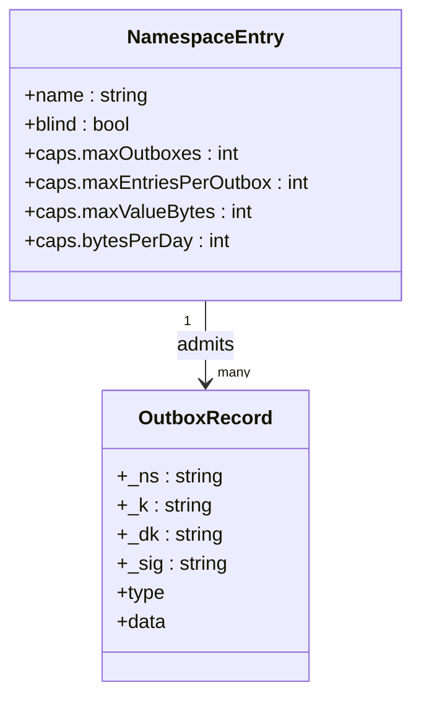
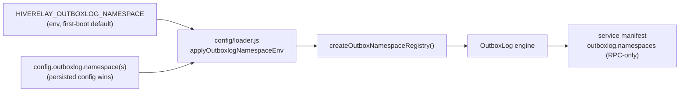
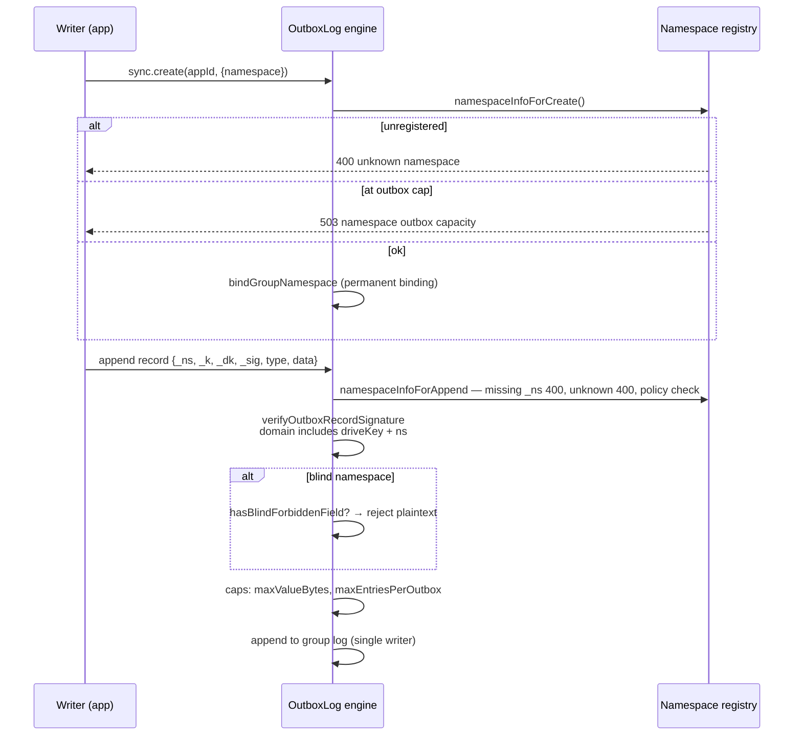
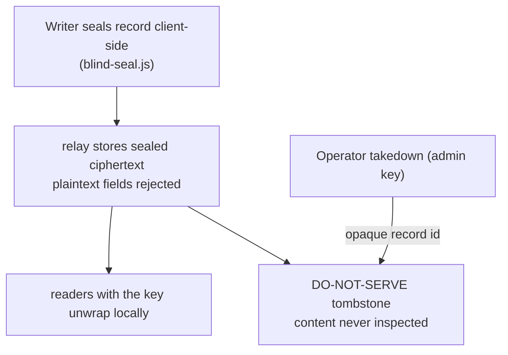
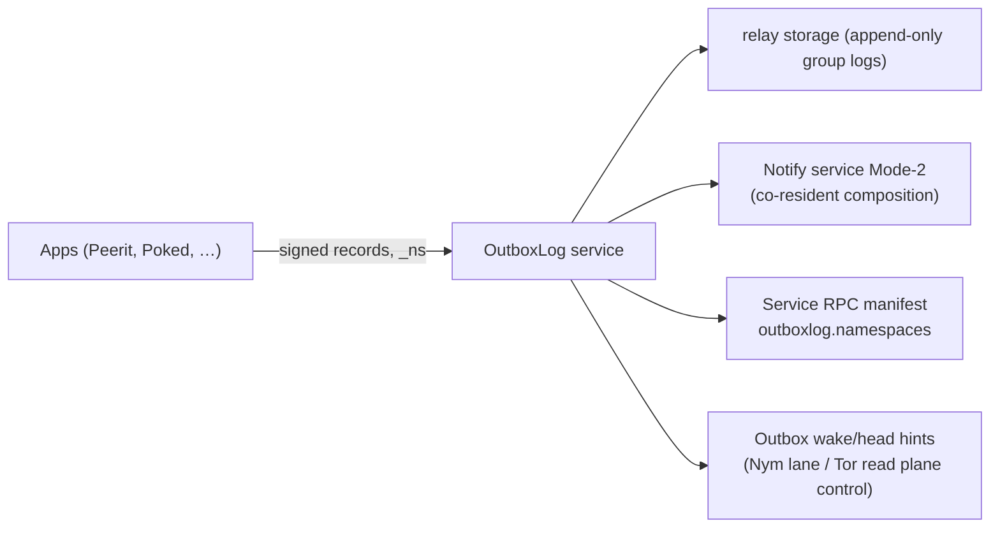

# Namespace — App-Neutral OutboxLog

**Status:** shipped in v0.24.1 (`feat(outboxlog): opaque-id takedown primitive + app-neutral namespace (#163)`, env wiring #172) · **Code:** `packages/services/builtin/outboxlog/` (`outbox-log.js`, `index.js`, `http-adapter.js`, `blind-seal.js`)

> Namespaces make the relay-hosted OutboxLog **app-neutral**: every signed record carries a namespace label, and the operator registers which namespaces (apps) the relay admits — with per-namespace caps and an optional blind mode where the relay stores only sealed ciphertext. Any app (Peerit, Poked, …) is admitted by configuration, no relay fork — the Service Contract commitment that app releases never require relay updates.

## 1. What it is

The OutboxLog is a relay-hosted, single-writer, append-only signed log — one "outbox" per app writer key. Before namespaces, the service was coupled to one app. Now:

- A **namespace registry** (operator-owned) admits named namespaces, each with its own capability profile.
- Every record is labeled (`_ns`) and every outbox group binds to exactly one namespace — a group can never straddle two.
- A **blind namespace** forbids plaintext fields: the relay stores only sealed ciphertext (blind sealing in `blind-seal.js`).
- An **opaque-id takedown** primitive lets the operator mark individual records do-not-serve without learning anything about their content.

It also fixed a fleet footgun: ENV-provisioned boxes had no way to register a namespace, so *every* append was refused `unknown namespace` — the `HIVERELAY_OUTBOXLOG_NAMESPACE` env var now seeds the registry (persisted config still wins).

## 2. Data model



Namespace names match `/^[a-z0-9][a-z0-9._-]{0,63}$/`; `caps.bytesPerDay` is parsed but not enforced today (see §7).

- Default namespace: `'outbox'`.
- Signed payload: `` `pear.app.${driveKey}:${ns}:${canonicalOutboxRecord(type, data)}` `` — the namespace is inside the signature domain, so a record cannot be replayed across namespaces.
- Registry semantics: when explicitly configured, the registry admits **exactly** what was asked — no hard-injected house namespace. Persisted namespaces are re-validated on load; `configureNamespaces` refuses to drop a persisted namespace.

## 3. Flows

### 3.1 Register and configure



Env is a **default only**: once a namespace config is persisted, env changes no longer override it.

### 3.2 Create + append (the validation pipeline)



Rebinding a group to a different namespace → `400 namespace mismatch`. Signature verification looks up rules from the registry — a record in an unregistered namespace fails verification even if well-formed.

### 3.3 Read / resolve

- `namespaces()` snapshot (engine) → RPC method `OutboxLogApp.namespaces()`; the service manifest advertises the `outboxlog.namespaces` capability with exact method names for P2P RPC parity.
- **No HTTP route lists namespaces** — the surface is RPC-only by design. HTTP exposes only `POST /api/sync/create` (which takes `{namespace}`); appends carry `_ns` inside the signed record.

### 3.4 Blind namespaces and takedown



The operator's takedown is gated by the admin key and references records by opaque id only — moderation without content exposure, matching the blind-custody posture of the rest of the stack.

## 4. Security and capability model

- **Writer authentication**: per-record ed25519 signatures, `_k` must equal `appId`, namespace inside the signature domain.
- **Operator allowlist**: unregistered namespaces reject at create, append, and verify time.
- **Blind mode**: `BLIND_FORBIDDEN_FIELDS` hard-blocks plaintext fields on blind namespaces.
- **Caps**: enforced per namespace — `maxOutboxes`, `maxEntriesPerOutbox`, `maxValueBytes` (each resolved as min of namespace cap and global fallback).
- **Takedown**: admin-key-only, opaque-id, do-not-serve.

## 5. Config surface

```json
{
  "outboxlog": {
    "namespace": "outbox",
    "namespaces": {
      "outbox": { "blind": false },
      "peerit": { "blind": true, "caps": { "maxOutboxes": 10000, "maxEntriesPerOutbox": 5000, "maxValueBytes": 8192 } },
      "poked":  { "blind": true }
    }
  }
}
```

- `config.outboxlog.namespace` / `config.outboxlog.namespaces` map; fed into the engine at `OutboxLogApp.start()`.
- `HIVERELAY_OUTBOXLOG_NAMESPACE` (env) seeds the default on first boot only.
- Reconfiguration must not drop a persisted namespace (fail-closed).

## 6. How it plugs in



- **Service Contract**: app releases never require relay updates — admission is config, not code.
- **Notify Mode-2** composes with the co-resident outboxlog.
- **Privacy transports**: encrypted wake/head hints are exactly the bounded control messages the Tor/Nym privacy lanes carry; the log bodies themselves stay on native paths (or Tor bulk).

## 7. Honest limits

1. `caps.bytesPerDay` is parsed but **not enforced** today — only count/byte caps are checked.
2. Namespace enumeration is RPC-only; there is no public HTTP discovery of admitted namespaces (deliberate).
3. Do not conflate with the ENS/petname "naming" roadmap (`PEAR-NAMING-IPFS-RELEASE-ROADMAP`) — that is a different concept from this shipped feature.
4. A group permanently binds to its first namespace; there is no migration — choose names carefully.

Related: `docs/SERVICES.md` (OutboxLog section), `blind-seal.js`, `docs/tor-transport.md`, and the Nym × HiveRelay spec (wake-hint lane) in the research vault.
