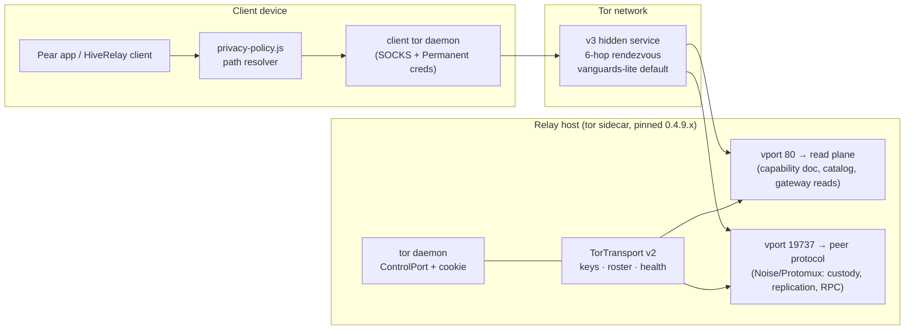
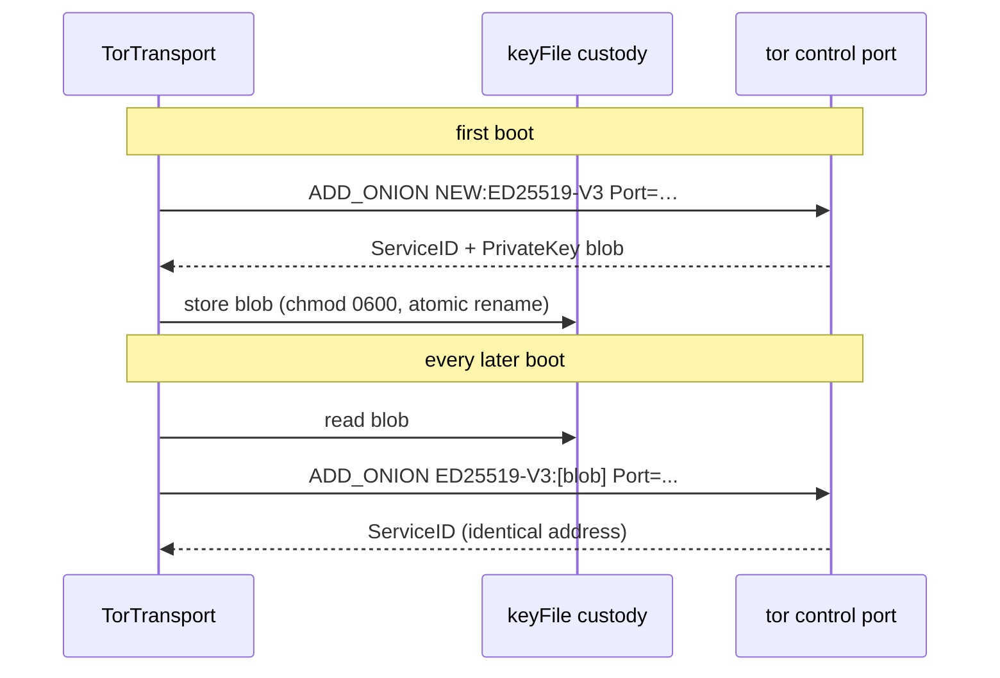
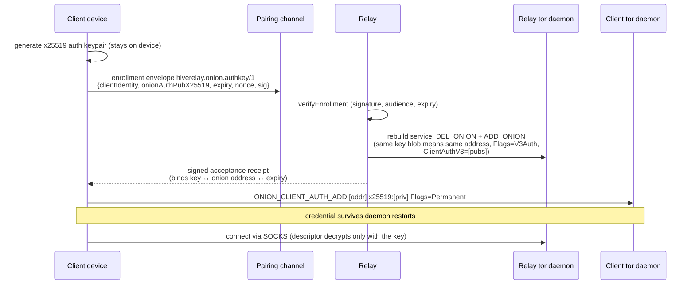
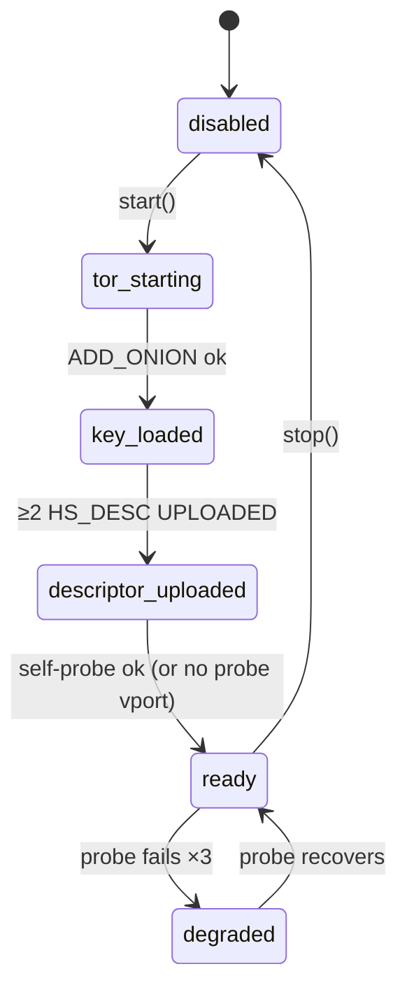
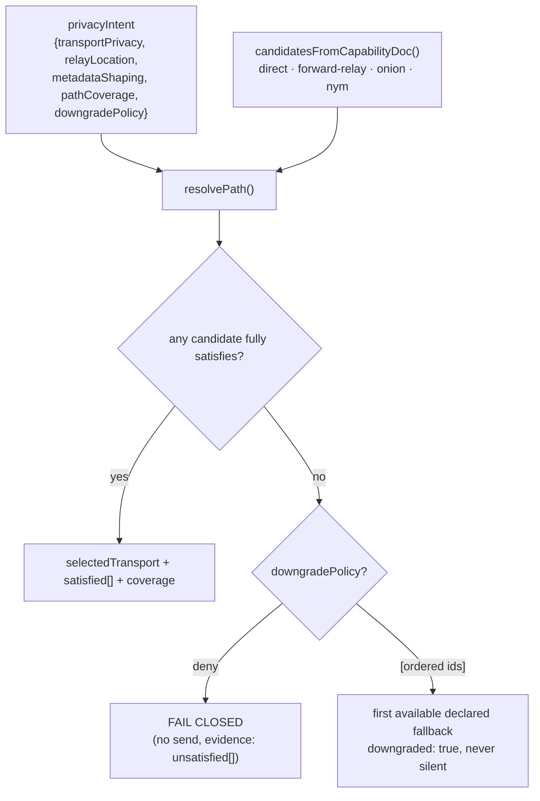

# Tor v3 Onion Transport — Relay-Side Location Anonymity

**Status:** shipped (RA-01–RA-05, RA-07, 2026-07-17) · **Code:** `packages/core/transports/tor/` (`index.js`, `auth-keys.js`, `redaction.js`) · **Operator guide:** `docs/tor-transport.md` · **Spec:** `hiverelay.onion/1` (research vault)

> The Tor transport hides the **relay's** network location: clients reach the relay through a v3 onion service and never learn its IP. With restricted discovery enabled, only enrolled clients can even decrypt the service descriptor. It composes with the Nym lane (client→relay timing resistance) and the native forward-relay (zero-dependency baseline) behind one privacy-policy resolver.

## 1. What it is

A persistent, access-gated, health-gated Tor v3 onion service managed through the local tor daemon's control port, plus:

- **persistent identity** — the same onion address across restarts (encrypted key custody);
- **restricted discovery** — per-client x25519 v3 authorization, device-generated keys, signed enrollment;
- **dual virtual ports** — structural separation of the public read plane from the peer/replication protocol, never exposing operator surfaces;
- **health-gated advertisement** — the endpoint appears in the signed capability doc only while verified reachable;
- **privacy-safe observability** — redaction + a forbidden-field audit gate.

What it deliberately does **not** provide: timing-correlation resistance (no cover traffic — that claim is reserved for the Nym lane), application-level anonymity for the relay's stable pubkey, or any change to HiveRelay's own authorization.

## 2. Architecture

Trust boundaries: the app↔daemon links are loopback; the tor daemon is in the TCB but sees only already-encrypted flows (Noise at the application layer); the Tor network is an untrusted transport that supplies reachability + location hiding; application authorization is revalidated inside every handler (`ONION-INV-006`: an auth key grants *reachability*, never service authorization).

## 3. Persistent identity

Rules (all tested): corrupt key file → fail closed, never a silent re-identity; the blob belongs in the operator's encrypted backup; the onion key is distinct from the stable HiveRelay identity — the binding is the **signed capability doc**, which is the only channel a client may trust for an onion address.

## 4. Restricted discovery (private relays)

Load-bearing semantics (each verified live against tor 0.4.9.6 in the M0 spike):

- `Flags=V3Auth` is **mandatory** with `ClientAuthV3`; the daemon never holds client secrets — only public keys.
- **No runtime roster add exists**: enrollment rebuilds the service in place (same address; brief intro-point churn). Roster persists in `rosterFile` (operator-private) and re-applies at start.
- Client credential install is one control-port command with `Flags=Permanent`; no hand-written files.
- Filesystem deployments (`HiddenServiceDir` + `authorized_clients/*.auth` + RELOAD) are the PoW-capable shape; the valid `.auth` line is exactly `descriptor:x25519:<pub>` (3 fields), and an all-invalid roster runs **fail-open** — hence the negative probe in the health gate.

## 5. Health-gated advertisement

The signed capability doc carries `privacyTransports` **only while `ready`**: version floor checked, key restored and address matched, ≥2 descriptor uploads observed, and a SOCKS self-probe through the network back to the read-plane vport. Degraded health removes the entry — clients never see a dead endpoint (`ONION-INV-003`). The field is omitted entirely when empty, so relays without Tor produce byte-identical docs to older builds (fixture-stable signing).

The advertisement entry: `{id: tor-v3-onion-v1, addresses: [{address, keyId, notBefore, notAfter, priority}], vports, vportRoles {readPlane, peer}, auth {mode, enrollment}, pow, exposure, relayLocation: 'hidden-onion', supports[]}` — signed by the stable relay identity, with rotation overlap handled by a fresh `keyId`.

## 6. Policy resolution (client side)

`packages/client/privacy-policy.js` implements the orthogonal axes (`relayLocation`: `exposed → hidden-1hop → hidden-onion → hidden-mixnet`). A stronger path satisfies a weaker requirement; the Nym lane reports `control-only` coverage, so a `full`-coverage intent can never silently land on it.

## 7. Abuse, DoS, and PoW

- No source IP exists on this lane → quotas are per-capability/per-identity, never per-IP; connection caps and `MaxStreams` bound circuits.
- PoW defense is a **packaging decision**, not a runtime toggle: it needs a tor build with the `pow` module (Homebrew's lacks it) and a `HiddenServiceDir`-configured service; `pow.enabled` attempts the daemon-wide `SETCONF` and fails closed with guidance otherwise.
- Version floor is a security property: daemon below `minDaemonVersion` → transport fails closed (0.4.8 leaves the network 2026-09-01).

## 8. Observability

Public surfaces get coarse health only (`running`, `activeConnections`) — the existing bounded public-status contract is unchanged. `redaction.js` provides `redactTorInfo()` for new surfaces and `auditPayload()`, the forbidden-field gate: onion addresses, client auth pubkeys, hidden-service key blobs, `.auth` lines, and roster contents are flagged anywhere they appear in public logs/metrics; the capability doc's own advertised address is whitelisted explicitly.

## 9. Honest limits

1. **No timing-correlation resistance** — no cover traffic; never render this lane as `traffic-analysis-resistant`.
2. Long-lived services accumulate guard-discovery exposure (PoPETs 2022; arXiv 2602.23560 intro-circuit intersection attack, Feb 2026) — mitigated by vanguards-lite, endpoint rotation, `hidden-only` exposure.
3. `dual` exposure links the public and onion identities via shared uptime — operators choose: hidden-only identity, or accept the link.
4. Operator-side deanonymization (payment rails, hosting accounts, cross-signing) is out of transport scope — see the operator checklist in `docs/tor-transport.md`.
5. Remaining follow-up: 100 MB/10 min bulk gate on realistic uplinks (5 MB live gate passed at 1.19 Mbps). Shipped since (2026-07-18): pairing-channel enrollment hookup (`transports/tor/enrollment.js` — the envelope rides `RelayNode.pairDevice` extras; verify → roster rebuild-in-place → rosterFile persist → signed receipt; 4 tests in `tor-enrollment.test.js`) and peer-vport listener binding (`transports/tor/peer-listener.js` — loopback Noise XK endpoint the onion peer vport 19737 forwards to, folded into the transport's vport mapping and lifecycle; 7 tests in `tor-peer-listener.test.js`).

## 10. Test evidence

- 12 transport unit tests (`tor-transport.test.js`) incl. persistent key custody, roster rebuild, health transitions, and the persistent-parser `TorControl`.
- 9 lifecycle tests (`tor-auth-keys.test.js`): envelopes, receipts, roster store, wire formats.
- 4 enrollment tests (`tor-enrollment.test.js`): pairing-channel verify → roster add + persist → rebuild → signed receipt; rejection cases (bad sig, expired, wrong relay, identity mismatch); gating no-ops; the `RelayNode.pairDevice` wiring.
- 7 peer-vport tests (`tor-peer-listener.test.js`): Noise XK upgrade with a Protomux round-trip, wrong-identity rejection, connection cap, and the stubbed-listener vport mapping/binding.
- 13 resolver tests (`privacy-policy.test.js`): fail-closed, explicit fallback ordering, coverage honesty.
- 9 redaction tests (`tor-redaction.test.js`) incl. the audit gate.
- 5 capability-doc tests + fixture stability (`capability-doc.test.js`, profile vectors).
- Live-tor integration (`tor-bulk.test.js`, env-gated): persistent address across restarts, 5 MB integrity at 1.19 Mbps measured.
- M0 spike evidence pack (8 experiment scripts vs tor 0.4.9.6) in the research vault.
