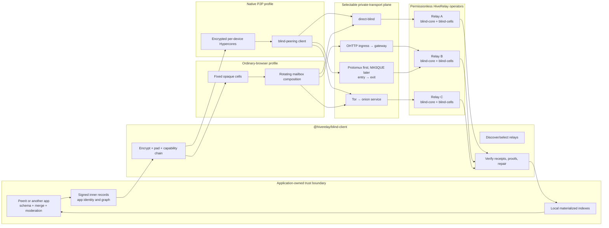

# Blind, App-Agnostic HiveRelay — Master Specification

**Status:** proposed architecture and implementation contract

**Date:** 2026-07-11

**Scope:** HiveRelay, its client SDK, Peerit as the first migration consumer, and
ordinary-browser/Pear/Bare/Node runtime parity

**Target protocol family:** `hiverelay-blind/1`

**Canonical destination:** `HiveRelay/docs/protocol/BLIND-APP-AGNOSTIC-HIVERELAY-MASTER-SPEC.md`

This is the canonical HiveRelay substrate specification. The reviewed document,
canonical vectors, and ABI registry/hash MUST remain together in HiveRelay's
`docs/protocol` tree and release artifacts. Peerit retains only a separately
signed consumer profile naming the accepted `specHash`, `abiHash`, and
`vectorSetHash`; a Peerit release is not the protocol authority.

This is the source-of-truth design for making HiveRelay a modular availability
provider that, for conforming producers, receives no application data it can
interpret. A permissionless opaque-byte service cannot stop a malicious producer
from intentionally uploading plaintext. It supersedes the
privacy *target* in the older OutboxLog and BlindShard plans. It does not describe
the current production deployment: live Peerit still uses app-aware OutboxLog.

The non-normative application migration and responsibility map is maintained in
`BLIND-SUBSTRATE-APPLICATION-ADOPTION.md`. It does not add a relay API; it makes
the client-only adoption boundary explicit for Peerit and later applications.

The product being specified is the **HiveRelay blind substrate**, not a new Peerit
backend. Its strict blind membrane surrounds generic storage, inbox, core,
discovery, admission, evidence, and opaque-forwarding roles. Repair is a capable
client composition over those roles, never an autonomous G3 relay service. Peerit is the first conformance
consumer and has no privileged protocol, endpoint, key, route, padding class,
operator setting, or server plugin. Adding a compatible P2P app MUST require only
client-side adapter/capability distribution; it MUST NOT require a HiveRelay code
update, restart, namespace, domain allowlist, or per-app configuration.

The durable Peerit principle remains unchanged:

> Only Alice can author Alice's records. Anyone may relay Alice's records. No
> relay path is trusted.

The refactor changes what the relay is allowed to know while carrying those
records.

---

## 1. Executive decision

Do **not** add another `blind` flag to OutboxLog. Build a new universal substrate
whose relay-visible unit is a capability-addressed ciphertext cell or an encrypted
Hypercore—not a Peerit namespace, author outbox, semantic row, or social graph.

This is the replacement architecture for application serving, not a permanent
second Peerit backend. At the end of the declared migration window, Peerit's
production read/write path uses only the universal substrate and no new Peerit
state enters OutboxLog, BlindShard, Notify, or another semantic HiveRelay service.
Legacy HiveRelay products may remain separately available to unrelated consumers
while they migrate, but they are outside the strict membrane, use different
process/store/identity/descriptor surfaces, and cannot advertise
`hiverelay-blind/1`. A compatible application adopts the client protocol/profile;
an operator never installs application code, registers an application namespace,
or joins an application-specific relay cluster.

The final HiveRelay application-serving artifact is therefore the blind substrate,
not a broad semantic product with a blind feature enabled. Its canonical
`BuildManifestV1.productMode` is exactly
`BLIND_APPLICATION_SUBSTRATE_V1` and its signed isolation evidence proves the
legacy/plugin surfaces absent. During bounded migration an operator may colocate a
separately released legacy-compatibility artifact, but that artifact has a signed,
non-extendable write/read sunset and a different executable/image, process,
listener, identity, descriptor, store, release channel, logs, metrics, and
credentials.

The target has two complementary availability profiles behind one client SDK:

1. **Blind Core:** encrypted per-device Hypercore replication for Pear, Bare, Node,
   and eventually production-ready P2P web runtimes. HiveRelay composes the
   upstream Holepunch `blind-peer` protocol instead of inventing a competing
   replication protocol.
2. **Blind Cells:** fixed-size, random-address, immutable ciphertext cells for
   ordinary browsers. Rotating encrypted capability chains compose cells into
   mailboxes and logs without exposing application schema to the storage relay.

Ordinary browsers also need a small **Blind Inbox** adjunct (called rendezvous by
the Peerit adapter): a capability-created, epoch-rotated, opaque, fixed-frame
inbox used to carry encrypted discovery announcements. It is a generic app-free
service, not a semantic directory, and its stable per-epoch physical topic is
disclosed as G2-S rather than G3.

Both profiles use the same rules:

- application identity, author identity, signatures, types, graph edges,
  timestamps, moderation state, and semantic IDs live only inside ciphertext;
- the client owns encryption, signing, merge, conflict resolution, and indexes;
- the relay owns bounded byte movement, leases, storage, generic receipts, and
  availability proofs;
- no operator config names Peerit or any other consuming application;
- relay discovery is permissionless, while acknowledgement/retrieval/repair policy
  is explicitly client-selected and Sybil-aware;
- OutboxLog remains a temporary compatibility adapter and is not the new native
  wire contract.

They also share one **tiered private-transport plane**. `direct-blind` is the
minimum-latency baseline; `split-web` uses generic OHTTP role separation;
the first buildable `split-native` path uses persistent two-hop Protomux/Noise,
with MASQUE retained as a later adapter to the same forwarding ABI; and `tor-full`
is the strict high-privacy option. All paths carry the same canonical blind service
messages. Transport changes who can correlate a request; it never changes storage
authority, application truth, or ciphertext meaning. Experimental mix and PIR
profiles are isolated from the version-1 interactive path.

This is a substantial refactor, but most required infrastructure already exists:
service lifecycle patterns, signed capability documents, Hypercore replication,
storage accounting, fixed-cap parsers, blind payment primitives, custody receipts,
client-side repair-state patterns, relay selection, client-side signatures, local materialized
indexes, and multi-runtime build/test machinery.

---

## 2. Normative language and terminology

`MUST`, `MUST NOT`, `SHOULD`, `SHOULD NOT`, and `MAY` are normative.

| Term | Meaning |
| --- | --- |
| **Inner record** | Application-defined signed bytes. Peerit posts, votes, comments, identities, moderation actions, and graph fields exist here. |
| **Capsule** | Randomized authenticated encryption of an inner record plus encrypted routing/chain data and padding. |
| **Cell** | One relay-visible fixed-size storage unit containing only capsule bytes and generic lease metadata. |
| **Storage slot** | A pseudorandom 32-byte identifier derived from a coarse allocation epoch and one-time random create verification key. It is not a plaintext hash, content ID, app ID, author ID, or namespace. |
| **Mailbox** | Client-side composition of cells using encrypted next-capability pointers. The relay does not parse mailbox state. |
| **Blind Inbox** | Capability-created bounded append/read/watch of fixed-size opaque frames under a random physical topic with explicit authorization, lease, and retention. |
| **Rendezvous** | An optional app-side composition of one or more Blind Inboxes plus encrypted bootstrap/authority rules. It is not a relay ABI family, directory, or application truth. |
| **Blind Core** | A Hypercore whose replicated blocks are encrypted with a read capability the blind peer does not possess. |
| **Read capability** | Secret material sufficient to locate/decrypt one cell (or a capability chain). It never grants create/renew/drop authority and never enters relay-managed state. |
| **Write/management capability** | One-time create plus independent renew/drop signing keys for one cell replica. It does not decrypt content or identify an app/author and is never published to readers. |
| **Conforming producer** | A client implementation that encrypts and pads application bytes according to the selected profile before invoking the substrate. A public byte store cannot detect or prevent a malicious caller from deliberately uploading plaintext. |
| **Relay identity** | Stable operator Ed25519 key used only for signed descriptors, receipts, proofs, and dual-signed identity transitions. It is not an app identity. |
| **Admission token** | One-time anonymous credit, proof-of-work, or payment proof authorizing bounded resource use. |
| **Bootstrap** | A non-exclusive way to find initial relays or app capabilities. Bootstrap is not network membership or authority. |
| **Blind service** | A bounded capability- or byte-oriented operation that can be executed without application semantics: cell/core storage, inbox, lease/quota, receipt/proof, discovery, or opaque forwarding. |
| **Strict blind membrane** | The HiveRelay substrate boundary inside which every advertised role is generic and app-agnostic. App-aware/semantic services may exist only outside this membrane and cannot inherit its routes, descriptor profile, or claims. |
| **Transport role** | One independently selectable role in a private path: ingress/entry, gateway/exit, storage, Tor onion endpoint, or mix hop. A role name is infrastructure metadata, not an application name. |
| **Transport descriptor** | A relay-signed, expiring binding between a relay identity, generic role, authenticated endpoint, protocol versions, padding classes, and optional app-free next-hop route. |
| **Operator diversity** | Evidence or policy suggesting roles are controlled by different parties. Different relay keys, hosts, ASNs, or regions are signals, never cryptographic proof of independence. |

The word **blind** without a guarantee level is forbidden in product, protocol, and
operator documentation.

---

## 3. Guarantee ladder

Blindness is not one property. Every implementation and UI claim MUST state the
highest level it actually proves.

| Level | Name | Required property | Expected residual leakage |
| --- | --- | --- | --- |
| **G0** | End-to-end integrity | A relay cannot make a conforming client accept forged/altered/substituted bytes or let delivery replay/reordering change canonical application state without a detected continuity/floor conflict. | A relay may serve in any order, fork its view, or withhold; clients detect/reconcile and app merge rules choose canonical state. |
| **G1** | Payload opacity | For a conforming producer, the substrate receives randomized encrypted payload bytes and no content-decryption key; relay-generated state, logs, metrics, and crash data do not add plaintext or keys. | A public relay cannot recognize a malicious producer intentionally placing plaintext in an opaque byte field. Stable opaque identifiers, sizes, timing, IPs, and access patterns may remain. |
| **G2-S** | Storage-schema opacity | Persisted relay-managed state contains no app/namespace name, application author key, recipient, record type, semantic ID, community, graph edge, or app-specific API credential. Opaque stream/cell identifiers may still be linkable. | Request metadata may identify the calling app; the relay can observe that an unknown stream or slot is active and measure its volume. |
| **G2-W** | Storage-wire app opacity | The storage relay also receives no app-identifying origin, host, credential, path, discovery topic, or uniquely app-specific client fingerprint during operation. | A separate ingress may know the app/client; timing, volume, and collusion can still correlate roles. |
| **G3** | At-rest protocol unlinkability | Independent replicas and newly migrated cells use independent pseudorandom per-replica slots, randomized encryption, and no deterministic relay-visible author/app partition or cross-replica equality join key. | One replica's slot is stable for its lease: renewals, reads, and access timing remain linkable until the capable client migrates to a fresh independently randomized replica. Statistical correlation also remains through size/lease buckets, filesystem/write order, volume, timing, IP, and access patterns. |
| **G4-T** | Source/route separation | The storage role cannot reliably bind the client's network address or application origin to a blind operation because an independently operated oblivious or anonymity transport separates them. | The ingress/entry may see the client; the exit/gateway/storage may see its adjacent hop; timing, volume, collusion, endpoint compromise, and global observation may correlate the path. |
| **G4-I** | Read-interest privacy | The storage role cannot reliably distinguish which logical item/read graph a client requested within a declared anonymity set. This requires common bucket downloads, measured cover/batching, PIR/ORAM, or an equivalently tested construction. | Bucket membership, epochs, total volume, timing, cache behavior, and active attacks may remain. |
| **G5** | Active operator-as-reader resistance | The operator cannot learn content even by running the application as an allowed reader. | **Not achievable for world-readable public content.** It requires private audience keys or stronger access-control/non-collusion assumptions. |

An unqualified **G4** claim means both G4-T and G4-I passed for the named traffic
class. `split-web`, `split-native`, and Tor can establish G4-T under different
assumptions; none hides a requested slot from the storage service by itself.

### Required launch claims

- Every `hiverelay-blind/1` storage implementation MUST meet **G0, G1, and G2-S**
  for the conforming-producer test corpus. It MUST describe G1 as a producer/
  protocol guarantee, not claim that it can prove every caller-supplied byte on a
  permissionless store is ciphertext.
- Direct cross-origin browser HTTPS does **not** meet G2-W because it exposes the
  browser `Origin` and source network address. A Peerit release may claim G2-W only
  when it uses an independently operated, generic oblivious ingress (or an
  equivalently tested transport) and the storage operator cannot see the inner
  app-identifying request metadata.
- Peerit's fixed-cell target SHOULD meet **G3 at rest** against a passive
  storage-role observer without a Peerit reader capability.
- `blind-core` meets G0, G1, and G2-S but exposes a stable opaque core/discovery key and is
  therefore not G3.
- G4-T and G4-I are separate transport/access-pattern claims, never implied by
  encrypted storage. A release MUST name the transport profile, protected traffic
  class, role-separation assumptions, fallback behavior, and measured anonymity
  set rather than say only “G4”.
- Public Peerit MUST explicitly fail the G5 claim: an operator who obtains the
  public reader capability can read what every other public reader can read.

G2-S, G2-W, and G3 describe the **storage role without an out-of-band application
reader capability**. They do not survive an operator deliberately joining a public
application as a reader. The required active-reader negative test must show that
such an operator can identify Peerit slots, follow its public capability graph,
group the decrypted authors, and read the public content.

The honest public-content promise is:

> From a conforming producer, the storage role receives no plaintext, application
> schema, or application identity from the storage protocol; it cannot detect an
> intentionally nonconforming plaintext upload. A direct browser request may still expose its
> origin unless an oblivious ingress is used. Public readers may obtain Peerit's
> capabilities outside the storage protocol, and an operator acting as a reader
> can identify and decrypt that public data.

---

## 4. Goals and non-goals

### 4.1 Goals

1. A clean HiveRelay install can serve compatible apps without application names,
   namespaces, domains, release signatures, custom validators, or operator approval
   of each app.
2. For the conforming-producer corpus, a relay filesystem seizure exposes only
   ciphertext, random/pseudonymous storage identifiers, coarse lease metadata,
   and generic accounting; relay-generated state never adds plaintext or keys.
3. Peerit author signatures remain the content authority; a relay signature proves
   only that a relay accepted or served exact ciphertext.
4. Any number of independent operators may advertise the generic service.
5. Clients—not an app owner—choose their availability/repair set and verify relay
   acknowledgements plus recent retrieval evidence.
6. Native and web clients converge on the same inner application records despite
   using different availability transports.
7. Storage, inbox, discovery, admission, and privacy transport remain small,
   independently testable substrate modules; repair remains a client-side
   composition.
8. Cold start, offline writers, partitions, relay loss, repair, revocation, quota,
   and teardown have specified behavior and executable tests.
9. The same canonical blind operations work over direct, split-web, split-native,
   and Tor transports without application-specific endpoints, credentials, keys,
   paths, or size fingerprints.
10. A strict privacy selection can require different operators for entry, exit,
    and storage and fail closed rather than silently downgrade to a direct path.
11. Onboarding a third compatible P2P app changes no relay code/configuration and
    causes no app-specific descriptor, route, credential, endpoint, metric, quota,
    storage partition, or restart.

### 4.2 Non-goals

1. Hiding world-readable Peerit content from an operator who actively joins Peerit
   as a public reader.
2. Proving that commodity hardware physically erased data or retained no copy.
3. A blockchain, global relay consensus, global total order, or relay-controlled
   application truth.
4. Semantic moderation or content scanning by a blind storage relay.
5. Preserving `/api/sync/directory`, clear `appId`, clear `op.type`, namespace
   admission, or per-author SSE in the native protocol.
6. Claiming anonymity from TLS, Noise, Tor support, or opaque bytes alone.
7. Making the experimental browser DHT relay a production dependency before its
   upstream and live-network gates pass.
8. Providing relay-side semantic search, recommendation, ranking, graph traversal,
   moderation, or per-application policy while claiming the same role is
   application-blind. Those functions remain client-side in version 1.
9. Claiming resistance to a global passive observer, compromised endpoints, or
   colluding path operators from OHTTP, MASQUE, Tor, padding, or mix support alone.

---

## 5. Why the current design cannot be extended in place

| Current component | Valuable part to retain | Why it cannot be the target wire | Disposition |
| --- | --- | --- | --- |
| Peerit signed inner records | Author ownership, Ed25519 verification, key binding, deterministic client reduction | Several author/type fields are relay-visible in v2 | Keep as the encrypted inner application layer |
| Peerit Opaque-Log v2 | Browser WebCrypto, randomized AES-GCM envelope, local reconstruction/indexing | One bundled public RK; clear `_t`, `_k`, `_ns`, timestamps/slug; stable per-author OutboxLog | Replace outer format; retain tested inner validation and indexing |
| OutboxLog | Bounds, pagination work, atomic persistence patterns, subscription lifecycle, compatibility | Clear app namespace, `appId`, record type/ID, author directory, heads, app-specific signature verifier | Legacy migration adapter only; extract generic implementation patterns |
| OutboxLog blind seal | XChaCha20-Poly1305 helpers and recipient wrapping | Its AAD explicitly names namespace, appId, type, and ID | Reuse vetted crypto helpers only behind a new app-free format |
| Atomic/federated OutboxLog branches | CAS discipline, fsync-before-receipt, signed operator receipts | Replicate the same app-aware state and depend on pre-existing group roots | Generalize receipt/persistence code; do not expose OutboxLog schema |
| BlindShard/PVSS | Shard integrity checks, roster verification, custody tests | Relays receive publisher/custody linkage; every relay gets complete ciphertext; public readers can fetch threshold shares | Retire from public Peerit path; retain only as an explicitly separate experimental custody profile |
| Shard store | Hyperblobs/Hyperbee storage, CAS, caps, proofs, HTTP adapter shape | Content-hash address, stable pinner, custody intent/share fields, public possession oracle | Best starting point for `blind-cells` after replacing identity/address/pin schema |
| DHT adapter | Real Hypercore/Hyperbee/Hyperswarm composition and dependency injection | Opens unencrypted, app-named cores; browser DHT relay remains experimental | Add encrypted random cores; keep behind live-network and upstream-stability gates |
| HiveRelay capability doc | Signed generic relay discovery and feature negotiation | Current profiles advertise app-aware services and ambiguous build versions | Extend with exact blind protocol/build profiles; remove app names from blind profile |
| Cashu/lease code | Blind issuance and one-time bearer credit machinery | Current integration was not designed as a mandatory cross-app admission contract | Put behind an `anonymous-quota` interface and re-audit double-spend/linkage |
| RepairTicket | Signed repair lifecycle and bounded event handling | Records expose signer and target relationships | Reuse state-machine lessons only in optional app/client repair profiles; do not expose a relay REPAIR service |

Current evidence is explicit:

- Peerit's fixed read key is public by design and current v2 is not confidentiality:
  [`js/seal.js`](https://github.com/bigdestiny2/peerit/blob/9d445dcb263ff420f7392875ea5747614ebd4c2a/js/seal.js).
- Current v2 leaves relay-visible structural fields and stores `_t` outside the
  ciphertext: [`js/data.js`](https://github.com/bigdestiny2/peerit/blob/9d445dcb263ff420f7392875ea5747614ebd4c2a/js/data.js).
- The browser DHT adapter names cores by `outbox:<appId>` and uses JSON Hyperbee
  values without block encryption: [`js/dht-adapter.js`](https://github.com/bigdestiny2/peerit/blob/9d445dcb263ff420f7392875ea5747614ebd4c2a/js/dht-adapter.js).
- Current OutboxLog derives rows and event topics from clear app IDs and types:
  [`outbox-log.js`](https://github.com/bigdestiny2/P2P-Hiverelay/blob/999b0afd7584bb727cef6e6a88a054f11513927a/packages/services/builtin/outboxlog/outbox-log.js).
- Current OutboxLog blind AAD contains `namespace`, `appId`, `type`, and `id`:
  [`blind-seal.js`](https://github.com/bigdestiny2/P2P-Hiverelay/blob/999b0afd7584bb727cef6e6a88a054f11513927a/packages/services/builtin/outboxlog/blind-seal.js).
- Its swarm hub is explicitly an in-process stand-in, not relay-to-relay
  replication:
  [`swarm-hub.js`](https://github.com/bigdestiny2/P2P-Hiverelay/blob/999b0afd7584bb727cef6e6a88a054f11513927a/packages/services/builtin/outboxlog/swarm-hub.js).

Wire compatibility with those leaks is therefore not an acceptance criterion for
the new protocol.

### 5.1 Current HiveRelay branch and durability hazards

The implementation plan MUST start from exact capabilities and commits, not the
shared version label:

```text
official main                    999b0afd7584bb727cef6e6a88a054f11513927a
codex/peerit-atomic-commit       d8c82183e0ebd1f33e3bc42145a2d568925e8b39
codex/federation-quorum-receipts 0eb6da2a941d7b0575dceaffab0f1fbba15f7415
```

At the time of this audit all report HiveRelay `0.24.3` and OutboxLog `0.1.0`.
Official main does not contain `/api/sync/commit`; the atomic and federation work
remains branch-only. The federation child is not a permissionless replication
protocol: it uses static mutual allowlists and has no history export, bootstrap,
head exchange, catch-up, anti-entropy, or repair.

The current live/release configuration also establishes what Peerit is **not**:

- `shardRoster` is empty, and the published shard roster contains empty keys/an
  example host; current Peerit content is not stored as operational BlindShards;
- the web release selects only `outbox.peerit.site` and reports
  `singleIngressWriter: true`; multiple independent relays are still a target, not
  current shared OutboxLog state;
- current OutboxLog persists clear app/namespace/author-signing/type/ID/time outer
  metadata plus ciphertext, and Peerit's bundled public read key lets an operator
  actively decrypt it as any public reader.

The atomic/federation feature branches and official main have diverged. The
implementation MUST rebase or extract reviewed commits onto a clean current base,
not merge a feature branch wholesale and regress newer API/docs/tests. Identical
package versions across behaviorally different branches are specifically forbidden
for the new profile.

Other current hazards that the refactor MUST not inherit:

- the base Hypercore journal queues asynchronous appends and can return before the
  journal is durable;
- its named journal cores are local relay artifacts, not portable canonical author
  logs, and seeding them does not reconstruct another relay's OutboxLog state;
- `/api/token` is publicly issued and the author directory/read paths remain public;
- `join(appId, inviteKey)` can accept an omitted invite and return the group invite,
  so that value is not a meaningful privacy capability;
- namespace `bytesPerDay` is declared but not enforced by the current engine;
- shard bytes can survive while pin metadata is lost because the default RelayNode
  mount does not inject durable pin persistence;
- shard-store GET/HEAD is a public possession oracle and its per-hash DHT helper is
  not a deployed discovery/replication network;
- the capability document hardcodes selected service profiles, omits important
  shard behavior, and cannot distinguish the atomic/federation branch behavior;
- advertised OutboxLog capabilities do not map cleanly to generic service-RPC
  methods, so a descriptor is not itself an interoperability proof.

The atomic branch's fsync/CAS/idempotency/writer-lease code and the federation
branch's receipt signing are useful extraction sources. They MUST be merged behind
the new app-free protocol with unique versions and conformance tests; branch names
are not production features.

---

## 6. Threat model

### 6.1 Actors and adversaries

| Actor/adversary | Capabilities | Required defense |
| --- | --- | --- |
| Honest-but-curious **storage-role-only** operator | Full disk, process memory, application logs, metrics, HTTP/DHT metadata, but no out-of-band app reader capability | G1, G2-S, and optionally G2-W/G3 according to profile; no content key in the storage role |
| Curious external control journal/lease quorum | Replicated relay/store IDs, spend tags, random locator/topic/core commitments, operation/cost classes, control revisions, lease/fence state, and precise commit timing across three nodes; no body/read key or client transport connection | Treat every node as part of the storage/redeemer knowledge domain; same semantic scanner/redaction; signed topology/failure-group evidence; issuer/ingress separation and timing-collusion limits |
| Malicious relay | Withhold, delete, replay, reorder, fork, corrupt, lie about storage, selectively serve | Client verification, immutable inner history, monotonic floors, multi-relay retrieval, signed receipts and challenges |
| Colluding relays | Compare slots, hashes, timing, source IPs, receipts, and discovery topics | Per-relay random slots/wrappers for G3; state residual timing correlation; G4-T/G4-I require separate named transport/access-pattern assumptions |
| Malicious client | Flood storage, replay tokens, allocate empty slots, amplify reads/proofs/forwarding, send malformed lengths | Bounded codecs, one-time spends, byte-duration pricing, PoW/payment, TTLs, backpressure and global caps |
| Sybil operator | Create many relay keys and claim quorum diversity | Never equate keys with independent operators; client policy/pinning/diversity signals and explicit assumptions |
| Passive network observer | Observe addresses, packet sizes, timing | TLS/Noise for content; size classes; separately tested G4-T/G4-I transports for stronger metadata protection |
| Active public reader | Obtain public Peerit bootstrap/read capability and run normal client logic | Allowed for public content; this is the required negative G5 proof |
| Compromised application origin | Ship malicious JavaScript, steal reader/writer capabilities | Outside relay cryptography; signed/offline app distribution and PearBrowser reduce but do not eliminate this web-origin trust |
| Curious ingress/entry | Observe client address, browser headers, outer sizes/timing, and selected next hop | End-to-end request encryption, generic shared endpoints, bounded padding, no app credential/path; opaque-origin browser gate for the stronger ingress-app-opacity claim |
| Curious gateway/exit | Observe previous hop, storage destination, outer sizes/timing, and multiplexed sessions | Distinct operator from entry/storage, end-to-end blind-service encryption where applicable, bounded circuit lifetime, no client identifier |
| Tor-local or onion-service observer | Observe that Tor is used, onion endpoint identity, and application-shaped timing/volume | Full v3 onion path, application padding/batching, no clearnet fallback; do not claim global traffic-analysis resistance |

### 6.2 Relay-visible data budget

The strict `blind-cells` storage record MAY contain only:

```text
protocolVersion
pseudorandom self-certifying storageSlot
sizeClass
coarse allocation/lease epochs
ciphertext bytes
hash(ciphertext) used for local integrity/receipt
random create/renew/drop verification keys and state/policy revisions
anonymous admission-spend marker
relay-local accounting counters
```

The external control quorum may persist the same generic control metadata needed
to reproduce spends, idempotency, immutable state, and descriptor floors, but no
ciphertext body, decryption/read key, application label, author field, browser
Origin, or original client address. Its snapshots, consensus logs, diagnostics,
metrics, backups, and crash dumps are part of the P1 sentinel/redaction scan. The
daemon-to-quorum connection and commit timing remain correlatable; replication
across nodes improves durability and does not create anonymity.

It MUST NOT contain:

```text
app/namespace name       app origin/domain       app API key
application author key   stable recipient key    record type
semantic/content ID      community/room name     graph target/parent
application timestamp    moderation action       plaintext hash
decryption/read key      recipient list          custody publisher
```

A Blind Core necessarily exposes an opaque core/discovery key, length, block
sizes, and activity. Those fields MUST be documented as the difference between
the G2-S core profile and the G3 cell profile.

### 6.3 Public-browser metadata boundary

A normal browser sends an HTTP `Origin` header and exposes its source IP to the
direct HTTPS/WebSocket endpoint. For a conforming producer,
direct browser-to-storage operation can meet G1,
G2-S, and G3 for stored state, but it fails G2-W, G4-T, and G4-I. Conformance tests MUST
record the negative evidence that a direct storage endpoint sees
`Origin: https://peerit.site` (or the deployed Peerit origin).

An OHTTP-style split can improve this:

- the oblivious ingress sees browser IP/origin but not the inner storage request;
- the storage gateway sees the slot request but not the browser IP/origin;
- privacy depends on the two operators not colluding and on padding/timing sets.

OHTTP does **not** hide the requested slot from the storage gateway. PIR/ORAM or
bucket download is required for that stronger property.

The G2-W web profile uses RFC 9458 request/response encapsulation and RFC 9180
suite identifiers without inventing a new HPKE construction. Gateway discovery is:

```text
BlindOhttpKeyConfigV1 {
  version:          u8 = 1
  gatewayRelayKey:  32 bytes
  gatewayDescriptorSequence:u64
  configId:         u8
  kemId:            u16
  kdfId:            u16
  aeadId:           u16
  encodedPublicKey: bounded bytes[1..256]
  notBeforeEpoch:   u32
  notAfterEpoch:    u32
  previousConfigHash:optional 32 bytes
  signature:        gateway relay Ed25519 signature
}
```

The signature uses purpose-3 recipe 2 with domain
`hiverelay.blind.ohttp-key-config.v1` and the canonical fields before `signature`
as payload. Configs overlap for
at least two epochs; clients reject rollback below a witnessed config/descriptor,
unknown suites, validity over 30 days, or overlapping/recent reuse of `configId`
with different key bytes. The u8 ID may be reused only after the former config's
`notAfterEpoch + 120` (the fixed 30-day replay/cache horizon), its private key is
deleted, no validity overlaps, and a witnessed descriptor/config-set chain has
advanced; reuse without all conditions is rollback/equivocation. Wraparound and
stale-client vectors cover IDs 255→0. `gatewayDescriptorSequence` MUST equal the descriptor whose auxiliary set
contains the config. Each wrapper maps to exactly one RFC 9458 key configuration:
`configId || kemId || encodedPublicKey || u16be(4) || kdfId || aeadId`, where the
HPKE public-key length is exactly `Npk` for the selected KEM. The canonical
`application/ohttp-keys` object sorts wrappers by `configId`, rejects duplicates,
prefixes each resulting key-configuration encoding with its `u16be` byte length,
and concatenates one or more entries exactly as RFC 9458 section 3.2 requires. An
invalid entry invalidates the entire collection; clients never salvage a subset.

The initial gateway descriptor, config collection, and ingress→gateway mapping are
either release-bundled/content-addressed or fetched from the ingress at the one
shared generic key-config resource and authenticated against the signed gateway
key/descriptor sequence. A client MUST NOT contact the gateway directly to fetch
the key needed to hide its address from that gateway. A later refresh follows the
same ingress/privacy path and accepts only a signed, sequence-linked, witnessed
collection; an unprotected OHTTP error can trigger a refresh check but cannot
supply trusted config bytes. The browser pads encapsulated CELL/INBOX requests and responses to
negotiated generic classes. The independently operated ingress receives only an
opaque OHTTP message plus generic gateway route; it strips browser ambient headers
before forwarding. The gateway receives only the decapsulated fixed-route blind
request and ingress connection metadata, never the original `Origin`/IP. P3-W
tests non-collusion assumptions, key rotation, error encapsulation, and both sides'
logs.

The outer HTTP boundary is exact. Client and ingress use `POST` with
`Content-Type: message/ohttp-req`; a successfully decapsulated target response,
including a target/application error, is returned as outer HTTP `200` with
`Content-Type: message/ohttp-res` and the protected response. Relay errors and
gateway errors before successful decapsulation are unprotected HTTP 4xx/5xx as
required by RFC 9458. Because an ingress can forge those unprotected responses,
the client treats them only as untrusted transport/config observations—never as a
blind operation result, proof of non-processing, automatic downgrade, or authority
to adopt key material. Post-decapsulation Blind errors remain inside the protected
bHTTP response.

The ordinary page origin remains visible to the **ingress** unless a separately
gated browser construction removes it. The candidate `opaque-ohttp-frame-v1`
construction runs the audited OHTTP client in an application-bundled sandboxed
opaque-origin frame (`sandbox="allow-scripts"` without `allow-same-origin`), passes
only bounded binary jobs over a `MessageChannel`, uses `credentials: "omit"` and
`referrerPolicy: "no-referrer"`, and sends only the shared generic OHTTP route.
It is not normative merely because HTML assigns an opaque origin: supported
Safari/iOS, Chromium, and Firefox builds MUST be captured on the wire and prove
that `Origin`, `Referer`, cookies, client hints, fetch-metadata fields, URL paths,
TLS/SNI selection, caches, service workers, and error behavior do not provide a
stable app discriminator. Until that proof passes, docs MUST say “storage-wire
app opacity”; they MUST NOT say every ingress is application-blind.

The opaque frame is insufficient if unrelated apps select disjoint gateways or
distinct route IDs/configs/padding schedules. The stronger ingress-app-opacity
classifier therefore includes gateway/route choice, HPKE config, outer class,
cadence, retry, cache, and error distributions. It requires a shared generic route
pool and app-neutral selection policy; it cannot be satisfied by hiding only the
`Origin` header.

A normal website cannot create an HTTP `CONNECT`/CONNECT-UDP MASQUE tunnel through
Fetch. The native split profiles are therefore Pear/Bare/Node profiles. Version 1
first ships a Protomux/Noise two-hop forwarder using current HiveRelay primitives;
MASQUE is a later transport adapter to the same `FORWARD` ABI, not a prerequisite
for source separation. A browser MAY
experiment with an end-to-end encrypted WebTransport/WebSocket byte tunnel through
a generic forwarder, but it is a separately versioned transport and cannot inherit
the MASQUE or OHTTP proof.

### 6.4 Blind-service semantic boundary

“Relays provide every service blind” means every **infrastructure** service needed
for availability can operate without application meaning. A conforming strict
role MAY:

- put/get/prove/renew/drop a fixed cell by random capability-derived slot;
- create/authenticate/append/read/watch bounded fixed inbox frames by rotating
  random physical topic;
- mirror encrypted core blocks under an opaque discovery key;
- spend a generic anonymous quota token and account byte-duration classes;
- sign generic storage/serve receipts and challenge responses;
- advertise signed generic service/transport descriptors; and
- forward an opaque bounded message or byte tunnel to an allowed next role.

The same role MUST NOT interpret or index an author, community, record type,
application timestamp, social edge, moderation action, search term, rank feature,
or application name. Semantic search/ranking/moderation/graph traversal remains in
the client over locally decrypted indexes. A future TEE/MPC/FHE service is a new
trust/profile contract, not an exception to this rule. PIR is limited to hiding a
generic index selection; it does not authorize semantic relay processing.

These roles are HiveRelay substrate modules. An app consumes them by shipping an
opaque client adapter and capabilities. If supporting that app requires a relay
plugin, app validator, schema migration, namespace, CORS-domain edit, dedicated
route/key, metric label, operator approval, or restart, that service is outside the
  strict membrane and fails the app-agnostic conformance gate. During bounded
  migration an app-aware service may coexist on the same machine only as a
  separately released signed-sunset compatibility product with a separate claim
  boundary; it cannot be selected by the strict client path or made a permanent
  HiveRelay application-serving alternative.

HiveRelay's existing Notify, OutboxLog, semantic directory, app-webhook, search,
moderation, and app-specific SSE surfaces are outside this membrane. They MUST NOT
be mounted in the strict blind daemon, advertised by its descriptor, or reached by
a strict client retry. Coexistence requires a different process/listener,
  descriptor/product, release artifact/channel, signed sunset, logs, metrics, and
  credentials.

G3 repair is deliberately absent from the relay ABI. A capable client or
independently running app-side repairer retrieves a valid replica, creates a new
randomized wrapper/slot, performs an ordinary `CELL.PUT`, and publishes an opaque
app-owned availability update through ordinary cells/inboxes. A relay never learns
which G3 cells are replicas and never scans, matches, or repairs them autonomously.

Generic service semantics remain visible: an operator may learn the operation
code, random locator/topic, negotiated padding class, coarse lease, adjacent
transport role, timing, and volume. Calling these fields “opaque” does not make
them invisible. “Inside the strict membrane” means no app semantics or per-app
behavior/configuration; it does not by itself prove that ambient Origin, endpoint
selection, or traffic shape cannot statistically identify an app. Those stronger
role-local claims require G2-W/P3-W and, for ingress, P20.

### 6.5 Tiered private-transport profiles

All profiles carry the canonical messages from sections 9–12. No transport may
add an app field, app credential, dedicated app path, app-specific HPKE key, or
unique padding class.

| Profile ID | Required route | Intended runtime | Claim ceiling before access-pattern defenses | Normative fallback |
| --- | --- | --- | --- | --- |
| `direct-blind-v1` | Client → storage over authenticated HTTPS/Protomux/Noise | All | G0/G1/G2-S and profile-dependent G3; not G2-W/G4-T/G4-I | Direct only; UI states metadata exposure |
| `split-web-ohttp-v1` | Browser → generic OHTTP ingress A → OHTTP gateway/storage B | Ordinary browser | G2-W at storage and G4-T for storage under A/B non-collusion; not G4-I | May fall back only after explicit user/policy permission to `direct-blind-v1`; claim downgrades visibly |
| `split-native-protomux-v1` | Native client → Noise/Protomux entry A → Noise/Protomux exit B → storage C, carrying a separate end-to-end Noise blind session | Pear/Bare/Node | G2-W and G4-T at storage under operator/traffic assumptions; not G4-I | Strict mode fails closed; balanced mode may explicitly choose direct |
| `split-native-masque-v1` | Native client → H3 MASQUE entry A → H3 MASQUE exit B → storage C, carrying the same end-to-end blind stream | Pear/Bare/Node, later adapter | Same ceiling as `split-native-protomux-v1`; no stronger claim from HTTP/3 | Strict mode fails closed; balanced mode may explicitly choose direct |
| `tor-native-full-v1` | Native client/sidecar → full v3 onion service → local HiveRelay blind endpoint | Pear/Bare/Node with Tor sidecar | G2-W and G4-T under the Tor threat model; not G4-I or global-observer resistance | MUST fail closed; never resolve/connect to the clearnet endpoint |
| `tor-browser-full-v1` | Tor Browser page → full v3 onion service → local HiveRelay blind endpoint | Tor Browser | Tor source-address separation only by default; browser `Origin`/Fetch Metadata can identify the app, so neither G2-W nor this ladder's G4-T passes until the separate opaque-origin ambient-header gate; not G4-I/global-observer resistance | MUST fail closed; never resolve/connect to clearnet; failed/unknown header gate remains visibly below G2-W/G4-T |
| `tor-single-onion-v1` | Tor client → operator-declared single-onion endpoint, only where the selected Tor implementation supports it | Native, experimental | May hide the client address from the service, but does not hide the public service/operator location and is not equivalent to `tor-native-full-v1` | MUST fail closed; MUST NOT be selected by a policy requiring service-location privacy |
| `mix-async-v1` | Fixed-size Sphinx-family packet through independently operated mixes to a blind write/inbox endpoint | Background/queued operations, experimental | Only the traffic class and adversary demonstrated by its cover/delay test | Queue or fail; never silently send the same sensitive operation directly |

`split-web-ohttp-v1` uses a fresh HPKE request context for every logical request
while reusing pooled HTTP/2 or HTTP/3 connections. Both split-native adapters reuse
bounded-lifetime entry/exit circuits and multiplex canonical blind operations;
neither creates a circuit per cell. Protomux/Noise is the required first build
because it fits the current runtime; MASQUE is enabled only after its independent
runtime and performance gate. Entry, exit, and storage SHOULD be different
operators. `tor-native-full-v1` uses SOCKS5 username exact ASCII `<torS0X>0` and a
nonempty password equal to unpadded base64url of 32 fresh CSPRNG bytes. One password
is scoped to one local session/persona, never an account/app-global identity and
normally not one token per request; any different username, empty password, reuse
across personas, or legacy arbitrary username/password profile is nonconforming.
A page in Tor
Browser cannot set that SOCKS token; `tor-browser-full-v1` relies on the browser's
own first-party/circuit isolation, which is capture-tested and never claimed as an
app-configured property.

Storage idempotency does not relax RFC 9458 retry rules. If an OHTTP response is
lost after the request might have been processed, the client MUST keep the logical
intent pending and MUST NOT automatically encapsulate and submit it again merely
because the connection closed, timed out, or returned an ambiguous transport
error. Automatic resubmission with a fresh HPKE context is permitted only after a
positive protocol signal that the request was not processed, such as an applicable
HTTP/2 `REFUSED_STREAM`, HTTP/3 `H3_REQUEST_REJECTED`, or qualifying `GOAWAY` state
under the respective HTTP rules. Otherwise the client first reconciles through a
separate safe read/prove operation where the family provides one, or requires an
explicit user/policy decision to resend the exact inner request. A resend never
reuses an HPKE context and never changes gateway/storage destination, commitment,
spend, locator, or ciphertext while claiming to be the same attempt. Direct or
weaker fallback is always a separate visible path decision.

Tor is a TCP stream transport in this profile. Strict Tor mode MUST NOT start
HyperDHT/QUIC/UDP discovery, issue DNS for a clearnet relay, include a clearnet
fallback race, or fetch a clearnet descriptor outside Tor. Cells, inboxes,
descriptor discovery, admission, and Blind Core transport therefore use the
onion-exposed stream API. A relay operator need not run a public Tor guard/middle
relay: each HiveRelay MAY expose its existing blind API as its own onion service,
preferably through a local Unix socket. If an operator also runs a Tor network
relay, the processes, keys, logs, and advertised roles MUST remain separate.

Tor changes the network path; it does not suppress browser-generated application
metadata. A direct Tor Browser cross-origin request from a Peerit page to a relay
onion can carry `Origin`, Fetch Metadata, and policy-dependent referrer fields to
storage. `tor-browser-full-v1` therefore starts with source-address separation
only, below this ladder's G4-T because G4-T also requires origin separation. It
may add G2-W and G4-T only after the same supported-browser opaque-origin capture/classifier used
for P20 proves that the onion storage role receives no stable app discriminator.
Native onion streams do not generate those browser headers and use the separate
`tor-native-full-v1` claim.

The signed profile bit cannot remotely prove how an operator configured its onion
service. Both `tor-native-full-v1` and `tor-browser-full-v1` therefore require reproducible operator-side process/config
evidence for the full service circuit; without that evidence the client may still
use the onion address but MUST label service-location privacy unverified. A
`tor-single-onion-v1` declaration is explicitly an operator statement, never a
cryptographic proof of hop count.

The `mix-async-v1` adapter is for small delayed writes or opaque inbox updates,
not live feed reads or bulk core replication. It MUST use a
reviewed Sphinx-family implementation and publish its cover, delay, churn, replay,
and active-attack assumptions; this specification does not invent a mix
cryptosystem.

#### 6.5.1 Role-local visibility matrix

| Role/path | May see | Must not receive/claim |
| --- | --- | --- |
| Direct storage | Client IP, app Origin in browsers, generic op, random slot/topic/core key, padded class, lease, timing/volume | Plaintext/key/app fields; may not claim G2-W or G4-T |
| OHTTP ingress | Client IP, opaque OHTTP ciphertext, outer request size/timing, selected signed gateway route; browser app origin unless `opaque-ohttp-frame-v1` passes | Inner op/slot/topic/cell bytes, admission spend, or response plaintext |
| OHTTP gateway/storage | Ingress IP, generic op, random slot/topic, padded class, timing/volume | Original client IP, browser ambient headers, app path/credential |
| Protomux or MASQUE entry | Client IP, chosen exit, circuit sizes/timing | Storage destination, blind op/locator, payload, app identity |
| Protomux or MASQUE exit | Entry identity/IP, signed exit→storage route and its generic admission/caps, storage endpoint, circuit sizes/timing, opaque client↔storage Noise records | Original client IP, blind operation/locator, storage-session plaintext, app identity |
| Storage behind a split-native exit | Exit identity/IP, generic op/locator, padded class, timing/volume | Original client IP/Origin, entry identity, app fields |
| Native full-onion endpoint/storage | Its onion service identity, local Tor stream, generic op/locator, padded class, timing/volume | Client network address, clearnet fallback metadata, app fields; no G4-I/global-observer claim |
| Tor Browser full-onion endpoint/storage | The native-row fields plus browser `Origin`, Fetch Metadata, and permitted referrer/header surface until the opaque-origin gate passes | Client network address and clearnet fallback metadata; MUST NOT claim G2-W from Tor alone and makes no G4-I/global-observer claim |
| Anonymous-quota issuer | Source IP/origin unless privately transported, plus scheme-specific issuance eligibility/transcript | Later redemption locator or storage request in a claimed unlinkable profile |
| Anonymous-quota redeemer/storage | One-use token/spend marker and generic authorized cost | Issuance identity/account or app-specific quota bucket |
| External journal/lease quorum | Relay/store/journal IDs, spend and opaque locator commitments, generic operation/cost/lease classes, revisions/fences, control-state snapshot, daemon address, exact commit timing | Ciphertext bodies, read/decryption keys, app/author/type labels, issuance account, original client IP/Origin; it is part of redeemer/storage for collusion analysis |
| Discovery role | Universal protocol query, signed descriptors, network source unless privately transported | Requested app/content/community or an app membership list |

No row promises non-collusion. A client may enforce distinct relay keys, endpoints,
ASNs, jurisdictions, user pins, and independently witnessed operator statements,
but MUST report these as selection evidence rather than proof that legal/control
ownership differs.

#### 6.5.2 Read-interest defenses

The first production G4-I candidate is a **fixed epoch bucket**: many clients fetch
the same bounded storage bucket and filter locally. The relay groups already-stored
fixed cells only by coarse allocation epoch and a common prefix of their
pseudorandom slots; it does not construct an app feed, checkpoint, or semantic
index. Bucket width, identifier encoding, cadence, pagination, admission, cache
policy, and padding are universal substrate parameters exercised by at least two
unrelated fixture apps or otherwise described as app-fingerprintable.
A fixed-count decoy batch MAY improve a measured anonymity set but cannot be called
PIR.

`pir-checkpoint-v1` MAY later hide selection within an immutable checkpoint bucket,
but its hint size, preprocessing, query/response amplification, database version
binding, multi-server/non-collusion assumption, and mobile cost MUST be published.
It is not a mutable multiwriter store and is not on the version-1 write path. ORAM
and general private computation remain research profiles.

---

## 7. System architecture



### 7.1 Layer ownership

| Layer | Owns | Must not own |
| --- | --- | --- |
| Application adapter | Schema, author identity, canonical logical IDs, signatures, merge, moderation, discovery capabilities | Relay credentials or relay-specific truth |
| Blind client | Encryption, padding, capability derivation, relay policy, receipts, repair, runtime adapters | Application semantics beyond opaque inner bytes |
| Blind availability services | Cells/cores, lease enforcement, generic proofs/receipts, byte accounting | App schemas, authors, recipients, semantic indexes |
| Blind edge | The only public listeners; TLS/HTTP/CORS, Protomux/onion transport framing, fixed route-to-family mapping, bounded streaming, ambient-metadata stripping, and private IPC | Relay signing/storage keys, canonical body parsing, storage, admission decisions, app services, or arbitrary proxying |
| Blind daemon | Private Unix-IPC listener, isolated relay signing identity, canonical five-family dispatch, admission, storage/WAL, descriptor/receipt/health signing | Any public listener/TLS credential, app services/namespaces, Notify/OutboxLog, semantic plugins, or shared app-aware process state |
| Private transport | Direct/OHTTP/Protomux/MASQUE/Tor/mix adapters, role selection, padding/batching, fail-closed downgrade policy | Storage authority, app semantics, decryption keys, or an unqualified anonymity claim |

### 7.2 Small module boundary

The implementation SHOULD be split as follows:

```text
@hiverelay/blind-protocol     pure binary codecs, domains, vectors, errors
@hiverelay/blind-client       encrypt/pad/capabilities/selection/repair
@hiverelay/blind-edge         isolated public transport/metadata membrane
@hiverelay/blind-daemon       private canonical ABI/storage/signing process
@hiverelay/blind-cells        relay cell engine inside blind daemon
@hiverelay/blind-mailbox      client-side rotating chain/bag composition
@hiverelay/blind-inbox        generic fixed-frame inbox service/client
@hiverelay/blind-core         adapter around upstream blind-peer
@hiverelay/anonymous-quota    one-use token, PoW, Cashu adapters
@hiverelay/availability       client-only receipts, challenges, quorum and repair planner
@hiverelay/discovery          generic signed service descriptors/DHT lookup
@hiverelay/private-transport  OHTTP/Protomux/MASQUE/Tor/batching adapters and policy
```

Those are logical boundaries except for `blind-edge` and `blind-daemon`, which are
mandatory disjoint workspaces, build components, entry points, processes, users,
and service units from the first production release. One deterministic
multi-component distribution bundle is the single `buildArtifactHash`; it contains
exactly the selectively built edge and daemon component artifacts plus packaging
metadata, but neither component imports or packages the other component's source
or any compatibility source. `BlindLaunchTopologyV1` freezes their digests,
entrypoints, UIDs, mounts, two unequal private sockets, listener ownership, permitted children,
service units, and default launcher. Compose/systemd instantiate exactly two
long-running services after one signed, bounded volume-ownership initializer has
exited successfully. That initializer reuses the daemon component artifact, is
not a third product component or application-serving process, and is covered by
the same topology and process-inspection evidence.
A compatibility runtime is built from its separate frozen source tree and is not a
third component of this bundle.

Daemon constructs/signs descriptor, DHT-pointer, health, receipt and proof bytes;
edge serves or transports those exact bytes and owns every public endpoint named
by the descriptor. Edge never holds the relay signing key. Endpoint readiness is
daemon state joined to edge-owned endpoint IDs by the frozen private IPC and launch
topology, so neither process can advertise a role alone.

Every module that opens a store, swarm, stream, timer, subscription, worker, or
file handle MUST expose explicit `close()`/`destroy()` and `AbortSignal` behavior.
Slow consumers MUST cause bounded backpressure or disconnection, never unbounded
queues.

### 7.3 Frozen minimal daemon ABI

The version-1 product exposes exactly five top-level protocol families through
blind-edge; blind-daemon dispatches the same five after private IPC. HTTP,
Protomux, OHTTP, onion, and future MASQUE adapters are mappings to this ABI; they
MUST NOT create different semantics:

| Family | Frozen sub-operations | Purpose |
| --- | --- | --- |
| `DESCRIBE` | `GET`, `CHALLENGE`, `ADMISSION_PARAMETERS` | Signed descriptor/build/profile discovery, fresh health proof, and hashed generic admission parameters |
| `CELL` | `PUT`, `GET`, `RENEW`, `DROP`, `PROVE`, `BATCH_GET` | Immutable fixed-cell storage and evidence |
| `INBOX` | `CREATE`, `RENEW`, `CLOSE`, `APPEND`, `READ`, `WATCH` | Capability-created opaque fixed-frame inboxes with bounded retention |
| `CORE` | `MIRROR`, `PROVE`, `OPEN_REPLICATION` | Generic encrypted Hypercore sponsorship/evidence and upstream replication |
| `FORWARD` | `OPEN`, `DATA`, `WINDOW`, `CLOSE` | Bounded opaque next-hop stream used by split transports |

Every resource-consuming sub-operation carries or references generic admission;
admission issuance is not an app service and is not a sixth storage verb. Version
1 has no `REPAIR`, `NOTIFY`, `SEARCH`, `DIRECTORY`, namespace, author-head, or
semantic subscription family. Adding a top-level family requires a new major ABI,
new `abiHash`, vectors, threat review, and proof that it remains inside the strict
membrane. Optional experimental adapters may wrap these families but cannot
silently extend them.

#### 7.3.1 Canonical transport-neutral dispatch

Every adapter carries the same length-delimited dispatch frame. Integer fields
below are unsigned big-endian fixed-width values; no transport may infer or omit a
field:

```text
BlindDispatchFrameV1 {
  frameLength:   u32                  // bytes after this field, <= 4 MiB + 64
  version:       u8 = 1
  frameKind:     u8                   // 1 request, 2 response, 3 error,
                                      // 4 stream-control/data
  familyId:      u8
  operationId:   u8
  flags:         u8 = 0               // all bits reserved in v1
  requestId:     16 bytes             // random nonzero for unary/open; zero for stream
  streamId:      u64                  // zero for unary/open request; nonzero after open
  sequence:      u64                  // zero for unary; per-sender monotonic for stream
  bodyLength:    u32                  // exact following bytes, <= family/op cap
  body:          exact canonical operation bytes
}
```

The frozen registry is:

| Family ID | Operations (`name=id`) |
| --- | --- |
| `1 DESCRIBE` | `GET=1`, `CHALLENGE=2`, `ADMISSION_PARAMETERS=3` |
| `2 CELL` | `PUT=1`, `GET=2`, `RENEW=3`, `DROP=4`, `PROVE=5`, `BATCH_GET=6` |
| `3 INBOX` | `CREATE=1`, `RENEW=2`, `CLOSE=3`, `APPEND=4`, `READ=5`, `WATCH=6` |
| `4 CORE` | `MIRROR=1`, `PROVE=2`, `OPEN_REPLICATION=3` |
| `5 FORWARD` | `OPEN=1`, `DATA=2`, `WINDOW=3`, `CLOSE=4` |

The operation bitmap ordinal is the row-major order above: bits 0..2 are the
three DESCRIBE operations, 3..8 the six CELL operations, 9..14 the six INBOX
operations, 15..17 the three CORE operations, and 18..21 the four FORWARD
operations. Bits 22..31 are zero. A descriptor's `enabledOperationBits` is the
exact currently advertised subset; a health response's `readyOperationBits` is
the exact ready subset of both the descriptor and challenge request. Unknown bits,
a ready bit absent from either input, or a family/profile role claiming an
operation whose bit is clear fails validation.

The wire registry carries one closed row per pair:

```text
OperationProfileV1 { // ABI-registry metadata, not sent in each request
  familyId:              u8
  operationId:           u8
  requestSchemaId:       u16
  resultSchemaId:        u16 // zero only for kind-4-only stream verbs
  allowedRequestKindBits:u8
  allowedResultKindBits: u8
  streamTransition:      u8 // 0 unary, 1 core-child, 2 forward-open, 3 forward-active
  maxRequestBodyBytes:   u32
  maxResultBodyBytes:    u32
  admissionMode:         u8 // 0 none, 1 optional, 2 required
  costClassRuleId:       u16 // zero only when admissionMode=0
  requestCommitmentDomainId:u16 // zero only when no request commitment exists
  resultSignatureDomainId:u16   // zero when transport/authentication is sufficient
  errorProfileId:        u8 // 1 = canonical BlindErrorV1 precedence/mapping
  transportSupportBits:  u16
}

RelayResultBindingV1 { // nested in every persistent signed operation result
  version:               u8 = 1
  relayPublicKey:        32 bytes
  storeId:               32 random nonzero bytes
  descriptorSequence:    u64
  descriptorHash:        32 bytes
  durabilityProfileId:   u8
  durabilityContinuityHash:32 bytes
  durabilityProfileHash: 32 bytes
  restoreEvidenceHeadSequence:u64
  restoreEvidenceHeadHash:32 bytes
  externalCommitWitness: optional BlindExternalCommitWitnessV1
}

BlindExternalCommitWitnessV1 { // conditionally present under the closed table below
  version:               u8 = 1
  relayPublicKey:        32 bytes
  storeId:               32 random nonzero bytes
  externalJournalId:     32 random nonzero bytes
  durabilityContinuityHash:32 bytes
  durabilityProfileHash: 32 bytes
  restoreEvidenceHeadSequence:u64
  restoreEvidenceHeadHash:32 bytes
  familyId:              u8
  operationId:           u8
  requestCommitment:     32 bytes
  resultCommitment:      32 bytes
  commitWalSequence:     u64
  commitWalHash:         32 bytes
  coveringFloorRevision:u64
  coveringFloorHash:     32 bytes
  coveringFloorWalSequence:u64
  coveringFloorWalHash:  32 bytes
  writerEpoch:           u64
  writerFenceTokenHash:  32 bytes
  externalLeaseRevision: u64
  witnessedUnixMillis:   u64
  witnessPublicKey:      32-byte Ed25519 public key
  signature:             64-byte Ed25519 signature
}
```

Kinds use bits 0..3 for frame kinds 1..4. Transport bits are 1 DIRECT_HTTP,
2 DIRECT_NATIVE, 4 OHTTP, 8 TOR_HTTP, 16 TOR_NATIVE, and 32 MASQUE_NATIVE. Domain
IDs resolve through the registry's sorted `(domainId, exact ASCII bytes)` table;
cost-rule IDs resolve through its generic admission-cost table. These rows are the
normative v1 closure (sizes are bytes):

```text
DomainRegistryEntryV1 {
  domainId:         u16
  purpose:          u8 // 1 request commitment, 2 result signature,
                       // 3 auxiliary WIRE signature
  recipeId:         u8 // 1 operation-defined commitment preimage,
                       // 2 Ed25519(domain || len64(payload) || payload)
  exactAsciiBytes:  canonical ASCII bytes[1..96]
}

ErrorProfileEntryV1 {
  errorProfileId:        u8 = 1
  code:                  u8
  directCorrelatedStatus:u16 = 200
  protectedInnerStatus:  u16 = 200
  retryable:             u8 = 0 | 1
  retryAfterMode:        u8 // 0 MUST be absent, 1 MUST be present
}

AdmissionCostRuleV1 {
  costClassRuleId:  u16
  ruleKind:         u8
}
```

The sorted domain table is exact; IDs and bytes are never locally assigned:

| ID | Purpose | Recipe | Exact ASCII bytes |
| ---: | --- | ---: | --- |
| 1 | request | 1 | `hiverelay.blind.request.v1cell-put` |
| 2 | request | 1 | `hiverelay.blind.request.v1cell-get` |
| 3 | request | 1 | `hiverelay.blind.request.v1cell-renew` |
| 4 | request | 1 | `hiverelay.blind.request.v1cell-drop` |
| 5 | request | 1 | `hiverelay.blind.request.v1cell-prove` |
| 6 | request | 1 | `hiverelay.blind.request.v1cell-batch-get` |
| 7 | request | 1 | `hiverelay.blind.request.v1inbox-create` |
| 8 | request | 1 | `hiverelay.blind.request.v1inbox-renew` |
| 9 | request | 1 | `hiverelay.blind.request.v1inbox-close` |
| 10 | request | 1 | `hiverelay.blind.request.v1inbox-append` |
| 11 | request | 1 | `hiverelay.blind.request.v1inbox-read` |
| 12 | request | 1 | `hiverelay.blind.request.v1inbox-watch` |
| 13 | request | 1 | `hiverelay.blind.request.v1core-mirror` |
| 14 | request | 1 | `hiverelay.blind.request.v1core-serve` |
| 15 | request | 1 | `hiverelay.blind.request.v1core-open-replication` |
| 16 | request | 1 | `hiverelay.blind.forward-open.v1` |
| 101 | result signature | 2 | `hiverelay.blind.descriptor.v1` |
| 102 | result signature | 2 | `hiverelay.blind.health-result.v1` |
| 103 | result signature | 2 | `hiverelay.blind.admission-parameters.v1` |
| 104 | result signature | 2 | `hiverelay.blind.cell-receipt.v1` |
| 105 | result signature | 2 | `hiverelay.blind.batch-get-result.v1` |
| 106 | result signature | 2 | `hiverelay.blind.inbox-receipt.v1` |
| 107 | result signature | 2 | `hiverelay.blind.inbox-append-ack.v1` |
| 108 | result signature | 2 | `hiverelay.blind.inbox-read-result.v1` |
| 109 | result signature | 2 | `hiverelay.blind.core-ack.v1` |
| 110 | result signature | 2 | `hiverelay.blind.core-open-result.v1` |
| 111 | result signature | 2 | `hiverelay.blind.forward-open-result.v1` |
| 201 | auxiliary signature | 2 | `hiverelay.blind.ohttp-key-config.v1` |
| 202 | auxiliary signature | 2 | `hiverelay.blind.identity-transition.v1` |
| 203 | auxiliary signature | 2 | `hiverelay.blind.dht-pointer.v1` |
| 204 | auxiliary signature | 2 | `hiverelay.blind.transport-route.v1` |
| 205 | auxiliary signature | 2 | `hiverelay.blind.forward-hop-open.v1` |
| 206 | auxiliary signature | 2 | `hiverelay.blind.forward-hop-accept.v1` |
| 207 | auxiliary signature | 2 | `hiverelay.blind.external-journal-topology.v1` |
| 208 | auxiliary signature | 2 | `hiverelay.blind.external-commit-witness.v1` |
| 209 | auxiliary signature | 2 | `hiverelay.blind.restore-evidence-head.v1` |
| 210 | auxiliary signature | 2 | `hiverelay.blind.backup-manifest.v1` |
| 211 | auxiliary signature | 2 | `hiverelay.blind.clean-restore-evidence.v1` |
| 212 | auxiliary signature | 2 | `hiverelay.blind.backup-retention-transition.v1` |

Request entries 1..15 are exactly the already-written concatenation of common
ASCII prefix `hiverelay.blind.request.v1` and operation ASCII label; entry 16 is
the distinct forwarding preimage. The table changes no commitment formula—it
freezes the bytes that those formulas already use. Recipe 2 signs the exact
canonical payload bytes with pure Ed25519 over
`exactAsciiBytes || len64(payload) || payload`; no recipe-2 signature may omit the
length, add a prehash/context, or select a local preimage. For a schema containing
two signatures, such as `RelayIdentityTransitionV1`, both keys sign the same
recipe-2 payload with both signature fields omitted. Duplicate ID/bytes, wrong
purpose/recipe, unknown ID, non-ASCII byte, an operation referencing a domain of
the wrong purpose, or a WIRE signature field without exactly one purpose-2/3
registry entry fails generation.

Error profile 1 is likewise a closed sorted registry. Every correlated direct
response and every OHTTP protected inner response uses status 200 and a canonical
kind-3 dispatch frame; outer adapter failures before trustworthy correlation are
not `BlindErrorV1` and use the separately frozen adapter mapping. The exact rows
are:

| Code | Name | Direct | Protected inner | retryable | retryAfterEpoch |
| ---: | --- | ---: | ---: | ---: | --- |
| 1 | BAD_VERSION | 200 | 200 | 0 | absent |
| 2 | BAD_ENCODING | 200 | 200 | 0 | absent |
| 3 | TOO_LARGE | 200 | 200 | 0 | absent |
| 4 | BAD_SLOT | 200 | 200 | 0 | absent |
| 5 | BAD_CREATE_SIG | 200 | 200 | 0 | absent |
| 6 | BAD_MANAGEMENT_SIG | 200 | 200 | 0 | absent |
| 7 | STALE_REVISION | 200 | 200 | 0 | absent |
| 8 | CONFLICT | 200 | 200 | 0 | absent |
| 9 | SPEND_REQUIRED | 200 | 200 | 1 | absent |
| 10 | SPEND_INVALID | 200 | 200 | 0 | absent |
| 11 | SPEND_REPLAY | 200 | 200 | 0 | absent |
| 12 | LEASE_UNSUPPORTED | 200 | 200 | 0 | absent |
| 13 | NOT_FOUND | 200 | 200 | 0 | absent |
| 14 | EXPIRED | 200 | 200 | 0 | absent |
| 15 | SUPPRESSED | 200 | 200 | 0 | absent |
| 16 | BUSY | 200 | 200 | 1 | absent |
| 17 | INTERNAL | 200 | 200 | 1 | absent |
| 18 | RENEW_NOT_DUE | 200 | 200 | 1 | required |
| 19 | RETRY_TERMINAL | 200 | 200 | 0 | absent |
| 20 | TRANSPORT_UNSUPPORTED | 200 | 200 | 0 | absent |

`retryAfterEpoch` is present exactly for code 18, is strictly greater than the
authenticated effective epoch floor, and is the first epoch at which the same
otherwise-valid renewal can succeed. All other rows encode the optional as absent.
Unknown/duplicate/missing rows, a body whose bits disagree with its row, or a
profile reference other than 1 fails ABI generation and decoding.

Cost derivation returns exactly one `(resourceClass:u8, leaseClass:u8)` used to
select the unique matching `AdmissionParametersV1.resourceCosts` row for the same
family/operation. Lease class zero means NONE. Complete canonical result length
bands are `1 <=4 KiB`, `2 <=16 KiB`, `3 <=64 KiB`, `4 <=256 KiB`,
`5 <=1 MiB`, `6 <=4 MiB`; exceeding the operation cap fails before cost lookup.
The rule table is:

| ID | ruleKind | Exact derivation |
| ---: | ---: | --- |
| 1 | 1 CELL_PUT_CLASS_LEASE | `(request.sizeClass, request.leaseClass)` |
| 2 | 2 STORED_CELL_CLASS_NONE | `(stored.sizeClass, 0)` after metadata lookup; indistinguishable absence uses `(1,0)` |
| 3 | 3 STORED_CELL_CLASS_REQUEST_LEASE | `(stored.sizeClass, request.leaseClass)` after valid management authorization |
| 4 | 4 CANONICAL_RESULT_BAND_NONE | `(smallest complete canonical result-length band, 0)` computed from authenticated metadata before reading large bodies; indistinguishable absence is band 1 |
| 5 | 5 INBOX_CREATE_SHAPE_LEASE | `((retentionClass-1)*3 + highestSetFrameClass, request.leaseClass)`, where frame bits 0..2 mean classes 1..3 and other/zero bits fail |
| 6 | 6 INBOX_STORED_SHAPE_REQUEST_LEASE | same shape formula from authenticated stored inbox metadata, with `request.leaseClass` |
| 7 | 7 INBOX_APPEND_FRAME_RETENTION | `(request.frameClass, stored.retentionClass)` after topic lookup/auth-mode validation |
| 8 | 8 INBOX_WATCH_BOUND_WAIT | `((waitBand-1)*6 + responseBoundBand, 0)`, wait bands are `1 <=1s`, `2 <=5s`, `3 <=15s`, `4 <=30s`; response bound is computed from request limit and stored permitted frame classes before waiting |
| 9 | 9 CORE_MIRROR_LENGTH_LEASE | `(1+floor(log2(max(1,ceil(billableBytes/1MiB)))), request.leaseClass)`; `billableBytes` is total requested length for a higher fork or any lease extension, otherwise the positive same-fork length delta |
| 10 | 10 CORE_SESSION_CLASS_NONE | `(request.sessionClass, 0)` |
| 11 | 11 FORWARD_CIRCUIT_CLASS_NONE | `(request.circuitClass, 0)` |

Rule 4 uses exact metadata sizes including fixed fields, compact prefixes, entries,
and signature, without reading ciphertext bodies first. For batch/read it prices
the selected snapshot page; for a core proof it prices the bounded proof response.
An optional-admission operation applies its rule only when admission is present;
the descriptor's explicit uncharged policy otherwise applies. Resource-cost rows
sort by raw `(familyId,operationId,resourceClass,leaseClass)` bytes, reject a
duplicate tuple, and must cover every tuple the advertised rule can produce. A
missing/mismatched tuple or token cost is `SPEND_INVALID` before expensive work;
the relay never chooses a cheaper neighboring class. Registry generation expands
every enabled operation/rule over its finite request/metadata class domain and
proves the profile has exactly one row per producible tuple and no unreachable
row; the complete union must fit 512 rows and the 16-KiB parameter-object cap.
Rule 9 emits at most classes 1..45 for a u64 byte length, so the full version-1
all-operation matrix remains within this bound. Profiles may expose a strict
subset of operations, but may not partition one operation's tuples ambiguously
across profiles with the same `(profileId,schemeId,parameterHash)`.

Persistent result witnessing has no circular signature. Let
`unsignedPersistentResultBytes` be the complete canonical result with
`relayBinding.externalCommitWitness` encoded as absent (presence byte zero) and
with only that result schema's final relay `signature` field omitted; every other
field and nested signature remains. Then:

```text
persistentResultCommitment = BLAKE2b-256(
  "hiverelay.blind.persistent-result.v1" || familyId(u8) || operationId(u8) ||
  len64(unsignedPersistentResultBytes) || unsignedPersistentResultBytes
)
```

`restoreEvidenceHeadSequence/hash` are zero in profile 1, profile-2 control-only,
and profile-2 feed-bound/unqualified rows. In the body-backed row they name the
exact highest accepted feed head used when constructing the result; its feed/store/
continuity and current/drill evidence equal the commit-time descriptor profile.
The named head is the terminal head and occurs exactly once in the retained,
verified deterministic-suffix bundle. The relay retains that complete signed head
and exact canonical bundle with the result for the result-retention horizon. For a
witness-bearing result,
`head.issuedExternalUnixMillis <= witness.witnessedUnixMillis <
head.expiresExternalUnixMillis - 360000`; for an uncharged signed proof/read, the
head is within its effective interval at result construction and its derived
issued/expiry epochs contain the result epoch. A zero/missing/stale/substituted head
under a body-backed profile, a named head absent from or duplicated in the retained
bundle, or a head whose interval does not cover the result as just specified fails
result validation and mutation readiness. Historical validation uses these exact
commit-time bytes and never substitutes a later feed head or bundle.

For durability profile 1, `externalCommitWitness` is always absent and the relay
signs the complete result after its local commit point. For profile 2 it is
present exactly when the closed witness-condition table below says `always` or
when that optional-admission request actually carries admission; it is absent for
uncharged side-effect-free reads/proofs. When present, the journal creates
`BlindExternalCommitWitnessV1` only after the final result WAL record and its
covering floor are majority-fsynced. Its `resultCommitment` equals
the formula above, request/family/operation/store/profile/fence fields equal the
commit and active descriptor—including continuity, exact dynamic profile, and
restore-head fields—`commitWalSequence <= coveringFloorWalSequence`,
and the floor hash/sequence/hash tuple is exact. The witness signature message is
ASCII domain `hiverelay.blind.external-commit-witness.v1` followed by `len64` and
all canonical fields before `signature`. The relay inserts that witness, then its
ordinary result signature covers the resulting complete preceding fields.

A client recomputes the unsigned result commitment and verifies the witness key
against the signed durability profile/topology. A valid witness is independently
signed evidence that the configured quorum covered that exact result; a profile
ID alone is only a relay assertion. Missing/extra/mismatched witness for that
exact outcome, result/request
substitution, floor below commit, wrong fence/profile, or same witness copied to
another result fails. Distinct quorum operators remain a topology assumption, not
a cryptographic conclusion.

The witness-bearing inventory and omitted final-signature path are closed:

| Operation | Witness-bearing signed schema/path | Omitted signature for its unsigned commitment | Witness condition |
| --- | --- | --- | --- |
| CELL.PUT / RENEW / DROP | `BlindReceiptV1` at result root | `signature` | always |
| CELL.PROVE | `BlindReceiptV1` at `ProveCellResultV1.receipt` | `receipt.signature` | exactly when request admission is present |
| CELL.BATCH_GET | `BatchGetResultV1` at result root | `signature` | exactly when request admission is present |
| INBOX.CREATE / RENEW / CLOSE | `InboxReceiptV1` at result root | `signature` | always |
| INBOX.APPEND | `InboxAppendAckV1` at result root | `signature` | always |
| INBOX.READ | `InboxReadResultV1` at result root | `signature` | exactly when request admission is present |
| INBOX.WATCH | `InboxReadResultV1` at result root | `signature` | always |
| CORE.MIRROR | `BlindCoreAckV1` at result root | `signature` | always |
| CORE.PROVE | `BlindCoreAckV1` at `CoreServeResultV1.acknowledgement` | `acknowledgement.signature` | exactly when request admission is present |
| CORE.OPEN_REPLICATION | `CoreOpenReplicationResultV1` at result root | `signature` | always |
| FORWARD.OPEN previous hop | `BlindForwardOpenResultV1` at result root | `signature` | always |
| FORWARD.OPEN next hop | `BlindForwardHopAcceptV1` at `nextHopAccept` | `nextSignature` | always; computed/signed before outer result |

DESCRIBE, CELL.GET, and FORWARD DATA/WINDOW/CLOSE have no witness-bearing signed
result. For an uncharged optional read/proof, the binding still pins store/profile
but its external witness is absent and the UI calls it relay-signed serve evidence,
not externally witnessed control evidence. For every “always” or charged row,
profile 1 requires witness absent and profile 2 requires it present/valid. Nested
construction is ordered: next-hop accept witness/signature first, then the outer
forward-result commitment/witness/signature, retaining the complete nested bytes.
Vectors cover every path, charged/uncharged branch, missing/extra witness, and
nested substitution.

Result-signature payloads are likewise exact. Purpose-2 domain signatures encode
`exactAsciiDomain || len64(canonicalSignaturePayload) ||
canonicalSignaturePayload`. Descriptor, health, admission-parameters,
BlindReceipt, InboxReceipt, InboxAppendAck, BlindCoreAck, CoreOpenReplicationResult,
BlindForwardOpenResult, and every other schema described as signing “all preceding
fields” use those complete canonical fields, including `RelayResultBindingV1` and
any commit witness. The two commitment-compressed large results use:

```text
BatchGetSignaturePayloadV1 {
  version:          u8 = 1
  relayBinding:     RelayResultBindingV1
  requestNonce:     32 bytes
  requestCommitment:32 bytes
  entriesCommitment:32 bytes
}

InboxReadSignaturePayloadV1 {
  version:          u8 = 1
  relayBinding:     RelayResultBindingV1
  requestNonce:     32 bytes
  requestCommitment:32 bytes
  snapshotRevision:u64
  entriesCommitment:32 bytes
  nextCursor:       optional opaque bytes[0..128]
}
```

The raw entries must reproduce `entriesCommitment` before signature verification.
No older “relay key only” or header subset omitting the complete binding is valid.
Vectors change every binding/witness/entry/cursor field independently.

| Pair | Request → result schema | Kinds / transition | Request / result cap | Admission | Commitment / result-signature domain | Transports |
| --- | --- | --- | ---: | --- | --- | --- |
| DESCRIBE.GET | `BlindDescribeGetV1` → `BlindServiceDescriptorV1` | 1→2/3, unary | 16,384 / 16,384 | none | none / descriptor | all unary |
| DESCRIBE.CHALLENGE | `BlindHealthChallengeV1` → `BlindHealthResultV1` | 1→2/3, unary | 16,384 / 16,384 | none | none / health | all unary |
| DESCRIBE.ADMISSION_PARAMETERS | `BlindAdmissionParametersRequestV1` → `AdmissionParametersV1` | 1→2/3, unary | 16,384 / 16,384 | none | none / admission-parameters | all unary |
| CELL.PUT | `PutCellV1` → `BlindReceiptV1` | 1→2/3, unary | 1,056,768 / 16,384 | required | cell-put / receipt | all unary |
| CELL.GET | `GetCellV1` → `GetCellResultV1` | 1→2/3, unary | 16,384 / 1,048,832 | optional | cell-get / none | all unary |
| CELL.RENEW | `RenewCellV1` → `BlindReceiptV1` | 1→2/3, unary | 16,384 / 16,384 | required | cell-renew / receipt | all unary |
| CELL.DROP | `DropCellV1` → `BlindReceiptV1` | 1→2/3, unary | 16,384 / 16,384 | none | cell-drop / receipt | all unary |
| CELL.PROVE | `ProveCellV1` → `ProveCellResultV1` | 1→2/3, unary | 16,384 / 1,049,600 | optional | cell-prove / receipt | all unary |
| CELL.BATCH_GET | `BatchGetV1` → `BatchGetResultV1` | 1→2/3, unary | 16,384 / 4,194,304 | optional | cell-batch-get / batch-get-result | all unary |
| INBOX.CREATE | `InboxCreateV1` → `InboxReceiptV1` | 1→2/3, unary | 16,384 / 16,384 | required | inbox-create / inbox-receipt | all unary |
| INBOX.RENEW | `InboxManageV1` → `InboxReceiptV1` | 1→2/3, unary | 16,384 / 16,384 | required | inbox-renew / inbox-receipt | all unary |
| INBOX.CLOSE | `InboxManageV1` → `InboxReceiptV1` | 1→2/3, unary | 16,384 / 16,384 | none | inbox-close / inbox-receipt | all unary |
| INBOX.APPEND | `InboxAppendV1` → `InboxAppendAckV1` | 1→2/3, unary | 70,656 / 16,384 | required | inbox-append / inbox-append-ack | all unary |
| INBOX.READ | `InboxReadV1` → `InboxReadResultV1` | 1→2/3, unary | 16,384 / 4,194,304 | optional | inbox-read / inbox-read-result | all unary |
| INBOX.WATCH | `InboxWatchV1` → `InboxReadResultV1` | 1→2/3, unary long-poll | 16,384 / 4,194,304 | required | inbox-watch / inbox-read-result | all unary |
| CORE.MIRROR | `CoreMirrorRequestV1` → `BlindCoreAckV1` | 1→2/3, unary | 16,384 / 16,384 | required | core-mirror / core-ack | all unary |
| CORE.PROVE | `CoreServeChallengeV1` → `CoreServeResultV1` | 1→2/3, unary | 16,384 / 4,194,304 | optional | core-serve / core-ack | all unary |
| CORE.OPEN_REPLICATION | `CoreOpenReplicationV1` → `CoreOpenReplicationResultV1` | 1→2/3, core-child | 16,384 / 16,384 | required | core-open-replication / core-open-result | direct-native, tor-native |
| FORWARD.OPEN | `BlindForwardOpenV1` → `BlindForwardOpenResultV1` | 1→2/3, forward-open | 131,072 / 131,072 | required | forward-open / forward-open-result | direct-native, tor-native, MASQUE-native |
| FORWARD.DATA | `BlindForwardDataV1` → none | kind 4, forward-active | 66,000 / 66,000 | none | none / none | direct-native, tor-native, MASQUE-native |
| FORWARD.WINDOW | `BlindForwardWindowV1` → none | kind 4, forward-active | 1,024 / 1,024 | none | none / none | direct-native, tor-native, MASQUE-native |
| FORWARD.CLOSE | `BlindForwardCloseV1` → none | kind 4/3, forward-active | 1,024 / 16,384 | none | none / none | direct-native, tor-native, MASQUE-native |

The corresponding numeric metadata fields are frozen independently of labels:

| Pair | costClassRuleId | requestCommitmentDomainId | resultSignatureDomainId |
| --- | ---: | ---: | ---: |
| DESCRIBE.GET | 0 | 0 | 101 |
| DESCRIBE.CHALLENGE | 0 | 0 | 102 |
| DESCRIBE.ADMISSION_PARAMETERS | 0 | 0 | 103 |
| CELL.PUT | 1 | 1 | 104 |
| CELL.GET | 2 | 2 | 0 |
| CELL.RENEW | 3 | 3 | 104 |
| CELL.DROP | 0 | 4 | 104 |
| CELL.PROVE | 2 | 5 | 104 |
| CELL.BATCH_GET | 4 | 6 | 105 |
| INBOX.CREATE | 5 | 7 | 106 |
| INBOX.RENEW | 6 | 8 | 106 |
| INBOX.CLOSE | 0 | 9 | 106 |
| INBOX.APPEND | 7 | 10 | 107 |
| INBOX.READ | 4 | 11 | 108 |
| INBOX.WATCH | 8 | 12 | 108 |
| CORE.MIRROR | 9 | 13 | 109 |
| CORE.PROVE | 4 | 14 | 109 |
| CORE.OPEN_REPLICATION | 10 | 15 | 110 |
| FORWARD.OPEN | 11 | 16 | 111 |
| FORWARD.DATA | 0 | 0 | 0 |
| FORWARD.WINDOW | 0 | 0 | 0 |
| FORWARD.CLOSE | 0 | 0 | 0 |

“All unary” is bits 1|2|4|8|16; it excludes MASQUE until that adapter's profile is
activated. The numeric registry expands every label above to exact IDs—labels are
not parsed at runtime. Generation fails if a family/operation lacks exactly one
row, a referenced schema/domain/cost rule is missing, a request/result codec exceeds
its cap, a stream transition contradicts kind bits, an admission-bearing schema
has mode none, a required spend lacks a commitment, or a transport route exposes
an unsupported pair. `BlindErrorV1` remains the only correlated error schema;
protected pre-correlation OHTTP transport errors use the separately frozen mapping
in section 8.4.1.

A response repeats the request's family, operation, and random `requestId` with
`frameKind=2`. A unary error does the same with `frameKind=3` and canonical
`BlindErrorV1` body. FORWARD DATA/WINDOW/CLOSE stream frames use kind 4, zero
request ID, their assigned stream ID, and a strictly increasing sequence
independently in each direction; a FORWARD stream error uses kind 3 with that
stream ID. CORE OPEN assigns an adapter child stream but carries no kind-4 blind
frames after its result. Unknown family/operation/kind,
nonzero flags/reserved fields, invalid ID combinations, length mismatch, duplicate
or non-monotonic stream sequence, trailing bytes, or a body above its advertised
cap fails closed before body allocation/dispatch. Adapters MUST NOT reinterpret an
error, synthesize defaults, or map an unknown operation to a plugin.

Every unary HTTP semantic unit contains one complete dispatch frame: direct HTTP
uses `BlindOuterEnvelopeV1`, while OHTTP uses the RFC 9292 bHTTP form in section
8.4.1. The five fixed
routes are `/api/blind/v1/describe`, `/api/blind/v1/cell`,
`/api/blind/v1/inbox`, `/api/blind/v1/core`, and
`/api/blind/v1/forward`; the route MUST match `familyId`, while `operationId` is
selected only by the authenticated canonical frame. A mismatch is `BAD_ENCODING`.
OHTTP wraps one
complete unary dispatch request/response. Protomux/Noise and onion stream adapters
carry repeated frames on one authenticated control channel. `CORE.OPEN_REPLICATION`
requires a distinct bounded child that switches to the pinned upstream wire;
FORWARD keeps canonical kind-4 frames. Both require a stream-capable adapter. `requestId` is correlation
only: it is excluded from signed request commitments, never reused across hops,
and never retained in logs. The operation body still carries its signed
`clientNonce` where specified.

`abiHash` is the domain-separated BLAKE2b-256 hash of the canonical bytes defining
this frame, the complete numeric registry, every request/result/error schema,
field order, enum, cap, and commitment domain. A route alias, enum reassignment,
schema default, or cap change therefore requires a new ABI/version and vectors;
source-language types are not the authority.

Schema names are not dumped into one accidental compatibility bucket. The release
generator classifies every named schema with this closed catalog:

```text
SchemaCatalogEntryV1 {
  category:             u8 // 1 WIRE, 2 EVIDENCE, 3 CLIENT_EXAMPLE, 4 INTERNAL_STORE, 5 PRIVATE_IPC
  categoryLocalSchemaId:u16
  schemaName:           canonical ASCII bytes[1..96]
  canonicalSchemaBytes: bounded bytes[1..65535]
}
```

- WIRE contains dispatch/envelopes, all operation request/result/error bodies,
  descriptors, health/admission objects, receipts, forwarding-hop records, and
  `OperationProfileV1`. It also contains the public durability-evidence codecs
  `BlindExternalJournalTopologyV1`, `BlindRestoreEvidenceHeadV1`,
  `BlindRestoreEvidenceBundleV1`, `BlindBackupEncryptionProfileV1`,
  `BlindBackupChunkManifestV1`, `BlindBackupManifestV1`,
  `BlindCleanRestoreEvidenceV1`, and `BlindBackupRetentionTransitionV1`; these are
  client-decodable public evidence, never INTERNAL_STORE imports. Exactly its canonical numeric/domain/cap/schema registry is
  `hiverelay-blind-abi-v1.cenc` and enters `abiHash`/`vectorSetHash`.
- EVIDENCE contains detached `BuildManifestV1`,
  the streaming canonical `BlindProductDistributionBundleV1` artifact container,
  `BlindLaunchTopologyV1`, `BlindReleaseEvidenceBundleV1`,
  `BlindReleaseSupportHorizonV1`,
  `BlindProductIsolationEvidenceV1`,
  its six canonical isolation reports and report bundle,
  `BlindRuntimeBoundaryEvidenceV1`,
  `HiveRelayCompatibilityBuildManifestV1`,
  `HiveRelayCompatibilitySunsetGenesisV1`,
  `HiveRelayLegacyCompatibilitySunsetV1`,
  `HiveRelayCompatibilitySunsetHeadV1`,
  `HiveRelayCompatibilityAuthorityTransitionV1`,
  `HiveRelayCompatibilityRuntimeBoundaryEvidenceV1`, protocol/transport profile
  artifacts, reproduction attestations, and other fetched build evidence. The compatibility
  sunset object is release evidence outside the membrane; it is never imported by
  a blind daemon or descriptor. Its
  separate `hiverelay-blind-evidence-v1.cenc` and vectors enter
  `evidenceFormatHash`/`evidenceVectorSetHash` in `BuildProfileV1`.
- INTERNAL_STORE contains `BlindStoreManifestV1`, `BlindExternalAckFloorV1`,
  `ChargedUnaryRetryV1`, WAL/checkpoint headers, cursor/retry records, and migration
  state. It may contain private control snapshots/checkpoints but MUST NOT classify
  or duplicate any public durability-evidence codec listed above. Its exact
  catalog bytes and canonical persistence-rule entries enter the store-format
  authority and `storeFormatHash`; its registry/vectors separately enter
  `storeVectorSetHash`. Neither forces a daemon wire-major change by itself.
- CLIENT_EXAMPLE contains `OpaqueChain*`, mailbox/example client records, replica
  planners, and fixture-only app composition. They are not covered by the public
  WIRE `specHash`; any interoperable serialization is owned and hashed by its
  signed application/client profile and vectors. They enter none of the WIRE,
  EVIDENCE, INTERNAL_STORE, or PRIVATE_IPC format hashes.
- PRIVATE_IPC v1 contains only `LocalDispatchV1`, `LocalUnaryResponseV1`,
  `LocalStreamOpenV1`, `LocalStreamFrameV1`,
  `LocalAuthenticatedChannelV1`, `LocalStreamAttachContextV1`, and
  `LocalStreamControlV1`. Its separate canonical
  `hiverelay-blind-private-ipc-v1.cenc` and vectors enter
  `privateIpcFormatHash`/`privateIpcVectorSetHash`; it is shared only by the two
  product components and enters neither the public WIRE ABI nor an app/client
  bundle. The readiness probe/ACK are closed variants of the first two schemas,
  not additional schema types or public operations.
- PRIVATE_IPC v2 is a separate additive authority for staged HTTPS `CELL.PUT`.
  It retains the seven v1 registry rows exactly and adds category-local IDs 8..12:
  `LocalTransportBindingV2`, `LocalStagedCellPutOpenV2`,
  `LocalStagedCellPutFrameV2`, `LocalReadyProbeV2`, and `LocalReadyAckV2`.
  It carries the full public outer envelope, separates write readiness, binds the
  edge attestation to real TLS exporter material, enforces exact canonical
  `PutCellV1`/`BlindReceiptV1`/`BlindErrorV1` bodies, and requires a same-class
  correlated result-fit barrier before commit. Its pure contract validates the
  binding only: daemon runtime must independently observe native peer credentials
  and mint process-private authority, and no caller assertion or validation record
  grants it. Readiness is invalid before acceptance and expired at exact probe,
  ACK, or descriptor bounds. V1 staged writes and v1/v2 fallback are forbidden.
  Its separate registry/vectors use v2 hash domains and enter neither public WIRE
  nor a client bundle.

Schema IDs are category-local and cannot be referenced across categories except by
a 32-byte format hash field. The sole v1 exception is that PRIVATE_IPC imports the
generated WIRE values for family, transport ID, one-hot transport-support bit,
outer-class, and wire-class enums used by the local frames; it must import those
bindings rather than copy a table,
and its registry records the exact WIRE `abiHash` dependency. Any public enum change
therefore changes both ABI and private-IPC vectors. The generator rejects an
unclassified name, duplicate
ID/name, category change without the corresponding format-version change, a WIRE
operation referencing a non-WIRE schema, any other cross-category numeric import,
an INTERNAL_STORE schema imported by a client codec, or a PRIVATE_IPC schema
imported anywhere except `blind-edge` and
`blind-daemon` at product runtime. Standalone build/release generator and verifier
tooling may decode PRIVATE_IPC registries/vectors but is never packaged into a
component, client, or application bundle. This preserves the app-neutral membrane
while keeping the draft
“all named schemas” inventory only as a temporary completeness alarm, never the
final ABI authority.

#### 7.3.2 Frozen private edge↔daemon IPC

The two launch-topology sockets have mutual peer-credential authentication: daemon
accepts only the signed edge UID, while edge accepts only the signed daemon UID and
verifies the opened socket inode's owner, group, mode, and path before use. The
unary and stream paths are absolute, unequal, non-symlink Unix-domain socket paths;
one socket or one path multiplexed by frame type is non-conforming. They are not
HTTP, public Protomux, or a general RPC surface.
Every frame begins with unsigned big-endian `totalLength:u32`, the exact number of
bytes after that prefix. Overlong, short, trailing, half-closed, or multiply
decoded frames close the connection without public protocol dispatch.

The unary socket carries exactly:

```text
LocalDispatchV1 {
  version:                 u8 = 1
  family:                  u8 // exact public family ID 1..5
  transportId:             u8 // public 1..9; zero only for local readiness control
  transportSupportBit:     u16 // explicit one-hot public support bit; readiness zero
  endpointId:              u8 // 1..255, active descriptor endpoint
  outerClass:              u8 // public class 1..6; zero only for local readiness control
  acceptedMonotonicMillis: u64 // external first request byte; control probe construction
  absoluteDeadlineMonotonicMillis:u64
  adjacentRelayKeyPresent: u8 // exactly 0 or 1
  adjacentRelayKey:        present iff tag=1, nonzero 32-byte authenticated relay key
  bodyLength:              u32
  externalCanonicalBytes:  bytes[bodyLength]
}

LocalUnaryResponseV1 {
  version:                 u8 = 1
  responseKind:            u8 // 1 EXTERNAL_CANONICAL, 2 LOCAL_BROKER_ERROR, 3 LOCAL_READY_ACK
  localBrokerError:        u8 // zero for kinds 1/3; closed enum below for kind 2
  bodyLength:              u32
  externalCanonicalBytes:  bytes[bodyLength]
}
```

Including the four-byte prefix, unary request headers are exactly 32 bytes without
an adjacent key and 64 bytes with one; the unary response header is exactly 11
bytes. Multi-byte integers are unsigned big-endian. These constants and every
split/coalesce/truncation boundary are PRIVATE_IPC vectors.

For an external dispatch, `transportId` is 1..9, `transportSupportBit` is one
explicit registered one-hot bit, `outerClass` is 1..6, and
`bodyLength` is exactly the byte size of `outerClass`. For non-OHTTP unary paths,
the bytes are one complete exact-size `BlindOuterEnvelopeV1`; for OHTTP gateway
dispatch they are the successfully decapsulated exact-size canonical known-length
bHTTP plaintext from section 8.4.1. The edge does not decode the inner dispatch.
The response kind 1 has the same selected class and exact adapter form. Kind 2 has
zero body length and one code: 1 malformed IPC, 2 unauthorized edge peer, 3
topology/profile/endpoint mismatch, 4 class/length cap, 5 daemon draining, or 6
internal IPC failure. These are private broker outcomes; the edge maps them to the
fixed generic transport status and never serializes them as public WIRE errors:
code 4 becomes empty HTTP 413, while 1/2/3/5/6 become empty HTTP 503 and close the
IPC connection. Non-HTTP adapters use their already frozen transport-level
unavailable/too-large equivalent with no diagnostic string.

Exactly one local-control variant makes the edge-before-bind gate executable
without giving edge a WIRE codec or relay signing key. Edge sends
`LocalDispatchV1` with public family `DESCRIBE`, `transportId=0`,
`transportSupportBit=0`, the target `endpointId`, `outerClass=0`, no adjacent key,
and this exact 65-byte body:

```text
u8 controlKind = 1 // EDGE_READY_PROBE
bytes[32] edgeInstanceNonce
bytes[32] launchTopologyHash
```

For this variant only, the schema field named `externalCanonicalBytes` contains
that PRIVATE_IPC control body; it is never received from or forwarded to a public
peer.

Before sending it, edge completes a two-second connect/peer-credential/inode check
against each topology path. The stream-path check sends no frame and closes after
mutual credentials succeed; daemon treats that pre-dispatch EOF as a completed
readiness-path check, not as a public stream or malformed dispatch. One missing,
equal, symlinked, mis-owned, mis-moded, wrong-peer, or slow path blocks the probe
and therefore public bind.

Its `acceptedMonotonicMillis` is probe construction time and its absolute deadline
is exactly `acceptedMonotonicMillis + 2000`. Daemon returns kind 3 only after both
signed-topology unequal IPC sockets are bound, the store/coordinator has reached a
state that permits the three DESCRIBE operations, and daemon has constructed and
self-verified the current signed descriptor plus a nonce-bound signed health
result from the same readiness snapshot. Kind 3 has this exact 120-byte body:

```text
u8 controlKind = 1 // EDGE_READY_ACK
bytes[32] edgeInstanceNonce
bytes[32] launchTopologyHash
u8 endpointId
u64 descriptorSequence
bytes[32] descriptorHash
u16 readyRoleBits
u32 readyOperationBits
u64 expiresMonotonicMillis
```

The echoed nonce/topology/endpoint must match. Within the edge process a lower
descriptor sequence fails, an equal sequence requires the identical hash, and a
higher sequence replaces the remembered tuple. DESCRIBE.GET, CHALLENGE, and
ADMISSION_PARAMETERS must be set in `readyOperationBits`, and expiry must be after receipt but no later
than probe `t0 + 5000`. Edge opens no public listener before one valid ACK, renews
the probe no later than 1,000 ms before expiry, and closes the public listener plus
accepted public connections by expiry if refresh fails or rolls back. Daemon
derives the ACK fields from the same internal state that it signs; edge authenticates
the local daemon by socket peer credentials and parses only this PRIVATE_IPC body.
The ACK is deliberately not a second public or signed readiness format. Clients
verify the canonical WIRE descriptor and `DESCRIBE.CHALLENGE`; edge merely relays
those exact signed bytes and never parses WIRE, holds the relay private key, or
claims that the local ACK is independently verifiable outside the host.

There is at most one in-flight unary request on one IPC connection. A connection
may carry another length-prefixed pair only after the prior response is complete;
one direct HTTP request/OHTTP dispatch or one readiness probe maps to exactly one
pair. Edge derives family/transport/endpoint/class from its signed listener and authenticated outer
framing. `adjacentRelayKey` is present only when the selected route and transport
cryptographically authenticated that adjacent relay; it is never copied from a
header, URL, source address, caller preface, certificate label, or request body.
The daemon rechecks the endpoint's allowed family/transport/class and the registry
cap before allocating the body.

External unary-dispatch time is one absolute same-host monotonic budget; the
readiness control variant instead has its exact two-second rule above. Neither is
an HTTP header, query value, caller preface, wall-clock timestamp, or edge-local
reset. For external dispatch edge sets
`t0 = acceptedMonotonicMillis` from kernel `CLOCK_MONOTONIC` when it accepts the
first byte of that unary request on a new or reused authenticated public
TCP/onion/adjacent stream. For every family except INBOX it sets
`absoluteDeadlineMonotonicMillis = t0 + 15000`; because edge cannot inspect the
inner INBOX operation, it sets at most `t0 + 35000` for INBOX. Daemon rejects a
future `t0`, an already elapsed deadline, a horizon above those family caps, or a
clock source not shared across the two processes. After canonical dispatch decode,
an ordinary INBOX operation tightens to `t0 + 15000`; `INBOX.WATCH` tightens to
`min(edgeDeadline, t0 + maxWaitMillis + 5000, t0 + 35000)`. Only the canonical
bounded WATCH field may affect that formula. Its waiter deadline is
`min(dispatchMonotonicMillis + maxWaitMillis,
absoluteDeadlineMonotonicMillis - 2000)`; a nonpositive remainder returns
immediately. Expiration returns the
normal bounded `InboxReadResultV1` when dispatch is correlated, otherwise a fixed
transport timeout. No layer restarts the budget on retry, IPC connect, decode,
wait wakeup, or response write.

All additions/subtractions and comparisons use checked unsigned-u64 arithmetic;
overflow, underflow, monotonic-clock discontinuity, or process clock-origin
disagreement closes IPC and clears public readiness.

The separately bounded stages are: TLS handshake at most 5,000 ms from connection
accept (before unary `t0`); complete request headers at most 5,000 ms from `t0`, with request line at
most 1,024 bytes, at most 32 fields and at most 16,384 aggregate header bytes;
first body byte within 2,000 ms of headers, no body-progress idle interval above
2,000 ms, and complete body within 10,000 ms of headers; IPC connect plus complete
request-frame write within 2,000 ms; daemon response-frame write within 2,000 ms
after its result; and edge response first byte within 2,000 ms of that frame with
no public-write idle interval above 5,000 ms. The earlier absolute deadline always
wins and response completion/abort occurs by it. Direct family POSTs require one
exact `Content-Length` and reject `Transfer-Encoding`; OHTTP applies the equivalent
exact encapsulated/config class bound. TLS early data remains forbidden. CORS
OPTIONS has no body and a 5,000-ms absolute cap.

HTTP/2/3 header counts and bytes are measured on the decoded header list before
route dispatch; HPACK/QPACK dynamic tables, continuation frames, and compressed
input cannot bypass the same limits or allocate above the fixed connection cap.

The stream socket begins with one length-prefixed open and response, then carries
length-prefixed frames:

```text
LocalStreamOpenV1 {
  version:                 u8 = 1
  openKind:                u8 // closed 1..4 registry below
  transportId:             u8 // exact registry 1..9
  transportSupportBit:     u16 // explicit registered one-hot bit
  endpointId:              u8 // 1..255
  streamMode:              u8 // closed 1..5 registry below
  channelClass:            u8 // closed combination: zero or stream class 1..3
  acceptedMonotonicMillis: u64
  openDeadlineMonotonicMillis:u64
  adjacentRelayKeyPresent: u8
  adjacentRelayKey:        present iff tag=1, nonzero 32 bytes
  contextLength:           u32 // exact 225 or 137 for the registered combination
  context:                 bytes[contextLength] // closed canonical private schema
}

LocalStreamFrameV1 {
  version:                 u8 = 1
  direction:               u8 // 1 edge→daemon, 2 daemon→edge
  frameKind:               u8 // 1 CONTENT, 2 CORE_RAW, 3 CIPHERTEXT, 4 CONTROL, 5 ABORT
  sequence:                u64 // first zero, exact +1 per physical direction
  wireClass:               u8 // kind-specific zero or 1..3
  flags:                   u8 // bit 0 FIN only; all other bits zero
  bodyLength:              u32
  bytes:                   bytes[bodyLength]
}
```

Including the prefix, open headers are exactly 33 bytes without an adjacent key
and 65 bytes with one. The stream-frame header is exactly 21 bytes. Open deadline
must be after acceptance and no more than 15,000 ms later. The decoder validates
this closed table, including exact context length and adjacent-key policy, before
allocating the context:

| open kind | stream mode | class | context | adjacent relay key |
| --- | --- | --- | --- | --- |
| 1 `PUBLIC_CONTENT_CHANNEL` | 1 `DISPATCH_CONTENT` | 1..3 | authenticated channel | optional |
| 1 `PUBLIC_CONTENT_CHANNEL` | 2 `OUTER_ENVELOPE_CONTENT` | 1..3 | authenticated channel | optional |
| 2 `AUTHORIZED_EGRESS_CHANNEL` | 3 `FORWARD_HOP_CONTENT` | 1..3 | one-use attach | required |
| 3 `CORE_RAW_CHILD` | 4 `CORE_RAW` | 0 | one-use attach | forbidden |
| 4 `LOCAL_NOISE_ENDPOINT` | 5 `NOISE_ENDPOINT` | 1..3 | one-use attach | forbidden |

Unknown kinds, modes, classes, combinations, transport IDs, support bits, flags,
or context lengths fail before stream-state or body allocation. A support bit is
always carried explicitly; neither component derives it from `transportId`.

`LocalAuthenticatedChannelV1` is exactly 225 bytes:

```text
LocalAuthenticatedChannelV1 {
  version:                 u8 = 1
  edgeProcessNonce:        bytes[32] // nonzero
  localChannelNonce:       bytes[32] // nonzero
  parentSessionId:         bytes[32] // nonzero, derived
  transportProfileHash:    bytes[32] // nonzero
  finalNoiseHandshakeHash: bytes[64] // nonzero
  channelBindingMac:       bytes[32] // nonzero, keyed BLAKE2b-256
}
```

All byte fields are nonzero. Let
`E=BLAKE2b-256("hiverelay.blind.native-session-exporter.v1" ||
transportProfileHash || finalNoiseHandshakeHash)` and
`parentSessionId=BLAKE2b-256("hiverelay.blind.private-parent-session.v1" ||
launchTopologyHash || edgeProcessNonce || localChannelNonce || E)`.
`channelBindingMac` is keyed BLAKE2b-256 under `E` over the fixed domain,
topology hash, every open field including the explicit support bit and adjacent
presence/key, then the five preceding context fields. Daemon verifies the
derivations, expected profile, and MAC in constant time and returns an
implementation-opaque branded authority handle. Neither raw context bytes nor a
decoded object is authority.

`LocalStreamAttachContextV1` is exactly 137 bytes:

```text
LocalStreamAttachContextV1 {
  version:                 u8 = 1
  ticket:                  bytes[32] // nonzero and one-use
  parentSessionId:         bytes[32] // nonzero
  descriptorSequence:      u64 // nonzero
  descriptorHash:          bytes[32] // nonzero
  bindingHash:             bytes[32] // nonzero
}
```

A daemon-issued ticket is random,
expires within 2,000 ms, and there are at most 1,024 pending tickets. Consumption
deletes the record before expiry, binding, or expected-field comparison, so every
successful, wrong, replayed, or expired attempt is terminal. Successful
consumption returns another opaque branded authority handle; raw ticket/context
bytes never authorize a child stream.

Frame bodies are variable and kind-specific:

- `CONTENT` uses class 1..3 and carries 1..4,073, 1..16,361, or 1..65,512
  bytes; zero bytes are legal only with FIN.
  Edge terminates the outer encrypted transport record, validates only its fixed
  record header/padding, and forwards content fragments without parsing canonical
  WIRE. Daemon reassembles the canonical u32-length-prefixed item under the public
  maximum dispatch cap and a hard buffer cap of one maximum item plus one maximum
  transport record. Thus a 65,624-byte complete `FORWARD.DATA` dispatch is exactly
  two physical class-3 content frames with 65,512 and 112 body bytes.
- `CORE_RAW` has class zero and 0..65,535 bytes; an empty body is legal only with
  FIN.
- `CIPHERTEXT` forbids FIN. Class zero handshake flights are exactly 32, 96, and
  64 bytes for phases 1, 2, and 3. Transport ciphertext uses class 1..3 and is
  exactly 4,096, 16,384, or 65,535 bytes.
- `CONTROL` has class zero, zero flags, and one exact `LocalStreamControlV1`.
  `ABORT` has class zero, zero flags, and exactly one generic code: peer EOF, bad
  sequence, cap exceeded, timeout, draining, transport failure, or internal
  failure. Neither may contain freeform text, peer details, or public WIRE errors.

`LocalStreamControlV1` has the canonical declaration:

```text
LocalStreamControlV1 {
  version:                 u8 = 1
  controlKind:             u8 // closed 1..7
  controlId:               u64 // nonzero
  variant:                 exact fixed fields selected by controlKind
}
```

Its only exact variants are `CHANNEL_ACCEPT` (42 bytes),
`CHANNEL_REJECT` (11), `ATTACH_TICKET` (74), `EGRESS_DIAL` (167),
`EGRESS_RESULT` (76 on failure or 108 on success with exactly one adjacent key),
`CORE_CHILD_OPEN` (82), and `NOISE_SESSION_OPEN` (139). Their fixed fields are
binding/profile/descriptor hashes, registered classes, checked deadlines/caps,
nonzero stream IDs, adjacent keys, and one-use tickets; there is no generic payload
or string field.

Every physical fragment, ciphertext flight, control, FIN, and abort consumes one
sequence number. Sequence starts at zero and is exact `+1` independently in each
direction. FIN terminates that direction; only a correctly sequenced generic abort
may follow its FIN. ABORT terminates the whole stream. Incomplete reassembly at
FIN, a byte after FIN, sequence gap/replay, cap violation, peer-credential change,
process drain, or either-side abort closes both directions and releases the
lifecycle scope. Daemon alone owns WIRE decode, signing, storage, admission,
windows, quotas, and terminal state. Edge owns transport termination and bounded
byte/timeout backpressure. No IPC field can carry source IP, Origin, header,
cookie, trace, app, author, or caller-selected metadata.

#### 7.3.3 Frozen FORWARD stream schemas and flow control

`FORWARD.OPEN` uses the `BlindForwardOpenV1` in section 12. Its `circuitClass`
selects one frozen app-neutral window/byte/idle/lifetime tuple; callers cannot
submit arbitrary numeric fingerprints. Its canonical result and stream
bodies are:

```text
BlindForwardOpenResultV1 {
  version:          u8 = 1
  relayBinding:     RelayResultBindingV1
  routeId:          16 bytes
  nextDescriptorSequence:u64
  nextDescriptorHash:32 bytes
  circuitNonce:     32 bytes
  grantedWireClass:u8           // exactly requestedWireClass in v1
  circuitClass:     u8
  streamId:         u64             // random nonzero on this authenticated channel
  grantedInitialWindow:u32          // exact circuitClass tuple
  maxDataBytes:     u32             // exact wireClass bytes in split-native
  maxCircuitBytes:  u64             // exact circuitClass tuple
  idleMillis:      u32             // exact circuitClass tuple
  lifetimeMillis:  u32             // exact circuitClass tuple
  openedAtEpoch:   u32
  requestCommitment:32 bytes
  nextHopAccept:   BlindForwardHopAcceptV1
  signature:       64 bytes
}

BlindForwardDataV1 {
  version:          u8 = 1
  circuitNonce:     32 bytes
  offset:           u64
  bytes:            bounded opaque bytes[1..maxDataBytes]
}

BlindForwardWindowV1 {
  version:          u8 = 1
  circuitNonce:     32 bytes
  consumedThrough:  u64
  creditIncrement:  u32             // 1..1 MiB; total credit remains capped
}

BlindForwardCloseV1 {
  version:          u8 = 1
  circuitNonce:     32 bytes
  closeKind:        u8               // 1 FIN(send side), 2 ABORT(both sides)
  finalSendOffset:  u64
  reasonCode:       u8               // generic bounded enum, no app text
}
```

The open-result signature uses purpose-2 recipe 2 with domain
`hiverelay.blind.forward-open-result.v1` and every preceding field as its canonical
payload. `requestCommitment` includes the requested window,
idle/lifetime fields and inner-handshake hash in addition to the section 12 route
fields. A DATA offset MUST exactly equal the next expected byte offset; relays do
not reorder or buffer gaps. A sender may have at most the receiver-granted number
of unconsumed bytes outstanding. WINDOW advances only after bytes have been
successfully written to the next-hop bounded queue and prior buffers released; it
never raises outstanding credit above 1 MiB. At zero credit the adapter stops
reading upstream and relies on transport backpressure—no spill to an unbounded
queue.

Each direction has independent offsets, sequence, FIN, and credit. Both FINs close
normally after buffered bytes drain; ABORT, malformed frames, quota/lifetime/idle
expiry, aggregate DATA beyond `maxCircuitBytes`, next-hop loss, or daemon shutdown
closes both directions and releases
socket, buffers, waiter, route/admission, and circuit-table entry exactly once.
Per-circuit buffers are at most the granted window plus one max-size frame, and
global/per-route byte/stream caps apply before OPEN. Keepalive bytes do not reset
the admitted lifetime. No FORWARD result asserts end-to-end delivery or privacy;
the inner Noise/application protocol supplies that evidence.

---

## 8. Cryptographic and capability model

### 8.1 Key separation

The design has seven unrelated key domains:

1. **Application author keys:** existing Peerit Ed25519 keys. They sign inner
   records and never authenticate directly to a relay.
2. **Application bootstrap/room capabilities:** authenticate/decrypt the encrypted
   manifest/rendezvous and deliver per-cell read capabilities. Public Peerit
   distributes them outside the storage protocol; private apps only to members.
3. **Storage capabilities:** a one-time create key and independent random
   renew/drop signing keys for each cell replica. They reveal no app or author
   identity and are distinct from its read capability.
4. **Transport/core keys:** random or app-pseudonymous keys used for encrypted
   Hypercores or optional outer continuity. They MUST NOT equal application author
   keys.
5. **Relay identity keys:** operator keys signing descriptors, receipts, and
   challenge responses. They never sign application content.
6. **External control-journal witness keys:** Ed25519 keys held only by the
   independently failed journal service. The daemon receives the public key and
   floor signatures but never the private key.
7. **Build/release/restore evidence keys:** distinct Ed25519 builder, release-
   signing, and clean-restore verifier keys used only for their named evidence,
   never runtime relay operations.

No key may be reused across these domains. In particular, the external witness
public key must be byte-distinct from the relay identity, build release signer,
reproducer keys, descriptor endpoint keys, admission issuer/verifier signing keys,
and every visible create/renew/drop/append capability key accepted by the store;
the build release key must differ from the runtime relay key. Store/request
validation rejects a known equality before mutation. An application author key
inside ciphertext is intentionally unknowable to the relay and is covered by the
conforming-client key-separation rule. Distinct public keys prove key separation,
not different real-world operators or failure domains.

Every version-1 field described as an Ed25519 public key/signature uses pure
Ed25519 (not Ed25519ph/ctx) over the exact declared message bytes. Verification
decodes both the public point `A` and signature point `R` from their unique
canonical compressed encodings, rejects non-canonical encodings and every
small-order `A` or `R`, requires the scalar `S < L`, and verifies the standard
prime-order Ed25519 equation without ZIP-215/cofactored acceptance. Implementations
MUST NOT prehash, normalize, reinterpret, or add a context. The common crypto
vectors freeze canonical positives plus non-canonical/small-order A and R, `S=L`,
high-S, changed message/domain, and wrong-key cases; all schema-specific signature
vectors inherit this profile.

### 8.2 Mandatory cell encryption profile

The cross-runtime mandatory profile uses a fresh random data key per cell replica,
not a collection-wide data key:

```text
K_cell = random(32)

sealed = AES-256-GCM(
  key = K_cell,
  nonce = random 12-byte nonce,
  plaintext = canonicalLength || innerRecord || encryptedNextCapabilities || randomPadding,
  aad = "hiverelay.blind.cell.v1" || formatVersion || sizeClass || storageSlot
)

CellBlobV1 {
  formatVersion: u8 = 1
  nonce:         12 bytes
  sealed:        sizeClass - 13 bytes, including the 16-byte GCM tag
}

ReadCellCapV1 {
  version:       u8 = 1
  relayPublicKey:32 bytes
  storageSlot:   32 bytes
  cellKey:       32 bytes
  sizeClass:     u8
  expectedCellBlobHash: optional 32 bytes
}

WriteCellCapV1 {
  readCap:         ReadCellCapV1
  allocationEpoch: u32
  createPrivateKey:32 bytes
  renewPrivateKey: 32 bytes
  dropPrivateKey:  32 bytes
}
```

Requirements:

- `K_cell` and nonce MUST come from a CSPRNG for every encryption.
- The same inner record MUST encrypt differently on every write.
- A nonce MUST never be reused with the same cell key.
- `sizeClass` is the exact total byte length of `CellBlobV1`, not merely the
  encrypted portion. The largest total plaintext is therefore `sizeClass - 29`
  bytes; after its four-byte length header, structured content is at most
  `sizeClass - 33` bytes.
- `canonicalLength` is one authenticated big-endian `u32` counting the structured
  content before random padding.
- Decoders MUST reject non-canonical lengths, trailing structure, unknown mandatory
  versions, and authentication failure.
- The relay size-checks but otherwise treats the entire cell blob as opaque bytes;
  it does not parse the client encryption suite.
- Optional suites such as XChaCha20-Poly1305 require their own protocol ID and
  cross-runtime vectors; they cannot silently replace the mandatory profile.
- A forward pointer MAY omit `expectedCellBlobHash` before the future cell exists;
  AEAD authentication plus signed inner chain continuity then supplies integrity.
  A stored acknowledgement/availability manifest fills the hash after creation.
- A read capability MAY appear only inside encrypted application bootstrap/chain/
  recovery state. A `WriteCellCapV1` MUST remain in the writer's encrypted local
  vault/recovery bundle and MUST NOT be placed in a public-reader frame.

Random encryption deliberately rejects convergent/message-locked encryption in
the privacy profile. Deduplication is not worth equality and guess-confirmation
leakage.

### 8.3 Slot and management capabilities

For every cell replica, the client generates independent random Ed25519 keypairs:

```text
(createPublicKey, createPrivateKey) = Ed25519.generate()
(renewPublicKey, renewPrivateKey) = Ed25519.generate()
(dropPublicKey,  dropPrivateKey)  = Ed25519.generate()
allocationEpoch = current six-hour epoch
storageSlot = BLAKE2b-256(
  "hiverelay.blind.slot.v1" || allocationEpoch || createPublicKey
)
```

The create key makes the future slot self-certifying. A reader that learns a
future slot cannot pre-emptively poison it with arbitrary bytes: `PUT` must reveal
the matching `createPublicKey` and carry its signature over the complete
`allocationCommitment`. Finding a different key for the announced slot requires a
BLAKE2b-256 preimage/collision break.

Canonical commitments are:

In the formulas below, `||` concatenates the exact canonical binary encoding of
each typed field in the shown order; quoted domain/operation strings are fixed
ASCII bytes and are not caller-controlled.

```text
allocationCommitment = BLAKE2b-256(
  "hiverelay.blind.allocate.v1" || relayPublicKey || storageSlot ||
  allocationEpoch || sizeClass || leaseClass || declaredCellBlobHash ||
  createPublicKey || renewPublicKey || dropPublicKey
)

putRequestCommitment = BLAKE2b-256(
  "hiverelay.blind.request.v1" || "cell-put" || allocationCommitment || clientNonce
)

manageRequestCommitment = BLAKE2b-256(
  "hiverelay.blind.request.v1" || operation("cell-renew" | "cell-drop") || relayPublicKey || storageSlot ||
  expectedRevision || expectedLeaseEpoch || requestedLeaseClass || clientNonce
)

getRequestCommitment = BLAKE2b-256(
  "hiverelay.blind.request.v1" || "cell-get" || relayPublicKey ||
  storageSlot || clientNonce
)

proveRequestCommitment = BLAKE2b-256(
  "hiverelay.blind.request.v1" || "cell-prove" || relayPublicKey ||
  storageSlot || clientNonce
)

batchGetRequestCommitment = BLAKE2b-256(
  "hiverelay.blind.request.v1" || "cell-batch-get" || relayPublicKey ||
  clientNonce || canonicalOrderedDistinctSlots
)

inboxCreateCommitment = BLAKE2b-256(
  "hiverelay.blind.inbox-create.v1" || relayPublicKey || physicalTopic ||
  allocationEpoch || frameClassBits || appendAuthMode || appendPublicKeyOrZero ||
  createPublicKey || renewPublicKey || closePublicKey || retentionClass || leaseClass
)

inboxCreateRequestCommitment = BLAKE2b-256(
  "hiverelay.blind.request.v1" || "inbox-create" ||
  inboxCreateCommitment || clientNonce
)

inboxManageRequestCommitment = BLAKE2b-256(
  "hiverelay.blind.request.v1" || operation("inbox-renew" | "inbox-close") ||
  relayPublicKey || physicalTopic || expectedRevision || expectedLeaseEpoch ||
  requestedLeaseClass || clientNonce
)

inboxAppendRequestCommitment = BLAKE2b-256(
  "hiverelay.blind.request.v1" || "inbox-append" || relayPublicKey ||
  physicalTopic || frameClass || frameHash || clientNonce
)

inboxReadRequestCommitment = BLAKE2b-256(
  "hiverelay.blind.request.v1" || "inbox-read" || relayPublicKey ||
  physicalTopic || BLAKE2b-256(cursor) || limit || clientNonce
)

inboxWatchRequestCommitment = BLAKE2b-256(
  "hiverelay.blind.request.v1" || "inbox-watch" || relayPublicKey ||
  physicalTopic || afterRevision || limit || maxWaitMillis || clientNonce
)

coreMirrorRequestCommitment = BLAKE2b-256(
  "hiverelay.blind.request.v1" || "core-mirror" || relayPublicKey ||
  corePublicKey || fork || length || signedHeadHash || leaseClass || clientNonce
)

coreServeRequestCommitment = BLAKE2b-256(
  "hiverelay.blind.request.v1" || "core-serve" || relayPublicKey ||
  corePublicKey || fork || length || signedHeadHash ||
  canonicalSortedDistinctBlockIndices || clientNonce
)

coreOpenReplicationRequestCommitment = BLAKE2b-256(
  "hiverelay.blind.request.v1" || "core-open-replication" || relayPublicKey ||
  wireProfileHash || sessionClass || controlChannelId || parentChannelBinding ||
  clientNonce
)
```

The cell create signature covers `allocationCommitment`; the inbox create signature
covers `inboxCreateCommitment`. A cell or inbox management signature covers its
corresponding request commitment, and signature-required inbox append covers
`inboxAppendRequestCommitment`. Admission redemption binds the exact request
commitment for operations that require a spend (create, renew, charged
reads/proofs/watch/append, forwarding hops, core sponsorship, and Core replication
open). `DropCellV1` canonically supplies
`requestedLeaseClass = 0 (NONE)`; no field is inferred from JSON/defaults. The
actual relay-computed expiry epoch is added to
the stored state/receipt; the create signer authorizes only a universal lease
class, never the relay clock.

Create accepts only `allocationEpoch <= effectiveNowEpoch + 1` and
`effectiveNowEpoch < allocationEpoch + 1460` (one year of six-hour epochs).
Thus an allocation epoch may be at most one epoch in the future, while its signed
create authorization remains submit-able for up to 1460 epochs after that epoch.
A writer may carry an unsubmitted future capability in encrypted chain state, but
cannot ask the relay to allocate a slot dated a year ahead. The trailing window
makes a captured old create request permanently invalid before its 365-day
tombstone can be compacted. Reusing the same create key with a new allocation
epoch derives a different slot.

Every commitment above is over the named canonical value fields only. Signatures,
admission tokens/envelopes, HTTP headers, and result bytes are explicitly excluded,
so authorization cannot be circular. Admission verifies against the exact
operation commitment before the shared transaction coordinator commits its spend.

The relay stores the three random public verification keys. A renew/drop request
carries the fields in `manageRequestCommitment` plus the corresponding signature.
The relay verifies with the operation-specific public key and atomically advances
`stateRevision` before issuing a receipt. The expected-revision CAS makes a
captured request stale after its first successful application. Private management
keys MUST never be sent to a relay, reused across cells/relays, or appear in URLs,
logs, receipts, or persisted request bodies. This is a transport capability, not
an application identity.

The storage slot is pseudorandom/self-certifying, not `hash(plaintext)` or
`hash(ciphertext)`. The client
keeps the expected ciphertext hash in its encrypted manifest and uses it for
end-to-end verification.

### 8.4 Padding classes

Version 1 MUST support exact total `CellBlobV1` classes:

```text
sizeClass 1 = 4 KiB
sizeClass 2 = 16 KiB
sizeClass 3 = 64 KiB
sizeClass 4 = 256 KiB
sizeClass 5 = 1 MiB
```

Implementations MAY add larger negotiated classes, but MUST NOT add app-specific
classes. Clients SHOULD batch small events into a cell and chunk larger objects.
Padding uses random bytes after an authenticated inner length.

The spec makes no claim that padding erases traffic analysis. Size class,
frequency, timing, and total volume remain observable.

### 8.4.1 Transport-neutral outer classes

All apps share these exact unary plaintext class sizes:

```text
outerClass 1 = 4 KiB
outerClass 2 = 16 KiB
outerClass 3 = 64 KiB
outerClass 4 = 256 KiB
outerClass 5 = 1 MiB
outerClass 6 = 8 MiB
```

Class 6 accommodates the maximum 4-MiB operation body plus dispatch/proof framing;
an adapter MUST choose the smallest mutually advertised class that fits, unless a
privacy policy deliberately chooses a larger class from the same universal set.
`envelopeClassBits` refers only to these IDs. Noise record `wireClass` IDs are a
separate namespace defined below. Per-app,
per-origin, or per-client class sets are forbidden.

Non-bHTTP request/response adapters use:

```text
BlindOuterEnvelopeV1 {       // exact total bytes = outerClass size
  version:          u8 = 1
  outerClass:       u8
  innerLength:      u32      // exact complete BlindDispatchFrameV1 bytes
  innerDispatch:    bytes[innerLength]
  randomPadding:    remaining bytes to exact class
}
```

For a split-native path, the complete envelope is encrypted inside the innermost
client↔storage Noise session **before** it enters the exit→storage
`FORWARD.DATA`; hop Noise and the client↔exit control session are both
insufficient because their terminating roles would otherwise learn the operation
and locator. The entry therefore sees only client↔exit record classes/direction/
timing. The exit terminates that control session and sees the signed storage route,
generic hop admission, and storage endpoint, but forwards only opaque
client↔storage records. Only storage terminates the inner blind session and parses
`innerLength`, dispatch bytes, and plaintext padding. Direct and onion adapters use
the same envelope for compatible request/response shaping, although the destination
can of course parse its inner length and Tor adds its own cells. Decoders reject an
unknown class, a non-canonical dispatch, length overflow/mismatch, non-exact total,
or trailing structure. Vectors cover every boundary and request/response direction.

OHTTP remains RFC 9458 compliant and does **not** place this private envelope where
Binary HTTP is required. Its HPKE plaintext is the RFC 9292 known-length Binary
HTTP request/response whose content is one complete `BlindDispatchFrameV1` and
whose control data selects the fixed generic family resource. Let `base` be the
canonical bHTTP encoding with zero padding. The client/gateway selects the smallest
shared outer class with `classBytes >= byteLength(base)` and appends exactly
`classBytes - byteLength(base)` bytes of RFC 9292 bHTTP zero padding. Thus the
complete bHTTP plaintext is exactly the selected class; HPKE adds only the fixed
overhead of the advertised key configuration. Inner response status/headers are
encoded before the same calculation, while the outer OHTTP response is generic.
Byte-exact RFC 9458/9292 vectors fix request control data, lowercase app-free
headers, family path, response status/error mapping, and every class boundary.

Canonical outbound bHTTP uses the shortest legal QUIC variable-integer width for
every framing indicator, status, name/value length, section length, and content
length. It always emits the explicit header length, content length, and zero trailer
length; it never uses RFC 9292's permitted truncation shortcut. Encoder vectors
cover 63/64, 16,383/16,384, and 1,073,741,823/1,073,741,824, plus every reachable
message/class boundary. An inbound RFC 9292 decoder still treats permitted missing
empty content/trailer fields as zero and accepts legal wider QUIC integers as the
RFC requires, then normalizes to this unique semantic form before profile/dispatch
validation. Such alternate input is interoperable but is not canonical HiveRelay
client output and never changes response class selection or stored request bytes.

The inner known-length bHTTP request is unique: method `POST`, scheme `https`,
authority exactly the selected signed gateway authority, path exactly the selected
fixed family route, and the ordered header list `content-type` then `accept`, both
with value `application/vnd.hiverelay.blind-v1`. It has no authority override,
query, informational response, trailer, cookie, authorization, Origin, referrer,
Fetch Metadata, priority, or compression field. A correlated dispatch success or
Blind error uses status 200, only `content-type` with that value, and one complete
response/error dispatch as content. Inner `Date` is absent in v1: application
admission/idempotency handles replay, and the RFC 9458 one-time Date correction
path is not used. Every v1 OHTTP POST disables TLS early data/0-RTT on both
client→ingress and ingress→gateway legs and is queued until handshake confirmation;
classifying only mutations would leak the opaque operation. Gateways maintain a
bounded per-config replay cache for exact encapsulated `enc` values as a DoS
defense, but correctness never depends on that cache and exact app requests remain
idempotent.

```text
BlindOhttpTransportErrorV1 {
  version: u8 = 1
  code:    u8 // 1 MALFORMED_INNER, 2 TARGET_UNAVAILABLE, 3 TARGET_TIMEOUT
}
```

After successful HPKE decapsulation, protected transport errors have three exact,
non-overlapping boundaries. Status 400/code 1 is emitted only before a valid
`(familyId, operationId, requestId)` dispatch exists, for invalid
bHTTP/profile/route/dispatch framing. Status 503/code 2 is emitted only after a
valid dispatch was decoded but before it was handed to the target, and only with
positive evidence that the target could not accept it. Status 504/code 3 is
emitted only after the valid dispatch may have been handed to the target but no
valid correlated response was obtained before the bounded deadline; it is an
ambiguous transport outcome, not a claim that processing failed. Each returns one
protected bHTTP response. Its sole header is `content-type` with value
`application/vnd.hiverelay.blind-transport-error-v1`; content is the exact two-byte
schema above; trailer length is explicit zero; there is no Date, Retry-After, text,
request ID, or ambient field; and canonical zero padding selects the smallest
shared class. A target success or target-generated Blind error that returns a
valid matching request ID uses status 200 with that correlated dispatch instead;
the gateway never fabricates a correlated Blind error for timeout or connection
loss. Codes 1 and 2 prove that the target did not receive a valid dispatch (only
code 2 is eligible for policy-controlled same-destination fresh-HPKE retry).
Code 3 proves no processing outcome and requires reconciliation/no automatic
retry. Pre-decap errors stay unprotected and untrusted exactly as RFC 9458
requires. Vectors freeze all three protected bytes/statuses and the four
pre-decap/pre-dispatch/pre-target/post-target boundaries.

OHTTP ingress resources, gateway HPKE configs, routes, class sets, header sets, and
selection algorithms MUST be shared by multiple apps. A per-client/app config or
route partitions the anonymity set and fails P3-W/P20 even if its bHTTP padding is
correct. Ingress→gateway H2/H3 pools are cross-client and cross-app, use no
downstream-IP/Origin affinity, per-client TLS credential, priority, header, or
dedicated connection, and select eligible gateway connections independently of
the caller. Multi-client/two-app captures reject gateway-visible connection
grouping or stable pool affinity.

Long-lived CORE/FORWARD streams do not wrap every chunk in a multi-megabyte unary
class. `split-native-protomux-v1` uses two distinct
`Noise_XX_25519_ChaChaPoly_BLAKE2b` state machines: a client↔exit control session
carried by the entry→exit FORWARD circuit, and a client↔storage blind session
carried by a separately admitted exit→storage FORWARD circuit inside that control
session. They have independent ephemeral/static keys, transcripts, nonces,
offsets, windows, lifetimes, and abort state. In transport mode each direction
uses its Noise nonce/sequence, AEAD tag overhead is exactly 16 bytes, and each
outer-hop `FORWARD.DATA.bytes` value contains one complete record ciphertext for
that hop's session. The decrypted record plaintext is:

```text
BlindStreamChunkPlainV1 {    // exact total = wireClass bytes - 16-byte AEAD tag
  version:          u8 = 1
  wireClass:        u8       // ciphertext: 1=4096, 2=16384, 3=65535 bytes
  flags:            u8       // bit 0 FIN; other bits zero
  contentLength:    u32
  content:          bytes[contentLength]
  randomPadding:    remaining bytes to (wireClass bytes - 16)
}
```

Class 3 is 65,535, not 65,536: the Noise Framework caps every handshake and
transport message at 65,535 bytes. The three maximum content lengths are therefore
4,073, 16,361, and 65,512 bytes (ciphertext class minus the seven-byte plaintext
header and 16-byte tag). Every record remains below the frozen 65,536-byte generic
DATA cap.

The two layers use these exact state machines:

1. The client creates a fresh random Noise initiator static key for the
   client↔exit control session. It MUST NOT derive or reuse it from an account,
   device, app, storage session, or prior circuit. Entry `FORWARD.OPEN` carries
   exactly the 32-byte Curve25519 Noise XX flight 1 in `innerHandshake`, with a
   zero-length handshake payload. Version 1 permits no OPEN-time class downgrade:
   the next hop either returns `grantedWireClass == requestedWireClass` or rejects
   before dialing. Flights 2 and 3 also have zero-length payloads and are exactly
   96 and 64 bytes; the complete transcript is therefore 192 bytes. Flight 2 is in
   the verified `nextHopAccept` embedded by `BlindForwardOpenResultV1`; flight 3 is
   the caller's first DATA body at offset zero. The handshake deadline is the
   granted open idle deadline capped at 30 seconds. Any other flight size or
   payload fails closed.
2. The exit responder static key MUST equal the `endpointKey` in its verified
   signed descriptor. Its Noise prologue is the exact ASCII domain
   `hiverelay.blind.split-native.exit.v1` followed by fixed-width
   `entryRelayKey || entryDescriptorSequence || entryDescriptorHash ||
   exitRelayKey || exitDescriptorSequence || exitDescriptorHash || routeId ||
   circuitNonce || requestedWireClass || circuitClass`. Before the XX state reaches transport mode, an early record, extra
   flight, transcript/key mismatch, timeout, or fallback closes the circuit.
3. Only after that transition may the control-session plaintext carry bytes. Its
   plaintext content values concatenate into one length-delimited stream of
   canonical blind dispatch frames addressed to the exit. Frames may cross record
   boundaries; the exit caps incomplete reassembly at the absolute dispatch cap,
   rejects trailing/non-canonical bytes, and applies backpressure rather than
   buffering another frame.
4. Over that encrypted control stream the client sends a distinct
   `FORWARD.OPEN` for a signed exit→storage route, fresh circuit nonce, and distinct
   hop admission. Its `innerHandshake` is exactly flight 1 of a second Noise XX
   session using another fresh random initiator static key. The storage responder
   static key equals its descriptor `endpointKey`; the prologue domain is
   `hiverelay.blind.split-native.storage.v1` followed by fixed-width
   `exitRelayKey || exitDescriptorSequence || exitDescriptorHash ||
   storageRelayKey || storageDescriptorSequence || storageDescriptorHash ||
   routeId || circuitNonce || requestedWireClass || circuitClass`. The same verified-accept flight
   2 and first-DATA flight 3 framing, exact 32/96/64-byte zero-payload flights,
   no-downgrade rule, 192-byte transcript cap, 30-second deadline, and fail-closed
   transition rules apply.
5. After storage transport mode, exit-circuit DATA carries complete
   client↔storage Noise records as opaque bytes. Those second-hop dispatch frames
   are themselves a byte stream inside the client↔exit records, so a 65,535-byte
   storage record plus FORWARD framing is intentionally fragmented across at least
   two outer control records and reassembled under the dispatch cap. No inner frame
   is required to fit one outer record, and an implementation MUST NOT raise a
   record class to make it fit.
6. Client↔storage plaintext content values concatenate into exact
   `BlindOuterEnvelopeV1` byte streams. Storage learns the class from the bounded
   envelope header, caps reassembly at that class, authenticates the complete
   Noise record stream, and only then dispatches the inner request. Response
   envelopes return through the same layers in reverse. Envelope boundaries come
   only from each exact class header. `BlindStreamChunkPlainV1.FIN` permanently
   half-closes that Noise plaintext direction after its content (control stream at
   the exit layer, envelope stream at the storage layer); bytes after FIN fail
   closed. FORWARD FIN mirrors that half-close, while ABORT owns immediate circuit
   teardown.

Both FORWARD circuits redeem independently and retain independent stream IDs,
offsets, credit, byte caps, idle/lifetime caps, and sequence guards. Credit counts
that circuit's ciphertext bytes; zero inner credit propagates backpressure through
the control session without consuming outer credit into an unbounded queue.
Storage admission remains inside the client↔storage session and is distinct from
both hop admissions. Closing or failing any layer cascades a bounded abort inward
and outward and never selects a direct/open-proxy fallback.

Noise handshake/transcript, prologue, record AAD/nonce ordering, nested
fragmentation/reassembly, both directions, class boundaries, early-data rejection,
static-key nonlinkability, abort, and retry have byte-exact profile vectors.
Capture gates prove that entry cannot recover the exit control plaintext, exit
cannot recover storage-session operation/locator/plaintext, and storage does not
receive the client or entry network identity. Classes hide only content length
within one record, not timing, record count, direction, or circuit volume. Other
split adapters must define an equally exact nested overhead and knowledge
partition; adapters must not buffer past credit merely to fill a class.

---

## 9. Blind Cells protocol

### 9.1 Persisted cell record

```text
CellRecordV1 {
  version:          u8 = 1
  slot:             32 bytes pseudorandom/self-certifying
  allocationEpoch:  u32
  sizeClass:        u8
  leaseClass:       u8
  leaseEpoch:       u32
  stateRevision:    u64
  policyRevision:   u64
  cellBlobHash:     32 bytes
  cellBlob:         exact total bytes required by sizeClass
  createPublicKey:  32 random bytes
  renewPublicKey:   32 random bytes
  dropPublicKey:    32 random bytes
  allocationCommitment: 32 bytes
}
```

`cellBlobHash` protects local storage and binds receipts; because the blob is
randomized it is not a plaintext dictionary oracle. `allocationCommitment` binds
the protocol/domain, relay key, slot, size class, initial lease, blob hash, and all
three transport public keys. `PUT` includes an Ed25519 create signature over that
commitment, and the relay MUST verify both the signature and the self-certifying
slot derivation before admission is spent. For the G3 profile, every relay receives
a separately randomized wrapper, slot, and key set, so colluding stores do not get
a protocol equality join key.

The record contains no application timestamp. `allocationEpoch` is the coarse
transport-capability creation window and `leaseEpoch` is a relay retention bucket;
neither is a client event time.

Spend tags and exact-request retry records live in a separate generic quota/
idempotency keyspace, not beside exported cell metadata. They are nevertheless
committed in the same storage transaction as the cell allocation.

Version 1 has four universal lease classes measured in six-hour relay epochs:

```text
leaseClass 0 = NONE (drop transcript only; invalid for create/renew)
leaseClass 1 = L1  = 4 epochs (1 day)
leaseClass 2 = L7  = 28 epochs (7 days)
leaseClass 3 = L30 = 120 epochs (30 days)
leaseClass 4 = L90 = 360 epochs (90 days)
```

The request carries a `leaseClass`; the relay computes `leaseEpoch` from its
bounded clock and never accepts a client event timestamp. Strict privacy clients
SHOULD spread renewals across the final 20% of a lease instead of using one
app-specific renewal instant. Size/lease distributions remain measurable and are
part of the G3 classifier report.

```text
candidateEpoch = floor(unixTimeSeconds / 21600)
if candidateEpoch <= persistedEpochFloor + 4:
  effectiveNowEpoch = max(candidateEpoch, persistedEpochFloor)
else:
  state = CLOCK_UNSAFE
  effectiveNowEpoch = persistedEpochFloor
```

The epoch floor is included in the fsynced WAL/checkpoint and never moves backward.
It is a daemon clock record, not a side effect of client traffic: while READY, an
idle daemon MUST append a tiny floor-advance record at every crossed epoch and use
a monotonic runtime clock to detect wall-clock discontinuities. Consequently a
quiet but online relay does not enter `CLOCK_UNSAFE` on its next request.

A detected runtime jump greater than four epochs, or a restart whose wall clock is
more than four epochs beyond the persisted floor, enters `CLOCK_UNSAFE`. Create,
renew, expiry GC, and new lease receipts stop; already present visible blobs retain
their pre-jump lease view and remain readable. A clean shutdown marker is useful
diagnostic evidence but MUST NOT by itself authorize a large jump. A configured
clock-verification policy (for example several authenticated time sources) or an
operator confirmation commits `CLOCK_CONFIRM(candidateEpoch)` to the WAL and
unfreezes evaluation. After a legitimately long offline interval is confirmed,
the daemon evaluates leases at the confirmed current epoch—expired data does not
gain extra lifetime merely because the relay was offline. Descriptor and fresh
health challenge report the state and last confirmed floor. Tests cover idle
operation across many epochs, rollback, forward jump, crash/clean long-offline
restart, confirmation, lease expiry after confirmation, and boundary races.

### 9.2 HTTP surface

All apps use the same media type, route, headers, CORS behavior, and body limits.
`POST /api/blind/v1/cell` carries one `BlindOuterEnvelopeV1` containing one
`BlindDispatchFrameV1` with the CELL family
and its frozen `PUT`, `GET`, `RENEW`, `DROP`, `PROVE`, or `BATCH_GET` operation ID.
`OPTIONS` on that family route serves generic preflight only. No operation-specific
cell URL exists.

All routes are fixed; slots live only in bounded binary bodies and never in URLs.
This removes the most common reverse-proxy/CDN/access-log identifier rather than
depending on redaction correctness at every layer.

`batch/get` is only a latency optimization in version 1. It is not cover traffic:
the storage endpoint can see which slots are requested and which entries are
absent. A future cover profile needs fixed-cardinality requests, credible decoys,
constant-size per-entry responses, and indistinguishable absence behavior.

#### 9.2.1 Canonical binary messages

The media type is `application/vnd.hiverelay.blind-v1` and the canonical schemas
live in `@hiverelay/blind-protocol` using `compact-encoding`. Ordered fields,
canonical unsigned integers, fixed-byte fields, optional tags, maximum lengths,
and domain strings are normative and covered by byte-exact vectors. JSON is not a
protocol encoding.

The version-1 byte grammar is frozen independently of any JavaScript package:

- Struct fields are concatenated in the written order with no field names,
  alignment, implementation defaults, or terminal marker.
- `u8`, `u16`, `u32`, and `u64` are fixed-width unsigned **big-endian** integers.
  A runtime that cannot represent every `u64` exactly MUST use an exact integer
  type; a floating-point round trip is non-conforming.
- `N bytes` and `bytes[N]` are exactly `N` raw octets with no prefix.
- Every `bounded bytes[min..max]`, bounded UTF-8 value, and array uses the
  canonical `compact-encoding.uint` length/count prefix: values `0..252` are one
  byte; `253..65535` are `0xfd || u16le`; `65536..2^32-1` are
  `0xfe || u32le`; larger permitted values are `0xff || u64le`. The shortest form
  is mandatory. Bounds are checked immediately after the prefix and before child
  allocation. No v1 bounded field permits a count or length above the exact-safe
  integer range.
- An optional value is `u8 presence || value-if-present`, where presence is
  exactly `0` for absent or `1` for present. A tagged union is its specified `u8`
  tag followed only by that variant's body. Other tag values fail closed.
- A field described as exact class/remainder bytes consumes the class-derived
  number of octets and has no independent length prefix. Random padding is
  authenticated where its enclosing schema says so but is otherwise uninterpreted.
- Text is strict UTF-8, must already be NFC, and is length-prefixed as bounded
  bytes. Invalid UTF-8, a non-NFC representation, an embedded NUL, or a value that
  violates the field's URL/path grammar is rejected; it is never normalized during
  verification.
- Sorted arrays compare the complete canonical unsigned element bytes
  lexicographically, reject duplicate encodings, and then write the canonical
  count followed by those bytes. A decoder rejects an unsorted or duplicate wire
  representation rather than reordering it.
- A top-level value must consume its entire declared body. Overlong integers,
  invalid presence/tag bytes, truncated fields, trailing bytes, and non-canonical
  order are `BAD_ENCODING`.

The little-endian payload of the compact length/count prefix is the sole endian
exception; it matches `compact-encoding.uint` exactly. Fixed protocol integers
remain big-endian. These rules, including negative examples at every prefix and
class boundary, are part of `abiHash` and the cross-runtime vector set.

```text
AdmissionV1 {
  profileId:       u16
  schemeId:        u16
  parameterHash:   32 bytes
  token:           bounded bytes[1..4096]
}

PutCellV1 {
  version:         u8 = 1
  storageSlot:     32 bytes
  allocationEpoch: u32
  sizeClass:       u8
  leaseClass:      u8
  clientNonce:     32 bytes
  createPublicKey: 32 bytes
  renewPublicKey:  32 bytes
  dropPublicKey:   32 bytes
  declaredBlobHash:32 bytes
  createSignature:64 bytes
  admission:       AdmissionV1
  cellBlob:        exact bytes selected by sizeClass
}

RenewCellV1 {
  version:         u8 = 1
  storageSlot:     32 bytes
  expectedRevision:u64
  expectedLeaseEpoch:u32
  leaseClass:      u8
  clientNonce:     32 bytes
  admission:       AdmissionV1
  signature:       64 bytes
}

DropCellV1 {
  version:         u8 = 1
  storageSlot:     32 bytes
  expectedRevision:u64
  expectedLeaseEpoch:u32
  clientNonce:     32 bytes
  signature:       64 bytes
}

ProveCellV1 {
  version:         u8 = 1
  storageSlot:     32 bytes
  clientNonce:     32 bytes
  admission:       optional AdmissionV1
}

GetCellV1 {
  version:         u8 = 1
  storageSlot:     32 bytes
  clientNonce:     32 bytes
  admission:       optional AdmissionV1
}

GetCellResultV1 {
  version:         u8 = 1
  sizeClass:       u8
  cellBlob:        exact bytes selected by sizeClass
}

ProveCellResultV1 {
  version:         u8 = 1
  receipt:         BlindReceiptV1
  sizeClass:       u8
  cellBlob:        exact bytes selected by sizeClass
}

BatchGetV1 {
  version:         u8 = 1
  clientNonce:     32 bytes
  slots:           bounded array[1..64] of 32 bytes
  admission:       optional AdmissionV1
}

BatchGetResultV1 {
  version:          u8 = 1
  relayBinding:     RelayResultBindingV1
  requestNonce:     32 bytes
  requestCommitment:32 bytes
  entries: ordered array[1..64] of tagged BatchGetEntryV1
  entriesCommitment:BLAKE2b-256(canonical(entries))
  signature:        64 bytes
}

BatchGetEntryV1 = tagged union {
  0: { status: absent }
  1: { status: found, sizeClass: u8, cellBlob: exact class bytes }
}

BlindErrorV1 {
  version:         u8 = 1
  code:            stable u8 enum
  retryable:       u8 = 0 | 1
  retryAfterEpoch: optional u32
}
```

`PutCellV1` places all bounded metadata, declared hash, authorization, and body
size before the fixed cell bytes. The relay checks version, caps, slot derivation,
create signature, lease class, token shape, and available quota before accepting
the stream. It then streams the blob through a hasher into a capped staging file;
it MUST NOT buffer a 1-MiB cell in the global JSON/RPC body reader. A hash mismatch
deletes the staging record and does not spend admission credit.

Put/renew/drop responses are canonical `BlindReceiptV1`; `ProveCellV1` returns
`ProveCellResultV1`, whose receipt `requestNonce` MUST equal the request
`clientNonce` and whose request commitment MUST equal `proveRequestCommitment`.
`GetCellV1` returns `GetCellResultV1`; it adds only the generic class needed for
bounded dispatch and the exact blob, with no receipt or storage metadata. Stable
errors are:

```text
 1 BAD_VERSION         2 BAD_ENCODING        3 TOO_LARGE
 4 BAD_SLOT            5 BAD_CREATE_SIG      6 BAD_MANAGEMENT_SIG
 7 STALE_REVISION      8 CONFLICT            9 SPEND_REQUIRED
10 SPEND_INVALID      11 SPEND_REPLAY       12 LEASE_UNSUPPORTED
13 NOT_FOUND          14 EXPIRED            15 SUPPRESSED
16 BUSY               17 INTERNAL           18 RENEW_NOT_DUE
19 RETRY_TERMINAL     20 TRANSPORT_UNSUPPORTED
```

The closed `ErrorProfileEntryV1` registry above is the only HTTP/retry mapping.
For a request that reaches canonical dispatch, exactly one error is selected by
this precedence, stopping at the first failing stage: (1) declared/received body
cap (`TOO_LARGE`); (2) protocol version (`BAD_VERSION`); (3) canonical framing,
schema, enum, range, route/family match, and trailing bytes (`BAD_ENCODING`);
(4) adapter/operation support (`TRANSPORT_UNSUPPORTED`); (5) derived locator or
topic relation (`BAD_SLOT`); (6) required create then management authorization
(`BAD_CREATE_SIG`, `BAD_MANAGEMENT_SIG`); (7) operation-specific authenticated
cheap state guards (`STALE_REVISION`, `CONFLICT`, `LEASE_UNSUPPORTED`,
`RENEW_NOT_DUE`, and the public-indistinguishable `NOT_FOUND` mapping); (8)
admission and idempotency in this fixed suborder: presence (`SPEND_REQUIRED`),
parameter/cost/token proof (`SPEND_INVALID`), committed tag lookup, then for an
exact same commitment its deterministic replay or current channel/visibility
terminal (`RETRY_TERMINAL`, or authenticated `EXPIRED`/`SUPPRESSED`), otherwise
`SPEND_REPLAY`; (9) bounded resource availability (`BUSY`); and (10) an unexpected
failure after all safe checks (`INTERNAL`). Operation text may narrow which code
exists at a stage and define the exact same-commitment terminal condition, but may
not reorder these stages/substages or reveal a hidden state.

An untrusted public read never reaches a management-only distinction: every
never-created, expired, dropped, suppressed, reclaimed, policy-hidden, malformed
management attempt, or unavailable management record follows the one documented
public path and returns the same `NOT_FOUND` representation. No implementation may
use `BUSY`, `INTERNAL`, timing, retry bits, or `retryAfterEpoch` to smuggle that
state. Vectors inject one fault at every pair of adjacent stages and multiple
simultaneous faults, across direct and protected paths, and require the same
selected canonical bytes.

Errors MUST NOT disclose whether an absent random slot was
formerly expired, dropped, or never allocated unless the caller presents its
management capability.
`EXPIRED`, `SUPPRESSED`, and `RENEW_NOT_DUE` are emitted only after valid
management authorization (or on the authenticated operator surface), never by
public `GET`, `PROVE`, or `BATCH_GET`. Public reads map never allocated,
owner-dropped, expired/GC, suppressed, and policy-hidden states to the same
`NOT_FOUND` status, canonical body, padding class, cache policy, and bounded timing
distribution; batch uses only its single `absent` tag.
Batch results preserve request order, reject duplicate slots, cap the total result
at the descriptor's `maxResponseBytes`, and use purpose-2 recipe 2 domain
`hiverelay.blind.batch-get-result.v1` over exact
`BatchGetSignaturePayloadV1`, including the complete relay binding/witness,
request nonce/commitment, and entries commitment. The signature does not prove that omitted/absent entries never
existed.

Rules:

- put uses one bounded canonical `PutCellV1` binary envelope containing
  protocol version, allocation epoch, size class, requested universal lease class,
  create/renew/drop public keys,
  create signature, and the exact-size cell blob. The admission envelope is
  bounded separately and is never copied into the cell record.
- Request commitments use only the exact non-authorization preimages in section
  8.3. Admission redemption and management signatures MUST bind that same digest;
  adapters MUST NOT add headers, signatures, tokens, or implementation defaults.
- All integers, optional fields, and error codes use the canonical
  `blind-protocol` codec; HTTP adapters MUST NOT reinterpret JSON numbers or apply
  implementation-specific defaults.
- No `/directory`, namespace list, app list, author heads, semantic prefix/range,
  or record-type endpoint exists.
- Body parsers MUST cap declared lengths before allocation.
- Create MUST fsync committed relay state before returning a `stored` receipt.
- Reads MUST never allocate a cell or mutate application-visible state.
- Binary request bodies MUST NOT be persisted in application, reverse-proxy, CDN,
  or tracing logs.
- Authentication/admission tokens MUST be in a non-logged header or binary body,
  never a query string.
- The relay accepts only descriptor-advertised lease classes and rounds no
  caller-supplied application timestamp into a lease.
- An exact `PUT` retry that races a lost response returns the already persisted
  receipt without spending twice. This requires one atomic mapping from
  `(spendTag, requestCommitment)` to the allocation/receipt. Reuse of either value
  with a different counterpart is a double-spend/conflict error.
- CORS allowlists MUST NOT be app registries. A direct G2-S deployment either accepts
  the generic protocol from all origins under quota or uses an oblivious ingress.

### 9.3 State machine and atomic persistence

Version 1 uses a fsynced binary write-ahead log (WAL), fsynced staging blobs, and
periodic atomically renamed index checkpoints. Hyperblobs/Hyperbee may back later
implementations only if a conformance test proves the same cross-resource atomic
contract; their current separate blob/index/pin stores are not sufficient.

For create, the engine:

1. validates only the fixed prefix, declared body length/hash, slot/create
   signature, caps, clock, admission shape, and coarse available capacity without
   allocating a staging file or marking the spend used;
2. calls side-effect-free `admission.prepare()` and rejects an invalid/replayed
   shape before any body disk I/O. Under the canonical slot+spend lock it detects
   an exact retry/conflict or appends/fsyncs one compact `INGRESS_RESERVED` WAL
   record binding the spend tag, locator, commitment, declared bytes, 15-minute
   deadline, and exactly two transport-attempt credits. Durability profile 1 may
   authorize body work after this local fsync; profile 2 first obtains a pinned
   external floor covering the reservation and appends/fsyncs its local
   `EXTERNALLY_WITNESSED` marker.
   This reserves/consumes the token for that commitment and counts against
   global/per-profile staging quota; it can later become STORED or terminal but
   cannot be reused elsewhere;
3. before accepting the first body byte, appends/fsyncs an attempt-credit
   decrement. Profile 2 externally witnesses that exact transition and
   appends/fsyncs its local witnessed marker; profile 1 proceeds after the local
   fsync. It
   then streams into a capped temporary file while hashing under byte-rate/
   deadline/abort limits. A complete wrong length/hash becomes terminal and
   consumes the spend through another locally fsynced terminal transition, which
   profile 2 also externally covers; a transport abort may use the one remaining exact-retry
   credit. Exhaustion/expiry is likewise locally committed and externally covered
   before it can release locks or an outcome. Thus one valid token can cause at
   most two declared-body ingress/hash attempts even after total live-volume loss,
   not unlimited disk work. A matching file is fsynced;
4. reacquires the lock, revalidates reservation/map generation, atomically renames
   the file, fsyncs the directory, and appends/fsyncs one
   final WAL commit binding cell state, prepared spend,
   request commitment, idempotency key, receipt fields, and blob path. This state
   becomes `LOCAL_DURABLE_VISIBLE` and may release a profile-1 signature after that
   fsync. Under profile 2 it is `LOCAL_COMMITTED_PENDING_FLOOR`, hidden from reads
   and unable to release a signature. Crash-created pre-WAL files are bounded
   reclaimable orphans;
5. for profile 2 only, submits the exact WAL sequence/hash to the pinned external control journal and
   obtains a valid covering `BlindExternalAckFloorV1`;
6. for profile 2 only, appends/fsyncs an `EXTERNALLY_WITNESSED` marker binding that floor, then makes
   the cell visible and returns the deterministically reproducible signed receipt.

A crash before the reservation WAL leaves an unspent token. Profile 1 replays its
complete local WAL from the same intact store and resumes the exact remaining
attempt budget/result; any missing, forked, rolled-back, or ambiguous control state
permanently retires that `(relayPublicKey,storeId)` rather than guessing. Under
profile 2, a locally committed control transition without its external floor
remains hidden and authorizes no resource work/outcome; startup must witness its
exact sequence/hash first. A profile-2 crash after step 4 replays one hidden
pending allocation and must complete step 6 before exposure. Uncharged reads,
proofs, GC, checkpoint export, and rebalance omit profile-2 pending-floor state.
Invalid/reused admission can consume bounded parse/verifier CPU but cannot force
body staging or fsync. The relay-wide
`BlindStoreTransactionCoordinator`, invoked by the cell engine, owns this WAL
transaction; a quota plugin cannot commit separately. Inbox/admission use the
same spent-tag authority. Multi-process deployment requires one transactional
backend/lock authority; v1 MUST NOT run two uncoordinated writers over one store.

Cell lifecycle and operator policy are orthogonal:

```text
objectState: ABSENT | STAGING | PRESENT | TOMBSTONE(owner-drop | expired-gc)
policyState while PRESENT: VISIBLE | SUPPRESSED
leaseView while PRESENT (derived from the relay clock):
  ACTIVE          effectiveNowEpoch <= leaseEpoch
  EXPIRED_GRACE   leaseEpoch < effectiveNowEpoch <= leaseEpoch + 4
  RECLAIMABLE     effectiveNowEpoch > leaseEpoch + 4
```

The grace period is universally four six-hour epochs. Merely crossing a clock
boundary does not mutate storage or increment `stateRevision`. Create commits
`PRESENT/VISIBLE` at revision 0. Owner renew/drop and GC serialize through
`stateRevision`; operator suppress/restore serialize through a separate
`policyRevision`, so policy action cannot make a valid owner capability lose its
management revision.

Normative ordering:

- renew is allowed while the blob is `PRESENT`, including grace/suppressed state;
  it computes `targetLeaseEpoch = max(oldLeaseEpoch,
  effectiveNowEpoch + duration(leaseClass))`. If target equals old, it returns
  management-only `RENEW_NOT_DUE` before spending or mutation. Otherwise it sets
  `leaseEpoch = targetLeaseEpoch`, increments `stateRevision`, preserves policy
  state, and emits `renewed`. Repeated early renewals therefore maintain at most
  the selected duration ahead of current time rather than stacking durations;
- owner drop is allowed from any `PRESENT` lease/policy view, wins only at its
  expected state revision, writes a terminal owner tombstone, increments the
  revision, and immediately makes public reads indistinguishable from absence;
- suppress/restore never changes `stateRevision`; suppressed read/prove is
  indistinguishable from absence, while authenticated renew/drop still works.
  Restore makes bytes visible only if they remain `PRESENT`; it cannot undo GC;
- public read/prove is allowed only for `VISIBLE` + `ACTIVE/EXPIRED_GRACE`.
  A prove receipt carries the actual lease epoch; plain reads reveal no lease view;
- GC takes the slot lock, rechecks `RECLAIMABLE` and expected state revision,
  removes the blob, writes `TOMBSTONE(expired-gc)`, and increments the revision.
  A concurrent successful renew/drop makes the GC CAS stale;
- exact committed request retry returns the original receipt; a different request
  at the slot is `CONFLICT`, and a spent tag bound elsewhere is `SPEND_REPLAY`;
- owner/expiry tombstones, spent tags, and idempotency receipts persist until their
  record age is greater than 1460 epochs and are priced/accounted as metadata. By then the
  signed `allocationEpoch` acceptance window is closed, so the old create
  signature cannot replay. A new epoch with the same key derives a different slot;
- per-operator/global tombstone byte caps, admission pricing, and compaction prevent
  permanent metadata amplification. Allocation pricing reserves the fixed
  tombstone bytes through the horizon; if that reserved pool is full, new create
  fails `BUSY` before staging rather than evicting an unexpired tombstone.
  Conflicts/failed staging create no visible state; orphan cleanup is bounded and
  restart-safe.

### 9.3.1 Physical partitioning and online rebalance

Logical locators remain the 32-byte values in the ABI. Every daemon generates a
random persistent 32-byte `K_partition` during store initialization. It is
distinct from relay identity, descriptor, receipt, transport, and admission keys;
it is never advertised, copied except in operator-encrypted recovery material, or
shared with another relay. Every implementation maps records into exactly 65,536
relay-local virtual buckets:

```text
virtualBucket = bigEndianU16(first2Bytes(HMAC-SHA-256(
  K_partition,
  serviceTag || primaryLocator
)))
```

`serviceTag` is the fixed ABI-family byte (`CELL`, `INBOX`, or `CORE`) and
`primaryLocator` is respectively the storage slot, physical inbox topic, or opaque
core key. Keying prevents identical portable G2-S locators from landing in
correlatable bucket numbers at different relays. Core storage may retain its
upstream physical layout, but its accounting owner is assigned through this
bucket. The map contains no app, author, namespace, or logical replica
relationship. Losing `K_partition` makes deterministic recovery of the index
layout impossible, so it participates in the daemon's atomic backup/recovery
contract; rotating it requires a full fenced rebalance and is never an identity
rotation side effect.

`BucketMapV1` assigns each virtual bucket to one local shard worker/volume and has
a monotonically increasing `mapGeneration`. The canonical protocol does not
mandate files, RocksDB, Hyperbee, or object storage; it mandates the mapping,
single-writer fence, and crash behavior. Physical layouts SHOULD group indexes,
WAL segments, blobs, tombstones, retry pins, and byte accounting by virtual bucket
so adding a disk/worker moves bounded ranges rather than rehashing the entire
store. Descriptors expose only coarse aggregate capacity, never the bucket map or
per-bucket traffic.

Rebalance is an explicit state machine:

```text
STABLE(source, generation)
  -> COPYING(source, target, snapshotRevision)
  -> CATCHING_UP(source, target, walRevision)
  -> FENCED(target, generation + 1)
  -> STABLE(target, generation + 1)
```

Every operation reservation captures the bucket's `(mapGeneration,
ownerFenceToken)`. The source remains the sole writer through COPY/CATCH_UP. The target copies a
verified snapshot, replays ordered per-bucket WAL deltas, and proves identical
record/blob hashes and accounting. The coordinator then fences the source,
stops new reservations, and drains or boundedly aborts every staged transaction
through a recorded final per-bucket WAL LSN. The target verifies state through
that LSN; only then does one ordered WAL commit fsync the new ownership-map
generation/fence token and expose the target as writer. A transaction whose saved
generation/token no longer matches MUST NOT publish on the old owner: it is
deterministically rerouted before staging where possible, or releases its unspent
reservation/staging and returns retryable `BUSY`. Reads may consult both locations while
copying but return one state revision; no phase permits two unfenced writers.
Crash recovery chooses the last fsynced map generation, resumes or discards the
copy idempotently, and never deletes the source until a later verified checkpoint.
Rebalance has bounded concurrency/IO budgets and pauses under foreground latency,
disk-pressure, clock-unsafe, or integrity-failure conditions. Conformance tests
race reservations/staging/WAL commit against every fence transition, kill the
daemon at every copy/final-LSN/map-fsync point, and prove no lost cell, double spend, stale
receipt, expired resurrection, accounting drift, or app-correlated partition.

### 9.3.1 Store format, rolling upgrade, backup, and restore

Protocol compatibility does not make an internal store safely upgradeable. Every
store starts with a checksummed/MACed replicated root manifest:

```text
BlindLocalCheckpointV1 { // canonical header; snapshot bytes are a separate hashed file
  magic:                 exact ASCII "HRBCKP01"
  checkpointVersion:     u16 = 1
  relayPublicKey:        32 bytes
  storeId:               32 random nonzero bytes
  durabilityProfileId:   u8
  durabilityContinuityHash:32 bytes
  durabilityProfileHash: 32 bytes
  formatMajor:           u16
  formatMinor:           u16
  storeFormatHash:       32 bytes
  specHash:              32 bytes
  abiHash:               32 bytes
  mapGeneration:         u64 nonzero
  bucketMapHash:         32 bytes
  writerEpoch:           u64 nonzero
  writerFenceTokenHash:  32 bytes
  checkpointRevision:    u64 nonzero
  previousCheckpointHash:optional 32 bytes // absent exactly at revision 1
  coveredWalSequence:    u64 nonzero
  coveredWalHash:        32 bytes
  epochFloor:            u32
  descriptorSequenceFloor:u64
  descriptorHashFloor:   32 bytes
  snapshotByteLength:    u64 nonzero
  snapshotHash:          32 bytes
}

BlindStoreManifestV1 { // internal, never served to clients
  magic:                 exact ASCII "HRBLIND1"
  manifestVersion:       u16 = 1
  storeId:               32 random nonzero bytes
  relayPublicKey:        32 bytes
  durabilityProfileId:   u8
  durabilityContinuityHash:32 bytes
  durabilityProfileHash: 32 bytes
  formatMajor:           u16
  formatMinor:           u16
  storeFormatHash:       32 bytes
  specHash:              32 bytes
  abiHash:               32 bytes
  mapGeneration:         u64
  bucketMapHash:         32 bytes
  checkpointWalSequence: u64
  checkpointHash:        32 bytes
  epochFloor:            u32
  writerEpoch:           u64
  writerFenceTokenHash:  32 bytes
  externalLeaseRevision: u64 // zero for durability profile 1
  externalJournalId:     32 bytes // zero for profile 1; nonzero for 2
  externalWitnessPublicKey:32 bytes // zero for profile 1
  restoreEvidenceFeedId: 32 bytes // nonzero only for profile-2 feed-bound/backed
  lastAckWalSequence:    u64 // zero for profile 1
  lastAckWalHash:        32 bytes // zero for profile 1
  externalCheckpointRevision:u64 // zero for profile 1
  externalCheckpointHash:32 bytes // zero for profile 1
  descriptorSequenceFloor:u64
  descriptorHashFloor:  32 bytes
  migrationState:        u8 // 0 stable, 1 prepared, 2 copying, 3 verifying, 4 switching
  sourceFormatMajor:     u16
  targetFormatMajor:     u16
  migrationCursorHash:   32 bytes
  previousManifestHash:  optional 32 bytes
  manifestRevision:      u64
  mac:                   32 bytes
}

BlindExternalAckFloorV1 { // external control-journal witness, not client wire
  version:               u8 = 1
  relayPublicKey:        32 bytes
  storeId:               32 bytes
  externalJournalId:     32 random nonzero bytes
  durabilityContinuityHash:32 bytes
  floorRevision:         u64
  previousFloorHash:     optional 32 bytes
  writerEpoch:           u64
  writerFenceTokenHash:  32 bytes
  externalLeaseRevision: u64
  walSequence:           u64
  walHash:               32 bytes
  descriptorSequence:    u64
  descriptorHash:        32 bytes
  witnessedUnixMillis:   u64
  witnessPublicKey:      32-byte Ed25519 public key
  signature:             64-byte Ed25519 signature
}

BlindControlStateSnapshotV1 { // canonical external control snapshot
  version:               u8 = 1
  relayPublicKey:        32 bytes
  storeId:               32 bytes
  durabilityContinuityHash:32 bytes
  walSequence:           u64
  walHash:               32 bytes
  entries:               sorted array[0..16777216] of {
                           entryKind: u8[1..8],
                           key: bounded bytes[1..256],
                           value: bounded bytes[0..65535]
                         }
}

BlindPreparedAdmissionStoreV1 { // INTERNAL_STORE; admission-sensitive at rest
  version:               u8 = 1
  spendTag:              32 nonzero bytes
  requestCommitment:     32 nonzero bytes
  profileId:             u16[1..65535]
  schemeId:              u16[1..65535]
  parameterHash:         32 nonzero bytes
  resourceClass:         u16
  leaseClass:            u8
  costUnits:             u64
  walCommitRecord:       bounded bytes[1..16384]
}

BlindCellHistoricalResultSnapshotV1 {
  storageSlot:           32 nonzero bytes
  allocationEpoch:       u32
  sizeClass:             u8[1..5]
  leaseClass:            u8[1..4]
  leaseEpoch:            u32
  stateRevision:         u64
  policyRevision:        u64
  cellBlobHash:          32 nonzero bytes
  allocationCommitment:  32 nonzero bytes
  objectState:           u8[1..2]
  policyState:           u8[1..2]
}

BlindCellReservedSpendSnapshotV1 {
  version:               u8 = 1
  transactionId:         32 nonzero bytes
  spendTag:              32 nonzero bytes
  requestCommitment:     32 nonzero bytes
  requestFingerprint:    32 nonzero bytes
  storageSlot:           32 nonzero bytes
  allocationEpoch:       u32
  sizeClass:             u8[1..5]
  leaseClass:            u8[1..4]
  declaredBlobHash:      32 nonzero bytes
  createPublicKey:       32 nonzero bytes
  renewPublicKey:        32 nonzero bytes
  dropPublicKey:         32 nonzero bytes
  allocationCommitment:  32 nonzero bytes
  profileId:             u16[1..65535]
  preparedAdmissionBytes:bounded canonical BlindPreparedAdmissionStoreV1 bytes[1..17408]
  resultBindingBytes:    optional canonical profile-1 result-binding bytes[1..1024]
  declaredBytes:         u32
  deadlineUnixMillis:    u64 nonzero
  remainingAttempts:     u8[0..2]
  reservedEpoch:         u32
}

BlindCellCommittedPutSpendSnapshotV1 {
  version:               u8 = 1
  transactionId:         32 nonzero bytes
  spendTag:              32 nonzero bytes
  requestCommitment:     32 nonzero bytes
  requestFingerprint:    32 nonzero bytes
  storageSlot:           32 nonzero bytes
  allocationEpoch:       u32
  sizeClass:             u8[1..5]
  leaseClass:            u8[1..4]
  declaredBlobHash:      32 nonzero bytes
  createPublicKey:       32 nonzero bytes
  renewPublicKey:        32 nonzero bytes
  dropPublicKey:         32 nonzero bytes
  allocationCommitment:  32 nonzero bytes
  profileId:             u16[1..65535]
  preparedAdmissionBytes:bounded canonical BlindPreparedAdmissionStoreV1 bytes[1..17408]
  resultBindingBytes:    optional canonical profile-1 result-binding bytes[1..1024]
  declaredBytes:         u32
  deadlineUnixMillis:    u64 nonzero
  remainingAttempts:     u8[0..1]
  reservedEpoch:         u32
  resultIdentity:        32 nonzero bytes
  committedEpoch:        u32
  resultCell:            BlindCellHistoricalResultSnapshotV1
}

BlindCellTerminalSpendSnapshotV1 {
  version:               u8 = 1
  transactionId:         32 nonzero bytes
  spendTag:              32 nonzero bytes
  requestCommitment:     32 nonzero bytes
  requestFingerprint:    32 nonzero bytes
  storageSlot:           32 nonzero bytes
  allocationEpoch:       u32
  sizeClass:             u8[1..5]
  leaseClass:            u8[1..4]
  declaredBlobHash:      32 nonzero bytes
  createPublicKey:       32 nonzero bytes
  renewPublicKey:        32 nonzero bytes
  dropPublicKey:         32 nonzero bytes
  allocationCommitment:  32 nonzero bytes
  profileId:             u16[1..65535]
  preparedAdmissionBytes:bounded canonical BlindPreparedAdmissionStoreV1 bytes[1..17408]
  resultBindingBytes:    optional canonical profile-1 result-binding bytes[1..1024]
  declaredBytes:         u32
  deadlineUnixMillis:    u64 nonzero
  remainingAttempts:     u8[0..2]
  reservedEpoch:         u32
  terminalReason:        u8[1..3]
  terminalEpoch:         u32
}

BlindCellCommittedRenewSpendSnapshotV1 {
  version:               u8 = 1
  transactionId:         32 nonzero bytes
  spendTag:              32 nonzero bytes
  requestCommitment:     32 nonzero bytes
  requestFingerprint:    32 nonzero bytes
  storageSlot:           32 nonzero bytes
  expectedStateRevision: u64
  expectedLeaseEpoch:    u32
  requestedLeaseClass:   u8[1..4]
  profileId:             u16[1..65535]
  preparedAdmissionBytes:bounded canonical BlindPreparedAdmissionStoreV1 bytes[1..17408]
  resultBindingBytes:    optional canonical profile-1 result-binding bytes[1..1024]
  resultIdentity:        32 nonzero bytes
  committedEpoch:        u32
  resultCell:            BlindCellHistoricalResultSnapshotV1
}

BlindCellRequestResultSnapshotV1 {
  version:               u8 = 1
  transactionId:         32 nonzero bytes
  requestCommitment:     32 nonzero bytes
  requestFingerprint:    32 nonzero bytes
  storageSlot:           32 nonzero bytes
  resultBindingBytes:    optional canonical profile-1 result-binding bytes[1..1024]
  resultIdentity:        32 nonzero bytes
  committedEpoch:        u32
  resultCell:            BlindCellHistoricalResultSnapshotV1
}

BlindCellChargedReadPinEntrySnapshotV1 {
  storageSlot:           32 nonzero bytes
  present:               u8[0..1]
  sizeClass:             u8[0..5]
  allocationEpoch:       u32
  leaseClass:            u8[0..4]
  leaseEpoch:            u32
  stateRevision:         u64
  policyRevision:        u64
  cellBlobHash:          32 bytes
  allocationCommitment:  32 bytes
  // absent entries require the exact all-zero state after storageSlot
}

BlindCellChargedReadRetrySnapshotV1 {
  version:               u8 = 1
  lifecycleState:        u8[1..3] // 1 pinned, 2 finalized, 3 expired
  operationId:           u8 in {2 GET,5 PROVE,6 BATCH_GET}
  transactionId:         32 nonzero bytes
  spendTag:              32 nonzero bytes
  requestCommitment:     32 nonzero bytes
  requestFingerprint:    32 nonzero bytes
  preparedAdmissionBytes:optional bounded canonical BlindPreparedAdmissionStoreV1 bytes[1..17408]
  resultBindingBytes:    optional canonical profile-1 result-binding bytes[1..1024]
  receiptEpoch:          optional u32
  retryExpiresUnixMillis:u64 nonzero
  entries:               optional array[1..64] of BlindCellChargedReadPinEntrySnapshotV1
  resultCommitment:      optional 32 nonzero bytes
  committedEpoch:        u32
  terminalEpoch:         optional u32
}

BlindCellRecordSnapshotV1 {
  version:               u8 = 1
  storageSlot:           32 nonzero bytes
  allocationEpoch:       u32
  allocationLeaseClass:  u8[1..4]
  sizeClass:             u8[1..5]
  leaseClass:            u8[1..4]
  leaseEpoch:            u32
  stateRevision:         u64
  policyRevision:        u64
  cellBlobHash:          32 nonzero bytes
  blobVirtualBucket:     u16
  blobObjectId:          32 nonzero bytes
  createPublicKey:       32 nonzero bytes
  renewPublicKey:        32 nonzero bytes
  dropPublicKey:         32 nonzero bytes
  allocationCommitment:  32 nonzero bytes
  objectState:           u8[1..2]
  policyState:           u8[1..2]
  tombstoneReason:       optional u8[1..2]
  terminalEpoch:         optional u32
  createSpendTag:        32 nonzero bytes
  resultIdentity:        32 nonzero bytes
  createdEpoch:          u32
}

BlindCellControlGlobalSnapshotV1 {
  version:               u8 = 1
  epochFloor:            u32
  clockUnsafe:           u8[0..1]
  recoveryGap:           u8[0..1]
  storedBytes:           u64
  stagingBytes:          u64
  controlBytes:          u64
  tombstoneBytes:        u64
  reservedCells:         u64
  cellCount:             u64
  spendCount:            u64
  commitmentCount:       u64
  requestResultCount:    u64
  chargedReadPinnedCount:u64
  chargedReadFinalizedCount:u64
  chargedReadExpiredCount:u64
  chargedReadPinnedEntryCount:u64
  profileStagingCount:   u32
  integrityEvidenceCount:u32
  controlRecordAccountingBytes:u16 = 512
  tombstoneRecordAccountingBytes:u16 = 512
}

BlindCellProfileStagingSnapshotV1 {
  version:               u8 = 1
  profileId:             u16[1..65535]
  stagingBytes:          u64 nonzero
}

BlindCellIntegrityEvidenceSnapshotV1 {
  version:               u8 = 1
  reason:                u8[1..3]
  detectedEpoch:         u32
  evidenceHash:          32 nonzero bytes
}

BlindCoreOpenReplicationRetrySnapshotV1 {
  version:               u8 = 1
  lifecycleState:        u8[1..3] // 1 RESERVED, 2 LIVE, 3 TERMINAL
  logicalRetryKey:       32 nonzero bytes
  spendTag:              bounded bytes[1..128], nonzero
  requestCommitment:     32 nonzero bytes
  wireProfileHash:       32 nonzero bytes
  sessionClass:          u8[1..3]
  clientNonce:           32 bytes
  parentSessionId:       bounded bytes[1..256], nonzero
  controlChannelId:      u64 nonzero
  parentChannelBinding:  32 nonzero bytes
  streamId:              u64 nonzero
  maxSessionBytes:       u64 // exact session-class tuple
  idleMillis:            u32 // exact session-class tuple
  lifetimeMillis:        u32 // exact session-class tuple
  openedAtEpoch:         u32
  recordVirtualBucket:   u16 // HMAC-SHA256(K_partition, CORE || logicalRetryKey)[0..1]
  resultBytes:           optional canonical signed open-result bytes[1..16384]
  terminalReason:        optional canonical printable ASCII bytes[1..64]
}

BlindCoreControlGlobalSnapshotV1 {
  version:               u8 = 1
  epochFloor:            u32
  clockUnsafe:           u8[0..1]
  recordCount:           u64
  reservedCount:         u64
  liveCount:             u64
  terminalCount:         u64
  spendIndexCount:       u64
  logicalIndexCount:     u64
  channelIndexCount:     u64
  resultCount:           u64
  snapshotRecordBytes:   u64
}

The bounded Core recovery fragment covers only the durable idempotency and
lifecycle state emitted by `CoreReplicationStreamService` for
`CORE.OPEN_REPLICATION`. Kind 5 subtype 1 is keyed by
`FAMILY.CORE || 1 || logicalRetryKey`; kind 6 subtype 1 is the one required
global record. Recovery re-derives the logical retry key, request commitment,
private keyed virtual bucket, exact session-class limits, unique spend and
authenticated parent/control-channel indexes, unique stream IDs, checkpoint
epoch floor, canonical result tuple, relay/store/durability binding, and relay
signature. Reserved and live entries require their signed result. A terminal
entry may omit the result only for a failure before result construction; it must
always retain the request inputs, spend, channel, stream, and terminal reason so
restart cannot reopen or recharge it.

This branded result is deliberately `coreOpenReplicationRetryComplete`, not
`coreComplete` or all-family complete. It does not recover `CORE.MIRROR` bodies,
`CORE.PROVE` evidence/body indexes, child upstream sockets, tickets, live stream
scope, or engine/WAL publication state. Recovered LIVE entries remain retained
idempotency barriers and require a separate engine policy to become terminal;
this authority never resurrects an upstream child.

BlindInboxReservedSpendSnapshotV1 {
  version:               u8 = 1
  transactionId:         32 nonzero bytes
  spendTag:              32 nonzero bytes
  requestCommitment:     32 nonzero bytes
  requestFingerprint:    32 nonzero bytes
  physicalTopic:         32 nonzero bytes
  operation:             u8 in {1 CREATE,2 RENEW,4 APPEND,5 READ,6 WATCH}
  profileId:             u16[1..65535]
  frameClass:            u8[0..3] // nonzero exactly for APPEND
  frameHash:             optional 32 nonzero bytes // present exactly for APPEND
  requestedLeaseClass:   u8[0..4] // nonzero exactly for CREATE/RENEW
  declaredBytes:         u32 // exact frame-class bytes for APPEND, otherwise zero
  deadlineUnixMillis:    u64 nonzero
  remainingAttempts:     u8[0..2]
  reservedEpoch:         u32
}

BlindInboxCommittedSpendSnapshotV1 {
  // committed charged-operation fields; remainingAttempts is 0..1
  version:               u8 = 1
  transactionId:         32 nonzero bytes
  spendTag:              32 nonzero bytes
  requestCommitment:     32 nonzero bytes
  requestFingerprint:    32 nonzero bytes
  physicalTopic:         32 nonzero bytes
  operation:             u8 in {1,2,4,5,6}
  profileId:             u16[1..65535]
  frameClass:            u8[0..3]
  frameHash:             optional 32 nonzero bytes
  requestedLeaseClass:   u8[0..4]
  declaredBytes:         u32
  deadlineUnixMillis:    u64 nonzero
  remainingAttempts:     u8[0..1]
  reservedEpoch:         u32
  resultIdentity:        32 nonzero bytes
  resultRevision:        u64
  committedEpoch:        u32
  resultLeaseClass:      optional u8[1..4] // present exactly for CREATE/RENEW
  resultLeaseEpoch:      optional u32 // present exactly for CREATE/RENEW
  resultBindingBytes:    canonical profile-1 result-binding bytes[1..1024]
  clientNonce:           32 nonzero bytes
  retentionClassAtAppend:optional u8[1..4] // present exactly for APPEND
  appendLeaseEpoch:      optional u32 // present exactly for APPEND
  expiresAtEpoch:        optional u32 // present exactly for APPEND
  ackSignature:          optional 64 nonzero bytes // finalized APPEND ACK
  resultCommitment:      optional 32 nonzero bytes // present for APPEND/READ/WATCH
  retryState:            u8[0..3] // zero exactly outside READ/WATCH
}

BlindInboxExpiredAppendSpendSnapshotV1 {
  version:               u8 = 1
  transactionId:         32 nonzero bytes
  spendTag:              32 nonzero bytes
  requestCommitment:     32 nonzero bytes
  requestFingerprint:    32 nonzero bytes
  physicalTopic:         32 nonzero bytes
  profileId:             u16[1..65535]
  frameClass:            u8[1..3]
  frameHash:             32 nonzero bytes
  declaredBytes:         u32 // exact frame-class bytes
  deadlineUnixMillis:    u64 nonzero
  remainingAttempts:     u8[0..1]
  reservedEpoch:         u32
  resultIdentity:        32 nonzero bytes
  appendRevision:        u64 nonzero
  storedAtEpoch:         u32
  retentionClassAtAppend:u8[1..4]
  appendLeaseEpoch:      u32
  expiresAtEpoch:        u32
  expiredEpoch:          u32
  clientNonce:           32 nonzero bytes
  resultBindingBytes:    canonical profile-1 result-binding bytes[1..1024]
  ackSignature:          64 nonzero bytes
  resultCommitment:      32 nonzero bytes
}

BlindInboxTerminalSpendSnapshotV1 {
  // terminal charged-operation fields
  version:               u8 = 1
  transactionId:         32 nonzero bytes
  spendTag:              32 nonzero bytes
  requestCommitment:     32 nonzero bytes
  requestFingerprint:    32 nonzero bytes
  physicalTopic:         32 nonzero bytes
  operation:             u8 in {1,2,4,5,6}
  profileId:             u16[1..65535]
  frameClass:            u8[0..3]
  frameHash:             optional 32 nonzero bytes
  requestedLeaseClass:   u8[0..4]
  declaredBytes:         u32
  deadlineUnixMillis:    u64 nonzero
  remainingAttempts:     u8[0..2]
  reservedEpoch:         u32
  terminalReason:        u8[1..3]
  terminalEpoch:         u32
}

BlindInboxRequestResultSnapshotV1 {
  version:               u8 = 1
  transactionId:         32 nonzero bytes
  requestCommitment:     32 nonzero bytes
  physicalTopic:         32 nonzero bytes
  resultIdentity:        32 nonzero bytes
  resultRevision:        u64 nonzero
  committedEpoch:        u32
  resultBindingBytes:    canonical profile-1 result-binding bytes[1..1024]
  clientNonce:           32 nonzero bytes
  resultLeaseClass:      u8 = 0
  resultLeaseEpoch:      u32
}

BlindInboxRecordSnapshotV1 {
  version:               u8 = 1
  physicalTopic:         32 nonzero bytes
  metadataVirtualBucket: u16
  allocationEpoch:       u32
  allocationLeaseClass:  u8[1..4]
  frameClassBits:        u8[1..7]
  appendAuthMode:        u8[0..1]
  appendPublicKey:       optional 32 nonzero bytes
  createPublicKey:       32 nonzero bytes
  renewPublicKey:        32 nonzero bytes
  closePublicKey:        32 nonzero bytes
  retentionClass:        u8[1..4]
  leaseClass:            u8[1..4]
  leaseEpoch:            u32
  stateRevision:         u64
  policyRevision:        u64
  appendRevision:        u64
  createCommitment:      32 nonzero bytes
  objectState:           u8[1..2]
  policyState:           u8[1..2]
  tombstoneReason:       optional u8[1..2]
  terminalEpoch:         optional u32
  createSpendTag:        32 nonzero bytes
  createRequestCommitment:32 nonzero bytes
  resultIdentity:        32 nonzero bytes
  createdEpoch:          u32
}

BlindInboxFrameSnapshotV1 {
  version:               u8 = 1
  physicalTopic:         32 nonzero bytes
  appendRevision:        u64 nonzero
  frameHash:             32 nonzero bytes
  frameClass:            u8[1..3]
  frameVirtualBucket:    u16
  frameObjectId:         32 nonzero bytes
  appendLeaseEpoch:      u32
  storedAtEpoch:         u32
  expiresAtEpoch:        u32
  spendTag:              32 nonzero bytes
  requestCommitment:     32 nonzero bytes
  resultIdentity:        32 nonzero bytes
}

BlindInboxRetryReconstructionV1 { // exactly 50 bytes; fits the generic 256-byte retry-record cap
  version:               u8 = 1
  firstAppendRevision:   u64 // zero exactly for an empty page
  lastAppendRevision:    u64 // zero exactly for an empty page
  entryCount:            u8[0..64]
  nextCursorHash:        32 bytes // zero means absent
}

BlindInboxRetryFramePinSnapshotV1 {
  version:               u8 = 1
  spendTag:              32 nonzero bytes
  physicalTopic:         32 nonzero bytes
  appendRevision:        u64 nonzero
  frameHash:             32 nonzero bytes
}

BlindInboxRetryMaterialSnapshotV1 {
  version:               u8 = 1
  spendTag:              32 nonzero bytes
  entriesCommitment:     32 nonzero bytes
  nextCursor:            optional bounded bytes[1..128]
}

BlindInboxControlGlobalSnapshotV1 {
  version:               u8 = 1
  epochFloor:            u32
  clockUnsafe:           u8[0..1]
  recoveryGap:           u8[0..1]
  storedFrameBytes:      u64
  stagingFrameBytes:     u64
  controlBytes:          u64
  tombstoneBytes:        u64
  frameIndexBytes:       u64
  reservedFrames:        u64
  inboxCount:            u64
  frameCount:            u64
  spendCount:            u64
  commitmentCount:       u64
  requestResultCount:    u64
  retryRecordCount:      u64
  retryFramePinCount:    u64
  profileStagingCount:   u32
  integrityEvidenceCount:u32
  controlRecordAccountingBytes:u16 = 512
  tombstoneRecordAccountingBytes:u16 = 512
  frameIndexAccountingBytes:u16 = 256
  retryRecordAccountingBytes:u16 = 256
}

BlindInboxProfileStagingSnapshotV1 {
  version:               u8 = 1
  profileId:             u16[1..65535]
  stagingFrameBytes:     u64 nonzero
}

BlindInboxIntegrityEvidenceSnapshotV1 {
  version:               u8 = 1
  reason:                u8[1..3]
  detectedEpoch:         u32
  evidenceHash:          32 nonzero bytes
}

The bounded Inbox recovery fragment uses only keys beginning with
`U8(FAMILY.INBOX)`. Within entry kind 1, subtypes 1, 2, and 3 are respectively a
committed spend keyed by `spendTag`, terminal spend keyed by `spendTag`, and
close request result keyed by `requestCommitment`; kind 2 subtype 1 is a reserved
spend keyed by `spendTag`. Kind 4 subtype 1 is an inbox record keyed by
`physicalTopic`, while subtype 2 is a frame reference keyed by
`physicalTopic || U64BE(appendRevision)`. Kind 6 subtypes 1, 2, and 3 are the
single global record, per-profile staging keyed by `U16BE(profileId)`, and
integrity evidence keyed by `evidenceHash`. Kind 8 subtype 1 is the canonical
`ChargedUnaryRetryV1` keyed by `spendTag`; subtype 2 is an exact frame pin keyed
by `spendTag || U64BE(appendRevision)`. Unknown subtypes, foreign-family keys,
duplicates, unsorted entries, absent global state, incomplete indexes, or any
derived accounting mismatch fail recovery closed.

Inbox recovery re-derives every self-certifying topic, create commitment,
private keyed virtual bucket, frame retention deadline, request fingerprint,
result identity, committed-spend/frame relationship, close tombstone, compact
retry source commitment, and global/profile accounting. Candidate generation is
bounded in memory and is not the scalable external-sort publication algorithm.
The control snapshot contains immutable frame hashes and private object
references, not frame bodies. A branded Inbox reconstruction therefore proves
the complete bounded Inbox control fragment only; it does not authorize a local
checkpoint until the engine-bound WAL barrier, every referenced frame body's
length/hash/identity, the Cell/Core/global fragments, and the final composition
authority are independently verified.

The Inbox internal request fingerprint is
`BLAKE2b-256("hiverelay.blind.inbox-store-request-fingerprint.v1" || operation ||
spendTag || requestCommitment || physicalTopic || frameClass ||
frameHash-or-zero32 || requestedLeaseClass || profileId:u16be ||
declaredBytes:u32be)`. Its internal result identity is
`BLAKE2b-256("hiverelay.blind.inbox-store-result-identity.v1" || operation ||
physicalTopic || requestCommitment || resultRevision:u64be || resultHash ||
committedEpoch:u32be)`. These are private store identities, never client-wire
signatures. The exact retry source commitment uses domain
`hiverelay.blind.inbox-retry-source.v1`, then physical topic, source revision,
the 50-byte reconstruction fields, and every pinned `(appendRevision,frameHash)`
in increasing revision order. `sourceRevision` and `resultCommitment` already in
`ChargedUnaryRetryV1` deliberately avoid duplicating those fields in its bounded
reconstruction.

BlindExternalControlCheckpointV1 { // witness-signed prune/restore anchor
  version:               u8 = 1
  relayPublicKey:        32 bytes
  storeId:               32 bytes
  externalJournalId:     32 random nonzero bytes
  durabilityContinuityHash:32 bytes
  checkpointRevision:    u64
  previousCheckpointHash:optional 32 bytes
  baseFloorRevision:     u64
  baseFloorHash:         32 bytes
  writerEpoch:           u64
  writerFenceTokenHash:  32 bytes
  externalLeaseRevision: u64
  walSequence:           u64
  walHash:               32 bytes
  descriptorSequence:    u64
  descriptorHash:        32 bytes
  snapshotByteLength:    u64
  snapshotHash:          32 bytes
  oldestRetainedFloorRevision:u64
  createdUnixMillis:     u64
  witnessPublicKey:      32-byte Ed25519 public key
  signature:             64-byte Ed25519 signature
}

BlindBackupEncryptionProfileV1 {
  version:               u8 = 1
  algorithmId:           u16 = 1 // XCHACHA20_POLY1305_IETF
  keyDerivationId:       u16 = 1 // HKDF_SHA256
  recoveryKeyId:         32 random nonzero bytes
  keyEpoch:              u32 // nonzero; rotation forces full re-encryption
}

BlindBackupChunkManifestV1 {
  version:               u8 = 1
  backupId:              32 random nonzero bytes
  encryptionProfile:     BlindBackupEncryptionProfileV1
  encryptionManifestHash:32 bytes
  entries:               sorted array[1..16777216] of {
                           path: portable relative ASCII bytes[1..512],
                           fileOffset: u64,
                           plaintextByteLength: u32[1..4194304],
                           ciphertextByteLength:u32[17..4194320],
                           chunkObjectId:32 random nonzero bytes,
                           chunkSalt:32 random nonzero bytes,
                           nonce: 24 bytes,
                           ciphertextHash: 32 bytes
                         }
  totalPlaintextByteLength:u64
  totalCiphertextByteLength:u64
}

BlindBackupManifestV1 {
  version:               u8 = 1
  relayPublicKey:        32 bytes
  storeId:               32 bytes
  externalJournalId:     32 random nonzero bytes
  durabilityContinuityHash:32 bytes
  backupId:              32 random nonzero bytes
  backupFailureGroupId:  32 nonzero topology-witness-assigned bytes
  storeManifestRevision: u64
  storeManifestHash:     32 bytes
  storeFormatHash:       32 bytes
  coverageCutoffExternalUnixMillis:u64
  coveredWalSequence:    u64
  coveredWalHash:        32 bytes
  externalFloorRevision: u64
  externalFloorHash:     32 bytes
  externalCheckpointRevision:u64
  externalCheckpointHash:32 bytes
  baseFloorRevision:     u64
  baseFloorHash:         32 bytes
  controlSnapshotHash:   32 bytes
  backupEncryptionProfileHash:32 bytes
  encryptionManifestHash:32 bytes
  chunkManifestByteLength:u64
  chunkManifestHash:     32 bytes
  totalPlaintextByteLength:u64
  totalCiphertextByteLength:u64
  restoreVerifierPublicKey:optional 32-byte Ed25519 public key
  cleanRestoreEvidenceHash:optional 32 bytes
  createdExternalUnixMillis:u64
  restoreSupportExpiresUnixMillis:u64
  witnessPublicKey:      32-byte Ed25519 public key
  signature:             64-byte Ed25519 signature
}

BlindCleanRestoreEvidenceV1 {
  version:               u8 = 1
  backupId:              32 random nonzero bytes
  backupCandidateCommitment:32 bytes
  restoredStoreManifestHash:32 bytes
  verifiedWalSequence:   u64
  verifiedWalHash:       32 bytes
  verifiedExternalFloorRevision:u64
  verifiedExternalFloorHash:32 bytes
  verifiedCheckpointRevision:u64
  verifiedCheckpointHash:32 bytes
  scrubbedObjectCount:   u64
  scrubFailureCount:     u32 = 0
  startedExternalUnixMillis:u64
  completedExternalUnixMillis:u64
  verifierPublicKey:     32-byte Ed25519 public key
  signature:             64-byte Ed25519 signature
}

BlindBackupRetentionTransitionV1 {
  version:               u8 = 1
  relayPublicKey:        32 bytes
  storeId:               32 bytes
  externalJournalId:     32 random nonzero bytes
  durabilityContinuityHash:32 bytes
  backupId:              32 random nonzero bytes
  backupManifestHash:    32 bytes
  transitionRevision:    u64
  previousTransitionHash:optional 32 bytes // absent rev1; otherwise H(previous)
  operation:             u8 // 1 REGISTER, 2 EXTEND, 3 RETIRE
  supportExpiresUnixMillis:u64
  replacementBackupId:  optional 32 bytes
  effectiveExternalTimeFloorMillis:u64
  witnessPublicKey:      32-byte Ed25519 public key
  signature:             64-byte Ed25519 signature
}
```

`localCheckpointHash = BLAKE2b-256(
"hiverelay.blind.local-checkpoint-hash.v1" || len64(canonical
BlindLocalCheckpointV1) || canonical BlindLocalCheckpointV1)`. The manifest's
`checkpointWalSequence` equals the header's `coveredWalSequence`, and its
`checkpointHash` equals this header hash. The separately fsynced snapshot has
exactly `snapshotByteLength` bytes, hashes to `snapshotHash`, and decodes as one
canonical `BlindControlStateSnapshotV1` whose relay/store/continuity/WAL tuple
equals the header. A checkpoint hash is never a WAL-head hash or a sentinel for a
missing file.

The store-format authority is a separate canonical artifact from the daemon wire
ABI. Its generated draft filename is
`hiverelay-blind-store-format-authority-v1.draft.cenc`; the release process removes
only the `.draft` marker after all blockers close. The artifact bytes are exactly:

```text
ASCII "HRBSFA01"                              // 8 bytes
authorityVersion:u16be = 1
formatMajor:u16be = 1
formatMinor:u16be = 0
schemaCatalogLength:u64be
exact complete INTERNAL_STORE schema-catalog bytes
entryCount:u16be
entry[entryCount] {                            // strictly raw-ASCII sorted
  nameLength:u16be
  name: printable ASCII[nameLength]
  valueLength:u32be
  value: printable ASCII[valueLength]
}
```

Names are nonempty, unique, at most 127 bytes, and values are nonempty and at most
4096 bytes. There are at most 256 entries and the embedded catalog is at most 16
MiB. No hash-only catalog reference substitutes for the catalog bytes.
`storeFormatHash = BLAKE2b-256(
"hiverelay.blind.store-format-hash.v1" || len64(exact complete authority artifact)
|| exact complete authority artifact)`. The generated artifact therefore binds
both every INTERNAL_STORE schema byte and the following app-agnostic filesystem,
hash, publication, recovery, and retention rules; `storeVectorSetHash` is a
separate test-vector commitment and never substitutes for it.

Before touching a store root, the daemon reproduces and verifies the exact bundled
authority artifact from its embedded generated INTERNAL_STORE catalog and frozen
rule set, then requires its version, format, and hash to equal the signed
durability profile. The signed build profile's `storeFormatHash` must equal that
same durability hash. Only the verifier-minted local authority may enter the
storage engine. `runtime-binding.v1` persists this exact format tuple together
with relay/store/continuity/profile/map/fence identity under its `K_partition`
MAC; a stale artifact, split signed hash, forged verifier object, or preexisting
root binding mismatch fails before mutation. This executable binding does not
make the `.draft` artifact final: Core/global recovery, genesis, two-slot manifest
runtime integration, and every other declared publication blocker still apply.

The authority's canonical relative names are:

| Artifact | Final name | Temporary name |
|---|---|---|
| Runtime root binding | `runtime-binding.v1` | none; exclusive create for an empty root |
| Writer lock | `control/writer.lock.v1` | none |
| WAL | `control/wal.v2` | none; append in place |
| Manifest slot A | `control/manifest-a.v1` | `control/.manifest-a.v1.<nonce16>.tmp` |
| Manifest slot B | `control/manifest-b.v1` | `control/.manifest-b.v1.<nonce16>.tmp` |
| Checkpoint header | `control/checkpoint-<hash32>.v1` | `control/.checkpoint-<hash32>.v1.<nonce16>.tmp` |
| Control snapshot | `control/snapshot-<hash32>.v1` | `control/.snapshot-<hash32>.v1.<nonce16>.tmp` |

`<hash32>` is exactly 64 lowercase ASCII hex characters and `<nonce16>` exactly 32.
The checkpoint filename hash is `localCheckpointHash` and the snapshot filename
hash is `controlSnapshotHash`. The artifact also freezes the WAL payload,
checksum, and complete-frame recipes below; the checkpoint and control-snapshot
length-delimited recipes above; and the length-delimited manifest hash and keyed
manifest-MAC recipes below. Public backup/encryption/chunk/clean-restore/
retention/feed schemas remain owned only by WIRE. INTERNAL_STORE records retain
their exact canonical bytes and hashes opaquely and may not redefine public
codecs. Store-format evolution therefore does not silently mutate `abiHash`.

Publication is exact. A WAL writer appends one complete frame at the current EOF,
fsyncs `wal.v2`, advances its in-memory anchor, and only then applies, exposes,
signs, or acknowledges the transition. A checkpoint publisher first writes the
snapshot to an exclusive temporary file, fsyncs it, then reopens and stream-
verifies its canonical bytes, hash, bindings, and branded semantic reconstruction
before atomically renaming it with an OS-enforced no-replace primitive into its
content-addressed final name. It fsyncs `control` and verifies the final is the
same opened inode. It repeats that sequence for the
checkpoint header, then and only then advances the two manifest slots by linked
CAS. An already-existing checkpoint/snapshot final is accepted only if its exact
bytes match; the unused temporary is then removed and `control` is fsynced again,
while the final is never replaced. Each manifest slot update
instead uses exclusive temporary create, exact write, file fsync, atomic
rename-replace, directory fsync, and reopen/MAC/exact-byte verification. The
inactive/opposite slot advances first and the other slot second.

Recovery never selects a temporary or an unreferenced immutable final. It
MAC-checks both manifest slots. Zero valid slots fails; one valid slot is selected
but requires repair; equal revisions require byte-identical hashes and bytes;
unequal revisions require exactly `highRevision = lowRevision + 1` and
`high.previousManifestHash = hash(low)`. Every other fork or gap fails closed.
The selected manifest alone names the current checkpoint/WAL anchor; recovery
validates that checkpoint, its exact adjacent predecessor chain to revision 1,
its named snapshot, and all bindings and hashes before any repair, cleanup,
truncation, or listener. Validation-only startup deletes nothing.

This version retains the lock inode, every complete WAL frame from sequence 1,
and every immutable checkpoint and snapshot final. It retains exactly two mutable
manifest finals; a completed update leaves both at one revision and a crash may
leave one exact adjacent predecessor. Recognized manifest temporary files are
bounded and removable only after complete validation. Checkpoint/snapshot crash
orphan temporary reclamation, checkpoint/snapshot GC, WAL pruning or segment
replacement, a crash-resumable empty-root/revision-1 checkpoint genesis, and
online or offline format migration are explicitly **unsupported**. Consequently
an unknown/mismatched format, WAL v1, provisional layout, or empty unanchored root
fails closed. These are release blockers, not implementation choices hidden by a
format hash.

The manifest MAC key is a dedicated 32-byte store key and
`mac = BLAKE2b-256(key=K_store_manifest,
"hiverelay.blind.store-manifest-mac.v1" ||
len64(canonical fields before mac) || canonical fields before mac)`. Revision zero
alone omits `previousManifestHash`; each later revision hashes the complete prior
manifest under domain `hiverelay.blind.store-manifest-hash.v1`. In STABLE state,
`sourceFormatMajor=targetFormatMajor=0` and `migrationCursorHash` is 32 zero bytes.
PREPARED names nonzero source/current and strictly greater target with a zero
cursor; COPYING/VERIFYING/SWITCHING require the same source/target and a nonzero
canonical cursor/final-LSN commitment. Any other inactive/migration combination
fails before listeners.

Manifest genesis pins `durabilityContinuityHash`; every later manifest and every
WAL/checkpoint header repeats it. Startup recomputes the binding from the current
profile, requires equality with both manifest slots and every replayed header, and
rejects a zero, changed, mixed, or descriptor-mismatched value before listeners.
The current `durabilityProfileHash` may advance only in a linked manifest revision
paired with its linked descriptor transition; it never changes the continuity
field.

The version-2 local WAL frame is an exact internal-store codec. Integers are
unsigned big-endian and offsets are byte offsets from the start of the complete
frame:

```text
BlindWalHeaderV2 { // exact 192-byte prefix of each complete WAL frame
  0:   magic:                    4 bytes = ASCII "HRWL"
  4:   walVersion:               u8 = 2
  5:   recordType:               u8[1..255]
  6:   totalLength:              u32 = 224 + payloadLength
  10:  walSequence:              u64[1..2^64-1]
  18:  transactionId:            32 nonzero bytes
  50:  virtualBucket:            u16
  52:  mapGeneration:            u64[1..2^64-1]
  60:  writerFenceTokenHash:     32 nonzero bytes
  92:  payloadLength:            u32
  96:  previousWalHash:          32 bytes
  128: durabilityContinuityHash: 32 nonzero bytes
  160: payloadHash:              32 bytes = BLAKE2b-256(payload)
  192: payload:                  payloadLength bytes
  192 + payloadLength: checksum: 32 bytes
}
```

Sequence one has an all-zero `previousWalHash`; every later frame carries the
domain-separated complete-frame hash of its exact predecessor. The final checksum
is `BLAKE2b-256("hiverelay.blind.wal-frame-checksum.v1" ||
frame[0..totalLength-32])`, and the hash used by the successor/checkpoint is
`BLAKE2b-256("hiverelay.blind.wal-frame-hash.v1" || completeFrame)`.
Recovery rejects an unknown version, sequence gap, predecessor fork, mixed
continuity/map/fence binding, length disagreement, payload-hash failure, or
checksum failure before applying that frame. Version 1 is an unpublished draft
format with no continuity field and has no implicit compatibility path. An
operator must use an explicit offline migration proven by the finalized store
reader or retire the provisional identity; startup never guesses.

The root has the two independently fsynced manifest slots named by the authority.
Startup and update use the exact selection and publication procedures above. A
single corrupt/truncated slot is repairable only after the complete store validates;
an equal-revision mismatch, non-adjacent pair, or predecessor mismatch fails
closed. Conformance vectors must cover every write/rename/directory-fsync crash
and bit flip before the draft marker can be removed.

The manifest key, `K_partition`, cursor keys,
bucket map, complete checkpoint, required WAL tail, blobs/cores, tombstones,
spends/reservations, retry pins, lease/clock floor, and accounting form one
encrypted operator backup set. Relay identity/release signing keys use their own
threshold custody and are never copied into the data archive. A backup manifest
hashes every file/chunk, names the exact covered WAL sequence and format reader,
and is written to a failure domain outside the live volume. A coverage backup may
be registered after every uploaded ciphertext/chunk/manifest hash and covered
WAL/floor verifies, without pretending it has been restored. It becomes a
restore-supported/prune anchor only after a clean-room restore verifies every
hash/index/blob and replays through that sequence. Losing `K_partition` or the store MAC key is unrecoverable for that
store; the operator must start a new relay/store identity rather than fabricate
continuity.

Both durability profiles sign only after body/directory/local-WAL fsync and expose
the same blind operations; the profile distinguishes control-history continuity,
not application authority. Profile 1 `LOCAL_FSYNC_IDENTITY_RESET_V1` runs one
writer against one mounted live filesystem under an exclusive OS/filesystem lock;
that lock prevents concurrent conforming writers sharing that mount but is not a
hardware root of trust and cannot detect a byte-exact offline clone, rollback, or
copied key on another host. It may restart the same identity only as an operator
assertion that this is the continuously live store, after manifest, WAL,
body-reference, spend, deterministic-result, and visibility replay verify one
complete prefix. All external journal/witness/lease/floor/checkpoint/topology
and restore-evidence feed/checkpoint fields in its profile and manifest are their
specified zero/absent values.

Profile 1 never claims same-identity backup restore, cloned-volume start, warm
standby, cross-host live failover, offline-clone detection, rollback resistance
against a malicious operator, fork-safe identity, or control RPO0 after loss of
the live volume. A conforming operator treats any missing body/control record,
manifest/WAL fork, rolled-back prefix, ambiguous lock/clone, relocation/snapshot
restore, or attempted new `storeId` as permanent retirement of the old
`(relayPublicKey,storeId)` and starts a
fresh unrelated relay key and random store ID; possession/restoration of the old
private relay/receipt key cannot authorize it with a new/empty/copied store.
Software cannot enforce that rule against an operator who deliberately clones
both store and key. Clients therefore persist/gossip descriptor and result floors,
reject observed same-sequence forks and rollbacks, and label profile 1
`local-fsync / not externally fork-safe`; failure to observe equivocation is not
proof that no clone exists. Profile 2 is required for cryptographic same-identity
fencing across hosts.
Planned replacement uses a dual-signed identity transition to the new key.
An operator-local body copy is only an offline source from which a capable client
may perform fresh, independently authorized repair; old relay-bound cell/inbox/core
commitments cannot be served or receipted under the new key/store autonomously.
Profile 1 therefore advertises `acknowledgedRpoBand=targetRtoBand=
restoreDrillAgeBand=0` and `redundancyClass<=1` in v1. No old receipt/floor is
reproduced and clients create fresh bindings and acknowledgements normally.

Profile 2 same-identity recovery additionally requires zero-RPO external durability for the
small control WAL: spend tags, idempotency results, reservations, immutable-slot/
topic/core state, writer fence, and descriptor floors. Before releasing any signed
mutation or charged-operation result, the coordinator appends its committed WAL
record/hash to an independently failed linearizable control journal and obtains a
signed `BlindExternalAckFloorV1` whose sequence covers that commit. Group commit
may cover many results, but none is released early. Floor sequence/hash and
descriptor sequence/hash are gap-free, hash-linked, strictly monotonic, and the
signature message is exact ASCII domain `hiverelay.blind.external-ack-floor.v1`
followed by `len64(canonical fields before signature)` and those fields. For
profile-2 descriptor publication, the daemon freezes and signs the
canonical descriptor privately, persists those exact signed bytes/hash, obtains a
floor carrying that sequence/hash, fsyncs its local floor marker, and only then
publishes the same bytes; retry/recovery never re-signs them. The live
store checkpoints the latest witnessed values into its manifest; the journal and
writer lease cannot reside only on the live host/volume.

That prepare-fields → sign privately → persist exact bytes/hash → applicable
local/profile-2 floor → publish-exact-bytes ordering is normative for every
descriptor that changes lifecycle state or dynamic durability evidence, including
DRAINING and RETIRED. Profile 1 uses the linked local WAL/manifest descriptor floor;
profile 2 uses its external floor plus local witnessed marker. No descriptor is
published first and retroactively covered.

The witness algorithm is exactly Ed25519. Verification uses the canonical 32-byte
public-key and 64-byte signature encodings, rejects non-canonical/small-order public
keys and non-canonical scalar encodings, and verifies the exact domain-separated
canonical bytes without prehashing or implementation-added context. Floor revision
1 is genesis and alone omits `previousFloorHash`; every later revision is exactly
the prior revision plus one and carries:

```text
previousFloorHash = BLAKE2b-256(
  "hiverelay.blind.external-ack-floor-hash.v1" ||
  len64(canonicalCompletePriorFloorIncludingSignature) ||
  canonicalCompletePriorFloorIncludingSignature
)
```

A revision of zero, a later missing predecessor, a genesis predecessor, a skip,
same-revision byte fork, or wrong complete-prior hash fails closed. INTERNAL_STORE
vectors cover valid genesis/successor, wrong key, non-canonical signature/key,
changed field/domain, predecessor fork, and revision skip.

The control journal signs a floor only through a linearizable conditional append
against the current external writer-lease value for `(relayPublicKey, storeId)`.
The append request authenticates the complete raw `(writerEpoch,
writerFenceToken, holderInstanceId, externalLeaseRevision)` over a mutually
authenticated internal channel; the journal verifies the lease is unexpired and
exactly current, verifies the WAL header carries the same epoch/token hash/revision,
then commits the journal record and floor as one ordered operation. The signed
floor carries the domain-separated token hash and lease revision, never the raw
token or holder ID. A stale epoch, token, holder, revision, expired lease, or lease
change during the conditional append fails without advancing the floor. The lease
authority and journal may be one transactional service or two services with a
linearizable compare token; an eventually consistent read is nonconforming.
Delayed old-writer appends are raced across every acquisition, renewal, revocation,
expiry, pause, and replacement boundary in the fencing vectors.

`externalJournalReplicationClass=1` is
`LINEARIZABLE_3_NODE_QUORUM_V1`: lease and control records share one consensus
history replicated to three voting nodes in three operator-declared failure
domains. A floor is signed/released only after a majority commit has fsynced the
record on at least two nodes. Leader failover preserves one committed prefix;
minority/isolation never acknowledges. Loss of quorum immediately blocks new
admitted transitions and clears mutation readiness, while already witnessed
visible state remains available to uncharged reads. Different hosts/volumes/keys
are testable facts; organizational/provider independence remains a declared
assumption. Production profile 2 cannot use a same-process, same-volume, mock, or
single-copy journal/lease service. Failover tests kill/corrupt each node and disk,
partition every majority/minority split, replace a node from snapshot, lose the
signing service, and prove no floor/lease fork or acknowledged control-state loss.

Profile 2 requires a non-null topology evidence URL whose exact fetched bytes hash
to `externalJournalTopologyHash`. `BlindExternalJournalTopologyV1` is signed under
domain `hiverelay.blind.external-journal-topology.v1` followed by `len64` and every
canonical field before `signature`; its complete signed hash is:

```text
topologyHash = BLAKE2b-256(
  "hiverelay.blind.external-journal-topology-hash.v1" ||
  len64(canonicalCompleteTopologyIncludingSignature) ||
  canonicalCompleteTopologyIncludingSignature
)
```

Topology revision 1 alone omits its predecessor; later revisions are exactly
prior+1 and hash the complete prior signed object. Nodes sort by their complete
canonical bodies and have distinct node keys and distinct failure-domain IDs;
`replicationClass=1`, exactly three nodes, and quorum two are invariant.
`backupFailureGroups` sort by complete canonical body, reject duplicate IDs, and
use the topology witness's one registry-scoped failure-domain namespace together
with `liveStoreFailureGroupId` and `sharedFailureGroupId`. The same observed
host/volume/provider blast radius must receive the same ID across every current
topology the witness signs; operators cannot mint per-backup aliases. An ID's
operator mapping cannot change within the topology chain, though a new distinct
destination may be added. These are witness attestations, not cryptographic proof
of physical or corporate independence.
`sharedFailureGroupId` is stable for the journal ID and is identical in every
relay/store topology relying on that managed quorum. It must equal
`DurabilityContinuityBindingV1.externalJournalFailureGroupId`, while topology
journal ID, witness key, replication class, relay/store, and continuity hash must
equal the descriptor/profile binding. `issuedEpoch < expiresEpoch
<= issuedEpoch+4`; stale/missing/forked evidence clears mutation readiness and
resilience/privacy qualification, though it is not a public control endpoint.

For body-backed class 2, each current/drill manifest's
`backupFailureGroupId` resolves exactly one current topology row and is distinct
from both `liveStoreFailureGroupId` and the journal's `sharedFailureGroupId`; the
current and drill manifests may use the same qualifying backup destination. A
missing/remapped/duplicate row, equal physical ID, or topology expiry clears the
body claim. Equal backup failure-group IDs across manifests/relays collapse to one
backup failure domain for availability calculations. Equal operator-group IDs are
also one operator for organizational diversity even when witnesses attest
different physical failure domains. Removing a row while a supported manifest or
feed head references it is invalid.

Topology `roleConflictBits` use bit 0 storage/relay operator, 1 ingress/entry,
2 gateway/exit, 3 quota issuer, 4 quota redeemer, 5 descriptor discovery, and
6 mix hop; bits 7..15 are zero. These are signed operator declarations, not proof
of ownership independence. For a G4-T or unlinkable-admission claim, none of the
journal-node operator groups may overlap the selected ingress/entry or quota-
issuer group, and every journal node is conservatively part of the storage/
redeemer knowledge domain. Multi-relay availability counts at most one relay per
`sharedFailureGroupId`; absent current evidence is one unknown shared group, not
three independent relays. Clients display this as declared/witnessed topology
evidence and retain timing-collusion limits.

Topology expiry governs qualification for new work; it does not erase historical
evidence. A profile-2 relay and its evidence mirrors retain every complete signed
topology object and predecessor needed by any retained descriptor/result for at
least the descriptor horizon of 1,460 epochs and one year, subject to the same
4,096-object online chain cap. `DESCRIBE.GET`/the selected evidence path can fetch
one by exact topology hash without a direct-URL downgrade. A client accepting a
profile-2 persistent result stores the complete descriptor, durability profile,
topology, and commit witness bytes when present (or content-addressed verified
copies) with the result. For a body-backed result it additionally stores the exact
signed restore-evidence head named by `RelayResultBindingV1` and the exact verified
canonical bundle containing that head. Historical verification uses the topology
whose hash is in that result's descriptor. For a body-backed result, it requires
the retained head sequence/hash to equal the result binding and, when a commit witness is
present, that witness's copy; it requires that head exactly once in the retained
bundle as its terminal head and rechecks the applicable witnessed or uncharged
commit-time interval-coverage rule. It checks the applicable signatures/chains and
commit-time validity, and ignores only later wall-clock expiry; current relay selection still requires
fresh evidence. A current descriptor, head, or bundle is never substituted for
these commit-time objects.
Missing archived bytes make the historical external-topology claim unverifiable,
not profile 1 and not a reason to silently substitute the current topology. Missing
head/bundle bytes analogously make the historical body-recovery claim unverifiable
without erasing an independently valid profile-2 control witness.
Vectors cover expiry after commit, topology rotation with stable continuity,
archived retrieval at 30/90/365 days, forked predecessors, pruned dependencies,
and substitution by a newer valid topology. Body-backed result vectors additionally
cover head rotation after commit, a missing or noncanonical retained bundle, the
named head absent/duplicated in that bundle, both interval boundaries, an uncharged
result path, and substitution by a newer otherwise-valid head/bundle.

Profile-2 body-recovery claims are publicly checkable rather than inferred from a
coarse band, but their cadence is independent of descriptor cadence. The
descriptor/continuity binding pins one stable random nonzero
`restoreEvidenceFeedId` and `restoreEvidenceFeedUrl`; the URL is an evidence mirror,
not a control endpoint. It must be canonical HTTPS with no query/fragment and a
path ending exactly `/latest.cenc`. A bounded GET of that URL (through the already
selected evidence/privacy path) returns content type
`application/vnd.hiverelay.blind-restore-evidence-v1`, no content encoding, no
redirect, and one exact canonical `BlindRestoreEvidenceBundleV1`. If its terminal
head has sequence `L`, `heads` contains exactly the contiguous deterministic suffix
`max(1,L-384)..L` in ascending sequence; the remaining artifact bytes correspond
exactly to head `L`. This one response is therefore valid for concurrent
descriptors with different checkpoints. The signed head advances without issuing a new
descriptor:

```text
restoreEvidenceHeadHash = BLAKE2b-256(
  "hiverelay.blind.restore-evidence-head-hash.v1" ||
  len64(canonicalCompleteHeadIncludingSignature) ||
  canonicalCompleteHeadIncludingSignature
)
```

The head signature uses purpose-3 recipe 2 domain
`hiverelay.blind.restore-evidence-head.v1` with every field before `signature` as
payload. Its relay/store/journal/continuity/feed/witness fields equal the current
descriptor/topology. Sequence 1 alone omits `previousEvidenceHeadHash`; each later
sequence is prior+1 and hashes the complete prior signed head. Current backup WAL
sequence and external-floor revision never decrease. `feedSlot =
floor(issuedExternalUnixMillis / 300000)` and at most one head may exist per
feed slot. `issuedEpoch` equals checked-u32
`floor(issuedExternalUnixMillis / 21600000)` exactly. A successor's external
time/slot strictly increase and its derived epoch cannot decrease. Clients persist the highest
head and reject rollback, skip, same-sequence fork, wrong predecessor, or feed-ID
substitution. History is retrievable on the selected evidence path by exact head
hash. Every body-backed descriptor, and every feed-bound descriptor after its
first head, pins one already verified feed head as
`restoreEvidenceCheckpointSequence/hash`; the head equals that feed/store/
continuity and is externally covered by the descriptor publication floor. A
control-only descriptor and a feed-bound descriptor before head 1 carry the paired
zero checkpoint fields and make no body claim. A
current valid descriptor's latest feed head may be at most 384 successors beyond
that checkpoint. A fresh or long-offline client verifies the descriptor chain,
uses that checkpoint as its feed trust anchor, and walks at most 384 consecutive
heads directly from the ordered bundle: the descriptor checkpoint sequence/hash
must occur exactly once anywhere in the deterministic suffix, and every later
element is exact prior+1 with the correct predecessor. It does not fetch the feed from
genesis. An existing client additionally
rejects a checkpoint/head below or conflicting with its persisted floor. Vectors
cover a fresh client, 30/90/365-day return, exactly 384 successors, 385 rejection,
forks before/after a descriptor checkpoint, cold-history audit, and checkpoint
rollback. The full linear history remains cold-retained for audit, not startup.
For explicit cold audit only, replace terminal `/latest.cenc` with
`/head/<64 lowercase hex head hash>.cenc`; the response is one exact canonical
`BlindRestoreEvidenceHeadV1` with content type
`application/vnd.hiverelay.blind-restore-evidence-head-v1`, cap 4096 bytes, and
whose complete hash equals the path. Percent encoding, uppercase hex, redirect,
query, content encoding, cross-origin/base substitution, or hash mismatch fails;
runtime qualification never needs this historical endpoint because the latest
bundle carries the bounded chain.

The same path prefix is the frozen content-addressed cold-audit store. Replacing
`/latest.cenc` yields only these GET resources:

| Path suffix | Exact response | Content type | Maximum |
| --- | --- | --- | ---: |
| `/bundle/<headHash>.cenc` | deterministic suffix bundle `max(1,L-384)..L` ending at that exact head `L`, with artifacts for `L` | `application/vnd.hiverelay.blind-restore-evidence-v1` | 524288 bytes |
| `/backup-manifest/<manifestHash>.cenc` | one `BlindBackupManifestV1` | `application/vnd.hiverelay.blind-backup-manifest-v1` | 65535 bytes |
| `/clean-restore/<evidenceHash>.cenc` | one `BlindCleanRestoreEvidenceV1` | `application/vnd.hiverelay.blind-clean-restore-v1` | 8192 bytes |
| `/retention/<transitionHash>.cenc` | one `BlindBackupRetentionTransitionV1` | `application/vnd.hiverelay.blind-backup-retention-v1` | 8192 bytes |
| `/chunk-manifest/<chunkManifestHash>.cenc` | one `BlindBackupChunkManifestV1` | `application/vnd.hiverelay.blind-backup-chunks-v1` | exact declared length, at most 67108864 bytes for an advertised claim |
| `/chunk/<ciphertextHash>.bin` | exact stored ciphertext plus tag | `application/vnd.hiverelay.blind-backup-chunk-v1` | exact entry length, at most 4194320 bytes |

Every placeholder is 64 lowercase hexadecimal characters. Head/manifest/
clean-restore/retention/chunk-manifest/chunk response bytes hash to it under that
object's frozen domain. A bundle path is deliberately keyed by its terminal
head—not by a bundle hash—and is uniquely encoded by the deterministic suffix
rule; its terminal complete head hashes to the placeholder and every embedded
artifact hashes to that head's fields. Servers send exact `Content-Length`, `identity`
encoding, and stream before allocation. `/latest.cenc` is always
`Cache-Control: no-store`; every hash path, including `/head/`, is
`Cache-Control: public, max-age=31536000, immutable`. Redirect, Range/partial response, query, fragment, percent encoding,
uppercase hex, content negotiation, decompression, length/hash mismatch, or path
alias fails.

All evidence GET/OPTIONS responses are public and credential-free:
`Access-Control-Allow-Origin: *`, no `Access-Control-Allow-Credentials`, no
origin-dependent `Vary`, and `Cross-Origin-Resource-Policy: cross-origin`.
OPTIONS returns 204 with `Access-Control-Allow-Methods: GET, OPTIONS`, an empty
allow-headers list, and `Access-Control-Max-Age: 600`; cookies, authorization,
client certificates, and per-app origins are forbidden. Browser vectors cover
cross-origin latest/hash fetch, cache revalidation, stale intermediaries, failed
redirect/encoding/range, and no credential leakage. Current and
drill manifests, chunk manifests, and every referenced ciphertext remain
retrievable through their signed support expiry plus seven days; archived bundles
and signed heads remain for the one-year evidence horizon. A missing object clears
the body-recovery claim immediately and blocks clean restore/pruning.

Third parties lack the recovery master key and therefore cannot personally prove
plaintext recovery from ciphertext. What is publicly checkable is the exact
witness/verifier signature chain, cadence/timing/size claims, encrypted manifest
coverage, and availability/hash of every ciphertext object. The independent
clean-room verifier proves authenticated decryption and scrub under its signed
attestation; release audits with authorized recovery custody repeat that restore.
Documentation MUST NOT call public ciphertext fetch alone a cryptographic proof
that the recovery key exists or that plaintext restore will succeed.

Coverage and drill evidence are separate. The current backup/transition byte
strings decode as one signed `BlindBackupManifestV1` plus its latest REGISTER or
EXTEND transition; the drill strings decode as a possibly older manifest, its
mandatory `BlindCleanRestoreEvidenceV1`, and its latest REGISTER or EXTEND. Every
decoded current/drill transition satisfies `H(transition)` equal to the
corresponding head transition-hash field. Every other complete object hash equals
its corresponding head field, all keys/store/journal/continuity/floors/support
expiries/candidate commitments verify, and neither transition is RETIRE. The
current manifest's clean-restore fields may both be absent; the drill manifest's
verifier/evidence fields are both present and match the embedded evidence. One
backup may serve both roles only when it satisfies both sets—this is permitted,
never required.

Before signing a head for a body-backed descriptor, or for a feed-bound descriptor
that is publishing or advancing a nonzero checkpoint, the pinned witness/backup
monitor streams the complete current chunk manifest, verifies its signature-
independent hash, length, ordering, and totals, verifies every newly uploaded
ciphertext byte/hash, and checks every reused
content-addressed object remains present under immutable storage metadata. It
records `currentChunkObjectCount = entries.length` and:

```text
currentAvailabilityAuditHash = BLAKE2b-256(
  "hiverelay.blind.backup-availability-audit.v1" ||
  currentBackupManifestHash || currentBackup.chunkManifestHash ||
  u64be(currentChunkObjectCount) ||
  u64be(currentBackup.totalCiphertextByteLength) ||
  u64be(issuedExternalUnixMillis)
)
```

This is a signed operational attestation, not a proof of plaintext recovery.
Ordinary clients verify the bounded head/bundle/signatures and do not download the
backup corpus every feed slot. Explicit auditors may stream the full public chunk
manifest/ciphertexts; authorized recovery drills decrypt. Peerit routine
qualification MUST NOT full-fetch a multi-gigabyte corpus. Release load tests
prove one monitor per feed—not every client—performs exhaustive new-object checks,
with bounded random re-download scrubs of reused objects and immediate
qualification loss on a missing object.

The exact millisecond bounds are:

```text
rpoLimit(1)=900000; rpoLimit(2)=3600000; rpoLimit(3)=21600000
rtoLimit(1)=3600000; rtoLimit(2)=14400000; rtoLimit(3)=86400000
```

For nonzero `acknowledgedRpoBand`,
`currentBackup.coverageCutoffExternalUnixMillis <=
currentBackup.createdExternalUnixMillis <= issuedExternalUnixMillis <
expiresExternalUnixMillis <= currentBackup.coverageCutoffExternalUnixMillis +
rpoLimit(band)`. The cutoff is the external-quorum time of the exact covered
WAL/body snapshot, while `createdExternalUnixMillis` is the later witness time
after encrypted upload/chunk verification; using completion time as the cutoff is
invalid. The current manifest's covered WAL/floor equal the head. For REGISTER,
the head's current support expiry equals the manifest's initial expiry; after
EXTEND it instead equals the latest transition's expiry while the immutable
manifest retains its original value. In both cases the head support expiry is at least the
head expiry. The
drill field follows the same rule. Thus any still-valid head proves the advertised maximum backup-coverage
age without descriptor churn.
For nonzero `targetRtoBand`, drill completion minus start is nonnegative and at
most `rtoLimit(band)`. The current and drill manifests match the same store and
continuity, and both equal the active
`DurabilityProfileV1.storeFormatHash` byte-for-byte; a format-hash change requires
a new qualifying drill. Equal `storeFormatMajor` values, compatible minor versions,
or an implementation's claim of read compatibility never substitute for this exact
hash equality. The drill plaintext byte count satisfies checked big-integer
`drillBytes * 10 >= currentBytes * 9`, preventing a tiny fixture from proving a
large store's RTO. Independently of whether RPO/RTO bands are declared,
`issuedExternalUnixMillis < expiresExternalUnixMillis <=
issuedExternalUnixMillis + 900000`. `restoreDrillAgeBand` must equal the universal
band at both head issuance and the final millisecond before head expiry, measured
from the clean evidence completion time; a head may not straddle an age-band
boundary. Drill support lasts beyond head expiry. Band zero is allowed only when
no restore qualification is claimed; band 7 truthfully means older than 30 days
throughout the full head interval and may be rejected by client policy.

A client validates signed external times against a trusted wall clock with the
frozen five-minute uncertainty margin and fails the head early by that margin; it
never extends expiry. Producers also reserve a fixed 60-second fetch/jitter budget:
the next backup/head must be published and overlap before
`min(head.expiresExternalUnixMillis, currentBackup.coverageCutoff +
rpoLimit(band)) - 300000 - 60000` when RPO is nonzero, and before
`head.expiresExternalUnixMillis - 360000` otherwise. Therefore band 1 has a
maximum effective production cadence of 540,000 ms (nine minutes), not fifteen;
outage/slow-upload tests exercise the overlap boundary and clear qualification
before any gap. Zero/unknown bands, time underflow/overflow, an older/wrong
age band, expired support/head, missing backing bytes, absent current chunk
coverage, or any mismatch clears the advertised body RPO/RTO/restore
qualification. It does not rewrite the independent profile-2 control-RPO0 fact,
but a client policy such as Peerit's may remove the relay from writes. Profile 1
requires absent feed URL and zero feed ID. Evidence fetches use the already
selected privacy path, a release cache, or an explicitly separate evidence
workflow; failure never triggers a direct privacy downgrade. For every body-backed
descriptor, and every feed-bound descriptor with a nonzero checkpoint, relays/
mirrors retain each accepted signed head and referenced bundle for at least 1,460
epochs/one year, with the same 4,096 online-head cap; high-cadence heads older than
the current plus one may move to content-addressed cold evidence while remaining
retrievable.

The external history is bounded by signed control checkpoints, never by deleting
an arbitrary prefix. `BlindControlStateSnapshotV1` is the complete canonical
control keyspace at its WAL sequence; it excludes ciphertext bodies but includes
their immutable metadata/hash/reference, all spends/idempotency/reservations/
attempt credits, terminal states, retry pins, cell/inbox/core metadata, writer/
bucket/epoch/accounting state, and descriptor floors. Entry kinds are exactly:
1 spend/idempotency, 2 reservation/attempt, 3 cell metadata/policy/tombstone,
4 inbox metadata/frame index, 5 core metadata/accounting, 6 writer/bucket/epoch/
global accounting, 7 descriptor/identity floor, 8 retry pin. Each key/value uses
the versioned codec frozen for that kind in `storeFormatHash`; entries sort by raw
`entryKind || key` bytes and reject duplicates. Snapshot decoding/hashing streams
entries and never allocates the declared maximum array at once.

```text
controlSnapshotHash = BLAKE2b-256(
  "hiverelay.blind.control-snapshot.v1" ||
  len64(canonicalSnapshotBytes) || canonicalSnapshotBytes
)
checkpointHash = BLAKE2b-256(
  "hiverelay.blind.external-control-checkpoint-hash.v1" ||
  len64(canonicalCompleteCheckpointIncludingSignature) ||
  canonicalCompleteCheckpointIncludingSignature
)
```

Every `snapshotHash` field above equals `controlSnapshotHash` over the complete
canonical `BlindControlStateSnapshotV1` bytes. The checked-in
`store/control-state-snapshot-v1.bin` vector freezes those bytes and their hash
preimage and is included in `storeVectorSetHash`.

Checkpoint signature input is exact domain
`hiverelay.blind.external-control-checkpoint.v1` followed by `len64` and all
canonical fields before `signature`. Revision 1 alone omits
`previousCheckpointHash`; later revisions are exactly prior+1 and hash the complete
prior signed checkpoint. The checkpoint's base floor is an existing complete
valid floor whose WAL/descriptor/lease tuple exactly equals the snapshot/header;
`snapshotByteLength` is exact, `snapshotHash` verifies, and
`oldestRetainedFloorRevision` equals `baseFloorRevision`. The checkpoint and
snapshot are quorum-replicated and the manifest records their revision/hash before
they can be a restore or prune anchor.

Backup bytes have no informal directory listing and are never stored off-host in
plaintext. A path is a relative sequence of lowercase ASCII components separated
only by `/`. Each component matches `[a-z0-9][a-z0-9._-]{0,127}` and the complete
path is at most 512 bytes. Absolute/empty paths, empty components, `.` or `..`, a
leading/trailing slash, backslash, colon, percent, NUL/control bytes, drive/UNC
forms, uppercase, non-ASCII, normalization/case aliases, and duplicate raw paths
are invalid. Chunk entries sort by raw `(path,fileOffset)` bytes and cover every
regular file contiguously from plaintext offset zero with no gap/overlap. Symlinks,
hard-link aliases, devices, sockets, FIFOs, sparse-hole ambiguity, and any
non-regular file are excluded. Both checked totals must equal their respective
entry sums, and `ciphertextByteLength = plaintextByteLength + 16` exactly.

Profile 1 is exactly XChaCha20-Poly1305-IETF with 24-byte nonces and HKDF-SHA256.
The 32-byte recovery master key is generated and held in recovery custody separate
from relay, witness, store-MAC, partition, release, and online backup-operator
keys; only its random nonsecret `recoveryKeyId` appears in evidence. For one
key epoch, every `chunkObjectId` is globally unique and nonzero; its chunk salt is
random and its nonce is unique for that object key. Let `canonicalEncryptionPlan` be the complete canonical
`BlindBackupChunkManifestV1` from `version` through `encryptionProfile`, followed
by the complete ordered entry array with every entry encoded only through `nonce`
(therefore excluding `encryptionManifestHash`, every `ciphertextHash`, and both
totals). Then:

```text
backupEncryptionProfileHash = BLAKE2b-256(
  "hiverelay.blind.backup-encryption-profile.v1" ||
  len64(canonical(BlindBackupEncryptionProfileV1)) ||
  canonical(BlindBackupEncryptionProfileV1)
)
encryptionManifestHash = BLAKE2b-256(
  "hiverelay.blind.backup-encryption-manifest.v1" ||
  len64(canonicalEncryptionPlan) || canonicalEncryptionPlan
)
chunkPrk[i] = HKDF-SHA256-Extract(entry[i].chunkSalt, recoveryMasterKey)
chunkKey[i] = HKDF-SHA256-Expand(
  chunkPrk[i],
  "hiverelay.blind.backup-chunk-key.v1" || recoveryKeyId ||
  u32be(keyEpoch) || entry[i].chunkObjectId ||
  len64(canonical entry[i] fields path through nonce) ||
  canonical entry[i] fields path through nonce,
  32
)
chunkAad[i] =
  "hiverelay.blind.backup-chunk-aad.v1" || recoveryKeyId ||
  u32be(keyEpoch) || entry[i].chunkObjectId ||
  len64(canonical entry[i] fields path through nonce) ||
  canonical entry[i] fields path through nonce
ciphertextHash[i] = BLAKE2b-256(
  "hiverelay.blind.backup-ciphertext.v1" ||
  len64(storedCiphertextAndTag[i]) || storedCiphertextAndTag[i]
)
```

Array index `i` is zero-based only for notation and is not a cryptographic input.
The deliberate absence of backup ID and whole-manifest hash from the key/AAD lets
one unchanged ciphertext object appear byte-for-byte in later complete backup
manifests. Across all retained manifests under one `(recoveryKeyId,keyEpoch)`, a
`chunkObjectId` may map to exactly one complete structural entry and ciphertext
hash; rebinding any path/offset/length/salt/nonce/hash is terminal. An unchanged
chunk may reuse that entire entry/object. Any changed plaintext, path, offset, or
length uses a fresh object ID, salt, nonce, key, and ciphertext. Every backup still
contains a complete contiguous logical file/chunk manifest, so restore has one
manifest hop and no unbounded delta chain.

The witness/backup monitor signs the new coverage manifest only after every
referenced object already exists and hashes correctly. Object reference counts are
derived from all non-retired manifests; GC never deletes an object while any
supported manifest references it. Recovery-key/key-epoch rotation requires a full
re-encryption into new object IDs before a head may advertise the new epoch; mixed
epochs in one manifest are invalid. Reuse exposes same-store cross-backup equality
and coarse changed-region/churn timing to the backup object operator. This is
documented leakage; per-operator recovery keys/salts prevent useful cross-operator
equality. Initial full upload and key rotation have separate activation gates.
Steady-state band-1 qualification uploads only dirty/new ciphertext plus the
complete manifest within the nine-minute deadline; if dirty-byte throughput,
manifest generation, or object verification misses it, qualification clears.
Benchmarks include 15-GiB/one-million-cell stores at idle and 1/5/20% dirty rates,
key rotation, dedup ratio, upload bandwidth, CPU, and restore time.

The full signed `BlindBackupManifestV1` repeats the
two encryption hashes and both checked byte totals; they must equal the fetched
chunk manifest/profile before registration. `chunkManifestByteLength` is the exact byte length of the fetched
canonical chunk-manifest bytes before hashing or allocation, not a re-encoding.
Restore first streams and checks that length and `chunkManifestHash`, validates
the portable path and coverage grammar, checks each stored ciphertext hash, then
AEAD-authenticates and decrypts each chunk with the exact key/AAD. No plaintext is
created before its tag verifies. Only authenticated plaintext enters an
`openat`/directory-fd extractor rooted at a newly created empty restore directory:
every component is opened/created with no-follow semantics, the resolved object
must remain beneath that root and be a regular file owned by the restore process,
and extraction never uses a shell, ambient working directory, string-concatenated
absolute path, or pre-existing leaf. Hash/index/WAL scrub and clean-restore
evidence occur only after all authenticated decryption completes.

The public backup location and operator-visible object store contain only the
canonical manifests and ciphertext+tags. Release fixtures scan them for every app
sentinel and known plaintext, exercise nonce/key/AAD/path/ciphertext substitution,
and require failure before extraction. A matching `recoveryKeyId` is not proof the
key still exists; a qualifying clean restore is the evidence of recoverability.
The complete manifest is hashed as:

```text
chunkManifestHash = BLAKE2b-256(
  "hiverelay.blind.backup-chunk-manifest.v1" ||
  len64(canonicalChunkManifest) || canonicalChunkManifest
)
backupCandidateCommitment = BLAKE2b-256(
  "hiverelay.blind.backup-candidate.v1" ||
  len64(canonical BlindBackupManifestV1 fields from version through
        restoreVerifierPublicKey, excluding cleanRestoreEvidenceHash and later) ||
  those exact canonical fields
)
cleanRestoreEvidenceHash = BLAKE2b-256(
  "hiverelay.blind.clean-restore-evidence-hash.v1" ||
  len64(canonicalCompleteCleanRestoreEvidenceIncludingSignature) ||
  canonicalCompleteCleanRestoreEvidenceIncludingSignature
)
backupManifestHash = BLAKE2b-256(
  "hiverelay.blind.backup-manifest-hash.v1" ||
  len64(canonicalCompleteBackupManifestIncludingSignature) ||
  canonicalCompleteBackupManifestIncludingSignature
)
H(t) = retentionTransitionHash(t) = BLAKE2b-256(
  "hiverelay.blind.backup-retention-transition-hash.v1" ||
  len64(t) || t
)
```

Here and everywhere in version 1, `t` is the exact complete canonical encoded
`BlindBackupRetentionTransitionV1`, including its signature; `H` has no alternate
preimage or encoding. For transition revision 1, `previousTransitionHash` is
absent. For every later revision it equals `H(previous transition)` exactly. A
feed head's current/drill transition hash equals `H(current transition)` for the
latest REGISTER or EXTEND selected for that role, never `H` of its predecessor.

The clean-restore signature domain is
`hiverelay.blind.clean-restore-evidence.v1`; its message is that exact ASCII domain
followed by `len64(canonical fields before signature)` and those complete fields.
The backup-manifest signature uses the identical construction with domain
`hiverelay.blind.backup-manifest.v1`. `restoreVerifierPublicKey` and
`cleanRestoreEvidenceHash` are either both absent for a coverage-only manifest or
both present for a restore-supported manifest. When present, the verifier key is
byte-distinct from relay/witness/release keys, runs from a clean failure domain
with read-only candidate bytes, verifies all chunks/indexes/blobs/cores/control
state, replays to the declared local/external tuples, and reports zero scrub
failures; the manifest repeats that key/hash and the pinned witness signs only
after the evidence verifies. When absent, the witness signs only after ciphertext
upload, chunk-manifest/hash/length/coverage verification and MUST NOT imply a
successful restore. Every manifest uses exact signature domain
`hiverelay.blind.backup-manifest.v1` and has
`created < restoreSupportExpires <= created + 400 days` on the external quorum
clock. Key separation and clean-host evidence are testable; they do not prove
different organizational control.

Backup support is authoritative only after a lease-conditioned journal transition.
REGISTER is transition revision 1, alone omits its predecessor, matches the exact
manifest expiry, records whether its optional clean-restore pair is absent or
valid, and has no replacement. EXTEND is prior+1, keeps the same manifest
and backup ID, strictly increases expiry by at most 400 days from the transition's
external time floor, and has no replacement. RETIRE is prior+1, does not shorten
the last expiry, names a distinct already REGISTERED supported replacement whose
checkpoint is at least as new, and is legal only after the last support expiry plus
seven days. Every transition signature uses exact domain
`hiverelay.blind.backup-retention-transition.v1` followed by
`len64(canonical fields before signature)` and those fields; predecessor hash is
exactly `H(previous transition)` above. The journal CASes the current transition
revision and `H(current transition)` and commits REGISTER/EXTEND/RETIRE into the
same replicated control history/snapshot;
an unregistered file or operator-local record never affects pruning.
A RETIRE of a clean-restore-qualified manifest requires a replacement whose
optional verifier/evidence pair is also present and valid; a coverage-only
replacement cannot preserve restore/prune-anchor qualification. A coverage-only
manifest may replace another coverage-only manifest after the same expiry/safety
rules.

Expiry and safety evaluation uses only the external quorum's authenticated
monotonic lease-clock floor, never daemon/operator wall time. The floor never
decreases. An observed rollback or forward jump more than five minutes beyond
prior floor plus quorum-measured monotonic elapsed time enters
`JOURNAL_CLOCK_UNSAFE`: lease expiry may fail closed, but backup retirement and
pruning pause until a quorum CLOCK_CONFIRM backed by at least two authenticated
time sources commits the new floor. Clock-unsafe also immediately rejects writer-
lease acquire/renew/revoke and conditional journal/floor appends, clears profile-2
mutation readiness, and lets every existing writer stop at its already cached
conservative local monotonic deadline; it never extends or guesses a lease.
Vectors cover rollback, jump, long partition,
leader change, confirmation, and expiry-boundary races.

Floors before a checkpoint's base may be pruned only after: its checkpoint/
snapshot and all referenced bodies have a registered clean-restore backup; every
non-retired backup anchors that checkpoint or a newer one; the latest two
checkpoints and every supported backup checkpoint remain quorum-readable; no
pending transition references an older floor; every older backup has a valid
RETIRE transition; and the external safety interval has elapsed. The complete base
floor is retained with each retained checkpoint. Restore starts from the newest
checkpoint required by its pinned manifest/registered backup, verifies the signed
chain/snapshot, then replays every contiguous later floor; it never accepts a
signed but unregistered or lower anchor. Missing snapshot/base floor, checkpoint/
retention fork/skip, premature pruning, or replay gap is terminal
`RECOVERY_GAP_READ_ONLY` for that identity.

Profile 2 store genesis creates floor 1, a canonical initial control snapshot, and signed
external checkpoint 1, then writes nonzero checkpoint revision/hash to both
manifest slots before any listener or READY bit. There is no profile-2 READY state
with checkpoint revision zero/zero hash. Checkpoint cadence keeps the signed
`externalCheckpointAgeBand` at or below band 4 (24 hours) in READY production;
failure to create/verify a fresh checkpoint or an older age clears mutation
readiness until recovery, while already witnessed uncharged reads continue. The
daemon permits at most 4,096 hidden pending
control transitions or 64 MiB of pending canonical control bytes; at either bound
it returns `BUSY` before consuming another spend. Journal quorum outage, slow
followers, checkpoint creation, compaction, and restore are benchmarked for
storage growth, floor batch size/latency, pending depth, write backpressure,
uncharged-read continuity, failover RTO, and zero acknowledged gaps.

This is a transition-level rule, not only a result-level rule. Every WAL transition
that first binds or consumes a spend, reserves ingress/staging capacity, decrements
an attempt credit, commits a terminal invalid-body/expiry state, changes an
idempotency result, or changes immutable object/control state must obtain its
covering external floor before that transition authorizes subsequent resource
work or releases a lock/outcome. Group commit is permitted, but the first body byte
waits for both the witnessed `INGRESS_RESERVED` and witnessed first-credit
decrement. A daemon that cannot reach the pinned journal stops new admitted work;
it does not fall back to locally durable spend accounting.

At profile-2 store genesis, `externalJournalId` and `externalWitnessPublicKey` are
always generated
or selected from independently provisioned operator configuration and committed
to both manifest slots before the first listener opens. A feed-bound/backed store
also generates and pins nonzero `restoreEvidenceFeedId`; a control-only store pins
zero and cannot add one without a new identity. These values are also carried by
the signed `DurabilityProfileV1`, so descriptor continuity exposes substitution.
Every floor matches the pinned relay key, store ID, journal ID, and witness key.
For a body-backed descriptor, or a feed-bound descriptor with a nonzero checkpoint,
every accepted feed head additionally matches the nonzero pinned feed ID;
a merely self-signed floor under another key is invalid. Version 1 does not rotate
this binding in place: changing any value requires a new relay/store identity
and an ordinary dual-signed relay identity transition. Restore configuration
cannot override the restored binding, and the external journal must prove that it
still owns the same monotonically hash-linked history.

`externalJournalId` is random and nonzero. The witness private key is generated,
stored, and used only in the external journal service/failure domain and is never
mounted or delivered to the blind daemon. Genesis/descriptor validation enforces
the section 8.1 public-key separation rules, while each CELL/INBOX capability
request rejects a visible capability key equal to the pinned witness key before
admission or mutation. Negative vectors cover witness=relay, witness=release,
witness=reproducer/endpoint/admission, and witness=visible-capability reuse.

Startup first reads the external journal's latest signed floor, then compares it
with the manifest and local WAL before exposing any state. A local contiguous
`LOCAL_COMMITTED_PENDING_FLOOR` tail beyond the journal floor is valid only when
every referenced body exists and hashes correctly; recovery resubmits those exact
sequence/hash pairs idempotently, obtains covering floors, writes the local
`EXTERNALLY_WITNESSED` markers, and only then exposes them. It never re-encodes,
renumbers, truncates, or replaces that tail. A journal floor ahead of the locally
reproducible WAL/body state, a hash fork at the same sequence, a missing referenced
body, an unknown witness binding, or a refusal to acknowledge the exact local tail
enters `RECOVERY_GAP_READ_ONLY`; the old identity can never become writable again.
Thus local fsync alone authorizes neither visibility nor a result, while a floor
acknowledged just before a crash is recovered without creating a second outcome.

Format-authority version 1 does not authorize migration. The following shadowed,
single-writer state machine is the required design for a future authority revision;
until its executor, bidirectional readers, vectors, and crash proofs are included
in such an artifact, every non-STABLE migration state and format mismatch fails
closed:

```text
FORMAT_STABLE(v)
  -> PREPARED(v -> v+1, sourceCheckpoint, targetId)
  -> COPYING(source read-only snapshot + ordered WAL tail)
  -> VERIFYING(all records, blobs, spends, accounting, bucket map)
  -> FENCED_SWITCH(one WAL commit + directory fsync)
  -> FORMAT_STABLE(v+1)
```

Startup first opens the manifest with a read-only compatibility checker. An
unknown major, missing migration reader, checksum/MAC failure, or artifact/store
tuple mismatch fails before listeners. Upgrade takes a verified backup/checkpoint,
persists PREPARED, writes a separate target store, tails the one active writer,
fences at a final LSN, verifies byte/accounting equality, and atomically commits
the switch. It never rewrites the only copy in place. The source remains immutable
through the declared rollback horizon and is reclaimed only after another verified
checkpoint/restore. Before switch, rollback discards target; after switch, an old
binary may start only if its declared reader supports the new format—otherwise a
tested reverse shadow migration is required.

The "declared rollback horizon" is exactly the current build's signed
`BlindReleaseSupportHorizonV1`; there is no promise based on an unknown population
of released clients. Activation before `activationNotBeforeUnixMillis`, serving an
old ABI after its row's `oldAbiServeThroughUnixMillis`, rollback after
`rollbackThroughUnixMillis`, or operating the current build after
`fullSupportThroughUnixMillis` fails closed unless a different fully signed build
and horizon have already activated.

In that future revision, `FENCED_BLUE_GREEN` is the only cross-format online
procedure. The new daemon
starts with no public listener and no writer lease, creates a separate target
store, copies a read-only source checkpoint, tails the ordered WAL, and verifies
all bodies, spends, accounting, buckets, and external floors. The old descriptor
enters DRAINING and stops new admission. At the signed fence LSN the old daemon
commits its terminal WAL/checkpoint, clears mutation readiness, releases the
external `(relayPublicKey, storeId)` writer lease, and closes its daemon IPC before
the new daemon may CAS that lease to a higher `writerEpoch`. Only then may the new
edge acquire the public endpoints and publish READY. An old-ABI endpoint may remain
only as a route owned by the **new** edge and backed by a vector-proven canonical
old-ABI→current-ABI adapter through the same new daemon; the old daemon never
remains a second writer. Before the fence, rollback deletes only the target. After
the fence, rollback repeats the same lease/fence sequence into a separately
verified reverse-shadow store and is permitted only within the predecessor row's
deadline and vectors.

In authority version 1, only identical `storeFormatHash` is accepted and no
migration is performed. A future `IN_PLACE_FORMAT_COMPATIBLE` procedure requires
an exact
bidirectional reader/writer compatibility vector set named by the horizon. The old
edge drains, the old daemon commits and releases its writer lease, both old
processes stop, and only then do the new two components start, acquire a higher
writer epoch, and open listeners. Rollback repeats that stop/fence/start sequence;
an old binary never opens a store it cannot verify and no two daemons share a
writer epoch. Kill tests cover every drain, final-LSN, lease-CAS, socket transfer,
descriptor, and reverse-migration boundary.

Restore is equally explicit:

```text
EMPTY -> RESTORING -> VERIFYING -> REPLAYING_WAL -> SCRUBBING
      -> FENCING_OLD_WRITER -> READY | RECOVERY_GAP_READ_ONLY
```

All storage/mutation readiness bits remain clear until READY; no receipt is signed
during restore. Continuity-preserving restart requires one external linearizable
writer-lease record at the stable key `(relayPublicKey, storeId)`. Its mutable CAS
value is exactly `(writerEpoch, writerFenceToken, holderInstanceId,
leaseRevision, expiresAtLeaseClockMillis)`. The epoch is nonzero and strictly
increases; the 32-byte token and holder ID are fresh random values. Acquisition,
renewal, revocation, and expiry update that one value conditionally on the complete
previous value and revision—epoch/token are never part of the lookup key.

The authoritative lease clock permits a TTL of at most 30 seconds. A writer renews
by 10 seconds before expiry and clears mutation/readiness at least 5 seconds before
expiry unless the conditional renewal has committed. Renewal is one periodic
linearizable CAS, not an RPC per operation. Its response carries an authenticated
remaining-TTL value; the writer subtracts measured request round-trip time plus a
2-second uncertainty margin and maps the result to a conservative local monotonic
deadline. Before WAL commit and again before releasing a signed result, the
coordinator checks the cached epoch/token/revision and that deadline. A process
pause, event-loop stall, or VM suspension that crosses the stop margin clears
readiness before further output. `writerEpoch`, the token hash
`BLAKE2b-256("hiverelay.blind.writer-fence-token.v1" || writerFenceToken)`, and
lease revision persist in the store manifest and each WAL transaction header.
The restored writer selects an epoch greater than both the verified store epoch and
the external value, obtains a fresh value only after conditional revocation or
authoritative expiry of the predecessor, and waits one full stop margin before
READY. The old writer self-stops on renewal loss. If the lease service is
unreachable, returns ambiguous CAS state, loses monotonic history, or exclusive
fencing cannot be proved, both hosts fail closed and the restore uses a new relay
identity—operator belief that the old host is dead is insufficient. Release tests
partition the old host before and after every renewal/expiry boundary and prove
that no two values can authorize a WAL commit or signed receipt. Tests suspend the
process between pre-commit check, fsync, external floor, signature, and response;
no output crosses the conservative local deadline.

The signed descriptor's `DurabilityProfileV1` is a coarse operator
statement, not cryptographic proof that off-host media will survive. It may
advertise an RPO/RTO band only when backup cadence and a clean-machine restore
drill meet it; otherwise the band is zero. A receipt proves one acknowledged relay
state, not permanent survival of that operator. Multi-relay clients still assume
one operator/failure domain may disappear.

A same-identity restore MUST reproduce the external control journal through its
latest signed WAL sequence/hash and descriptor sequence/hash floor before fencing.
A stale backup cannot create a new descriptor branch. If any covered control
record is absent/conflicting, identity continuity fails and the restored store
never reaches READY under that key.

If any acknowledged opaque body/block or other signed-result state was lost inside
a nonzero advertised RPO window, state is `RECOVERY_GAP_READ_ONLY`: health is read-only and
degraded, clients remove the relay from resilient counts and repair to other
relays, but scrub or client repair cannot make the old identity writable again
because v1 receipts carry no recovery generation. The operator retains that
identity read-only for evidence or starts a new relay/store identity. The relay
never fabricates receipts, forgets a spend/first-write, advances a stale descriptor,
or treats the RPO band as permission to return to READY.

Release gates kill power/process at every migration and restore transition,
corrupt/truncate each artifact, lose each key in simulation, restore onto a clean
machine, partition an old still-running writer during fencing, and compare all visible results, receipts, spent-tag behavior, leases,
bucket ownership, and byte accounting. They measure acknowledged-write RPO and
READY RTO against the advertised band and rehearse 30/90/365-day backup retention.

### 9.4 Receipt

```text
BlindReceiptV1 {
  version:        u8 = 1
  protocol:       exact ASCII "hiverelay-blind-cell-v1" (23 bytes)
  relayBinding:   RelayResultBindingV1
  slotCommitment: BLAKE2b-256(slot)
  cellBlobHash:    32 bytes
  allocationCommitment: 32 bytes
  requestCommitment:32 bytes
  sizeClass:      u8
  allocationEpoch:u32
  leaseClass:     u8
  leaseEpoch:     u32
  stateRevision:  u64
  receiptEpoch:   u32
  requestNonce:   32 bytes
  result:         u8 // 1 STORED, 2 SERVED, 3 RENEWED, 4 DROPPED
  signature:      64-byte Ed25519 signature over canonical domain-separated bytes
}
```

Receipts MUST NOT contain app, author, namespace, recipient, content ID, plaintext
hash, source IP, endpoint URL, or payment identity. A receipt proves a statement by
one relay; it does not prove operator independence or physical storage.
`requestNonce` and `requestCommitment` MUST equal the initiating canonical request
for every stored/served/renewed/dropped result; a client rejects a receipt copied
from another operation or retry generation.
The signature uses purpose-2 recipe 2 domain
`hiverelay.blind.cell-receipt.v1` with every preceding canonical field as payload.

### 9.5 Proof semantics

A successful version-1 proof requires the client to receive the full cell blob,
hash it locally, compare it with its encrypted manifest and stored receipt, and
verify the relay signature over that hash plus a fresh nonce. A signature over a
stored hash without returning the bytes is not a possession/retrievability proof.
Even the full-read proof does not establish that the relay kept those bytes
continuously or did not fetch them from another source. Documentation MUST call
this a point-in-time proof of service/retrievability, not a sealed proof of
replication. A future sublinear proof requires a separately specified and audited
PoR construction; it MUST NOT weaken version 1 silently.

---

## 10. Blind mailbox and immutable history

`blind-mailbox` is a client library over cells, not a relay schema.

### 10.1 Single-writer rotating chain

Before writing cell `i`, the client pre-generates the replica capabilities for
cell `i+1`. The substrate client recognizes only a generic encrypted chain frame:

```text
OpaqueChainCheckpointV1 {
  version:                 u8 = 1
  coveredFrontier:         sorted array[1..1024] of
                           { chainId: 32 bytes, sequence: u64, frameHash: 32 bytes }
  opaqueStateCommitment:   32 bytes
  snapshotPayloadHash:     32 bytes
  snapshotReadCaps:        sorted array[1..16] of ReadCellCapV1
}

OpaqueChainFrameV1 {
  version:                 u8 = 1
  chainId:                 32 random bytes
  sequence:                u64
  previousFrameHash:       optional 32 bytes
  transportVerifyKey:      32 bytes
  opaquePayloads:          array[0..256] of bounded bytes, each <= 256 KiB
  nextReadCellCaps:         sorted array[0..16] of ReadCellCapV1
  checkpoint:              optional OpaqueChainCheckpointV1
  transportSignature:      64 bytes
}
```

All arrays use canonical shortest length prefixes; caps are enforced before child
allocation and total structured bytes must fit the selected cell class. Duplicate
relay+slot capabilities or checkpoint frontier keys fail closed. Payload
deduplication and meaning are app-adapter concerns. `previousFrameHash` is absent exactly at sequence 0 and required
thereafter; sequence increments by one, the transport key is constant for the
chain, and frame hash is BLAKE2b-256 of the complete signed frame. The signature
covers domain `hiverelay.blind.opaque-chain-frame.v1` plus canonical preceding
fields. At least one opaque payload or a checkpoint is required. Large bodies use
an app-owned opaque chunk manifest rather than raising these bounds. An empty
next-capability array terminates transport reachability; whether that is an
authorized application close is decided only by the app adapter.

Readers decrypt a current cell, verify the transport signature/hash continuity,
pass opaque payloads to their selected app profile, learn the next random
capabilities, and poll/fetch those slots. The relay sees unrelated
random cells at rest. Direct timing/IP observation can still link a next-slot poll
to a later write; source separation is G4-T work and concealing the access relation
is G4-I work.

Substrate requirements:

- `chainId`, transport key, payloads, checkpoint commitments, and next
  capabilities are inside the encrypted cell and never relay fields;
- each concurrent writer uses its own random immutable transport chain/signing
  key unless an optional app profile defines and proves a safe shared-writer
  construction;
- only `ReadCellCapV1` values appear in a frame. Create/renew/drop private keys
  remain in encrypted producer/recovery state;
- sequence/previous-hash/transport-signature verification is generic; payload
  signatures, author binding, merge, edit/delete meaning, checkpoint authority,
  revocation, and recovery are entirely optional app-profile rules;
- a checkpoint describes only its creator's witnessed frontier and cannot make a
  previously verified transport frame disappear; and
- a relay cannot mint a valid next capability or transport frame.

`mailbox.append()` is itself a crash-safe client transaction:

```text
PREPARED -> PARTIALLY_STORED -> RELAY_ACKNOWLEDGED_M_OF_N
         -> ANNOUNCED -> TAIL_ADVANCED
```

Before network I/O, the client durably records the canonical frame, exact per-relay
randomized blobs, next read/write capabilities, request commitments, and
idempotency/spend material. Each receipt is added transactionally. `ANNOUNCED`
means an app-validated opaque availability reference was submitted to enough
configured inboxes/peers; it does not mean every reader observed it. Only then does the
local tail CAS advance and release prior write capabilities according to recovery
policy. Restart resumes the first incomplete state without creating another
logical event.

Browser implementations serialize each local writer chain through a generation-token CAS
and cross-tab writer lease (Web Locks where available, IndexedDB CAS fallback).
Concurrent writers use separate chains and merge only according to the optional
app profile; they never share one transport signing seed by default. Every transition, response-loss point, abort, and
concurrent-tab race has a canonical state vector.

### 10.2 Blind Inbox (generic rendezvous primitive)

Relay discovery and opaque application discovery are different protocols. The
universal service topic in section 12 finds storage operators; it never doubles as
an app/content directory. `blind-inbox-v1` is the optional generic primitive for
bounded fixed-frame announcements. “Rendezvous” is an app-side composition name,
not a separate relay ABI or semantic service.

Each physical inbox is explicitly created and resource-priced. The producer
generates independent random Ed25519 create, append, renew, and close keypairs and
derives a self-certifying topic:

```text
physicalTopic = BLAKE2b-256(
  "hiverelay.blind.inbox-topic.v1" || allocationEpoch || createPublicKey
)
```

The create signature commits to relay key, physical topic, allocation epoch,
allowed frame classes, append authorization mode, append public key, retention
class, lease class, and nonce. `appendAuthMode = 1` requires a signature by
`appendPublicKey` on every append request commitment. `appendAuthMode = 0` is an
open capability inbox: knowledge of the unguessable topic plus admission permits
append. Open mode is appropriate for public rendezvous but is spam-capable once a
public reader learns the topic. Create/renew/close private keys are never sent to
the relay or placed in reader frames.

The app-side logical inbox MAY stripe across `2^s` independently created physical
topics, where `s` is 0..6. Each stripe has independent keypairs and no shared
relay-visible group ID. A conforming client chooses a stripe deterministically from
an authenticated inner announcement ID and an app-held stripe key, then unions all
stripes after decrypting. Stripe lists, rotation, and logical grouping remain only
in encrypted bootstrap/profile state. Per-stripe and global caps prevent a client
from concentrating load; striping is a scale primitive, not a G3 or G4-I claim.

The relay wire is app-independent:

```text
InboxCreateV1 {
  version:          u8 = 1
  allocationEpoch:  u32
  physicalTopic:    32 bytes
  frameClassBits:   u8
  appendAuthMode:   u8             // 0 open-capability, 1 signature-required
  createPublicKey:  32 bytes
  appendPublicKey:  optional 32 bytes, required exactly for mode 1
  renewPublicKey:   32 bytes
  closePublicKey:   32 bytes
  retentionClass:   u8             // R1/R7/R30/R90; per-frame retention
  leaseClass:       u8
  clientNonce:      32 bytes
  createSignature:  64 bytes
  admission:        AdmissionV1
}

InboxManageV1 {
  version:          u8 = 1
  operation:        u8             // 1 renew, 2 close
  physicalTopic:    32 bytes
  expectedRevision: u64
  expectedLeaseEpoch:u32
  leaseClass:       u8             // NONE for close
  clientNonce:      32 bytes
  signature:        64 bytes
  admission:        optional AdmissionV1 // required for renew
}

InboxAppendV1 {
  version:          u8 = 1
  physicalTopic:    32 bytes
  frameClass:       u8             // 1=4 KiB, 2=16 KiB, 3=64 KiB total
  frameHash:        32 bytes
  clientNonce:      32 bytes
  appendSignature:  optional 64 bytes, required exactly for auth mode 1
  admission:        AdmissionV1
  frame:            exact fixed-size randomized opaque bytes
}

InboxReadV1 {
  version:          u8 = 1
  physicalTopic:    32 bytes
  cursor:           opaque bounded bytes
  limit:            u16
  clientNonce:      32 bytes
  admission:        optional AdmissionV1
}

InboxWatchV1 {
  version:          u8 = 1
  physicalTopic:    32 bytes
  afterRevision:    u64
  limit:            u16
  maxWaitMillis:    u16            // 1..30000
  clientNonce:      32 bytes
  admission:        AdmissionV1
}

InboxReceiptV1 {
  version:          u8 = 1
  relayBinding:     RelayResultBindingV1
  topicCommitment:  BLAKE2b-256(physicalTopic)
  stateRevision:    u64
  leaseClass:       u8
  leaseEpoch:       u32
  requestNonce:     32 bytes
  requestCommitment:32 bytes
  result:           u8             // 1 created, 2 renewed, 3 closed
  signature:        64 bytes
}

InboxAppendAckV1 {
  version:          u8 = 1
  relayBinding:     RelayResultBindingV1
  topicCommitment:  BLAKE2b-256(physicalTopic)
  frameHash:        32 bytes
  appendRevision:   u64
  storedAtEpoch:    u32
  expiresAtEpoch:   u32
  requestNonce:     32 bytes
  requestCommitment:32 bytes
  result:           u8 = 1 // STORED
  signature:        relay Ed25519 signature
}

InboxReadResultV1 {
  version:          u8 = 1
  relayBinding:     RelayResultBindingV1
  requestNonce:     32 bytes
  requestCommitment:32 bytes
  snapshotRevision: u64
  entries:          bounded ordered array[0..64] of
                    { appendRevision: u64, frameHash: 32,
                      frameClass: u8, frame: exact class bytes }
  entriesCommitment:BLAKE2b-256(canonical(entries))
  nextCursor:       optional opaque bytes, maximum 128
  signature:        relay Ed25519 signature over InboxReadSignaturePayloadV1
}
```

`INBOX.CREATE/RENEW/CLOSE/APPEND/READ/WATCH` all map to the single fixed POST route
`/api/blind/v1/inbox`; the previous rendezvous-named URL aliases are not part of
the v1 ABI.
All use the same binary media/error/CORS/log rules as cells. Frame encryption is an
app/client-profile concern: the relay verifies only exact class length and
`frameHash`, never an inner nonce, cipher, announcement type, or key.

Create, renew, and close return `InboxReceiptV1` signed under
`hiverelay.blind.inbox-receipt.v1`; append acknowledgement uses
`hiverelay.blind.inbox-append-ack.v1`. For both, the signature message is the exact
ASCII domain followed by `len64(canonical fields before signature)` and every such
field in written order, including the complete relay binding/witness. Their
nonce/commitment must match the request. Append returns `InboxAppendAckV1`; read
and watch return `InboxReadResultV1`.

Create accepts allocation epochs in the cell creation window and rejects an
existing topic unless the complete create commitment is identical. The inbox lease
controls whether new append/watch work is accepted. Renew computes
`targetLeaseEpoch = max(oldLeaseEpoch, effectiveNowEpoch +
duration(leaseClass))` under revision CAS. If target equals old, it returns
management-only `RENEW_NOT_DUE` before spend/mutation; repeated calls cannot stack
future duration. Close is terminal and makes subsequent public operations
indistinguishable from absence. A frame expires at
`min(inboxLeaseEpoch, storedAtEpoch + duration(retentionClass))`; renewing an inbox
does not resurrect or extend an older frame. Version 1 uses R1/R7/R30/R90 durations
equal to L1/L7/L30/L90. GC and clock-unsafe rules match cells.

On an empty read cursor, the relay captures the current append revision. Its
authenticated cursor encodes only physical topic, last position, snapshot
revision, and a 15-minute expiry; later pages exclude later appends. `WATCH` is a
bounded long poll, not app SSE: it waits only until `appendRevision >
afterRevision`, timeout, abort, or shutdown and then returns one ordinary bounded
`InboxReadResultV1`. It has a per-connection/global waiter cap, releases every
waiter on abort/close, and never creates an unbounded subscription or retained
author/topic object. Clients reconnect from the last verified revision and union
several relays; neither read nor watch is a completeness proof.

Append atomically commits the exact frame, append revision, spend, request
commitment, and reproducible acknowledgement through the shared WAL coordinator.
Same hash+bytes+request is an idempotent retry; same hash with different bytes is
`CONFLICT`. Charged read/watch uses the generic `ChargedUnaryRetryV1` with compact
inbox reconstruction fields—spend tag, request commitment, topic commitment, snapshot revision,
first/last append revision, entries commitment, deterministic next-cursor
fields/hash, and expiry,
capped at 256 bytes total. The referenced immutable WAL/segment range is retry-pinned
until that record expires, allowing deterministic regeneration of the exact page
and signature without duplicating a multi-megabyte response in metadata. GC or
rebalance cannot remove the pinned range. An uncharged read uses snapshot cursors
but stores no retry record. Retry metadata expires after 15 minutes; the spent tag
retains its longer anti-replay horizon without retaining page details. Owner close
or operator suppression wins over exact byte replay through the authoritative
visibility check in section 14.1; the spent token is
not restored and the public retry is indistinguishable from absence.

Append acknowledgements and read results use domains
`hiverelay.blind.inbox-append-ack.v1` and
`hiverelay.blind.inbox-read-result.v1`; the latter signs exact
`InboxReadSignaturePayloadV1` including the complete binding/witness. Relay-assigned order, revision, and cursor
are availability hints only. App adapters decrypt, deduplicate, validate authority,
retain forks, and interpret payloads. A relay may omit, reorder, delay, or inject
opaque frames but cannot create a valid app-owned payload.

The service enforces create authorization, epoch skew, allowed frame classes,
per-topic/global entry and byte caps, cursor/limit/waiter caps, lease/retention,
one-use generic admission, streaming hashing, and bounded reads. It exposes no app
registration, topic enumeration, semantic query, mutable app head, author field,
or app notification callback.

At rest a physical inbox is G2-S rather than G3: its stable topic groups one
opaque set during its lifetime. A direct endpoint also fails G2-W/G4-T, and direct
topic reads fail G4-I. Rotation, independent striping, and common frame classes
reduce hotspots/fingerprints but do not justify anonymous or unlinkable language.
A generic OHTTP ingress can give the storage endpoint G2-W/G4-T under its
assumptions, but still not G3/G4-I. A client-owned consumer profile—mandatory for
an app that selects this composition but invisible to the relay—defines bootstrap,
topic/key derivation, and payload authority outside this service; Peerit's exact
rules live in its separately signed profile.

### 10.3 Consistency model

- Substrate transport state is the set of signature-valid `OpaqueChainFrameV1`
  branches reachable from capabilities/checkpoints; canonical application state
  is defined only by the selected app profile after payload validation.
- Relays are unordered availability replicas; they do not choose application
  winners.
- A cell is immutable and first-write-wins at its random slot.
- A chain fork is retained and resolved by the application, not silently overwritten.
- Missing cells yield incomplete state with an explicit availability signal.
- Rollback below a locally or independently witnessed transport/app-profile floor
  is rejected by the capable client.
- Fresh clients need a signed/capability bootstrap from the app/P2P network; no
  single relay directory is authoritative.

---

## 11. Blind Core profile

For native Pear/Bare/Node clients, HiveRelay SHOULD compose the upstream Holepunch
`blind-peer` and `blind-peering` packages.

The app:

1. creates an application-author-owned inner history;
2. places it in a random per-device transport Hypercore whose signing key is
   distinct from the application author key;
3. enables block encryption with a read capability never sent to blind peers;
4. asks several discovered/pinned blind peers to keep those cores available;
5. verifies Hypercore signatures/Merkle state and inner app signatures on read.

The client manifest wraps the upstream capability without changing its wire:

```text
BlindCoreReadCapV1 {
  version:          u8 = 1
  corePublicKey:    32 bytes       // stable opaque transport identity
  blockEncryptionKey:32 bytes      // never sent to blind peer
  witnessedFork:    u64
  witnessedLength:  u64
  witnessedSignedHead:bounded canonical Hypercore proof, maximum 4096 bytes
}

BlindCoreAckV1 {
  version:          u8 = 1
  relayBinding:     RelayResultBindingV1
  corePublicKey:    32 bytes
  fork:             u64
  length:           u64
  signedHeadHash:   32 bytes
  observedAtEpoch:  u32
  leaseEpoch:       u32
  result:           u8 // 1 MIRROR_ACCEPTED, 2 RECENTLY_SERVED
  requestNonce:     32 bytes
  requestCommitment:32 bytes
  signature:        relay Ed25519 signature over canonical domain-separated bytes
}

CoreMirrorRequestV1 {
  version:          u8 = 1
  corePublicKey:    32 bytes
  fork:             u64
  length:           u64
  signedHeadHash:   32 bytes
  leaseClass:       u8
  clientNonce:      32 bytes
  admission:        AdmissionV1
}

CoreServeChallengeV1 {
  version:          u8 = 1
  corePublicKey:    32 bytes
  fork:             u64
  length:           u64
  signedHeadHash:   32 bytes
  blockIndices:     sorted distinct array[1..16] of u64 below length
  clientNonce:      32 bytes
  admission:        optional AdmissionV1
}

CoreServeResultV1 {
  version:          u8 = 1
  acknowledgement:  BlindCoreAckV1
  proofsAndBlocks:   bounded canonical upstream Hypercore proof response
}

CoreOpenReplicationV1 {
  version:          u8 = 1
  wireProfileHash:  32 bytes
  sessionClass:     u8 // frozen C1/C2/C3 class
  controlChannelId: u64 // client-random nonzero, unique in authenticated session
  parentChannelBinding:32 bytes
  clientNonce:      32 bytes
  admission:        AdmissionV1
}

CoreOpenReplicationResultV1 {
  version:          u8 = 1
  relayBinding:     RelayResultBindingV1
  wireProfileHash:  32 bytes
  sessionClass:     u8
  controlChannelId: u64
  parentChannelBinding:32 bytes
  streamId:         u64 // child adapter stream, random nonzero
  maxSessionBytes:  u64
  idleMillis:       u32
  lifetimeMillis:   u32
  openedAtEpoch:    u32
  requestNonce:     32 bytes
  requestCommitment:32 bytes
  signature:        64 bytes
}
```

The transport Hypercore secret signing key remains only with its device writer and
is distinct from both the application author and block-encryption keys. Relay
bindings separately name each blind-peer operator carrying the same core.

HiveRelay adds only a generic control/evidence plane at the single fixed POST route
`/api/blind/v1/core`, dispatched by the frozen CORE operation ID; upstream blind-peer/
Hypercore replication remains byte-for-byte upstream. Mirror admission commits its
spend/request result in the shared coordinator, then configures the upstream
mirror; `mirror-accepted` is not a retrieval claim. A serve challenge returns the
requested upstream blocks/proofs plus an acknowledgement whose nonce/request/head
matches the request. The client verifies the canonical Hypercore signed head,
Merkle proofs, fork/length floor, block decryption, and inner logical bytes.
Responses are capped at 4 MiB; larger verification samples use several requests.
The block-encryption key never appears in either control message.
`BlindCoreAckV1` uses purpose-2 recipe 2 domain
`hiverelay.blind.core-ack.v1` with every preceding canonical field as payload; a
serve result's nonce and request commitment must equal the
challenge.

`CORE.OPEN_REPLICATION` is a control-plane open followed by an unmodified upstream
byte stream; it is not an underspecified BlindDispatch stream. The frozen generic
session classes are:

| Class | Aggregate byte cap | Idle cap | Lifetime cap |
| ---: | ---: | ---: | ---: |
| C1 (`1`) | 16 MiB | 30 seconds | 10 minutes |
| C2 (`2`) | 64 MiB | 60 seconds | 30 minutes |
| C3 (`3`) | 256 MiB | 120 seconds | 60 minutes |

The selected CORE `ProtocolProfileV1.profileHash` is the exact
`protocolProfileHash` of its canonical artifact, whose schema/dependency/vector
hashes pin the upstream blind-peer/blind-peering generation. OPEN requires that
hash and one class;
the relay rejects any mismatch before admission or child allocation. It commits
the spend, class limits, authenticated parent-channel binding, child stream ID,
and signed `CoreOpenReplicationResultV1` before exposing the child. The adapter
then creates one dedicated bounded child stream identified by `streamId` (the
Protomux profile name is `hiverelay/blind-core-upstream/1`) and hands its payload
bytes directly to the pinned upstream implementation. HiveRelay adds no dispatch,
JSON, namespace, core key, notification, or app field inside that child stream.
The adapter counts aggregate bytes, idle/lifetime, backpressure, abort, and close
without parsing upstream frames.

Consequently no `frameKind=4` BlindDispatch frame exists for CORE in version 1.
The OPEN request/result are ordinary correlated control frames whose response has
the nonzero child `streamId`; after that, only the adapter child carries upstream
bytes. Direct HTTP and OHTTP cannot provide this operation and return
`TRANSPORT_UNSUPPORTED` before spend. A lost OPEN response can reattach only on
the same authenticated parent channel to the same live child; another channel,
restart, expiry, or closed child returns `RETRY_TERMINAL` and never creates a
replacement under the old spend. Upstream wire captures against the pinned
version, class exhaustion, slow consumer, half-close, abort, lost response, and
restart are mandatory gates.

The required native Protomux transport artifact has `exporterId=1` and
`controlChannelIdType=1`. Let `noiseHandshakeHash` be the exact 64-byte final Noise
handshake `h` value for the authenticated parent connection. Both peers derive:

```text
authenticatedSessionExporter = BLAKE2b-256(
  "hiverelay.blind.native-session-exporter.v1" || transportProfileHash ||
  noiseHandshakeHash
)

parentChannelBinding = BLAKE2b-256(
  "hiverelay.blind.parent-channel-binding.v1" || transportProfileHash ||
  authenticatedSessionExporter || controlChannelId(u64be)
)
```

The client chooses a random nonzero `controlChannelId`, sends it in the OPEN on
that control channel, and never reuses it within the authenticated session. The
relay recomputes the binding from the endpoint's signed `transportProfileHash`,
the current connection transcript, and that exact u64. Zero, duplicate, an
exporter from another connection, or a different channel fails before admission.
Any later transport profile needs a new exporter ID/artifact/vectors; no ambient
socket or implementation Protomux object ID enters the formula. The request commitment
is the exact `coreOpenReplicationRequestCommitment` above. The result's
`controlChannelId`, `parentChannelBinding`, profile, class, and nonce equal the request, its limits
equal the fixed class row, and its Ed25519 signature uses purpose-2 recipe 2
domain `hiverelay.blind.core-open-result.v1` with every preceding canonical field
as payload.
The WAL atomically binds `(spendTag, requestCommitment, controlChannelId,
parentChannelBinding,
streamId, limits, terminalState)` before exposing the child. This operation is
available only on a transport profile with a vector-tested authenticated exporter.

The operation also stores
`coreOpenLogicalRetryKey = BLAKE2b-256("hiverelay.blind.core-open-retry.v1" ||
relayPublicKey || wireProfileHash || sessionClass || clientNonce)`. On a reused
spend, exact commitment+live binding reattaches; the same logical retry key with a
different control ID/binding returns `RETRY_TERMINAL` before generic replay
classification and creates nothing; any other changed field is `SPEND_REPLAY`.
This operation-specific precedence reconciles channel binding with the generic
spent-tag rule without making a second spend valid.

Core retention is a sponsorship model: any client that knows the opaque public
core key and supplies valid generic admission may request/extend mirroring; it
does not gain the transport writer key or block-encryption key. Active sponsorship
state is exactly `(fork,length,signedHeadHash,leaseEpoch,stateRevision)`. For the
same fork, a lower length is `STALE_REVISION`; equal length with another head hash
is `CONFLICT`; a higher length activates only after the pinned upstream verifier
proves that exact signed head is a valid extension of the stored head. A lower fork
is `STALE_REVISION`. A strictly higher fork is an admitted replacement generation,
may have a lower length, is billed for its complete requested length, and activates
only after the upstream verifier proves the exact `(key,fork,length,headHash)`.
Until activation, the old generation remains the sole visible/served state; an
invalid or unavailable candidate becomes a terminal admitted attempt without
changing it.

A new committed mirror credit computes `targetLeaseEpoch = max(oldLeaseEpoch,
effectiveNowEpoch + duration(leaseClass))`; it never adds a duration to an already
future expiry. A lease extension is billed against complete requested length. A
same-fork valid length increase at an unchanged later expiry is billed only for
the positive delta. `RENEW_NOT_DUE` occurs before spend only when fork, length,
head, and lease target are all unchanged; it never applies to a higher fork.
Candidate intent, spend, generation, upstream verification result, activation CAS,
old-generation retirement horizon, and reproducible ack/retry state use the shared
externally witnessed coordinator. Concurrent candidates order by fork then length;
same fork/length different heads conflict rather than choosing bytes. Crash/fault
vectors cover truncation, valid/invalid reorg, same-fork extension/non-extension,
response loss, restart before/after verification and activation, and old-fork
serve suppression.
There is no public core-drop capability in v1, because one reader must not delete
availability sponsored by another; retention expires or an operator suppresses it.
Exact request retries are idempotent, new paid extensions use new request/spend
commitments, and the shared coordinator commits admission/expiry/ack before the
adapter opens attacker-selected core state.
The requested length must not exceed the signed descriptor limit; growth beyond
the most recently sponsored length pauses until another admitted extension.

The blind peer stores encrypted blocks and can serve them without a read
capability. It still observes opaque core/discovery keys, lengths, replication
timing, peer keys/IPs, and referrer relationships, so its storage representation is
G2-S rather than G3 and direct transport fails G4-T/G4-I. A separately proven
private transport may add G4-T without changing that at-rest classification.

Protocol v1 composes and merges multiple encrypted device Hypercores only after
decryption in the client. It does not claim that Autobase control/system metadata
is blind. Autobase may enter a later profile only after an executable relay-state
fixture proves that app, author, writer membership, index, and graph relationships
remain inside ciphertext.

### Integration constraints discovered in the current workspace

- On 2026-07-11, npm `latest` was `blind-peer@3.12.1`,
  `blind-peering@2.4.1`, and `blind-peer-cli@1.8.3`.
- `blind-peer@3.12.1` depends on Hypercore 11/Corestore 7, while current HiveRelay
  and Peerit's browser DHT build pin Hypercore 10/Corestore 6.
- The first implementation slice MUST therefore run a wire/storage compatibility
  spike. Do not pass a Corestore 6 instance into a Corestore 7 API by assumption.
- Safe initial composition is an isolated service-owned store/swarm or sidecar with
  explicit lifecycle, health, accounting, and disk budget. A later coordinated
  Hypercore/Corestore upgrade may collapse it into the main store after proof.
- The ordinary-browser `@hyperswarm/dht-relay` dependency remains explicitly
  experimental upstream. It may be tested, but cannot be the only production web
  path in protocol version 1.

`blind-core` runs as an isolated service-owned component behind the blind daemon's
`CORE` family. It is not loaded as an app-aware `ServiceProvider` in the main
RelayKernel process. HiveRelay MUST NOT fork the upstream replication protocol
merely to add app namespaces, dashboards, or billing.

---

## 12. Permissionless relay discovery

### 12.1 Universal service topic

Relays advertise on one protocol-level DHT topic derived from:

```text
BLAKE2b-256("hiverelay.blind.service.v1")
```

The topic identifies the protocol, not an application. A relay returns:

```text
BlindDescribeGetV1 {
  version:          u8 = 1
  descriptorHash:   optional 32 bytes // absent=current; present=history by hash
  clientNonce:      32 bytes
}

BlindAdmissionParametersRequestV1 {
  version:          u8 = 1
  profileId:        u16
  schemeId:         u16
  clientNonce:      32 bytes
}

ProtocolProfileArtifactV1 {
  version:          u8 = 1
  protocolId:       u16
  major:            u16
  minor:            u16
  featureBits:      u64
  wireSchemaSetHash:32 bytes
  dependencyManifestHash:32 bytes
  interoperabilityVectorSetHash:32 bytes
}

TransportProfileArtifactV1 {
  version:          u8 = 1
  transportId:      u8
  profileName:      canonical ASCII bytes[1..64]
  major:            u16
  minor:            u16
  exporterId:       u8 // 0 NONE, 1 NOISE_HANDSHAKE_HASH_BLAKE2B
  controlChannelIdType:u8 // 0 NONE, 1 NONZERO_U64BE
  handshakeProfileHash:32 bytes
  dependencyManifestHash:32 bytes
  interoperabilityVectorSetHash:32 bytes
}

ProtocolProfileV1 {
  protocolId:       u16     // enum below
  major:            u16
  minor:            u16
  featureBits:      u64
  profileHash:      32 bytes // exact protocol-specific schemas/vectors/dependency profile
}

TransportEndpointV1 {
  endpointId:       u8      // unique within this descriptor, 1..255
  transportId:      u8      // enum below
  transportProfileHash:32 bytes
  roleBits:         u16     // generic infrastructure roles only
  privacyProfileBits:u16    // routes this endpoint can participate in
  canonicalUrl:     UTF-8 bytes[1..512]
  endpointKey:      optional 32 bytes
  envelopeClassBits:u16     // supported BlindOuterEnvelope classes
  wireClassBits:    u8      // supported Noise record classes; zero if not streaming
  maxStreams:       u16     // 0 for request/response-only endpoint
  auxiliaryUrl:     optional UTF-8 bytes[1..512]
  auxiliaryHash:    optional 32 bytes
}

`canonicalUrl` is the signed listener-authority anchor, not an operation or
application endpoint. Its path is exactly `/api/blind/v1/describe`; clients derive
the other fixed `DESCRIBE`, `CELL`, `INBOX`, `CORE`, and `FORWARD` routes from the
same scheme, authority, and signed transport profile. A descriptor cannot advertise
per-family or per-application authorities, paths, hostnames, or keys.

AdmissionProfileV1 {
  profileId:        u16     // unique within descriptor, 1..65535
  schemeId:         u16
  conformanceClass: u8      // 1 open, 2 private
  roleBits:         u16     // operations/hops at which this profile redeems
  parameterUrl:     optional canonical URL bytes[1..512] // evidence mirror only
  parameterHash:    32 bytes
}

DurabilityProfileV1 {
  profileId:        u8 // 1 LOCAL_FSYNC_IDENTITY_RESET_V1,
                       // 2 CONTROL_RPO0_3_NODE_V1
  storeFormatMajor: u16
  storeFormatMinor: u16
  storeFormatHash:  32 bytes
  externalJournalId:32 bytes // all zero for profile 1; random nonzero for 2
  externalWitnessPublicKey:32 bytes // all zero for 1; Ed25519 key for 2
  externalJournalReplicationClass:u8 // 0 for 1; 1 LINEARIZABLE_3_NODE_QUORUM_V1 for 2
  externalJournalFailureGroupId:32 bytes // zero for 1; stable nonzero for 2
  externalCheckpointAgeBand:u8
  externalJournalTopologyUrl:optional canonical HTTPS URL bytes[1..512] // absent for 1
  externalJournalTopologyHash:32 bytes // zero for 1
  restoreEvidenceFeedUrl:optional canonical HTTPS URL bytes[1..512] // feed-bound/backed evidence mirror
  restoreEvidenceFeedId:32 bytes // zero for profile1/control-only; otherwise stable nonzero
  restoreEvidenceCheckpointSequence:u64 // zero until a feed head; nonzero when backed
  restoreEvidenceCheckpointHash:32 bytes // paired zero or complete signed head hash
  acknowledgedRpoBand:u8 // 0 undeclared, 1 <=15m, 2 <=1h, 3 <=6h
  targetRtoBand:    u8   // 0 undeclared, 1 <=1h, 2 <=4h, 3 <=24h
  redundancyClass: u8   // 0 single, 1 local redundant, 2 verified off-host backup; 3 reserved invalid
  restoreDrillAgeBand:u8 // universal coarse age band or unknown
}

DurabilityContinuityBindingV1 {
  version:          u8 = 1
  profileId:        u8
  externalJournalId:32 bytes
  externalWitnessPublicKey:32 bytes
  externalJournalReplicationClass:u8
  externalJournalFailureGroupId:32 bytes
  restoreEvidenceFeedId:32 bytes
}

BlindExternalJournalTopologyV1 { // public generic durability evidence
  version:               u8 = 1
  relayPublicKey:        32 bytes
  storeId:               32 bytes
  externalJournalId:     32 random nonzero bytes
  durabilityContinuityHash:32 bytes
  topologySequence:      u64
  previousTopologyHash:  optional 32 bytes
  replicationClass:      u8 = 1
  commitQuorum:          u8 = 2
  sharedFailureGroupId:  32 random nonzero bytes
  liveStoreFailureGroupId:32 nonzero topology-witness-assigned bytes
  backupFailureGroups:   sorted array[0..16] of {
                           backupFailureGroupId:32 nonzero witness-assigned bytes,
                           operatorGroupId:32 random nonzero bytes
                         }
  nodes:                 sorted array[3..3] of {
                           nodePublicKey: 32-byte Ed25519 public key,
                           operatorGroupId: 32 random nonzero bytes,
                           failureDomainId: 32 random nonzero bytes,
                           roleConflictBits: u16
                         }
  issuedEpoch:           u32
  expiresEpoch:          u32
  witnessPublicKey:      32-byte Ed25519 public key
  signature:             64-byte Ed25519 signature
}

BlindRestoreEvidenceHeadV1 { // independently advancing public profile-2 feed
  version:               u8 = 1
  relayPublicKey:        32 bytes
  storeId:               32 bytes
  externalJournalId:     32 random nonzero bytes
  durabilityContinuityHash:32 bytes
  restoreEvidenceFeedId: 32 random nonzero bytes
  evidenceSequence:      u64
  previousEvidenceHeadHash:optional 32 bytes
  currentBackupManifestHash:32 bytes
  currentRetentionTransitionHash:32 bytes // H(current REGISTER or EXTEND)
  currentCoveredWalSequence:u64
  currentExternalFloorRevision:u64
  currentChunkObjectCount:u64
  currentAvailabilityAuditHash:32 bytes
  currentSupportExpiresUnixMillis:u64
  drillBackupManifestHash:32 bytes
  drillCleanRestoreEvidenceHash:32 bytes
  drillRetentionTransitionHash:32 bytes // H(current REGISTER or EXTEND)
  restoreDrillCompletedUnixMillis:u64
  drillSupportExpiresUnixMillis:u64
  issuedExternalUnixMillis:u64
  expiresExternalUnixMillis:u64
  issuedEpoch:           u32 // checked floor(issuedExternalUnixMillis/21600000)
  witnessPublicKey:      32-byte Ed25519 public key
  signature:             64-byte Ed25519 signature
}

BlindRestoreEvidenceBundleV1 { // fetched exact bytes, canonical size <= 524288
  version:               u8 = 1
  heads:                 ordered array[1..385] of BlindRestoreEvidenceHeadV1
  currentBackupManifestBytes:bounded canonical bytes[1..65535]
  currentRetentionTransitionBytes:bounded canonical bytes[1..8192]
  drillBackupManifestBytes:bounded canonical bytes[1..65535]
  drillCleanRestoreEvidenceBytes:bounded canonical bytes[1..8192]
  drillRetentionTransitionBytes:bounded canonical bytes[1..8192]
}

BuildProfileV1 {
  specHash:         32 bytes
  abiHash:          32 bytes
  vectorSetHash:    32 bytes
  evidenceFormatHash:32 bytes
  evidenceVectorSetHash:32 bytes
  storeFormatHash:  32 bytes
  storeVectorSetHash:32 bytes
  privateIpcFormatHash:32 bytes
  privateIpcVectorSetHash:32 bytes
  buildArtifactHash:32 bytes
  buildArtifactUrl: canonical HTTPS URL bytes[1..512]
  buildManifestUrl: canonical HTTPS URL bytes[1..512]
  buildManifestHash:32 bytes
  releaseEvidenceBundleUrl:canonical HTTPS URL bytes[1..512]
  releaseEvidenceBundleHash:32 bytes
  releaseSupportHorizonHash:32 bytes
  runtimeBoundaryEvidenceUrl:canonical HTTPS URL bytes[1..512]
  runtimeBoundaryEvidenceHash:32 bytes
}

BlindProductDistributionBundleV1 { // releaseArtifactBytes; streaming decode
  version:          u8 = 1
  artifactFormat:   u8 // 1 deterministic OCI components, 2 signed native components
  edgeComponentDistributionBytes:bytes[1..4294967295]
  daemonComponentDistributionBytes:bytes[1..4294967295]
  packagingFiles:   sorted array[2..256] of {
                      path: canonical UTF-8 bytes[1..512],
                      mode: u16,
                      fileBytes: bytes[1..16777216]
                    }
}

BuildManifestV1 { // detached sidecar; never inside releaseArtifactBytes
  version:          u8 = 1
  productMode:      u8 = 1 // BLIND_APPLICATION_SUBSTRATE_V1, no other v1 value
  implementationId:canonical ASCII bytes[1..64]
  implementationVersion:canonical ASCII bytes[1..64]
  sourceRevision:  canonical UTF-8 bytes[1..256]
  sourceTreeHash:  32 bytes
  implementationSpecHash:32 bytes
  specHash:         32 bytes
  abiHash:          32 bytes
  vectorSetHash:    32 bytes
  evidenceFormatHash:32 bytes
  evidenceVectorSetHash:32 bytes
  storeFormatHash:  32 bytes
  storeVectorSetHash:32 bytes
  privateIpcFormatHash:32 bytes
  privateIpcVectorSetHash:32 bytes
  toolchainManifestHash:32 bytes
  dependencyLockHash:32 bytes
  sbomHash:         optional 32 bytes
  artifactFormat:   u8 // 1 deterministic OCI bundle, 2 signed native bundle
  inputs:           sorted array[1..65535] of {
                      path: canonical UTF-8 bytes[1..512],
                      byteLength: u64,
                      contentHash: 32 bytes
                    }
  buildArtifactHash:32 bytes
  launchTopologyHash:32 bytes
  releaseSupportHorizonHash:32 bytes
  productIsolationEvidenceHash:32 bytes
  reproductionPolicyId:u8 = 1 // DISTINCT_RELEASE_SIGNER_KEY_V1
  reproductions:    sorted array[1..16] of {
                      builderPublicKey: 32-byte Ed25519 public key,
                      environmentHash: 32 bytes,
                      reproducedArtifactHash: 32 bytes,
                      signature: 64-byte Ed25519 signature
                    }
  releaseSignerPublicKey:32-byte Ed25519 public key
  releaseSignature:64-byte Ed25519 signature
}

BlindServiceDescriptorV1 {
  version:          u8 = 1
  relayPublicKey:   32 bytes
  storeId:          32 random nonzero bytes
  descriptorSequence:u64
  previousDescriptorHash:optional 32 bytes
  identitySequence: u64
  previousRelayKey: optional 32 bytes
  identityTransition:optional RelayIdentityTransitionV1
  build:            BuildProfileV1
  protocols:        sorted array[1..16] of ProtocolProfileV1
  endpoints:        sorted array[1..16] of TransportEndpointV1
  cellSizeClassBits:u8
  leaseClassBits:   u8
  maxBatchCount:    u16     // <= 64
  maxResponseBytes: u32     // <= 4 MiB
  maxSponsoredCoreLength:u64
  enabledOperationBits:u32 // operation-ordinal bitmap; bits 22..31 zero
  admissionProfiles:sorted array[1..8] of AdmissionProfileV1
  durability:       DurabilityProfileV1
  durabilityContinuityHash:32 bytes
  durabilityProfileHash:32 bytes
  storeLifecycleState:u8 // 1 ACTIVE, 2 DRAINING, 3 RETIRED
  drainStartedEpoch:optional u32 // present exactly for DRAINING/RETIRED
  capacityBand:     u8      // coarse enum 0..7, not an exact byte count
  issuedEpoch:      u32
  expiresEpoch:     u32     // issued < expiry <= issued + 4
  descriptorNonce:  32 bytes
  signature:        64 bytes
}

AdmissionParametersV1 {
  version:          u8 = 1
  relayPublicKey:   32 bytes
  profileId:        u16
  schemeId:         u16
  conformanceClass: u8
  roleBits:         u16
  verifierKey:      bounded bytes[0..4096]
  resourceCosts:    sorted array[1..512] of
                    { familyId: u8, operationId: u8, resourceClass: u8,
                      leaseClass: u8, costUnits: u64 }
  tokenMaxBytes:    u16             // <= 4096
  issuanceUrl:      optional canonical URL bytes[1..512]
  issuerRelayKey:   optional 32 bytes
  validFromEpoch:   u32
  expiresEpoch:     u32
  nonce:            32 bytes
  signature:        64 bytes
}

RelayIdentityTransitionV1 {
  version:          u8 = 1
  oldRelayKey:      32 bytes
  newRelayKey:      32 bytes
  oldIdentitySequence:u64
  newIdentitySequence:u64       // exactly old + 1
  validFromEpoch:   u32
  reasonCode:       u8          // generic rotation/compromise/recovery enum
  transitionNonce:  32 bytes
  oldSignature:     64 bytes
  newSignature:     64 bytes
}

BlindDhtPointerV1 {          // total canonical bytes <= 1000
  version:          u8 = 1
  relayPublicKey:   32 bytes
  descriptorSequence:u64
  descriptorHash:  32 bytes
  descriptorUrl:   canonical HTTPS URL bytes[1..512]
  transportBits:   u16
  issuedEpoch:      u32
  expiresEpoch:     u32
  nonce:            32 bytes
  signature:        64 bytes
}

BlindHealthChallengeV1 {
  version:          u8 = 1
  descriptorSequence:u64
  descriptorHash:   32 bytes
  endpointId:       u8 // exact signed descriptor endpoint
  transportSupportBit:u16 // exactly one frozen support bit
  requestedRoleBits:u16
  requestedOperationBits:u32
  clientNonce:      32 bytes
}

BlindHealthResultV1 {
  version:          u8 = 1
  relayPublicKey:   32 bytes
  storeId:          32 random nonzero bytes
  descriptorSequence:u64
  descriptorHash:   32 bytes
  endpointId:       u8 // exact challenged endpoint
  transportSupportBit:u16 // exact challenged one-hot support bit
  durabilityContinuityHash:32 bytes
  durabilityProfileHash:32 bytes
  clientNonce:      32 bytes
  readyRoleBits:    u16
  readyOperationBits:u32
  clockState:       u8       // 1 ready, 2 unsafe, 3 verifying
  effectiveEpochFloor:u32
  integrityState:   u8       // 1 verified, 2 degraded, 3 failed
  checkpointAgeBand:u8       // coarse universal band, no exact revision/time
  scrubAgeBand:     u8       // coarse universal band, no exact revision/time
  rebalanceState:   u8       // 0 stable, 1 copying, 2 catching-up, 3 fenced
  capacityBand:     u8
  challengeEpoch:   u32
  signature:        64 bytes
}
```

The challenge endpoint ID and exact one-hot transport-support bit MUST equal the
authenticated endpoint/transport tuple that received it, MUST belong to that
endpoint's pinned transport profile, and MUST support every requested operation.
The result echoes both fields inside the relay signature. A health proof cannot
qualify any other endpoint or transport. Health handles issued under the earlier
draft shape are invalid; implementations MUST NOT accept them through a
backward-compatibility path.

Build evidence uses these canonical EVIDENCE artifacts; their schemas and domains
are entries in `evidenceFormatHash`, not implementation-selected JSON. Arrays sort
by the first named key and then their complete canonical bytes unless explicitly
ordered:

```text
BlindLaunchTopologyV1 { // detached, release-signed
  version:                    u8 = 1
  buildArtifactHash:          32 bytes
  privateIpcFormatHash:       32 bytes
  privateIpcVectorSetHash:    32 bytes
  components:                 ordered array[2..2] of {
                                componentId: u8, // 1 BLIND_EDGE, 2 BLIND_DAEMON
                                componentArtifactHash: 32 bytes,
                                entrypointPath: canonical UTF-8 bytes[1..512],
                                entrypointContentHash: 32 bytes,
                                serviceUnitPath: canonical UTF-8 bytes[1..512],
                                serviceUnitContentHash: 32 bytes,
                                uid: u32, gid: u32,
                                readOnlyMounts: sorted array[0..32] of canonical UTF-8 bytes[1..512],
                                writableMounts: sorted array[0..8] of canonical UTF-8 bytes[1..512],
                                publicListenerFamilyBits: u8,
                                allowedChildEntrypointHashes: sorted array[0..8] of 32 bytes
                              }
  ipcUnarySocketPath:         canonical absolute UTF-8 bytes[1..512]
  ipcStreamSocketPath:        canonical absolute UTF-8 bytes[1..512]
  ipcOwnerUid:                u32
  ipcPeerUid:                 u32
  ipcGroupGid:                u32
  ipcMode:                    u16 = 0x01b0 // POSIX 0660
  launcherKind:               u8 // 1 OCI Compose, 2 systemd
  defaultCommand:             ordered array[1..32] of canonical UTF-8 bytes[1..512]
  initializers:               ordered array[1..1] of {
                                initializerId: u8,
                                componentArtifactHash: 32 bytes,
                                argv: ordered array[1..32] of canonical UTF-8 bytes[1..512],
                                uid: u32, gid: u32,
                                capabilityBits: u64,
                                networkDisabled: u8 = 1,
                                rootFilesystemReadOnly: u8 = 1,
                                noNewPrivileges: u8 = 1,
                                maxPids: u16, // 1..32
                                writableMounts: sorted array[1..8] of canonical UTF-8 bytes[1..512],
                                targets: ordered array[2..2] of {
                                  targetKind: u8, // 1 RUNTIME_ROOT, 2 DATA_ROOT
                                  path: canonical absolute UTF-8 bytes[1..512],
                                  finalUid: u32, finalGid: u32,
                                  finalMode: u16
                                },
                                maxRuntimeMillis: u32 // 1..60000
                              }
  releaseSignerPublicKey:     32-byte Ed25519 public key
  signature:                  64-byte Ed25519 signature
}

BlindArtifactFileInventoryV1 {
  version:                    u8 = 1
  buildArtifactHash:          32 bytes
  files:                      sorted array[1..65535] of {
                                componentId: u8, // 0 packaging, 1 edge, 2 daemon
                                path: canonical UTF-8 bytes[1..512],
                                mode: u16,
                                byteLength: u64,
                                contentHash: 32 bytes
                              }
}

BlindExecutableEntrypointCatalogV1 {
  version:                    u8 = 1
  buildArtifactHash:          32 bytes
  launchTopologyHash:         32 bytes
  entries:                    ordered array[2..2] of {
                                componentId: u8,
                                componentArtifactHash: 32 bytes,
                                entrypointPath: canonical UTF-8 bytes[1..512],
                                entrypointContentHash: 32 bytes,
                                argvPrefix: ordered array[1..16] of canonical UTF-8 bytes[1..512]
                              }
}

BlindRuntimeImportGraphV1 {
  version:                    u8 = 1
  buildArtifactHash:          32 bytes
  entrypointNodeIds:          ordered array[2..2] of 32 bytes
  nodes:                      sorted array[2..65535] of {
                                nodeId: 32 bytes,
                                componentId: u8,
                                path: canonical UTF-8 bytes[1..512],
                                contentHash: 32 bytes,
                                importedNodeIds: sorted array[0..4096] of 32 bytes
                              }
}

BlindListenerEntryV1 {
  componentId:                u8
  listenerClass:              u8 // 1 PUBLIC, 2 PRIVATE_UNIX
  transportId:                u8 // public registry 1..9; private IPC 0
  endpointId:                 u8
  addressOrSocket:            canonical UTF-8 bytes[1..512]
  port:                       u16
  ownerUid:                   u32
}

BlindListenerCatalogV1 {
  version:                    u8 = 1
  buildArtifactHash:          32 bytes
  launchTopologyHash:         32 bytes
  observedFromUnixMillis:     u64
  observedThroughUnixMillis:  u64
  listeners:                  sorted array[1..64] of BlindListenerEntryV1
}

BlindRouteAbsenceEvidenceV1 {
  version:                    u8 = 1
  buildArtifactHash:          32 bytes
  abiHash:                    32 bytes
  evidenceVectorSetHash:      32 bytes
  allowedRoutes:              sorted array[1..16] of {
                                method: canonical ASCII bytes[1..16],
                                path: canonical ASCII bytes[1..256],
                                familyId: u8
                              }
  negativeProbes:             sorted array[1..256] of {
                                method: canonical ASCII bytes[1..16],
                                path: canonical ASCII bytes[1..256],
                                expectedStatus: u16,
                                observedStatus: u16,
                                responseBodyBytes: bytes[0..4096]
                              }
}

BlindProcessInspectionEvidenceV1 {
  version:                    u8 = 1
  buildArtifactHash:          32 bytes
  launchTopologyHash:         32 bytes
  observedFromUnixMillis:     u64
  observedThroughUnixMillis:  u64
  completedInitializers:      ordered array[1..1] of {
                                initializerId: u8,
                                componentArtifactHash: 32 bytes,
                                argv: ordered array[1..32] of canonical UTF-8 bytes[1..512],
                                uid: u32, gid: u32,
                                startedUnixMillis: u64,
                                endedUnixMillis: u64,
                                exitCode: u8,
                                observedCapabilityBits: u64,
                                networkDisabled: u8,
                                rootFilesystemReadOnly: u8,
                                noNewPrivileges: u8,
                                pidsLimit: u16,
                                observedPeakPids: u16,
                                writableMounts: sorted array[1..8] of canonical UTF-8 bytes[1..512],
                                targetsAfter: ordered array[2..2] of {
                                  targetKind: u8,
                                  path: canonical absolute UTF-8 bytes[1..512],
                                  finalUid: u32, finalGid: u32,
                                  finalMode: u16,
                                  inodeKind: u8 = 1, // DIRECTORY
                                  symlinkFree: u8 = 1
                                }
                              }
  processes:                  sorted array[2..16] of {
                                processOrdinal: u16,
                                componentId: u8,
                                parentProcessOrdinal: optional u16,
                                uid: u32, gid: u32,
                                executablePath: canonical UTF-8 bytes[1..512],
                                executableContentHash: 32 bytes,
                                argv: ordered array[1..32] of canonical UTF-8 bytes[1..512],
                                environmentNames: sorted array[0..256] of canonical ASCII bytes[1..128],
                                mounts: sorted array[0..64] of {
                                  path: canonical UTF-8 bytes[1..512],
                                  accessMode: u8 // 1 read-only, 2 read-write
                                }
                              }
}

BlindProductIsolationReportBundleV1 {
  version:                    u8 = 1
  artifactFileInventoryBytes:canonical BlindArtifactFileInventoryV1 bytes[1..50331648]
  executableEntrypointBytes:  canonical BlindExecutableEntrypointCatalogV1 bytes[1..65536]
  runtimeImportGraphBytes:    canonical BlindRuntimeImportGraphV1 bytes[1..50331648]
  listenerCatalogBytes:       canonical BlindListenerCatalogV1 bytes[1..1048576]
  routeAbsenceEvidenceBytes:  canonical BlindRouteAbsenceEvidenceV1 bytes[1..1048576]
  processInspectionBytes:     canonical BlindProcessInspectionEvidenceV1 bytes[1..4194304]
}

BlindProductIsolationEvidenceV1 {
  version:                       u8 = 1
  productMode:                   u8 = 1 // BLIND_APPLICATION_SUBSTRATE_V1
  buildArtifactHash:             32 bytes
  launchTopologyHash:            32 bytes
  artifactFileInventoryHash:     32 bytes
  executableEntryPointHash:      32 bytes
  runtimeImportGraphHash:        32 bytes
  listenerCatalogHash:           32 bytes
  forbiddenComponentPresenceBits:u16 = 0
  routeAbsenceEvidenceHash:      32 bytes
  processInspectionEvidenceHash:32 bytes
  isolationReportBundleHash:     32 bytes
  issuedUnixMillis:              u64
  evidenceSignerPublicKey:       32-byte Ed25519 public key
  signature:                     64-byte Ed25519 signature
}

BlindRuntimeBoundaryEvidenceV1 {
  version:                    u8 = 1
  buildArtifactHash:          32 bytes
  buildManifestHash:          32 bytes
  launchTopologyHash:         32 bytes
  componentProcesses:         ordered array[2..2] of {
                                componentId: u8,
                                entrypointPath: canonical UTF-8 bytes[1..512],
                                entrypointBytes: bounded bytes[1..16777216],
                                serviceUnitPath: canonical UTF-8 bytes[1..512],
                                serviceUnitBytes: bounded bytes[1..1048576],
                                uid: u32, gid: u32
                              }
  listeners:                  sorted array[1..64] of BlindListenerEntryV1
  descriptorProtocolId:       canonical ASCII bytes[1..64]
  descriptorSigningPublicKey: 32-byte Ed25519 public key
  discoveryTopic:             32 bytes
  publicCredentials:          sorted array[1..32] of {
                                credentialClass: u8,
                                canonicalPublicBytes: bounded bytes[1..65535]
                              }
  storageRoots:               sorted array[1..16] of {
                                componentId: u8,
                                path: canonical UTF-8 bytes[1..512],
                                rootClass: canonical ASCII bytes[1..64],
                                encryptionPublicKey: optional 32-byte public key
                              }
  releaseChannelUrl:          canonical HTTPS URL bytes[1..512]
  releaseChannelPublicKey:    32-byte Ed25519 public key
  observability:              ordered array[2..2] of {
                                componentId: u8,
                                logSinkId: canonical ASCII bytes[1..128],
                                logNamespace: canonical ASCII bytes[1..128],
                                metricSinkId: canonical ASCII bytes[1..128],
                                metricNamespace: canonical ASCII bytes[1..128]
                              }
  deploymentId:              32 random nonzero bytes
  observedFromUnixMillis:     u64
  observedThroughUnixMillis:  u64
  issuedUnixMillis:           u64
  expiresUnixMillis:          u64
  evidenceSignerPublicKey:    32-byte Ed25519 public key
  signature:                  64-byte Ed25519 signature
}

BlindReleaseSupportHorizonV1 {
  version:                    u8 = 1
  buildArtifactHash:          32 bytes
  specHash:                   32 bytes
  abiHash:                    32 bytes
  vectorSetHash:              32 bytes
  evidenceFormatHash:         32 bytes
  evidenceVectorSetHash:      32 bytes
  storeFormatHash:            32 bytes
  storeVectorSetHash:         32 bytes
  privateIpcFormatHash:       32 bytes
  privateIpcVectorSetHash:    32 bytes
  issuedUnixMillis:           u64
  activationNotBeforeUnixMillis:u64
  fullSupportThroughUnixMillis:u64
  upgradeMode:                u8 // 1 FENCED_BLUE_GREEN, 2 IN_PLACE_FORMAT_COMPATIBLE
  predecessors:               sorted array[0..4] of {
                                buildArtifactHash: 32 bytes,
                                buildManifestHash: 32 bytes,
                                abiHash: 32 bytes,
                                storeFormatHash: 32 bytes,
                                privateIpcFormatHash: 32 bytes,
                                oldAbiServeThroughUnixMillis: u64,
                                rollbackThroughUnixMillis: u64,
                                compatibilityVectorSetHash: 32 bytes
                              }
  releaseSignerPublicKey:     32-byte Ed25519 public key
  signature:                  64-byte Ed25519 signature
}

BlindReleaseEvidenceBundleV1 { // canonical bytes <= 536870912
  version:                    u8 = 1
  buildManifestBytes:         canonical complete signed BuildManifestV1 bytes[1..50331648]
  launchTopologyBytes:        canonical complete signed BlindLaunchTopologyV1 bytes[1..1048576]
  isolationEvidenceBytes:     canonical complete signed BlindProductIsolationEvidenceV1 bytes[1..65536]
  isolationReportBundleBytes: canonical BlindProductIsolationReportBundleV1 bytes[1..134217728]
  releaseSupportHorizonBytes: canonical complete signed BlindReleaseSupportHorizonV1 bytes[1..1048576]
  privateIpcRegistryBytes:    bounded canonical bytes[1..1048576]
  privateIpcVectorManifestBytes:bounded canonical bytes[1..1048576]
  releaseCompatibilityVectorManifestBytes:sorted array[0..4] of bounded canonical bytes[1..1048576]
  toolchainManifestBytes:     canonical ToolchainManifestV1 bytes[1..1048576]
  reproductionEnvironmentBytes:sorted array[1..16] of canonical ReproductionEnvironmentV1 bytes[1..1048576]
  dependencyLockBytes:        bounded bytes[1..16777216]
  sbomBytes:                  optional bounded bytes[1..33554432]
}

HiveRelayCompatibilityBuildManifestV1 {
  version:                      u8 = 1
  productMode:                  u8 = 2 // LEGACY_COMPATIBILITY_V1
  compatibilityProductId:       canonical ASCII bytes[1..128]
  implementationVersion:        canonical ASCII bytes[1..64]
  sourceRevision:               canonical UTF-8 bytes[1..256]
  sourceTreeHash:               32 bytes
  inputs:                       sorted array[1..65535] of BuildInputV1
  toolchainManifestHash:        32 bytes
  dependencyLockHash:           32 bytes
  compatibilityArtifactFormat: u8 // 1 deterministic OCI bundle, 2 signed native bundle
  compatibilityArtifactUrl:     canonical HTTPS URL bytes[1..512]
  compatibilityArtifactHash:    32 bytes
  sunsetChainGenesisHash:       32 bytes
  sunsetGenesisUrl:              canonical HTTPS URL bytes[1..512]
  sunsetLatestUrl:              canonical HTTPS URL bytes[1..512]
  releaseSignerPublicKey:       32-byte Ed25519 public key
  releaseSignature:             64-byte Ed25519 signature
}

HiveRelayCompatibilitySunsetGenesisV1 {
  version:                    u8 = 1
  compatibilityProductId:     canonical ASCII bytes[1..128]
  sunsetChainId:              32 random nonzero bytes
  sunsetSequence:             u64 = 0
  successorSpecHash:          32 bytes
  successorAbiHash:           32 bytes
  successorVectorSetHash:     32 bytes
  genesisAuthoritySequence:   u64
  genesisAuthorityPublicKey:  32-byte Ed25519 public key
  genesisAuthorityKeyId:      32 bytes
  sunsetHistoryBaseUrl:       canonical HTTPS URL bytes[1..512]
  issuedUnixMillis:           u64
  lastWriteUnixMillis:        u64
  lastReadUnixMillis:         u64
  releaseChannelPublicKey:    32-byte Ed25519 public key
  signature:                  64-byte Ed25519 signature
}

HiveRelayLegacyCompatibilitySunsetV1 {
  version:                      u8 = 1
  compatibilityProductId:       canonical ASCII bytes[1..128]
  sunsetChainGenesisHash:       32 bytes
  sunsetChainId:                32 bytes
  sunsetSequence:               u64
  compatibilityArtifactUrl:     canonical HTTPS URL bytes[1..512]
  compatibilityArtifactHash:    32 bytes
  compatibilityBuildManifestUrl:canonical HTTPS URL bytes[1..512]
  compatibilityBuildManifestHash:32 bytes
  compatibilityRuntimeBoundaryEvidenceUrl:canonical HTTPS URL bytes[1..512]
  compatibilityRuntimeBoundaryEvidenceHash:32 bytes
  successorSpecHash:            32 bytes
  successorAbiHash:             32 bytes
  successorVectorSetHash:       32 bytes
  successorBuildArtifactHash:   32 bytes
  successorBuildManifestHash:   32 bytes
  successorLaunchTopologyHash:  32 bytes
  successorIsolationEvidenceHash:32 bytes
  successorRuntimeBoundaryEvidenceHash:32 bytes
  issuedUnixMillis:             u64
  lastWriteUnixMillis:          u64
  lastReadUnixMillis:           u64
  previousSunsetHash:           32 bytes
  releaseAuthoritySequence:     u64
  releaseAuthorityPublicKey:    32-byte Ed25519 public key
  releaseAuthorityKeyId:        32 bytes
  authorityTransitionHash:      optional 32 bytes
  signature:                    64-byte Ed25519 signature
}

HiveRelayCompatibilitySunsetHeadV1 {
  version:                      u8 = 1
  compatibilityProductId:       canonical ASCII bytes[1..128]
  sunsetChainGenesisHash:       32 bytes
  sunsetChainId:                32 bytes
  sunsetSequence:               u64
  sunsetHash:                   32 bytes
  compatibilityBuildManifestHash:32 bytes
  headLeaseSlot:                u64 // floor(notBeforeUnixMillis / 300000)
  issuedUnixMillis:             u64
  notBeforeUnixMillis:          u64
  expiresUnixMillis:            u64
  releaseAuthoritySequence:     u64
  releaseAuthorityKeyId:        32 bytes
  signature:                    64-byte Ed25519 signature
}

HiveRelayCompatibilityAuthorityTransitionV1 {
  version:                     u8 = 1
  compatibilityProductId:      canonical ASCII bytes[1..128]
  sunsetChainGenesisHash:      32 bytes
  sunsetChainId:               32 bytes
  successorSpecHash:           32 bytes
  successorAbiHash:            32 bytes
  successorVectorSetHash:      32 bytes
  previousSunsetHash:          32 bytes
  previousSunsetSequence:      u64
  nextSunsetSequence:          u64
  previousAuthoritySequence:   u64
  nextAuthoritySequence:       u64
  previousPublicKey:           32-byte Ed25519 public key
  nextPublicKey:               32-byte Ed25519 public key
  previousKeyId:               32 bytes
  nextKeyId:                   32 bytes
  validFromSunsetSequence:     u64
  previousKeySignature:        64-byte Ed25519 signature
  nextKeySignature:            64-byte Ed25519 signature
}

HiveRelayCompatibilityRuntimeBoundaryEvidenceV1 {
  version:                    u8 = 1
  compatibilityProductId:     canonical ASCII bytes[1..128]
  compatibilityArtifactHash:  32 bytes
  compatibilityBuildManifestHash:32 bytes
  entrypointPath:             canonical UTF-8 bytes[1..512]
  entrypointBytes:            bounded bytes[1..16777216]
  serviceUnitPath:            canonical UTF-8 bytes[1..512]
  serviceUnitBytes:           bounded bytes[1..1048576]
  processUid:                 u32
  processGid:                 u32
  processArgv:                ordered array[1..64] of canonical UTF-8 bytes[1..512]
  listeners:                  sorted array[1..64] of BlindListenerEntryV1
  descriptorProtocolId:       canonical ASCII bytes[1..64]
  descriptorSigningPublicKey: 32-byte public key
  discoveryTopic:             32 bytes
  publicCredentials:          sorted array[1..32] of {
                                credentialClass: u8,
                                canonicalPublicBytes: bounded bytes[1..65535]
                              }
  storageRoots:               sorted array[1..16] of {
                                path: canonical UTF-8 bytes[1..512],
                                rootClass: canonical ASCII bytes[1..64],
                                encryptionPublicKey: optional 32-byte public key
                              }
  releaseChannelUrl:          canonical HTTPS URL bytes[1..512]
  releaseChannelPublicKey:    32-byte Ed25519 public key
  logSinkId:                  canonical ASCII bytes[1..128]
  logNamespace:               canonical ASCII bytes[1..128]
  metricSinkId:               canonical ASCII bytes[1..128]
  metricNamespace:            canonical ASCII bytes[1..128]
  deploymentId:              32 random nonzero bytes
  observedFromUnixMillis:     u64
  observedThroughUnixMillis:  u64
  successorBuildArtifactHash: 32 bytes
  successorBuildManifestHash: 32 bytes
  successorBuildManifestBytes:canonical complete signed BuildManifestV1 bytes[1..50331648]
  successorBlindRuntimeBoundaryEvidenceBytes:canonical complete signed BlindRuntimeBoundaryEvidenceV1 bytes[1..50331648]
  disjointBoundaryBits:       u16
  issuedUnixMillis:           u64
  expiresUnixMillis:          u64
  evidenceSignerPublicKey:    32-byte Ed25519 public key
  signature:                  64-byte Ed25519 signature
}

BuildInputV1 {
  path:             canonical UTF-8 bytes[1..512]
  byteLength:       u64
  contentHash:      32 bytes
}

ToolchainEntryV1 {
  name:             canonical ASCII bytes[1..64]
  version:          canonical ASCII bytes[1..128]
  distributionHash:32 bytes
}

ToolchainManifestV1 {
  version:          u8 = 1
  entries:          sorted array[1..256] of ToolchainEntryV1
}

ReproductionEnvironmentV1 {
  version:          u8 = 1
  os:               canonical ASCII bytes[1..64]
  architecture:     canonical ASCII bytes[1..64]
  containerOrVmHash:32 bytes
  sourceDateEpoch:  u64
  locale:           canonical ASCII bytes[1..64]
  timezone:         canonical ASCII bytes[1..64]
  variables:        sorted array[0..256] of {
                      name: canonical ASCII bytes[1..128],
                      valueHash: 32 bytes
                    }
}

BuildReproductionAttestationV1 {
  version:          u8 = 1
  builderPublicKey: 32-byte Ed25519 public key
  environmentHash: 32 bytes
  unsignedBuildCommitment:32 bytes
  reproducedArtifactHash:32 bytes
}
```

`forbiddenComponentPresenceBits` uses this fixed EVIDENCE registry: bit 0 general
`ServiceProvider`/plugin loader, bit 1 OutboxLog, bit 2 Notify/webhooks, bit 3
shard-store/custody/RepairTicket, bit 4 application registry/validator/semantic
index, bit 5 legacy JSON service RPC, bit 6 application-named route, bit 7
application credential/config, bit 8 shared app-aware identity/store, and bit 9
unrestricted forwarding proxy. Bits 10..15 are zero. Every bit MUST be zero for
product mode 1; a scanner cannot suppress a finding and still produce conforming
evidence.

All report, artifact, manifest, topology, chain, and boundary hashes have these
sole preimages and domains:

```text
blindComponentArtifactHash = BLAKE2b-256(
  "hiverelay.blind.component-artifact.v1" || componentId(u8) ||
  len64(componentDistributionBytes) || componentDistributionBytes
)

launchTopologyHash = BLAKE2b-256(
  "hiverelay.blind.launch-topology-hash.v1" ||
  len64(canonicalCompleteSignedLaunchTopology) ||
  canonicalCompleteSignedLaunchTopology
)

artifactFileInventoryHash = BLAKE2b-256(
  "hiverelay.blind.artifact-file-inventory.v1" ||
  len64(canonical(BlindArtifactFileInventoryV1)) ||
  canonical(BlindArtifactFileInventoryV1)
)

runtimeImportNodeId = BLAKE2b-256(
  "hiverelay.blind.runtime-import-node.v1" || componentId(u8) ||
  len64(path) || path || contentHash
)

executableEntryPointHash = BLAKE2b-256(
  "hiverelay.blind.executable-entrypoint-catalog.v1" ||
  len64(canonical(BlindExecutableEntrypointCatalogV1)) ||
  canonical(BlindExecutableEntrypointCatalogV1)
)

runtimeImportGraphHash = BLAKE2b-256(
  "hiverelay.blind.runtime-import-graph.v1" ||
  len64(canonical(BlindRuntimeImportGraphV1)) ||
  canonical(BlindRuntimeImportGraphV1)
)

listenerCatalogHash = BLAKE2b-256(
  "hiverelay.blind.listener-catalog.v1" ||
  len64(canonical(BlindListenerCatalogV1)) ||
  canonical(BlindListenerCatalogV1)
)

routeAbsenceEvidenceHash = BLAKE2b-256(
  "hiverelay.blind.route-absence-evidence.v1" ||
  len64(canonical(BlindRouteAbsenceEvidenceV1)) ||
  canonical(BlindRouteAbsenceEvidenceV1)
)

processInspectionEvidenceHash = BLAKE2b-256(
  "hiverelay.blind.process-inspection-evidence.v1" ||
  len64(canonical(BlindProcessInspectionEvidenceV1)) ||
  canonical(BlindProcessInspectionEvidenceV1)
)

isolationReportBundleHash = BLAKE2b-256(
  "hiverelay.blind.product-isolation-report-bundle.v1" ||
  len64(canonical(BlindProductIsolationReportBundleV1)) ||
  canonical(BlindProductIsolationReportBundleV1)
)

productIsolationEvidenceHash = BLAKE2b-256(
  "hiverelay.blind.product-isolation-evidence-hash.v1" ||
  len64(canonicalCompleteSignedIsolationEvidence) ||
  canonicalCompleteSignedIsolationEvidence
)

blindRuntimeBoundaryEvidenceHash = BLAKE2b-256(
  "hiverelay.blind.runtime-boundary-evidence-hash.v1" ||
  len64(canonicalCompleteSignedBlindRuntimeBoundaryEvidence) ||
  canonicalCompleteSignedBlindRuntimeBoundaryEvidence
)

releaseSupportHorizonHash = BLAKE2b-256(
  "hiverelay.blind.release-support-horizon-hash.v1" ||
  len64(canonicalCompleteSignedReleaseSupportHorizon) ||
  canonicalCompleteSignedReleaseSupportHorizon
)

releaseCompatibilityVectorSetHash = BLAKE2b-256(
  "hiverelay.blind.release-compatibility-vector-set.v1" ||
  len64(releaseCompatibilityVectorManifestBytes) ||
  releaseCompatibilityVectorManifestBytes
)

releaseEvidenceBundleHash = BLAKE2b-256(
  "hiverelay.blind.release-evidence-bundle.v1" ||
  len64(canonical(BlindReleaseEvidenceBundleV1)) ||
  canonical(BlindReleaseEvidenceBundleV1)
)

compatibilityArtifactHash = BLAKE2b-256(
  "hiverelay.legacy-compatibility-artifact.v1" ||
  len64(compatibilityArtifactBytes) || compatibilityArtifactBytes
)

compatibilitySourceTreeHash = BLAKE2b-256(
  "hiverelay.legacy-compatibility-source-tree.v1" ||
  len64(canonical(compatibilityInputs)) || canonical(compatibilityInputs)
)

compatibilityBuildManifestHash = BLAKE2b-256(
  "hiverelay.legacy-compatibility-build-manifest-hash.v1" ||
  len64(canonicalCompleteSignedCompatibilityBuildManifest) ||
  canonicalCompleteSignedCompatibilityBuildManifest
)

compatibilitySunsetGenesisHash = BLAKE2b-256(
  "hiverelay.legacy-compatibility-sunset-genesis-hash.v1" ||
  len64(canonicalCompleteSignedSunsetGenesis) ||
  canonicalCompleteSignedSunsetGenesis
)

legacyCompatibilitySunsetHash = BLAKE2b-256(
  "hiverelay.legacy-compatibility-sunset-hash.v1" ||
  len64(canonicalCompleteSignedSunset) ||
  canonicalCompleteSignedSunset
)

compatibilitySunsetHeadHash = BLAKE2b-256(
  "hiverelay.legacy-compatibility-sunset-head-hash.v1" ||
  len64(canonicalCompleteSignedSunsetHead) ||
  canonicalCompleteSignedSunsetHead
)

compatibilityAuthorityKeyId = BLAKE2b-256(
  "hiverelay.compatibility-authority-key-id.v1" || releaseAuthorityPublicKey
)

compatibilityAuthorityTransitionCommitment = BLAKE2b-256(
  "hiverelay.compatibility-authority-transition.v1" ||
  len64(canonical transition fields before signatures) ||
  canonical transition fields before signatures
)

compatibilityAuthorityTransitionHash = BLAKE2b-256(
  "hiverelay.compatibility-authority-transition-hash.v1" ||
  len64(canonicalCompleteDualSignedTransition) ||
  canonicalCompleteDualSignedTransition
)

compatibilityRuntimeBoundaryEvidenceHash = BLAKE2b-256(
  "hiverelay.compatibility-runtime-boundary-evidence-hash.v1" ||
  len64(canonicalCompleteSignedRuntimeBoundaryEvidence) ||
  canonicalCompleteSignedRuntimeBoundaryEvidence
)
```

`BlindLaunchTopologyV1` signs domain `hiverelay.blind.launch-topology.v1` plus
`len64` and all preceding fields. Component IDs are exactly edge then daemon,
its private-IPC format/vector hashes equal the build manifest,
their distribution/entrypoint/service-unit hashes reproduce from the artifact and
file inventory, UIDs are nonzero and unequal, and writable mounts are disjoint.
Only edge has public family bits (exactly the five frozen ABI families); daemon has
zero and owns only the two private Unix sockets. The socket owner/peer equal
daemon/edge UIDs, paths are unequal, and the shared group is not used by another
process. Only the daemon may list the pinned `blind-peer` child; edge lists no
child. The default Compose/systemd command runs the initializer and then starts
exactly those two entrypoints under those service units. Neither component may
select compatibility behavior by flag, environment, or alternate
argv.

The sole initializer has `initializerId=1` (`VOLUME_OWNERSHIP_V1`), reuses the
exact daemon `componentArtifactHash`, runs as UID/GID 0, has read-only root
filesystem, disabled networking, `noNewPrivileges=1`, `maxPids=32`, and
`capabilityBits=0x0000000000000007`.
Initializer capability bit 0 means CHOWN, bit 1 DAC_OVERRIDE, bit 2 FOWNER, and
bits 3..63 are reserved-zero; this is an EVIDENCE-local normalization, not Linux's
numeric capability positions. Its writable mounts are exactly the daemon's two
top-level runtime/data roots, exclude every key, TLS, configuration, log, metric,
backup, and host path. Its ordered targets are exactly runtime then data, their
paths equal the writable-mount set, both final UID/GID equal the daemon UID/GID,
and final modes are exactly POSIX 0750 and 0700 respectively. Its signed argv may
only create those root directory entries and set their exact signed owner/group/
mode without recursive traversal, symlink following, reading file contents,
loading a product entrypoint/module, or
starting a listener. Relay identity and partition keys therefore arrive through
separate daemon-only handles and never live under an initializer-visible mount.
It completes with exit code zero within `maxRuntimeMillis <= 60000` before either
long-running component becomes ready; failure, timeout, residual initializer
process, or target-state mismatch prevents both services from advertising.

Process inspection contains exactly one completed initializer row whose artifact,
argv, UID/GID, normalized capabilities, network/root-filesystem/no-new-privilege
flags, PID limit, and mounts equal the topology byte-for-byte; observed peak PIDs
are in `1..pidsLimit`. The first five fields of each `targetsAfter` row
equal the corresponding signed target, while its final two fields prove
each is a non-symlink directory with the final owner/group/mode. The completed row
satisfies `observedFromUnixMillis <= startedUnixMillis < endedUnixMillis <=
observedThroughUnixMillis`; elapsed time is no greater than the signed maximum.
The `processes` array then contains only the two long-running
components plus a daemon child explicitly allowlisted by content hash. This
one-shot row is evidence of packaging bootstrap, not a third component, entrypoint,
listener owner, or source/import-graph root.

In a blind listener catalog, class 1 belongs only to component 1, has public
transport ID 1..9, nonzero endpoint/port; class 2 belongs only to component 2, has
transport/endpoint/port zero and an address exactly equal to one of the two signed IPC socket paths. No
other listener, wildcard management port, inherited file descriptor, or loopback
HTTP listener is permitted.

`BlindReleaseSupportHorizonV1` signs domain
`hiverelay.blind.release-support-horizon.v1` plus `len64` and all preceding
canonical fields. Its release key equals the build manifest key, its current tuple
equals that manifest, `issuedUnixMillis <= activationNotBeforeUnixMillis <
fullSupportThroughUnixMillis`, and every predecessor deadline lies within that
interval. Predecessor rows sort by artifact hash and are immutable release facts:
another signed object may advertise a newer release, but cannot extend a row in an
already published horizon. `compatibilityVectorSetHash` names byte-exact old-edge/
new-daemon and rollback/store-reader vectors, never a prose assertion. Each such
hash recomputes by the formula above from exactly one sorted release-bundle vector
manifest; there is no unreferenced manifest or missing predecessor set. The build
manifest, descriptor, and release bundle all name the same horizon hash.

Relay startup and every upgrade decision use
`effectiveSupportNow = max(safeWallUnixMillis, persistedSupportTimeFloor,
issuedUnixMillis)` and atomically persist the maximum. The section-8 clock-unsafe,
rollback/jump and offline-confirmation rules apply; an unsafe/unconfirmed clock
opens no mutation listener and cannot extend a horizon by running behind.

`BlindProductIsolationEvidenceV1`, `BlindRuntimeBoundaryEvidenceV1`, and the
launch topology sign domains `hiverelay.blind.product-isolation-evidence.v1`,
`hiverelay.blind.runtime-boundary-evidence.v1`, and the domain above respectively,
each followed by `len64` and every canonical field before `signature`. Release
isolation/topology signers equal the build manifest release signer; deployment
blind-runtime boundary signer equals the descriptor relay key and its hash is
bound by that descriptor; the compatibility-runtime boundary signer equals the
current sunset release-authority key and its hash is bound by that sunset. The six—not
five—reports in `BlindProductIsolationReportBundleV1` reproduce the complete two-
component file inventory, entrypoint catalog, closed runtime import graph, observed
listener catalog, fixed allowed-route inventory plus legacy-route negative probes,
and clean-image process inspection. Every report artifact/topology field equals the
build manifest. Allowed routes equal the complete fixed ABI route set and negative
probes equal every route-probe row in the manifest's exact
`evidenceVectorSetHash`; an evidence producer cannot choose the probe set. Every
file is regular and occurs once; all entrypoint/import nodes
are inventory files; every import node is reachable from exactly one component's
entrypoint; cross-component and compatibility/legacy imports fail. Running
processes/listeners/mounts must equal the signed topology, except the daemon's
explicitly allowlisted `blind-peer` child; the completed initializer must satisfy
the exact topology/time/exit/capability rules above and leave no running process.
The verifier derives every forbidden bit
from those six reports; zero is not accepted as a self-asserted result.

The descriptor's `buildArtifactUrl` path ends in lowercase
`/<buildArtifactHash>.bundle`; `releaseEvidenceBundleUrl` path ends in lowercase
`/<releaseEvidenceBundleHash>.cenc`; `buildManifestUrl` ends in
`/<buildManifestHash>.cenc`; `runtimeBoundaryEvidenceUrl` ends in
`/<runtimeBoundaryEvidenceHash>.cenc`. All are credential-free HTTPS GETs with no redirect,
query, fragment, userinfo, content negotiation, or content transformation and
return immutable exact bytes with CORS. Starting from the descriptor, a verifier
fetches all four, checks the path/content hashes, decodes the artifact container,
requires runtime-boundary
process/listener/identity fields to equal the live descriptor/topology, and requires the bundle's manifest,
topology, isolation evidence, six-report bundle, signed support horizon, toolchain,
private-IPC and release-compatibility vectors, environments, lock, and optional SBOM to reproduce
every named hash and signature. An unavailable or
unrecomputable member disables all strict roles. No release-channel layout or
unexplained 32-byte report label is trusted.

These immutable build/isolation objects are release-qualification inputs, not
per-operation downloads. A client may consume byte-identical copies bundled with
its signed application or a previously verified content-addressed cache; only a
full qualification verifier must fetch/extract the potentially large artifact.
Descriptor refresh still checks all hashes and the short-lived runtime-boundary
object, and no unpinned summary certificate substitutes for the exact evidence.

The compatibility product is built from a pinned full historical source tree in a
separate `packages/legacy-compat` workspace or a content-identical detached source
archive. It has its own canonical signed
`HiveRelayCompatibilityBuildManifestV1`, domain
`hiverelay.legacy-compatibility-build-manifest.v1` followed by `len64` and all
canonical fields before `releaseSignature`, and artifact/manifest hashes
above. Its `sourceTreeHash` is the compatibility-specific formula above over its
complete sorted inputs. `productMode` is exactly 2; its artifact contains the complete legacy
runtime, never merely sunset helpers. No source file, conditional entrypoint, image
layer, or build flag is shared with `blind-edge` or `blind-daemon` except audited
generic third-party dependencies represented independently in both manifests.

The separately authenticated compatibility release channel pins exactly one
`HiveRelayCompatibilitySunsetGenesisV1` hash per `compatibilityProductId`.
Genesis signs domain `hiverelay.legacy-compatibility-sunset-genesis.v1` with its
`releaseChannelPublicKey`, using `len64` plus every canonical field before the
signature. It fixes the random chain ID, successor protocol tuple and
initial authority, recomputes its authority key ID, and is itself the sole
sequence-zero sunset record. Its nonzero initial deadlines satisfy write <= read;
no later record may extend them. Every compatibility build
for that product retains the same genesis hash and no runtime may replace a
persisted product/genesis pair. This prevents a later build from beginning a
second predecessor-free chain. Its immutable `sunsetHistoryBaseUrl` follows the
same credential-free/no-redirect URL rules and serves each historical record at
`/sunset/<lowercase-sunset-hash>.cenc` and each authority transition at
`/transition/<lowercase-transition-hash>.cenc`; the build's `sunsetGenesisUrl` is exactly
that base plus `/genesis/<lowercase-genesis-hash>.cenc` and `sunsetLatestUrl` is
exactly that base plus `/head/latest.cenc`.

`HiveRelayLegacyCompatibilitySunsetV1` signs domain
`hiverelay.legacy-compatibility-sunset.v1` plus `len64` and every canonical field
before the signature; these records start at sequence one.
Sequence one must name the complete genesis hash and use its authority; every
later record is exact `+1` and names the previous complete sunset. All retain
product/genesis/chain and successor spec/ABI/vector. Sequence one omits authority
transition evidence. A same-sequence fork fails
closed. Artifact, build,
runtime-boundary and exact successor release evidence may advance, but each must
recompute and match the running products. The sunset's artifact/build/boundary
URLs end in their lowercase content hash, return exact immutable bytes without
redirect/transformation, and the artifact URL equals its signed build manifest.
Deadlines are nonzero,
`lastWriteUnixMillis <= lastReadUnixMillis`, never increase, and `issuedUnixMillis`
never decreases.

`sunsetLatestUrl` returns only canonical `HiveRelayCompatibilitySunsetHeadV1`
under `Cache-Control: no-store` and the same URL restrictions as release evidence.
Its signature preimage is `hiverelay.legacy-compatibility-sunset-head.v1` plus
`len64` and every canonical field before the signature; it binds
the current sunset hash/sequence (which must be at least one) and running compatibility build. Its authority
equals that sunset. `headLeaseSlot = floor(notBeforeUnixMillis / 300000)`, at most
one head exists per `(sunsetHash, headLeaseSlot)`,
`issuedUnixMillis <= notBeforeUnixMillis < expiresUnixMillis`, and the interval is
at most 15 minutes. A runtime fetches and verifies a fresh head before startup and
before every semantic read or write, follows the complete sunset chain to its
pinned genesis/persisted floor, and atomically persists the higher
`(sunsetSequence, sunsetHash, issuedUnixMillis, effectiveTimeFloor)`.

Local wall time may trail the signed head by at most 120 seconds and may not be
later than head expiry plus 120 seconds; larger skew, expiry, clock rollback,
offline head retrieval, or a fork fails closed. `effectiveNow` is the maximum of
local wall time, signed-head issued time, and the persisted time floor, must satisfy
`notBeforeUnixMillis <= effectiveNow < expiresUnixMillis`, and never decreases. At
`effectiveNow >= lastWriteUnixMillis` the compatibility runtime
rejects every semantic mutation before body acceptance, signing, token spend, or
storage change. At `effectiveNow >= lastReadUnixMillis` it closes public semantic
listeners and permits only the signed sunset/status response and authenticated
archive/shutdown administration; no semantic read, discovery, or fallback is
served. A runtime whose write gate is already expired may start only in enforced
read-only mode; once the read gate is expired it MUST NOT open a public semantic
listener at all.

When the release key is unchanged, a sunset retains the exact authority sequence,
public key and key ID and omits transition evidence. The first sunset using a new
authority includes the sole transition hash. The transition binds product/genesis/chain, immutable
successor tuple, exact previous sunset hash, consecutive sunset sequences,
consecutive authority sequences and both key IDs. `validFromSunsetSequence` equals
the next sequence and both keys sign the same commitment. Cross-product/successor
replay, self-signed replacement, omitted transition, and transition/sunset forks
fail closed.

Blind and compatibility runtime-boundary objects sign their respective exact
domains plus `len64` and all fields before the signature. The compatibility object
embeds the complete signed successor build manifest and blind boundary evidence
named by its sunset; their hashes and artifact tuple reproduce. Verifiers extract entrypoint/service
unit bytes from their artifacts; every compatibility listener entry uses
`componentId=3` (`LEGACY_COMPAT`) while blind entries use only 1/2. They compare
process UIDs, listener addresses, descriptor/signing identities, discovery topics,
public credentials, storage roots, release channel/key, log/metric sinks and
namespaces, and deployment IDs. The compatibility build-release signer also
differs from the successor blind build-release signer.
`disjointBoundaryBits` is recomputed from this exact registry: bit 0 entrypoint/
service-unit/process argv, 1 UID/GID, 2 listeners, 3 descriptor/signing identity,
4 discovery topic, 5 public credentials, 6 storage roots, 7 release channel plus
both build-release signers, 8 log sink/namespace, 9 metric sink/namespace, and 10
deployment ID. It must equal `0x07ff`; bits 11..15 are zero. Same-host deployment
does not waive any inequality.

For both boundary objects, `observedFromUnixMillis <= observedThroughUnixMillis <=
issuedUnixMillis < expiresUnixMillis` and validity is at most 24 hours. A blind
descriptor's issued/expiry epoch interval must fit inside its boundary-evidence
validity; a compatibility sunset head is usable only while both compatibility and
embedded successor boundary objects are valid at `effectiveNow`. Expired evidence
clears the corresponding role rather than preserving a stale separation claim.

Boundary `credentialClass` is closed: 1 complete TLS certificate chain, 2
descriptor/receipt signing public key, 3 management-authentication public key, and
4 admission issuer/redeemer public parameters. Each applicable class occurs once
per runtime and `canonicalPublicBytes` are the exact DER or canonical public
protocol bytes, not a key-name/hash assertion.

All build, topology, isolation, boundary, compatibility, genesis, sunset, head and
authority-transition objects are detached sidecars excluded from the artifact
bytes they hash. The release evidence bundle may contain their exact bytes but is
not itself embedded in the artifact or manifest, so every reference graph above is
acyclic.

`BuildManifestV1.inputs` are the complete regular-file input tree, sort by raw
canonical UTF-8 `path` bytes, and reject duplicate paths; symlinks, devices,
sockets, path aliases, and undeclared inputs fail the build. `reproductions` first
encode each complete four-field entry without an outer array prefix, then sort
those entry encodings by unsigned raw-byte lexicographic order; a duplicate
`(builderPublicKey, environmentHash)` pair is invalid even if another field
differs. `ToolchainManifestV1.entries` sort by complete canonical entry bytes and
reject duplicate `name`; environment variables sort by raw `name` bytes and
reject duplicate names. Encoders and decoders enforce order/uniqueness rather
than normalizing unordered input.

All referenced 32-byte evidence hashes are independently recomputable:

```text
contentHash = BLAKE2b-256(
  "hiverelay.blind.build-input-content.v1" || len64(fileBytes) || fileBytes
)
sourceTreeHash = BLAKE2b-256(
  "hiverelay.blind.source-tree.v1" ||
  len64(canonical(inputs)) || canonical(inputs)
)
toolchainManifestHash = BLAKE2b-256(
  "hiverelay.blind.toolchain-manifest.v1" ||
  len64(canonical(ToolchainManifestV1)) || canonical(ToolchainManifestV1)
)
dependencyLockHash = BLAKE2b-256(
  "hiverelay.blind.dependency-lock.v1" ||
  len64(dependencyLockBytes) || dependencyLockBytes
)
sbomHash = BLAKE2b-256(
  "hiverelay.blind.sbom.v1" || len64(sbomBytes) || sbomBytes
)
environmentHash = BLAKE2b-256(
  "hiverelay.blind.reproduction-environment.v1" ||
  len64(canonical(ReproductionEnvironmentV1)) ||
  canonical(ReproductionEnvironmentV1)
)
unsignedBuildCommitment = BLAKE2b-256(
  "hiverelay.blind.unsigned-build-manifest.v1" ||
  len64(canonical BuildManifestV1 fields from version through
        productIsolationEvidenceHash, inclusive) ||
  canonical BuildManifestV1 fields from version through
        productIsolationEvidenceHash, inclusive
)
```

Dependency-lock and SBOM bytes are exact detached evidence files (no newline or
JSON normalization); their paths and content hashes also occur in `inputs` when
they are build inputs. Every toolchain distribution, container/VM image, and
environment-variable value is content-addressed by the same input-content formula.
The detached evidence bundle includes the canonical toolchain and environment
artifacts plus exact lock/SBOM bytes, so a verifier never trusts an unexplained
32-byte label. Vectors include swapped adjacent rows, exact duplicates,
same-builder/environment conflicts, path aliases, and one-bit changes to every
hash preimage.

The descriptor is implementation-neutral. Canonical text files are strict UTF-8
with no BOM, LF (`0x0a`) line endings, no CR bytes, and exactly one final LF; files
violating that form are rejected rather than silently normalized. Let
`len64(x)` be an unsigned big-endian `u64` byte length. The hashes are frozen as:

```text
specHash = BLAKE2b-256(
  "hiverelay.blind.spec-hash.v1" || len64(specBytes) || specBytes
)

abiHash = BLAKE2b-256(
  "hiverelay.blind.abi-hash.v1" || len64(abiRegistryBytes) || abiRegistryBytes
)

vectorSetHash = BLAKE2b-256(
  "hiverelay.blind.vector-set-hash.v1" ||
  len64(vectorManifestBytes) || vectorManifestBytes
)

evidenceFormatHash = BLAKE2b-256(
  "hiverelay.blind.evidence-format-hash.v1" ||
  len64(evidenceRegistryBytes) || evidenceRegistryBytes
)

evidenceVectorSetHash = BLAKE2b-256(
  "hiverelay.blind.evidence-vector-set-hash.v1" ||
  len64(evidenceVectorManifestBytes) || evidenceVectorManifestBytes
)

storeVectorSetHash = BLAKE2b-256(
  "hiverelay.blind.store-vector-set-hash.v1" ||
  len64(storeVectorManifestBytes) || storeVectorManifestBytes
)

privateIpcFormatHash = BLAKE2b-256(
  "hiverelay.blind.private-ipc-format-hash.v1" ||
  len64(privateIpcRegistryBytes) || privateIpcRegistryBytes
)

privateIpcVectorSetHash = BLAKE2b-256(
  "hiverelay.blind.private-ipc-vector-set-hash.v1" ||
  len64(privateIpcVectorManifestBytes) || privateIpcVectorManifestBytes
)

buildArtifactHash = BLAKE2b-256(
  "hiverelay.blind.build-artifact-hash.v1" ||
  len64(releaseArtifactBytes) || releaseArtifactBytes
)

buildManifestHash = BLAKE2b-256(
  "hiverelay.blind.build-manifest-hash.v1" ||
  len64(buildManifestBytes) || buildManifestBytes
)

implementationSpecHash = BLAKE2b-256(
  "hiverelay.blind.implementation-spec-hash.v1" ||
  len64(implementationSpecBytes) || implementationSpecBytes
)

protocolProfileHash = BLAKE2b-256(
  "hiverelay.blind.protocol-profile-hash.v1" ||
  len64(canonicalProtocolProfileArtifact) || canonicalProtocolProfileArtifact
)

transportProfileHash = BLAKE2b-256(
  "hiverelay.blind.transport-profile-hash.v1" ||
  len64(canonicalTransportProfileArtifact) || canonicalTransportProfileArtifact
)
```

`specBytes` are the exact canonical bytes of
`docs/protocol/HIVERELAY-BLIND-WIRE-V1.md`. That frozen public document excludes
product evidence, client-example composition, daemon persistence, and private IPC
authority, so changes in those independent categories do not churn the public
WIRE tuple. This broader master remains the architectural and implementation
source document but is not itself the public WIRE `specHash` input.
`abiRegistryBytes` are the exact bytes of the published
`hiverelay-blind-abi-v1.cenc`, encoded by the version-1 `compact-encoding` schema
that serializes the numeric operation registry, every WIRE enum/field/cap/domain,
and its sorted category-local schema list. Evidence/store registries use the same
catalog meta-grammar but their separate files/hashes. Every registry has a
byte-exact fixture and no implementation-language metadata.

Every `ProtocolProfileV1` field before `profileHash` equals its fetched/pinned
`ProtocolProfileArtifactV1`, and `profileHash` uses the formula above. Every
endpoint's transport ID equals its fetched/pinned `TransportProfileArtifactV1` and
`transportProfileHash`. A missing artifact, mismatched dependency/vector hash, or
unknown exporter/control-ID type disables that protocol/endpoint before admission.

`durabilityProfileHash = BLAKE2b-256("hiverelay.blind.durability-profile-hash.v1"
|| len64(canonicalDurabilityProfileV1) || canonicalDurabilityProfileV1)` and the
descriptor's field must equal it. The profile is current signed evidence and
contains deliberately dynamic fields: format minor/hash, checkpoint/restore age,
topology hash/URL and restore-evidence feed URL, body RPO/RTO, and redundancy. It may change only in a newly
linked descriptor sequence and matching linked store-manifest revision; its feed
checkpoint sequence/hash is likewise dynamic. An
archived result continues to bind the exact descriptor/profile hash current at
its commit. Profile 2 additionally commits that descriptor/profile update through
its external floor before publication. A same-sequence profile change, manifest/
descriptor disagreement, or in-place overwrite of historical profile bytes is a
fork.

The immutable boundary is instead:

```text
durabilityContinuityHash = BLAKE2b-256(
  "hiverelay.blind.durability-continuity-hash.v1" ||
  len64(canonical(DurabilityContinuityBindingV1)) ||
  canonical(DurabilityContinuityBindingV1)
)
```

For one `(relayPublicKey,storeId)`, `durabilityContinuityHash` and every binding
field are immutable from genesis: profile ID, external journal ID, witness public
key, replication class, external failure-group ID, and restore-evidence feed ID.
Profile 1 binds the exact zero external tuple. Profile 2 always binds a nonzero
journal/witness/replication/failure-group tuple and binds either a zero feed ID for
control-only durability or a nonzero feed ID for body-backup durability. A profile-1/profile-2
change, journal/witness/replication/failure-group/feed replacement, or a profile hash
whose immutable fields differ requires a fresh random store ID and unrelated new
relay key; local history cannot be retroactively witnessed and witnessed history
cannot downgrade. A routine descriptor refresh may change dynamic profile evidence
only while its recomputed continuity hash remains byte-identical.

Durability `profileId=1` means local fsync with permanent identity reset after
control-state loss; `profileId=2` supplies the external zero-RPO control quorum
required before same-identity restore/failover can be claimed. Actual body restore
also requires the backed row below. In both, `acknowledgedRpoBand` describes
opaque body/block backup exposure only. Profile 1 must keep
`acknowledgedRpoBand`, `targetRtoBand`, and `restoreDrillAgeBand` at zero because
version 1 makes no protocol claim about new-identity recovery; private operator
copies are not continuity evidence. Band zero is `UNDECLARED`, never evidence.
Redundancy class 0 is SINGLE, 1 LOCAL_REDUNDANT, and 2
VERIFIED_OFF_HOST_BACKUP. Value 3 (`WARM_STANDBY`) is reserved/invalid in version 1
because no standby identity, lag, body-replication, fencing, or readiness proof is
defined.
The universal age enum used by restore/checkpoint/scrub is: 0 UNDECLARED, 1 at
most 15 minutes, 2 at most 1 hour, 3 at most 6 hours, 4 at most 24 hours, 5 at
most 7 days, 6 at most 30 days, and 7 older than 30 days. Unknown numeric values
fail descriptor validation. `storeFormatHash` equals the exact store-format
authority artifact hash carried by both profile and manifest.
The v1 cross-field truth table is closed:

| Row | Core external fields | Body feed fields | Body bands | Redundancy / restore age |
| --- | --- | --- | --- | --- |
| Profile 1 local | journal ID, witness key, replication class, failure-group ID, checkpoint age, topology URL/hash all zero/absent | feed URL/ID/checkpoint sequence/hash zero/absent | RPO=0, RTO=0 | class 0 or 1; restore age 0 |
| Profile 2 control-only | nonzero journal/witness/failure-group/topology, replication class 1, checkpoint age 1..4 | feed URL/ID/checkpoint sequence/hash zero/absent | RPO=0, RTO=0 | class 0 or 1; restore age 0 |
| Profile 2 feed-bound/unqualified | same current core tuple | nonzero immutable feed ID and HTTPS URL; checkpoint sequence/hash either both zero before first head or both nonzero | RPO=0, RTO=0 | class 0 or 1; restore age 0; no body claim |
| Profile 2 body-backed | same current core tuple | HTTPS feed URL, nonzero immutable feed ID, nonzero checkpoint sequence/hash | RPO 1..3, RTO 1..3 | class 2; restore age 1..7 with valid head/drill |

Every other combination, value 3 redundancy, unknown enum, a partially zero tuple
other than the feed-bound pre-genesis checkpoint pair,
body band or body-recovery qualification without the backed row, or age zero/nonzero
mismatch fails descriptor/startup validation. A feed-bound relay may activate,
temporarily downgrade, and later re-activate the body-backed row through the linked
descriptor/profile/manifest procedure while its feed ID/continuity remain fixed;
no stale head can retain a body claim. A control-only zero-feed relay needs a new
relay/store identity to add a feed. Profile 1 manifest external lease/
floor/checkpoint/feed fields are also zero. In profile 2, without a current
external control floor, nonzero signed checkpoint, fresh
checkpoint age band at most 4, current topology hash/URL, current verifiable
restore-evidence feed/head for any nonzero body-recovery claim, and verified three-node
quorum class 1, profile 2 cannot advertise mutation readiness even if its body
RPO/RTO bands are nonzero. `acknowledgedRpoBand` never describes the control
journal; profile-2 control RPO is exactly zero for released results or readiness is
clear.

Every persistent signed result's `RelayResultBindingV1` must equal the active
descriptor relay/store ID, descriptor sequence/hash, profile ID, and computed
continuity/profile hashes at its commit point. The descriptor, current
`BlindStoreManifestV1`, WAL/checkpoint header, and—under profile 2—external floor,
snapshot, checkpoint, topology, result witness, backup, and retention transition
must all carry or resolve to that same continuity hash. The topology's
`sharedFailureGroupId` must equal the continuity binding's
`externalJournalFailureGroupId`; its journal ID, witness key, and replication class
must likewise equal the binding/profile. Clients verify the archived descriptor
chain and retain the exact historical profile/topology bytes even after current
evidence advances, displaying local-fsync versus externally witnessed evidence
separately. In the body-backed row, the result binding's nonzero restore-evidence
head sequence/hash and any commit witness's copy are identical, and the retained
exact signed head and canonical bundle satisfy the section 9.3.1 uniqueness,
commit-time interval-coverage, and archival rules. In every other row both binding
fields are zero. A missing/mismatched binding, dynamic profile change without a
linked descriptor+manifest transition, or one relay/store tuple under another
continuity hash is invalid.

`BuildManifestV1`, launch topology, support horizon, isolation objects, and release
evidence bundle are detached sidecars and are explicitly excluded from
`releaseArtifactBytes`; the generated runtime descriptor and its signature are also
excluded. This breaks the artifact↔evidence hash cycle. The artifact is one
deterministic multi-component distribution containing exactly the selectively
built `blind-edge` and `blind-daemon` component binaries/images plus their runtime
libraries and packaging metadata. It contains no compatibility component.
For a `hiverelay-blind/1` release `productMode` is exactly
`BLIND_APPLICATION_SUBSTRATE_V1`; there is no optional/combined mode. The fetched
complete `BlindProductIsolationEvidenceV1` hashes to
`productIsolationEvidenceHash`, names that exact artifact and mode, and has zero
forbidden-component bits before a release signature is accepted. The fetched
launch topology and support horizon likewise hash to the manifest and reproduce
the exact two-process start/upgrade contract. A legacy
compatibility artifact has its own build/release manifest and signed sunset object;
it can never substitute for this manifest or appear in the strict descriptor.
`implementationSpecBytes` use the same strict UTF-8/LF rules as this master spec.
Input paths use the vector-manifest path grammar and sort by raw UTF-8 bytes.
For each reproduction row, the verifier derives exactly one canonical
`BuildReproductionAttestationV1` from that row plus the enclosing manifest's
`unsignedBuildCommitment`. Its signature message is exact ASCII domain
`hiverelay.blind.build-reproduction.v1` followed by `len64(attestationBytes)` and
the complete canonical attestation bytes. `reproducedArtifactHash` must equal the
manifest's `buildArtifactHash`; the unsigned commitment includes the optional SBOM
presence tag, complete canonical input array, artifact format, and every earlier
field exactly once. The release signature covers domain
`hiverelay.blind.build-manifest.v1` plus every preceding canonical field. A
production manifest uses `reproductionPolicyId=1` and needs at least one qualifying
reproduction whose `builderPublicKey` differs byte-for-byte from
`releaseSignerPublicKey`; a self-rebuild signed by the release key is permitted as
extra evidence but cannot satisfy the gate. Missing/dirty input, copied hash,
signature mismatch, artifact containing its manifest, or a URL whose fetched bytes
do not hash exactly fails release. Distinct keys prove only signer separation, not
different people, organizations, hosts, or failure domains. Product/release copy
may call a reproduction **independent** only when the detached release-evidence
policy `ORGANIZATIONALLY_INDEPENDENT_REPRODUCER_V1` additionally identifies the
controller and records a reviewed non-affiliation attestation; absent that
evidence it says only “distinct-key reproduction.”

Both build signature roles use exact Ed25519, not an inferred 32/64-byte scheme.
Verification applies the same canonical public-key/signature, small-order-key,
non-canonical-scalar, no-prehash, and exact-domain rules as the external-floor
profile. EVIDENCE vectors include wrong builder/release keys, swapped signature
roles, non-canonical keys/signatures, changed preimage fields, and wrong domains.

No vector manifest is an underspecified Merkle tree. For wire, evidence, and store
sets, each relative path is
strict UTF-8 NFC with `/` separators, no leading slash, empty component, `.`, `..`,
or backslash. Entries sort by raw UTF-8 path bytes, reject duplicate normalized
paths, and encode as `u16 pathLength || pathBytes || u64 vectorLength ||
BLAKE2b-256(vectorBytes)`. `vectorManifestBytes` is `u32 entryCount` followed by
those entries; an empty set is invalid. Vector bytes themselves are never newline-
normalized unless that vector's declared format requires canonical text.

`buildManifestBytes` are the exact canonical `BuildManifestV1` bytes linked
by the descriptor; its schema and fixture are included in the EVIDENCE registry.
`releaseArtifactBytes` are the exact downloadable, content-addressed
multi-component release bundle verified before execution. A container release
is canonical `BlindProductDistributionBundleV1`: its first two byte strings are
the deterministic edge/daemon OCI layouts containing each image manifest, config,
and every referenced layer—not a tag or one manifest alone. A native release uses
the same outer canonical container with exact signed edge/daemon native sub-bundles.
Packaging files contain only launcher/Compose/systemd/static release metadata and
are sorted/hashed as encoded. At most one launcher named by `defaultCommand` may
be executable; it only invokes Compose/systemd, exits before readiness, owns no
listener/store/key, and appears in process evidence if still present. Exactly the
signed one-shot volume initializer may execute from the daemon component artifact
before the two services; it is constrained and evidenced as above and exits before
readiness. No other initializer, library, launcher child, or third long-running
executable may hide there. The build
manifest artifact format equals the container, component hashes use the exact two
byte strings, and the complete file inventory uses component IDs 1/2 for extracted
component files and 0 for every packaging file. Thus `buildArtifactHash`
identifies the exact two-component product while remaining independent of Git,
npm, Node, or OCI as a protocol requirement.

A Rust, Bare, Node, or other independent implementation can advertise the same
spec/ABI/vector hashes while necessarily advertising a different artifact hash.
`buildArtifactUrl`, `buildManifestUrl`, `releaseEvidenceBundleUrl`, and
`runtimeBoundaryEvidenceUrl` are mandatory deterministic
content-addressed retrieval locations, not transport overrides. A strict
Tor/OHTTP client fetches them only through its already selected privacy path or
from a bundled/content-addressed copy; it never follows either URL directly over
clearnet. Failure to retrieve and hash the complete evidence disables the role.

Clients fetch admission parameters with `DESCRIBE.ADMISSION_PARAMETERS` by
`profileId`/`schemeId` over the already selected descriptor transport and privacy
path. The optional `AdmissionProfileV1.parameterUrl` is a content mirror/evidence
hint only; it MUST NOT cause a clearnet/direct fetch, DNS lookup, or privacy
downgrade, especially in Tor or OHTTP mode. The returned canonical object MUST hash exactly to
`parameterHash`, carry the same relay/profile/scheme/class/roles, overlap the descriptor's
validity, and verify under the relay key. Costs, verifier keys, token bounds,
issuer endpoint/key, and rotation are never inferred from website copy or local
defaults. A client fetches and pins parameters before issuance or redemption;
rollback/expiry fails closed.
The parameter signature uses purpose-2 recipe 2 domain
`hiverelay.blind.admission-parameters.v1` with every preceding canonical field as
payload, and
`parameterHash = BLAKE2b-256("hiverelay.blind.admission-parameters-hash.v1" ||
canonicalCompleteSignedParameters)`.
Profile IDs are unique within one descriptor and never silently rebound to another
scheme/hash. `AdmissionV1.profileId`, `schemeId`, and `parameterHash` MUST match
the currently valid signed profile before token parsing. Cost entries are keyed by
the pair `(familyId, operationId)` plus resource/lease class; an operation number
is never interpreted without its family.

`DESCRIBE.CHALLENGE` is a signed liveness/readiness proof, not a static `/health`
boolean and not a storage proof. The daemon signs
with purpose-2 recipe 2 domain `hiverelay.blind.health-result.v1` and every result
field before `signature` as payload, only after the challenged listener reaches
the same coordinator and identity key as the advertised roles.
Both requested bitmaps are nonzero. The nonce/descriptor sequence/hash prevent
replay, rollback, and substitution. A role bit is ready only
if its local engine, WAL/checkpoint, quota redeemer, and required transport
dependency are ready; `CLOCK_UNSAFE` clears all lease-mutating role readiness.
`requestedOperationBits` must be a nonempty subset of the challenged descriptor's
enabled bits with bits 22..31 zero. `readyOperationBits` is exactly the requested
subset whose complete per-operation path passed at response time; it cannot claim
an unrequested/disabled operation and it may be empty. A DRAINING response applies
the exact reduced set above rather than inheriting family-wide readiness.
`checkpointAgeBand` and `scrubAgeBand` use the one universal AGE_BAND enum exactly:
0 UNDECLARED, 1 <=15 minutes, 2 <=1 hour, 3 <=6 hours, 4 <=24 hours,
5 <=7 days, 6 <=30 days, 7 >30 days. They reveal neither an exact checkpoint/WAL
revision nor a last-write timestamp. The result's store ID, continuity hash, and
current durability-profile hash must equal its descriptor. Health is readiness
telemetry, not an activity oracle.
Clients bound the challenge timeout and reject stale epoch, wrong key/sequence/hash, missing
requested role, or a result whose build/profile descriptor is no longer current.

Descriptor revision and relay-key rotation are separate monotonic state machines.
`descriptorSequence` advances by exactly one on every newly signed descriptor,
including ordinary same-key expiry/capacity/endpoint/config refresh. Sequence zero
has no `previousDescriptorHash`; every later descriptor has it and hashes the
complete signed descriptor at sequence minus one. A same-key refresh retains the
same `relayPublicKey` and `identitySequence` and has both `previousRelayKey` and
`identityTransition` absent. A continuity root issues at most one routine
descriptor per six-hour epoch; planned refreshes overlap their predecessor by at
least one epoch. An emergency key rotation may add one transition descriptor in
that epoch. An emergency gap remains cryptographically linkable but is not
reported continuously ready during the gap.

Relay identity continuity changes only on actual key rotation. The transition
object is signed by both keys with purpose-3 recipe 2 domain
`hiverelay.blind.identity-transition.v1`; the one canonical payload omits both
signature fields. A rotation descriptor advances `descriptorSequence` by one, advances
`identitySequence` by exactly one, sets `previousRelayKey` to the prior descriptor
key, and embeds the matching dual-signed transition. Clients accept it only when
both signatures, sequences, epochs, the descriptor hash link, and a previously
witnessed old identity verify; they then treat the entire transition chain as one
operator for diversity. If the old key is unavailable, the new key starts a new
relay identity at descriptor/identity sequence zero and requires an independently
authenticated user/app pin—self-asserted recovery does not preserve trust. Old
descriptors remain valid only to original expiry and cannot redirect to an
unsigned successor.

Store continuity never crosses a relay-key rotation in version 1. A same-key
descriptor refresh must retain the exact nonzero `storeId`, durability profile ID,
and durability continuity hash; its dynamic durability profile hash may advance
only by the linked descriptor/manifest procedure above.

A planned rotation first acquires the store-global lifecycle fence, records one
fixed `drainStartedEpoch`, stops new-work reservations, and drains or
deterministically aborts every already admitted allocation, append, mirror, open,
renewal, watch, forwarding circuit, and charged read/proof before it can stage or
publish. It then freezes every canonical DRAINING descriptor field, signs those
bytes privately without publishing, computes the complete signed descriptor hash,
and commits that exact descriptor byte string/hash plus lifecycle transition and
reduced operation bitmap to the local WAL/manifest. Profile 2 obtains a covering
external floor carrying that exact sequence/hash; profile 1 uses its local commit.
Only after the applicable floor and local descriptor marker/manifest are fsynced
does it publish the already-signed bytes. Crash recovery reproduces the persisted
bytes exactly and never re-signs with a different nonce/body. It resumes from the
highest committed lifecycle fence, never republishes ACTIVE, and never releases a
pre-fence result under the DRAINING descriptor.

DRAINING enables exactly DESCRIBE.GET/CHALLENGE/ADMISSION_PARAMETERS; uncharged,
side-effect-free CELL.GET/PROVE/BATCH_GET, INBOX.READ, and CORE.PROVE; and valid
owner CELL.DROP/INBOX.CLOSE needed to shrink state. PROVE/BATCH_GET/READ/CORE.PROVE
with any admission, INBOX.WATCH, every new/renew/create/append/mirror/open/forward
operation, and all other mutation are rejected before token parsing or spend.
After publication, no result other than owner DROP/CLOSE may commit a new control
mutation or carry that DRAINING descriptor binding. `enabledOperationBits` and
challenge `readyOperationBits` expose exactly this set; readiness for a permitted
uncharged read remains available through a profile-2 journal outage, while owner
DROP/CLOSE readiness clears until their required witness path is healthy.
Clients remove DRAINING relays from new-write selection and repair live
capabilities elsewhere. The old key/store cannot
enter `RETIRED` until every live lease/frame/core sponsorship, reservation,
pending/witness transition, retry pin, and GC grace is gone; this may require the
full 90-day maximum lease horizon. Drain/retire state is fsynced locally for
profile 1 and quorum-witnessed for profile 2.

Only after the exact `RETIRED` old-key descriptor with zero readiness has completed
that applicable floor procedure and been published does the operator release its
writer lock/profile-2 lease and issue the dual-signed transition to a
fresh random store ID (and, for profile 2, fresh journal binding) under the new
key. The transition preserves operator history, not write authority or receipts
across stores. ACTIVE omits drain epoch; DRAINING/RETIRED require the original
nonfuture drain epoch; RETIRED is terminal. No in-place key transfer, shared writer
lease, live allocation import, or concurrent old/new mutation is valid in v1.
Emergency compromise/loss may skip graceful availability but starts an unrelated
identity and is reported degraded; it never silently breaks a routine rotation
promise.

A profile-1 gap/loss reset is stricter: it uses an unrelated new relay key and
store ID at descriptor/identity sequence zero with no continuity transition or
claim on the old descriptor chain. A same key with a changed store ID, profile ID,
or continuity hash,
new key with an unfenced old store, or result binding that crosses either boundary
fails closed. Descriptor-chain vectors cover same-key store/profile substitution,
planned retirement/rotation at every crash point, profile-2 delayed old floors,
profile-1 clone/relocation, and unrelated gap recovery. Lifecycle vectors race and
crash before/after global-fence acquisition, reservation closure, each in-flight
abort/finish, local fsync, profile-2 floor, descriptor signing/publication, every
DROP/CLOSE, final grace expiry, RETIRED publication, old-writer release, and new-key
start; they prove no post-fence forbidden result, duplicate spend, resurrected
reservation, ACTIVE rollback, or concurrent old/new mutation.

For any continuity root, a client persists the highest witnessed pair
`(descriptorSequence, descriptorHash)`. A different hash at the same sequence is
equivocation and fails closed; a lower sequence is rollback; a higher sequence is
accepted only through a complete consecutive, cycle-free hash chain whose key and
identity transition rules hold. `DESCRIBE.GET` fetches a named prior descriptor
over the already selected path—never an embedded clearnet URL. A daemon retains
every linked descriptor from the last 1,460 epochs and every key transition for at
least one year, with a protocol cap of 4,096 online links. Clients follow the same
bounded chain and vectors cover clean recovery after 30, 90, and 365 days offline;
deeper or unavailable history is “unwitnessed,” not silently trusted. DHT pointers, health results,
routes, OHTTP configs/catalogs, and Noise prologues bind the applicable descriptor
sequence plus hash (or a descriptor-covered auxiliary hash where including the
descriptor hash would be circular). Historical descriptors are evidence only
after expiry and cannot supply live endpoints/parameters.

Signatures alone do not stop a malicious operator from showing client-specific
same-sequence descriptors or auxiliary config/catalog sets. A strict privacy
profile therefore accepts only a release-bundled content-addressed set or a
sequence/hash witnessed from at least two independent directories/peers, caches
and gossips observed forks, and rejects any OHTTP config or route absent from that
witnessed auxiliary set. Without this transparency/witness gate, targeted
equivocation remains possible and the profile MUST NOT claim cross-client
unlinkability merely because each object has a valid signature. A fresh client's
cryptographic chain also does not prove real-world operator independence; it only
prevents known rotations from being counted as separate operators.

The version-1 protocol IDs are the frozen ABI families: `1 describe`, `2 cell`,
`3 inbox`, `4 core`, and `5 forward`. Admission is carried by those operations;
it is not an app protocol. Transport IDs are `1 HTTPS direct`, `2 direct
Protomux/Noise`, `3 OHTTP ingress`, `4 OHTTP gateway`, `5 split Protomux/Noise`,
`6 HTTP/3 MASQUE`, `7 Tor v3 onion`, `8 WebTransport/WebSocket opaque tunnel
(experimental)`, and `9 mix packet ingress (experimental)`. Role bits are storage, ingress/entry,
gateway/exit, quota issuer, quota redeemer, descriptor discovery, and mix hop at
bit positions 0 through 6 respectively; bit 7 is external control journal/lease
quorum evidence and is never a public blind-operation endpoint. Bits 8..15 are
reserved. Privacy-profile bits are `0 direct-blind`,
`1 split-web-ohttp`, `2 split-native-protomux`, `3 split-native-masque`, `4
tor-native-full`, `5 tor-single-onion`, `6 mix-async`, and `7 tor-browser-full`;
bits 8–15 are reserved. Unknown role/profile bits fail closed
for strict selection. `envelopeClassBits` uses the section 8.4 envelope class ID
as its bit position; `wireClassBits` uses the three Noise record class IDs from
section 8.4.1. These fields advertise capability only; they do not assert that another
operator exists or that the profile's proof gate passed.

Cells protocol feature bit 0 is `epoch-bucket-read-v1`; it advertises only the
bounded universal epoch/pseudorandom-prefix scan primitive from section 6.5.2,
not a passed G4-I claim. All other feature-bit assignments require a vector/ADR;
unknown critical assignments fail closed under the profile's version rules.

`auxiliaryUrl/hash` is type-specific: an OHTTP gateway binds its canonical signed
HPKE key-config set; an OHTTP ingress or Protomux/MASQUE forwarder binds a signed route
catalog; an onion endpoint binds no clearnet alternate. A client MUST verify the
auxiliary object's hash, signature, validity, and descriptor linkage before use.
An auxiliary object cannot add an endpoint/role absent from the enclosing relay
descriptor.

Because an OHTTP relay resource maps to a gateway and an unrestricted forwarder
would be an abuse surface, adjacent roles publish bounded, app-free route objects:

Version-1 OHTTP preserves RFC 9458's fixed relay-resource→gateway mapping. Each
ingress resource binds exactly one signed generic OHTTP gateway endpoint/HPKE
configuration. That gateway terminates OHTTP and dispatches only to the same
operator's fixed blind family resource; the encapsulated bHTTP request contains no
arbitrary absolute target. An independent ingress may publish several fixed
resources—one per eligible gateway—through its signed app-free catalog, shared by
all apps. It never accepts a caller-supplied host/port/URL. A later gateway→third-
party-storage hop requires a separately versioned, signed allowlist route and new
knowledge/open-proxy proof; it is not part of `split-web-ohttp-v1`.

```text
BlindTransportRouteV1 {
  version:              u8 = 1
  routeKind:            u8  // 1 OHTTP ingress→gateway,
                            // 2 Protomux entry→exit, 3 Protomux exit→storage,
                            // 4 MASQUE entry→exit, 5 MASQUE exit→storage,
                            // 6 mix hop→next hop
  routeId:              16 random bytes
  previousRelayKey:     32 bytes
  previousEndpointId:   u8
  nextRelayKey:         32 bytes
  nextDescriptorSequence:u64
  nextDescriptorHash:   32 bytes
  nextEndpointId:       u8
  envelopeClassBits:    u16
  wireClassBits:        u8
  maxCanonicalDispatchBytes:u32
  maxEncapsulatedRequestBytes:u32
  maxOpenBytes:         u32
  maxCircuitBytes:      u64
  maxConcurrentStreams: u16
  hopAdmissionProfileId:u16
  issuedEpoch:          u32
  expiresEpoch:         u32  // issued < expiry <= issued + 4
  routeNonce:           32 bytes
  previousSignature:    64 bytes
}

BlindForwardOpenV1 {
  version:              u8 = 1
  routeId:              16 bytes
  nextDescriptorSequence:u64
  nextDescriptorHash:   32 bytes
  requestedWireClass:   u8
  circuitClass:         u8
  circuitNonce:         32 bytes
  hopAdmission:         AdmissionV1
  innerHandshake:       bounded opaque bytes[32] // exact Curve25519 Noise flight 1
}

BlindForwardHopOpenV1 { // authenticated length-delimited adjacent-hop preface
  version:                  u8 = 1
  route:                    BlindTransportRouteV1
  previousDescriptorSequence:u64
  previousDescriptorHash:  32 bytes
  circuitNonce:             32 bytes
  requestedWireClass:       u8
  circuitClass:             u8
  grantedInitialWindow:     u32
  maxDataBytes:             u32
  maxCircuitBytes:          u64
  idleMillis:               u32
  lifetimeMillis:           u32
  clientRequestCommitment:  32 bytes
  handshakeFlight1:         32 bytes
  forwarderSignature:       64 bytes
}

BlindForwardHopAcceptV1 { // returned before destination resources are exposed
  version:                  u8 = 1
  previousRelayKey:         32 bytes
  previousDescriptorSequence:u64
  previousDescriptorHash:  32 bytes
  nextRelayKey:             32 bytes
  nextDescriptorSequence:   u64
  nextDescriptorHash:       32 bytes
  nextRelayBinding:         RelayResultBindingV1
  routeId:                  16 bytes
  circuitNonce:             32 bytes
  nextStreamId:             u64 // random nonzero on adjacent authenticated link
  grantedWireClass:         u8
  circuitClass:             u8
  grantedInitialWindow:     u32
  maxDataBytes:             u32
  maxCircuitBytes:          u64
  idleMillis:               u32
  lifetimeMillis:           u32
  openedAtEpoch:            u32
  hopOpenCommitment:        32 bytes
  handshakeFlight2:         96 bytes
  nextSignature:            64 bytes
}
```

FORWARD circuit classes are exact and shared by every app:

| Class | Initial window | Aggregate byte cap | Idle cap | Lifetime cap |
| ---: | ---: | ---: | ---: | ---: |
| F1 (`1`) | 64 KiB | 16 MiB | 30 seconds | 10 minutes |
| F2 (`2`) | 256 KiB | 64 MiB | 60 seconds | 30 minutes |
| F3 (`3`) | 1 MiB | 256 MiB | 120 seconds | 60 minutes |

The route must admit the selected tuple and the result/HopOpen/HopAccept repeat it
exactly. `nextRelayBinding` must repeat the next relay key and descriptor
sequence/hash, binds its store/durability profile, and carries the next relay's
profile-2 commit witness when required; `hopOpenCommitment` is that witness's
request commitment. The next signature covers every preceding field including the
binding/witness. Clients select the smallest class that covers the operation/circuit
policy; per-app overrides and arbitrary combinations are nonconforming. P21
captures/classifies all wire×circuit class pairs across multiple clients and at
least two apps; class still leaks a coarse traffic requirement and does not prove
traffic-analysis resistance.

The previous/forwarding relay signs the complete unsigned body with purpose-3
recipe 2 domain `hiverelay.blind.transport-route.v1`. The next relay independently signs its
referenced service descriptor; no bilateral per-app coordination is required.
The previous descriptor's `auxiliaryHash` covers the catalog (avoiding a circular
descriptor-hash reference); the next descriptor is named by hash in each route.
Both descriptors MUST be unexpired, contain the referenced endpoint/role, and
overlap the entire route validity. Route/catalog order is canonical, duplicates
are rejected, a catalog is
capped at 64 routes/64 KiB, `maxCanonicalDispatchBytes` is at most the absolute
dispatch cap, `maxOpenBytes <= 128 KiB`, and
`maxConcurrentStreams <= 1024`, and clients bound fetch/parse before allocation. A
route authorizes only the named generic next hop and declared byte/stream limits;
the named nonzero `hopAdmissionProfileId` MUST resolve uniquely in the forwarding
relay's descriptor, authorize the FORWARD/OPEN role, and match the OPEN envelope's
scheme/parameter hash. It MUST NOT contain an app, origin, namespace, dedicated
app key, or app-selected opaque label. The signatures prove that the forwarder
offers this route and that the next relay advertised the generic endpoint; they do
not prove successful reachability, independent ownership, or non-collusion.

The route's byte ceilings are role-local, not one ambiguous “request size.” A
gateway/storage checks `maxCanonicalDispatchBytes` only after decapsulation. An
OHTTP ingress checks `maxEncapsulatedRequestBytes` against the complete
`message/ohttp-req` bytes (selected bHTTP class plus the exact advertised HPKE
overhead); it cannot inspect or enforce the inner dispatch cap. Every advertised
envelope class must fit that on-wire cap, so the 8-MiB class is legal only when the
route admits its complete encapsulated size. Non-OHTTP routes set this field zero.
Streaming routes separately enforce `maxOpenBytes`, `maxCircuitBytes`, and
`maxConcurrentStreams`; OHTTP routes set streaming-only fields zero. A zero in a
field required by the route kind is invalid, not unlimited.

The caller-facing OPEN is not sent verbatim to the next hop. After validating the
client request/admission and before returning success, the forwarder opens the
route's authenticated adjacent endpoint using the fixed Protomux protocol
`hiverelay/blind-forward-hop/1` (or a byte-equivalent authenticated adapter) and
sends `u32be length || BlindForwardHopOpenV1`. The preface contains the complete
signed route, both descriptor bindings needed before Noise initialization, exact
granted bounds, the client request commitment, and only the 32-byte zero-payload
XX flight 1. The forwarder signs every preceding canonical field as the payload
of purpose-3 recipe 2 domain `hiverelay.blind.forward-hop-open.v1`. Its authenticated
link identity and signature key MUST both equal `route.previousRelayKey`. Every
preface field is mechanically copied/derived from the witnessed descriptors,
route, canonical client OPEN, and frozen class table; there is no free forwarder
nonce, label, header, padding, or extension in which an entry can tag a client.
Unknown/extra bytes fail closed and cross-client captures test this active-tag
channel.
`hopOpenCommitment = BLAKE2b-256("hiverelay.blind.forward-hop-open-commitment.v1"
|| canonicalCompleteSignedHopOpen)`. The next hop indexes replay state by
`(previousRelayKey, circuitNonce)` and stores the complete hop-open commitment. An
exact same commitment returns the same accept/stream without reinitializing Noise;
the same key+nonce with any changed route, descriptor, flight, or bound is terminal
conflict.

The next hop caps the length before allocation, verifies the route signature,
current previous/next descriptor sequence+hash, its endpoint/key/role, validity,
fence/capacity state, circuit uniqueness, and every bound before processing flight
1. `requestedWireClass` MUST be present in both endpoint/route `wireClassBits`;
`maxDataBytes` MUST equal that class's exact ciphertext bytes for split-native
(the 64-byte flight 3 is the sole HANDSHAKE-state exception); envelope classes are
irrelevant to this record check. It derives the
layer-specific prologue from the exact preface bindings, initializes Noise, reads
the exact flight 1, and produces the exact 96-byte zero-payload flight 2. It then
persists the bounded HANDSHAKE state and replies
`u32be length || BlindForwardHopAcceptV1`, signing every preceding canonical field
as the payload of purpose-3 recipe 2 domain
`hiverelay.blind.forward-hop-accept.v1`. Any mismatch closes the adjacent stream
without exposing a destination socket or a partial fallback.

The forwarder verifies that the accept repeats every route, descriptor, circuit,
class, and limit exactly; embeds the complete accept in its signed
`BlindForwardOpenResultV1`; and only then exposes the caller stream. The client
verifies the next-hop signature/static descriptor and consumes
`handshakeFlight2` from that result. Its first DATA at offset zero is exactly the
64-byte zero-payload flight 3 and nothing else. The forwarder maps the caller
stream ID to `nextStreamId` and transmits that DATA over the adjacent authenticated
link; only successful Noise transport transition permits a subsequent DATA body.
Thereafter each DATA body is one exact negotiated Noise ciphertext. Adjacent DATA,
WINDOW, and CLOSE use the same canonical FORWARD dispatch bodies/sequence rules;
stream-ID mapping, offsets, windows, and close state are one-to-one and persisted.
Flight 1/2 live only in preface/accept and do not consume DATA credit; flight 3 and
all transport ciphertext do. Byte-exact vectors cover preface/accept length caps,
route substitution, descriptor rollback, class confusion, all flight/order/state
errors, signature/link-key mismatch, abort, and crash between accept persistence
and caller result.

Every forwarding hop performs independent admission before allocating a
destination socket, stream buffer, or circuit. Its spend binds
`BLAKE2b-256("hiverelay.blind.forward-open.v1" || previousRelayKey || routeId ||
nextDescriptorSequence || nextDescriptorHash || requestedWireClass || circuitClass ||
circuitNonce ||
BLAKE2b-256(innerHandshake))`. The OPEN token sponsors one bounded byte/time class;
version 1 has no in-place quota extension, so exhausting it closes the circuit and
a replacement OPEN requires a fresh token. Global/per-route connection caps apply
before expensive work. The entry's token
authorizes only entry→exit; a nested end-to-end-encrypted open carries a distinct
exit token, and the final blind operation carries a distinct storage token. OHTTP
similarly keeps ingress admission outside HPKE and gateway/storage admission
inside it. A token, spend tag, nonce, trace ID, or credential MUST NOT be reused
across hops. Rejecting one hop fails the operation without a direct/open-proxy
fallback.

Arrays sort by their complete canonical unsigned body and reject duplicates.
Canonical URLs are HTTPS, lowercase/punycode host plus explicit port/path, with no
userinfo, query, or fragment. The sole exception is transport ID 7, which accepts
`http` or `https` only to one 56-character lowercase v3 base32 label followed by
`.onion`; it MUST NOT encode a clearnet alternate, credential, query, or fragment.
Unknown protocol/transport IDs or critical feature
bits fail closed; unknown noncritical bits are ignored only as defined by that
profile. The descriptor uses purpose-2 recipe 2 domain
`hiverelay.blind.descriptor.v1`; the DHT pointer uses purpose-3 recipe 2 domain
`hiverelay.blind.dht-pointer.v1`; each payload is all preceding canonical fields.
`descriptorHash = BLAKE2b-256("hiverelay.blind.descriptor-hash.v1" ||
canonicalCompleteSignedDescriptor)`.

It MUST NOT advertise supported apps or namespaces in the strict blind profile.
Endpoint paths, OHTTP configs, route IDs, onion identities, padding classes, and
HPKE keys MUST be shared generic infrastructure values. Any single-app endpoint,
route, key configuration, hostname, or padding class fails G2-W even when no
literal app name appears in the field.

The existing signed `/.well-known/hiverelay.json` machinery is the HTTP/bootstrap
representation: it wraps the base64url canonical binary descriptor and its hash;
JSON reserialization is never a signature preimage. The DHT representation MUST
refer to the same canonical descriptor.
Strict blind advertisement fails closed if the operator signature is unavailable;
an unsigned fallback document MUST NOT advertise a blind conformance profile.

DHT announcements are bounded pointers, not an unbounded descriptor dump. The full
canonical descriptor is capped at 16 KiB and fetched over the
advertised authenticated transport. Version 1 accepts descriptors for at most 24
hours with ten minutes of clock skew, caches `(relayKey, descriptorHash, expiry)`
against replay, and bounds parsing before allocation.

### 12.2 Bootstrap is not membership

Clients discover candidates through any combination of:

- DHT lookup on the universal topic;
- multiple HTTPS descriptor directories;
- app-bundled bootstrap relay keys;
- user-entered relay keys/endpoints;
- peers sharing signed, unexpired descriptors.

Transport policy constrains those mechanisms. Both full-onion profiles resolve and fetch
onion descriptors through Tor from a cached/app-signed onion bootstrap or a
directory reached through Tor; it MUST NOT run the UDP DHT or race a clearnet
directory. `split-web-ohttp-v1` may obtain the same canonical descriptors through
its generic oblivious route. Discovery privacy is evaluated separately from the
subsequent storage request.

An app-signed roster MAY recommend initial relays, but MUST NOT be an exclusive
allowlist for reading, caching, or storing. Users can add/remove operators. A relay
does not need the app owner's approval to advertise protocol compatibility.

A profile claiming permissionless multi-operator resilience nevertheless needs an
anti-eclipse starting set: its signed release/checkpoint pins at least three
descriptors from witnessed operator groups plus hashes from at least two
independently administered descriptor witnesses/directories. Candidate reservoirs
reserve source quotas for release pins, user pins, each directory, peers, and DHT;
thousands of DHT keys cannot evict every non-DHT source. Offline cached pins and
witnessed descriptor floors survive directory failure. Tests make >95% of DHT and
one directory malicious, remove bundled relay endpoints, and require discovery of
a clean permissionless relay without accepting rollback or app allowlisting. The
first ordinary web install is still rooted in its HTTPS origin unless the user
obtains the signed release through another authenticated channel.

### 12.3 Selection and Sybil boundary

Permissionless discovery does not make random relay keys independent operators.
Eligibility is role-specific:

- **storage-capable** means the signed descriptor, exact spec/ABI/vector hashes,
  fresh health challenge, bounded admission parameters, and relevant CELL/INBOX/
  CORE conformance pass. It does not require a privacy-overlay role or another
  operator;
- **permissionless-storage-eligible** additionally requires at least one current
  `open-admission-v1` profile usable without app/operator registration. Any
  operator may qualify by running the generic signed edge+daemon distribution and passing these public
  gates; no Peerit domain, namespace, roster, or approval exists; and
- **privacy-overlay-eligible(profile)** additionally requires the named ingress/
  entry/gateway/exit endpoint, signed bounded routes, hop admission, current
  profile-specific capture/leak/performance evidence, and a client-selected path
  satisfying its operator-separation policy. A storage-capable relay is not
  automatically eligible as an OHTTP, split-native, or Tor privacy role.

One operator MAY advertise several roles for reachability/testing, but that does
not satisfy a split-trust claim when selected in adjacent positions. Conversely,
lack of another overlay operator never prevents the relay from serving blind
storage directly; it only limits the stronger path claim. Capability bits express
what one relay offers, while route construction and privacy eligibility are client
decisions over several independently challenged descriptors.

The default client policy SHOULD:

- select at least three storage replicas where capacity permits;
- require distinct relay identity-transition chains, not merely distinct current
  keys;
- prefer user-pinned/petnamed operators and independently witnessed history;
- use optional ASN/region/operator claims only as fallible diversity signals;
- distribute selection rather than always choosing the first/fastest relay;
- challenge receipts after writes and periodically thereafter;
- never block an application write on every discovered volunteer relay;
- distinguish open cache replicas from the smaller client-selected availability set;
- for a strict split path, reject the same relay key in adjacent entry/exit/storage
  roles and prefer independently witnessed operator/control diversity;
- avoid a universal first ingress/exit that would centralize path observation;
- pin the selected privacy profile per operation and make any downgrade a new,
  visible policy decision rather than retry behavior.

To prevent client herding, each install keeps random `K_select` and ranks only
qualified operator-continuity groups with salted rendezvous score
`HMAC-SHA-256(K_select, purpose || selectionEpoch || continuityRoot)`. Selection is
sticky for four lease epochs unless health fails; signed capacity bands may adjust
weight only within a universal 1x..2x range, and observed “fastest” latency never
becomes a global primary rule. Failures use randomized exponential backoff
(1..60 seconds), three-failure circuit breaking for ten minutes, and at most two
concurrent replacement repairs per client. Re-entry is jittered. A full-scale gate
removes an operator/region serving its entire client share and proves remaining
queues/SLOs survive the redistributed load; killing one identity is insufficient.

Each DHT round consumes a bounded stream into a randomized reservoir of at most 64
candidates; HTTPS directories use opaque bounded pagination. Clients rate-limit
descriptors per relay key/endpoint, collapse duplicates, and never download every
response from a crowded topic. Before selection, a candidate completes an
authenticated fresh descriptor/health challenge and proves the exact
spec/ABI/vector/build profile. A cached challenge older than ten minutes cannot
authorize a new write or circuit; clients may use a shorter freshness window.
Endpoint, ASN, region, operator, and capacity claims are untrusted hints. A Sybil
can still flood discovery; user pins, independent witnesses, spend policy, and
diverse bootstrap paths are the actual boundary.

No UI may translate “three keys” into “three independent operators” without
external evidence.

---

## 13. Replication, receipts, catch-up, and repair

This section is client-side composition outside the strict blind membrane. The
relay ABI stops at cells, inboxes, cores, evidence, and forwarding. Generic clients
may use any app-owned manifest/profile; they do not send its codec, tags, authority
keys, logical hashes, or repair relationships to HiveRelay.

### 13.1 Availability status and policy

The protocol uses evidence-bearing status, not the unqualified word “durable”:

- **`local-committed`**: the complete resumable intent exists in the client's
  storage adapter. In a browser this is an IndexedDB transaction, not an fsync
  claim; native adapters MAY additionally report `local-fsynced`.
- **`relay-acknowledged(k)`**: `k` selected relay keys signed receipts for their
  exact expected replica tuples. This is an operator assertion at commit time.
- **`recently-retrievable(k, window)`**: within the declared window, `k` full-read
  challenges returned bytes that verified through the logical inner frame.
- **`repair-target(n)`**: policy intends `n` copies, whether or not all currently
  satisfy the prior states.
- **`network-resilient(policy)`**: shorthand allowed only when the policy states
  the honest/non-colluding operator assumption, minimum recent retrieval count,
  challenge window, and repair behavior.

G3 receipts do not “match” one another: their slots and blobs intentionally differ.
Each receipt MUST match its own app-owned expected replica evidence, and every
fetched/decrypted replica MUST yield the same app-profile logical-object
commitment before the client groups them. That commitment is encrypted client
state and never appears in a relay receipt or generic schema.

Peerit's initial target is:

```text
repair target: 3
minimum relay acknowledgements before normal success: 2
minimum recent full-read checks before network-resilient status: 2
minimum witnessed operator groups in the selected target: 3, at most one counted
  replica per operator group **and** per external-journal `sharedFailureGroupId`
  (evidence/assumption, never cryptographic independence proof)
```

The UI may let a user continue after one receipt, but must label it
`relay-acknowledged(1)`/“one acknowledged copy” and queue repair. It cannot call
one local ingress receipt a quorum or evidence of continuous physical storage.

### 13.2 Two replication profiles

| Profile | Mechanism | Benefit | Cost/leak |
| --- | --- | --- | --- |
| **Portable G2-S** | Same randomized ciphertext/opaque core replicated to several relays | Autonomous relay/core catch-up; simple repair | Colluding relays can correlate the identical ciphertext/core key |
| **Randomized G3** | Independent pseudorandom slot and randomized wrapper/key set per relay | Passive stores have no deterministic equality join across replicas/authors | Repair requires a capable client/repairer to map and re-envelope replicas; timing/size/layout may still correlate |

The protocol cannot simultaneously promise cross-relay unlinkability and
unassisted relay-to-relay anti-entropy over a shared visible object ID. Apps choose
the profile explicitly. Peerit SHOULD use G3 cells for web records and G2-S encrypted
cores for native availability until a stronger repair transport is proven.

### 13.3 Repair

`@hiverelay/availability` maintains an encrypted client-side manifest of:

- logical inner head/checkpoint;
- per-relay opaque slot/core capabilities;
- expected ciphertext hashes;
- relay receipts and lease epochs;
- last challenge result;
- pending repair tasks.

Any authorized client can:

1. challenge selected replicas;
2. retrieve and verify one healthy copy;
3. select a replacement relay from permissionless discovery;
4. re-randomize/re-encrypt for G3 or copy exact encrypted bytes for G2-S;
5. store and fsync the replacement;
6. verify the new receipt;
7. publish the updated encrypted capability manifest.

For public Peerit, ordinary readers may opt into repair because they possess the
public read capability. A storage relay does not receive that capability merely by
running the service.

Native Blind Core catch-up uses Hypercore replication. G3 Blind Cells have no
relay-to-relay anti-entropy: an authorized client/repairer selects the new relay,
creates a fresh wrapper/slot, uploads it, verifies it, and announces the encrypted
binding. A bounded import bundle is only a batch of independently authorized
opaque PUTs; it MUST NOT reveal a shared object, app, or author identifier.

### 13.3.1 Application-owned availability-profile boundary

`hiverelay-blind/1` defines no application root, author binding, logical-object
hash, repair-hint authority, release authority, migration census, merge rule, or
availability-manifest union. Those values are opaque app bytes carried in
`OpaqueChainFrameV1`, cells, and inbox frames. The generic client verifies only
transport capabilities, relay receipts/proofs, outer hashes, and the chain
contract; an app adapter performs every semantic/authority decision after decrypt.

Repair remains an app/client workflow: capable software selects a verified source,
creates an ordinary independent replica, performs CELL/CORE operations, then
publishes an opaque app-profile update through ordinary cells/inboxes. A storage
relay never receives the logical join key or an autonomous repair instruction.

Peerit is the first production consumer. Its details are non-normative to the
substrate ABI but mandatory and normative to Peerit. Its separately versioned and release-pinned consumer profile is the
sole normative Peerit authority and defines author/root rotation, public add-only
repair hints, discovery snapshots, and a signed legacy migration census. Exact
schemas, domains, validators, bootstrap rules, and release sequencing live in the
Peerit repository's separately signed
`docs/PEERIT-BLIND-SUBSTRATE-PROFILE.md`. A Peerit release MUST bind that artifact
to an immutable repository revision and profile-codec hash. It is deliberately
outside this HiveRelay specification and its `specHash`/`abiHash`/generic vectors.
Another app neither imports nor implements it. The substrate conformance fixtures
treat every consumer profile as uninterpreted bytes and prove that adding one
requires no daemon change.

### 13.4 Failure behavior

- Withholding or stale service: try another verified replica and mark the failing
  receipt/relay; never accept a lower signed inner floor silently.
- Conflicting bytes at a slot: fail closed and retain evidence.
- Partial write: preserve successful receipts and queue missing replicas.
- Client crash between writes: recover pending intent/receipt state locally and
  resume idempotently.
- Relay restart: load the last verified index checkpoint and replay only the WAL
  tail before advertising readiness. Hash blobs on read and through a bounded
  background scrub whose progress/last-complete epoch is advertised; do not block
  startup on scanning every ciphertext body.
- Network partition: each device continues its own inner chain; merge after
  reconnection retains both valid branches.
- Lease expiry: surface availability loss before GC; renew/repair to replacement.

---

## 14. Admission, abuse, takedown, and economics

A blind relay cannot inspect semantic content. Abuse defenses MUST be
content-neutral.

### 14.1 Admission interface

`anonymous-quota` is a side-effect-free verifier; it does not redeem independently:

```js
const prepared = await quota.prepare({
  spend,
  operation: 'cell-put' | 'cell-renew' | 'cell-get' | 'cell-batch-get' |
             'cell-prove' | 'inbox-create' | 'inbox-renew' |
             'inbox-append' | 'inbox-read' | 'inbox-watch' |
             'core-mirror' | 'core-serve' | 'core-open-replication' |
             'forward-open',
  resourceClass,
  leaseClass, // NONE for non-leased operations
  requestCommitment,
  signal
})

// prepared = { spendTag, requestCommitment, costClass, walCommitRecord }
// No token/spend state has changed yet.
```

One blind-daemon `BlindStoreTransactionCoordinator` owns the spent-tag/
idempotency WAL for cells, inboxes, cores, and local forwarding admission. The service commits
`prepared.walCommitRecord` in the same ordered WAL transaction as its accepted
state change (or, for a charged unary read/proof, before serving). An exact retry
looks up `(spendTag, requestCommitment)`; a different commitment is
`SPEND_REPLAY`. The quota adapter may observe a committed record for accounting
but cannot maintain a second authoritative spent database.

Charged unary operations use one implementation-neutral compact identity:

```text
ChargedUnaryRetryV1 {
  version:          u8 = 1
  spendTag:         32 bytes
  requestCommitment:32 bytes
  familyId:         u8
  operationId:      u8
  locatorCommitment:32 bytes
  sourceRevision:   u64
  sourceCommitment: 32 bytes
  resultCommitment: 32 bytes
  reconstruction:   bounded canonical bytes[0..96]
  retryExpiresMinute:u64 // relay wall-minute deadline, never an app timestamp
  retryState:       u8      // 1 replayable, 2 visibility-revoked, 3 terminal
}
```

The record, spent marker, underlying immutable-source pins, and accepted operation
commit in one coordinator transaction before bytes/open-result are released. The
record is at most 256 bytes and never duplicates a 1–4 MiB body. For CELL GET/
PROVE it pins the cell state/blob hash/class; for BATCH_GET it pins the ordered
slot-state vector; for INBOX READ/WATCH it uses the snapshot/range fields described
in section 10.2; for CORE PROVE it pins the exact fork/head, requested blocks, and
Merkle state needed to regenerate the canonical upstream proof. An implementation
that cannot deterministically regenerate and pin a CORE proof MUST expose that
operation as uncharged or unsupported, never spend first and improvise a retry.
All regenerated results must hash to `resultCommitment` before release.

Within the advertised 15-minute retry window, an exact retry returns the same
canonical result without another spend while the underlying object remains
publicly visible. Owner CLOSE/DROP or operator SUPPRESS has priority over byte
replay: under the one locator/policy lock, every retry consults the authoritative
current object/policy state and its pinned source revision before regenerating
bytes. A hidden/closed/dropped state returns the same indistinguishable `NOT_FOUND`
as any absent object, no bytes, and no new spend. DROP/CLOSE/SUPPRESS therefore
remains O(1); it never scans or rewrites retry records. Pins and compact records
expire/release asynchronously within 15 minutes. A bounded reverse-pin index MAY
accelerate cleanup but is never correctness-critical. After retry expiry the compact
source details/pins may be removed, but the long-lived spent marker remains; an
exact later retry returns `RETRY_TERMINAL`, while token reuse for another request
remains `SPEND_REPLAY`.

For FORWARD OPEN, the coordinator commits the spend, compact retry identity, and
exact signed `BlindForwardHopOpenV1` before dialing. After the adjacent hop returns
and persists a valid replay-stable accept, the coordinator commits that complete
accept, circuit-table mappings, and signed `BlindForwardOpenResultV1` before the
caller stream is exposed. An exact
retry on the same authenticated channel while the circuit is live returns the
same stream/open result and never creates a second circuit. A retry on another
channel, or after close/abort/restart when the original circuit cannot be safely
reattached, returns deterministic `RETRY_TERMINAL` without another spend. The
daemon never recreates a circuit merely to satisfy response-loss retry.

Supported adapters MAY include:

- one-time Privacy-Pass-style tokens;
- Cashu/blind-signed byte-duration credits;
- bounded proof-of-work tied to request commitment;
- operator-issued private bearer credits;
- per-IP rate limiting as an explicitly weaker fallback.

Descriptors declare one of two admission conformance classes:

- **`open-admission-v1`** provides at least one generic mode usable without app or
  operator approval: bounded request-bound proof-of-work, or anonymously
  purchasable/publicly issuable byte-duration credits under published terms.
- **`private-admission-v1`** requires an operator-issued bearer relationship. It
  may implement the blind wire but cannot count toward the “any compatible app can
  use this relay without registration” plug-and-play claim.

Peerit's permissionless default selection requires `open-admission-v1`; a user may
explicitly configure a private relay.

Requirements:

- issue and redemption transcripts MUST be unlinkable for a claimed anonymous
  token profile;
- clients SHOULD batch/prefetch credits and separate issuance from redemption in
  time;
- redemption sends no cookie, account, browser credential, stable client ID, app
  ID, or issuance connection identifier;
- issuance and redemption are distinct roles and protocol transcripts. The issuer
  signs/blinds generic credits but has no spent-tag database, storage locator,
  route ID, or callback into a redemption transaction. The redeemer verifies a
  token locally from the signed parameter object and never contacts the issuer on
  the request path;
- a profile claiming source-unlinkable anonymous authorization MUST use a distinct
  issuer operator or a separately proven oblivious issuance path and separate
  logs/keys/processes. One operator may advertise both roles for convenience, but
  then claims only the cryptographic blind-signature property and explicitly
  retains timing/source-correlation risk;
- every spend is one-use and the spent marker is durably committed atomically with
  the accepted allocation;
- every spend is bound to the canonical `requestCommitment`; an intercepted token
  cannot authorize a different slot, blob, lease, or operation;
- the admission envelope's `profileId`, `schemeId`, and `parameterHash` must match
  one unique, unexpired descriptor profile and are covered by the verifier/token
  transcript together with the request commitment; profile rotation never
  reinterprets an old token under new costs or keys;
- tokens encode only generic byte/lease classes, never app or namespace metadata;
- every OHTTP ingress/gateway, split-native entry/exit, mix hop, and storage role
  independently admits its own bounded work using a role-specific parameter
  profile. No upstream admission token implicitly sponsors a downstream hop;
- clocks use coarse epochs and bounded skew;
- one-use credits expire no later than 360 epochs after issuance, well before the
  1460-epoch spent/idempotency retention horizon;
- hoarding, replay, double-spend, and concurrent redemption are adversarial tests;
- custom cryptography is forbidden where a reviewed standard/library suffices.
- an external Cashu/payment mint MUST first exchange value for a locally
  verifiable blind one-use relay credit. Network mint redemption is not placed in
  the atomic cell transaction and cannot be claimed atomic with it.

### 14.2 Resource defenses

- global and per-connection byte/operation buckets;
- fixed max cell and batch sizes checked before allocation;
- maximum outstanding writes and proof challenges;
- empty-slot/ghost reclamation;
- storage high-water GC with lease correctness;
- slow-consumer queue limits and idle timeouts;
- bounded core proof, inbox-watch, and forwarding egress;
- no caller-controlled core/store creation before admission and caps pass.

Relays MAY allow uncharged GETs under bounded connection/IP egress limits, but the
descriptor MUST state that policy. Charged reads use anonymous one-use egress
credits; they never introduce an app credential or namespace.

An ingress/exit/gateway IP or pooled connection is not an end-user fairness key.
OHTTP, Tor, and split-forward paths collapse many clients onto a few adjacent
addresses, so every nontrivial shared-path GET/PROVE/BATCH/INBOX READ/WATCH/CORE
PROVE uses anonymous per-request egress admission (or another independently gated
Sybil-costed fair credit) before proof generation or large response allocation.
Only direct profiles may fall back to a disclosed per-IP limiter. No egress token
contains an app/namespace/locator, and noisy-neighbor tests send abusive traffic
through the same ingress while honest unlinkable clients retain their SLO.

Scheduling is bounded and lifecycle-aware after cheap canonical shape/auth checks:

1. reserve coordinator/WAL/disk headroom (minimum 5%) for clock/fence/recovery,
   valid RENEW/DROP/CLOSE, descriptor/config/admission refresh, and health;
2. use weighted fair queues per generic role/admission profile and opaque resource
   bucket, never one global FIFO or an app label;
3. shed new WATCH/FORWARD/bulk proof and batch work first, then new allocation/
   append/mirror work, before rejecting lifecycle-critical authenticated control;
4. cap health/config refresh separately so unauthenticated polling cannot consume
   the reserve, and use `BUSY` with universal jitter bands rather than exact load.

Saturation gates fill every admitted write/watch/forward queue, exhaust disk to
each high-water mark, and prove existing leases can renew/close, descriptor and
admission material refreshes before expiry, clock/fence WAL advances, and health
remains bounded. They also prove one topic/profile/adjacent privacy relay cannot
starve other fair queues.

### 14.3 Takedown and deletion

Two transitions are deliberately distinct:

- **owner DROP** verifies the per-cell drop key, is terminal for that slot, advances
  the state revision, and returns a signed `dropped` receipt;
- **operator SUPPRESS** applies local policy without pretending to be owner
  authorization. It persists an operator audit/tombstone record, defines an
  operator-only restore path, and public read/prove behaves like absence. The same
  generic policy transition may suppress a physical inbox or opaque core; it names
  only that locator, not an app/content reason on the public service. Charged
  replay consults this authoritative state under the locator lock, so policy wins
  immediately without an unbounded retry-record scan. Restore never revives owner-closed,
  dropped, GC'd, or upstream-truncated state.

A report MAY voluntarily disclose plaintext and a locator, but the normal storage
protocol does not. Application moderation remains signed inner state. Public
content may be re-uploaded to a fresh random slot and other relays remain
unaffected. The system promises only logical unavailability at the named relay;
it does not prove physical erasure, deletion by peers, or erasure of content
already read.

---

## 15. Operational privacy profile

A conforming strict blind relay MUST:

- disable request-body and raw-cell logging;
- suppress raw slot URLs at the app, reverse proxy, CDN, and tracing layers;
- never include slots, peer keys, source IPs, app origins, or ciphertext fragments
  in crash reports or exported metrics;
- expose aggregate byte/cell/error/latency bands only;
- strip rather than forward ambient browser headers, source addresses, TLS client
  identifiers, cookies, referrers, and tracing headers at every oblivious boundary;
- never reuse a request/circuit/trace identifier across ingress, exit/gateway, and
  storage logs, metrics, receipts, admission, or error bodies;
- if incident sampling needs a slot correlation handle, derive it with a rotating
  daily in-memory key, retain it for less than one day, forbid cross-day joining,
  and mark the node as a weakened operational profile for that interval;
- keep IP rate buckets in bounded memory unless abuse policy explicitly documents
  persistence;
- encrypt operator backups at rest even though cells are already ciphertext;
- separate management authentication from public blind service routes;
- make dashboard inspection incapable of rendering/decrypting cells;
- publish exact spec/ABI/vector/build-artifact hashes plus the hashed build
  manifest; source commit/runtime/storage format remain implementation evidence;
- bind every advertised direct/OHTTP/Protomux/MASQUE/onion endpoint and auxiliary key/route
  catalog in the signed descriptor, and remove it immediately when its local
  process is unavailable;
- connect an onion service to HiveRelay through a local socket where supported and
  prove in a leak test that strict Tor mode performs no clearnet DNS/connect retry;
- use atomic state/journal updates and verified startup replay;
- provide a redaction test that recursively scans snapshots, journals, logs,
  metrics, event buffers, and diagnostics.

Same-host app-aware coexistence is permitted only during a bounded migration and
only as the separately released compatibility product whose signed
`HiveRelayLegacyCompatibilitySunsetV1` is still valid. The final blind product is
the signed two-component distribution: `blind-edge` alone owns public listeners,
while `blind-daemon` owns private canonical dispatch, identity/partition keys,
store, WAL, and signing behind Unix IPC. Both have separate users, configs, logs,
metrics, credentials, limits, and service units. Both components MUST NOT package
or load the general `ServiceProvider` registry, Notify, OutboxLog, semantic
services, or any in-process app-aware service context; conformance requires those
components absent from both artifacts and import graphs. No third HTTP/TLS proxy
owns the routes; an optional L4
pass-through/load balancer terminates nothing, adds no metadata, and passes the
same capture gate.
Presence of an isolated daemon beside a broader semantic product is migration
topology, not completion of the replacement product or a whole-node G2-S/G3 claim.

A node MAY implement several transport roles, but a strict split-path client MUST
not select two adjacent roles from that node/operator. Co-locating roles is a
deployment convenience, not non-collusion evidence, and logs/metrics from colocated
roles are in the same adversary boundary.

---

## 16. App-facing SDK contract

The common API SHOULD remain small and runtime-portable:

```js
const client = await BlindClient.open({
  bootstrap,
  policy,
  storage,
  transports,
  privacy: {
    profile: 'split-web-ohttp-v1',
    fallback: 'fail-closed',
    requireDistinctAdjacentRelayKeys: true
  },
  signal
})

const mailbox = await client.openMailbox({
  rootCapability,
  profile: 'cells-randomized-g3' // or 'encrypted-core-g2s'
})

await mailbox.append(innerSignedBytes, { minimumAcknowledgements: 2, signal })

for await (const batch of mailbox.follow({ signal })) {
  // application decrypts/verifies/reduces through its adapter
}

await mailbox.repair({ targetCopies: 3, signal })
await client.close()
```

Rules:

- The core SDK accepts opaque `Uint8Array` inner records, not app objects.
- App adapters own schema/codec/signature validation.
- Every async network operation accepts an `AbortSignal` and a timeout.
- Every operation is pinned to one named privacy profile and destination-bound
  attempt before its first network request. Only an outer OHTTP ingress may be
  replaced as the same attempt, and only when its signed fixed resource reaches
  the exact same gateway/storage and preserves the same profile. Replacing a
  gateway, split exit, or storage relay is a new attempt/replica with fresh
  destination-bound locator/wrapper/keys/nonce/ciphertext, commitment, and
  admission; it never reuses bytes while calling itself retry. Any weaker profile
  likewise requires a new explicit caller decision.
- Results/status expose the actual path profile, adjacent relay keys, claim ceiling,
  downgrade state, and whether operator independence is merely assumed.
- Iterators have bounded queues and deterministic cancellation.
- Node, Bare, Pear/PearBrowser, and browser packages share canonical vectors.
- Browser-specific transport/storage dependencies stay behind adapters and do not
  leak DOM APIs into the protocol package.
- Package exports, ESM/CommonJS policy, TypeScript declarations, and runtime support
  are release-contract surfaces.

---

## 17. Peerit adapter

### 17.1 What remains authoritative

Keep Peerit's existing inner rules:

- Ed25519 author signatures;
- owner/key binding;
- PoW/admission where the app wants it;
- immutable content identity and signed target references;
- deterministic merge/LWW/sticky-community semantics;
- signed moderation overlay;
- client materialized feed/thread/vote/social indexes;
- local drafts, identity recovery, and offline writes.

All of those fields move inside the capsule. HiveRelay verifies none of their
semantics.

### 17.2 Old-to-new mapping

| Current Peerit concept | New representation |
| --- | --- |
| `_k`, `_dk`, `_ns`, `_t`, slug, timestamps | Encrypted inner record only |
| `v2!<HMAC>` relay row | Random cell slot or encrypted Hypercore block |
| `appId === author pubkey` group | No relay-visible author partition; app-local encrypted device chain |
| `head!<author>` directory | Encrypted inner checkpoint/head reached through capability bootstrap |
| `/api/sync/directory` | Encrypted, rotating app rendezvous plus P2P descriptor gossip |
| Prefix/range semantic queries | Local materialized index after decrypt/verify |
| OutboxLog atomic commit | Client chain append plus N relay cell/core receipts |
| Signed relay roster | Bootstrap/recommendation only; user/DHT-discovered relays allowed |
| `singleIngressWriter` | Removed from target; a gateway may proxy but cannot be the availability truth |
| PVSS share manifest | Removed from public-content path; read capabilities stay with readers |
| Same plaintext/ciphertext blob on one relay | Independently randomized fixed-cell replicas for G3 web profile |

### 17.3 Runtime strategy

The following are Peerit **client selection policies**, never Peerit modes inside
HiveRelay. Relays advertise only the universal substrate profiles and behave
identically for every conforming app.

- **Pear/PearBrowser, fast private default:** encrypted random per-device
  Hypercores/cells through the buildable `split-native-protomux-v1`, with
  independent entry, exit, and selected storage roles. Direct native
  Hyperswarm/Protomux remains an explicitly lower-metadata-privacy performance
  option. `split-native-masque-v1` may replace the transport adapter only after its
  separate runtime/interoperability/performance gate; it carries no stronger
  privacy claim.
- **Pear/PearBrowser, high-privacy option:** `tor-native-full-v1` through a supported Tor
  sidecar and relay onion endpoint. This stream profile replaces UDP DHT discovery
  with descriptor/core transport over Tor and never races a clearnet path.
- **Ordinary web, production v1:** Blind Cells over generic HTTPS, with multiple
  relays, generic Blind Inbox (used as Peerit rendezvous), and local IndexedDB
  capability/receipt state.
  The default strict G2-W/G4-T(storage) path connects only to independently
  operated generic OHTTP
  ingress origins allowed by `connect-src`; the encrypted inner request selects
  any conforming storage gateway, so the CSP list is not a relay membership list.
  An explicit direct-relay fallback either broadens CSP to `connect-src https:`
  (and documents the larger origin-exfiltration surface) or runs in Pear/extension
  packaging; it can claim only G2-S. `opaque-ohttp-frame-v1` may add ingress app
  opacity only after its cross-browser capture gate.
- **Tor Browser:** a signed Peerit build/onion bootstrap uses `tor-browser-full-v1` onion
  relay endpoints. Visiting `peerit.site` over an ordinary browser still exposes
  the client to that web origin/CDN even when storage requests use OHTTP; product
  copy MUST distinguish app-distribution privacy from storage-path privacy.
- **Ordinary web, experimental upgrade:** current browser Hypercore/DHT bundle
  after encrypted-core, live-wire, memory, mobile, and upstream-stability gates.
- **Read compatibility:** old OutboxLog remains readable during migration; old and
  new records reduce into the same verified local model.

### 17.4 Public capability distribution

Peerit is public, so its reader bootstrap ultimately reaches everyone. The first
new bootstrap can be shipped in the signed Peerit release and gossiped P2P. It MUST
not be sent as a special field in Blind Cells requests.

An operator can extract that public capability from the public application and act
as a reader. It can then derive Peerit's rendezvous topics, identify the referenced
slots/cores, follow the chains, group the decrypted authors, and read the public
content. This defeats active-reader app/mapping opacity as well as G5 content
secrecy. The negative test records the complete result permanently so future docs
do not drift back into “the relay cannot tell what it has” without the
storage-role-only qualifier.

### 17.5 Mandatory Peerit consumer-profile pin

Peerit MUST publish and sign its own mandatory consumer-profile identifier, codec/validator
hash, release sequence, current/previous bootstrap commitments, and the exact
HiveRelay `specHash`, `abiHash`, and `vectorSetHash` it accepts. The exact Peerit
record schemas, signature domains, migration authority, stripe/bootstrap values,
and validator live with the pinned Peerit release, not in HiveRelay code,
descriptors, generic vectors, or this canonical substrate specification. The
authoritative consumer-profile artifact is linked from the Peerit release at the
pinned repository revision (`docs/PEERIT-BLIND-SUBSTRATE-PROFILE.md`); HiveRelay
handles it only as opaque bytes. “Mandatory” is a Peerit release rule, never a
relay registration/profile/plugin rule. The rollout summary in this master spec is
non-normative; if wording differs, the pinned Peerit profile controls Peerit.

---

## 18. Codebase refactor map

### 18.1 HiveRelay: reuse

| Existing area | Reuse |
| --- | --- |
| `core/services/{provider,registry}.js` and `plugin-loader.js` | Reuse lifecycle lessons only. The strict blind daemon does not load this registry or share its process/service context. |
| `core/capability-doc.js` | Starting point for a signed generic descriptor; strict blind advertisement must fix unsigned fallback, hardcoded profiles, TOFU/version ambiguity, and fail closed. |
| shard-store engine/HTTP adapter | Reuse body-cap, Hyperblobs/Hyperbee, hashing, lock, and proof experience—not its content-hash address, public GET, custody/pin schema, default pin persistence, or cross-store transaction. |
| storage accounting/disk monitor/eviction | Generic byte caps, high-water behavior, operator metrics |
| custody/proof signing | Domain-separated canonical receipt/proof patterns, not existing app-bearing schemas |
| circuit/forward/Tor/DHT transports | Audited byte-pipe starting points for named G4-T profiles; no inherited anonymity/G4-I claim |
| atomic OutboxLog branch | Extract fsync, writer ownership, CAS, idempotency, checkpoint, and torn-tail patterns; it is not yet a generic library. |
| federation branch | Extract receipt-signing patterns only; it supplies no bootstrap/history/catch-up/anti-entropy/repair. |
| Cashu blind mint/lease replay guards | Candidate adapter after removing seed/app-key shape and making redemption participate in the cell WAL transaction. |
| repairticket lifecycle | Client-side repair state-machine and bounded-subscription lessons only; no daemon repair verb |
| release evidence/profile vectors | Exact protocol/build conformance and clean-image proof. Current service catalog/profile filtering must be extended to preserve the new fields. |

### 18.2 HiveRelay: add

```text
packages/blind-protocol/
  codec.js              canonical compact-encoding schemas
  domains.js            signature/KDF domain constants
  errors.js             stable bounded error codes
  vectors/              cross-runtime canonical fixtures

packages/blind-ipc/
  hiverelay-blind-private-ipc-v1.cenc
  registry.js           generated local transport/class/error bindings
  codec.js              frozen u32 unary/stream framing
  vectors/              split/coalesce/truncate/sequence fixtures

packages/blind-client/
  crypto.js             encrypt/decrypt/pad/chunk
  capabilities.js       slot/renew/drop derivation and encrypted manifests
  selection.js          permissionless candidate policy
  receipts.js           verify/challenge/quorum
  repair.js             client-coordinated repair planner
  runtime/{browser,bare,node,pear}.js

packages/blind-edge/
  bin.js                sole public product entry; no legacy/runtime mode flag
  config.js             public listener/TLS/CORS and fixed route schema only
  http.js               five frozen family routes, bounded raw streams
  protomux.js           public canonical framing adapter
  onion.js              onion/local-socket public adapter
  metadata.js           ambient header/source/trace stripping
  ipc-client.js         authenticated private connection to blind-daemon
  lifecycle.js          edge-owned listeners/drain; no daemon/storage key

packages/blind-daemon/
  bin.js                private canonical engine entry; never loads general service registry
  product-profile.js    strict IPC/store/signing/log/metric boundary
  ipc-server.js         sole private Unix listener and LocalDispatch decoder
  abi-router.js         only DESCRIBE/CELL/INBOX/CORE/FORWARD
  descriptor.js         spec/ABI/vector/build/identity-transition objects
  health.js             nonce-bound readiness challenge
  store/coordinator.js  one WAL/locks for spends, retries and service state
  store/buckets.js      K_partition + 65,536 bucket map/rebalance/fences
  store/checkpoint.js   atomic index/accounting checkpoints and startup replay
  cells/{engine,proof,receipt}.js
  inbox/{engine,watch,receipt}.js
  core/{index,accounting}.js  isolated upstream blind-peer lifecycle
  admission/{redeemer,pow,privacypass,cashu}.js
  forward/{engine,accounting}.js

packages/blind-issuer/
  bin.js                optional separately deployable generic token issuer
  parameters.js         signed issuance/verifier/cost rotation
  privacypass.js
  cashu.js

packages/private-transport/
  profiles.js           exact IDs, claim ceilings, downgrade policy
  policy.js             role/operator selection and fail-closed retry
  routes.js             signed endpoint/route verification and catalogs
  padding.js            shared outer classes, batching and accounting
  ohttp/browser-client.js  encapsulation, fresh HPKE context, pooled HTTP
  ohttp/opaque-frame.js    gated sandboxed frame/MessageChannel client
  ohttp/ingress.js         independently deployable generic forwarder
  ohttp/gateway.js         storage-side decapsulation/encapsulation
  ohttp/key-config.js      signed rotation, overlap, expiry/revocation
  protomux/native-client.js persistent two-hop end-to-end Noise circuit
  protomux/entry.js        bounded admitted entry forwarder
  protomux/exit.js         bounded admitted exit forwarder
  masque/native-client.js persistent two-hop HTTP/3 circuit
  masque/entry.js         bounded entry forwarder
  masque/exit.js          bounded exit forwarder
  tor/client.js            sidecar/SOCKS isolation, onion-only resolution
  tor/onion-service.js     descriptor-bound local-socket endpoint
  buckets.js               common fixed-epoch G4-I downloads
  experimental/mix.js      reviewed Sphinx-family adapter only
  experimental/pir.js      immutable checkpoint-bucket adapter only

packages/blind-daemon/protocol/blind-service-descriptor.js
packages/blind-daemon/protocol/blind-service-discovery.js
packages/blind-daemon/release/product-isolation-evidence.js
packages/blind-daemon/release/release-support-horizon.js
packages/legacy-compat/ // frozen complete historical semantic runtime; separate source/artifact
  package.json
  bin.js
  core/
  services/
packages/legacy-compat-release/ // tooling only; never imported by either product
  build-manifest.js
  sunset-genesis.js
  sunset-head.js
  sunset-evidence.js
  runtime-boundary-evidence.js
scripts/verify-blind-profile.mjs
scripts/launch-blind-topology.mjs
scripts/generate-blind-release-evidence.mjs
scripts/verify-blind-product-isolation.mjs
scripts/probe-forbidden-legacy-routes.mjs
scripts/verify-private-transport.mjs
scripts/capture-browser-privacy-headers.mjs
scripts/test-tor-no-clearnet-leak.mjs
scripts/bench-blind-services.mjs
scripts/simulate-blind-network.mjs
```

The integration is broader than adding a service directory. The implementation
MUST update and test these current HiveRelay surfaces:

```text
root package workspaces and release/package scripts; root npm start invokes only
  the signed two-service topology launcher, never the old RelayNode entrypoint
new packages/blind-edge/package.json, bin, strict public config, fixed
  HTTP/Protomux/onion route adapters, service unit and component image
new packages/blind-daemon/package.json, private bin/IPC config, service unit and component image
new packages/blind-daemon descriptor/DHT discovery and identity-transition store
new release builder for the one two-component distribution, signed launch topology,
  support horizon, build/spec/ABI/vector manifest and deterministic evidence retrieval
new packages/blind-daemon K_partition backup, bucket map and rebalance controller
new packages/blind-daemon health, metrics, redaction and clean-image verifier
new packages/legacy-compat frozen complete runtime source, distinct artifact/manifest,
  runtime boundary, genesis/current-head sunset chain and deadline enforcement
existing packages/core capability/identity code only for an explicit dual-signed
  transition or non-strict reverse-proxy integration; no in-process daemon plugin
```

The existing generic service RPC is length-prefixed JSON capped at 1 MiB; it
cannot safely carry a 1-MiB binary cell (especially after base64). Blind services
use raw streaming HTTP and/or a dedicated compact-encoding Protomux protocol. The
HTTP adapter explicitly implements POST/OPTIONS preflight, generic
`Access-Control-Allow-Origin: *` under admission, `Cache-Control: no-store`, raw
binary body dispatch, body-log suppression, and abort/backpressure.

Existing `NetworkDiscovery`/relay DHT records are not the new discovery protocol:
they join the old global topic, probe fixed ports, exchange limited metadata, and
carry a small gateway/index-room record. They require the bounded signed generic
descriptor/topic work in section 12.

### 18.3 HiveRelay: remove from the strict data path

- app namespace registration;
- `appId`/author grouping;
- semantic op types and row IDs;
- author head/directory APIs;
- clear publisher/pinner/custody linkage;
- app-labeled metrics and event topics;
- Notify, app webhooks, semantic SSE/subscriptions, search, ranking, and moderation
  services;
- server-side application signature/schema validation;
- public content-key shares held by storage relays.

OutboxLog, Notify, shard-store, custody, and semantic services are absent from the
final blind artifact and application-serving process. A not-yet-migrated consumer
may use them only through a separately released compatibility artifact with a
valid signed sunset; it cannot share the blind descriptor/identity/store/release
channel or advertise the strict blind profile. A clean-image file/import/process
scan plus negative probes for every retired route enforce absence rather than
trusting configuration.

### 18.4 Peerit: change

| File/area | Change |
| --- | --- |
| `js/sync.js` | Replace the production transport with the blind mailbox client; isolate old gossip as a signed-window migration/archive reader only |
| `js/data.js` | Encode current signed logical events as inner records; remove relay-visible v2 structural fields in new writes |
| `js/seal.js` | Replace fixed app-wide outer seal with capability-root cell crypto; keep old v2 decrypt only for migration |
| `js/dht-adapter.js` | Use random transport core names/keys and Hypercore block encryption; stop using `outbox:<appId>` and JSON-visible values |
| `js/gossip.js` | Gossip encrypted capability descriptors/inner heads; retain admission and deterministic merge after decrypt |
| `js/relay-roster.js` | Treat signed list as bootstrap/policy hint; add generic signed descriptor verification |
| `js/relay-pool.js` | Generalize receipts/quorum around opaque cells/cores; no app-aware CAS root dependency |
| `js/private-transport.js` | Select the named direct/OHTTP/Protomux/MASQUE/Tor profile, pin it per operation, verify signed routes and hop admission, and fail closed on forbidden downgrade |
| `js/privacy-status.js` | Display actual path/claim ceiling and separate app-origin, source-route, read-interest, and public-reader limits |
| `js/blob-store.js` | Fold bodies into generic padded/chunked cells; remove same-relay manifest/content-key layout |
| `js/blind-dealer.mjs` | Retire from public Peerit write path; preserve only separate experimental/private custody tests |
| `js/materialized-index.js` | Keep as local-only semantic index; add checkpoint import/export |
| identity/recovery | Back up mailbox/root capabilities with the existing encrypted identity recovery bundle |
| build/release | Bundle mandatory profile vectors/runtime adapter and the static migration provenance stages `LIVE_DUAL_READ -> FROZEN_CUTOFF -> ARCHIVE_ONLY`; the final product has no legacy writer or writable endpoint configuration, while archive import remains isolated; CSP supports generic relays without an exclusive fixed roster |

---

## 19. Migration plan

Migration is a static provenance import, not an online publication authority.
Peerit's profile records only `LIVE_DUAL_READ -> FROZEN_CUTOFF -> ARCHIVE_ONLY`:
the sources a client may read, the immutable cutoff it may import, and when the
legacy source becomes archive-only. The release signature authenticates those
artifacts; it cannot authorize authors, disable valid content, select relay
membership, or gate local authoring. Exact migration provenance remains normative
only in Peerit's mandatory consumer profile.

### Phase 0 — freeze the contract and claims

- Land the reviewed canonical document under HiveRelay `docs/protocol`, freeze the
  five-family ABI, generate `specHash`/`abiHash`/`vectorSetHash`, and make Peerit
  pin them rather than own the substrate contract.
- Mark existing Opaque-Log/BlindShard claims as legacy scopes rather than the target.
- Capture the current live signed-record inventory and verify every retained inner
  signature.
- Record the exact clean implementation baseline before refactoring. The current
  Peerit and HiveRelay worktrees/feature branches are in flight; branch labels or
  shared package version strings are not a reproducible base.
- Treat legacy OutboxLog as a latest-row store, not an immutable historical log.
  Migration creates a signed genesis snapshot of the valid rows actually present;
  it cannot recover overwritten/deleted history that was never retained.
- Re-enveloping already public content changes future relay metadata; it cannot
  revoke plaintext/ciphertext/capabilities that operators or readers already kept.
- Do not change the current production relay while the new protocol is unproven.

**Gate:** reviewers can classify every live/current field under G0–G5 and no old
wire field is accidentally normative for `hiverelay-blind/1`.

### Phase 1 — protocol package and executable vectors

- Implement canonical codecs, KDF/AEAD/padding, capability derivation, receipts,
  errors, descriptor/build/identity/health/admission objects, and vectors in
  `blind-protocol`/`blind-client`.
- Run identical vectors in Node, Bare, browser WebCrypto, and Pear/PearBrowser.
- Fuzz decoders and state transitions before adding network I/O.

**Gate:** byte-identical encoding/signatures/derivations across runtimes; malformed
and oversized vectors fail before large allocation.

### Phase 2 — isolated Blind Cells/Inbox daemon and clean-box operator proof

- Build the isolated two-component `blind-edge` + `blind-daemon` final
  application-serving product;
  do not load it as a `ServiceProvider` or copy the old shard pin schema.
- Add atomic journal/replay, quota interface, signed receipts, proofs, GC, and
  aggregate accounting, `K_partition`, 65,536 virtual buckets, and fenced online
  rebalance.
- Implement INBOX create/auth/renew/close/append/read/watch, retention, physical
  topic striping composition, compact charged-read retry pins, flood controls,
  restart replay, and multi-relay omission/fork convergence. No Peerit manifest or
  repair codec enters the daemon.
- Implement implementation-neutral descriptors, build/spec/ABI/vector hashes,
  admission-parameter discovery, identity transition, and fresh health challenge.
- Start a new relay from a clean machine/image with no Peerit configuration.

**Gate:** two unrelated fixture apps store/retrieve cells, discover their own
encrypted roots, and verify receipts through the same wire; recursive sentinel
audit finds no app/author/type/plaintext fields. The exact product-mode manifest,
signed isolation sidecar, artifact/import/process scans, listener catalog, and
legacy-route probes all prove the final artifact is the replacement substrate.

### Phase 2B — storage-wire app opacity

- Implement `split-web-ohttp-v1` over the exact canonical Blind Cells/Inbox
  messages and exact browser CSP/CORS/TLS behavior.
- Implement signed gateway key-config discovery, overlap rotation, expiry,
  rollback rejection, padded response handling, signed app-free route
  descriptors, and independently deployable generic ingress forwarding.
- Run ingress and storage gateway under independent operators and multiplex at
  least two fixture apps through the same endpoints/profile.
- Implement the `opaque-ohttp-frame-v1` experiment and cross-browser header capture;
  keep its stronger ingress-app-opacity claim disabled until every supported
  browser passes.
- Keep direct HTTPS as an explicitly G2-S-only profile. It is not an automatic
  retry target for a strict OHTTP operation.

**Gate:** storage-side capture contains no app Origin/Host/path/credential or
app-specific client profile; ingress capture cannot decrypt storage requests. Until this
passes, production docs cannot claim G2-W or say the operating relay cannot
identify the calling app. Ingress-app-opacity remains a separate failed/unknown
claim until the opaque frame capture shows no stable app discriminator.

### Phase 3 — Blind Core composition

- Pin upstream versions and run the Hypercore 10/11/Corestore 6/7 interop spike.
- Start with an isolated service-owned store/swarm if necessary.
- Add encrypted-core fixtures, lifecycle/accounting, multi-mirror availability, and
  restart/catch-up tests.

**Gate:** blind peer cannot decrypt test blocks; native clients recover after all
writers go offline; version/storage compatibility is demonstrated, not assumed.

### Release-order summary (Peerit profile is normative)

The deployment train is server-first, but server readiness never becomes authoring
authority. This summary MUST remain equivalent to Peerit's static provenance
profile:

1. publish the canonical HiveRelay spec/ABI/vectors and reproducible two-component
   blind-product artifact/build manifest, launch topology, support horizon, and
   signed final-product isolation evidence;
2. deploy the same generic product at independently operated relays and qualify it
   with unrelated fixture applications, without Peerit configuration or mutation;
3. ship Peerit's local-first adapter: an explicit user action commits identity,
   signs the inner event, journals its publication intents, and becomes locally
   visible even with zero reachable relays;
4. while `LIVE_DUAL_READ`, import verified legacy and blind records into one local
   model, but publish every new event only through the blind substrate; relay loss,
   admission pressure, or strict-privacy unavailability queues exact delivery;
5. publish one immutable `FROZEN_CUTOFF` provenance artifact, disable the legacy
   writer, and retain the old source only for bounded verified import; and
6. move to `ARCHIVE_ONLY` only after clean-install reconstruction passes, then
   retire the separate compatibility product under its signed support horizon.

Software may be rolled out operationally in small cohorts, but cohort membership,
release availability, health, durability labels, and bootstrap lists MUST NOT
change event validity or an author's ability to sign and journal locally. A signed
emergency advisory may pause automatic background delivery; it cannot veto an
explicit author action or invalidate content. Installed compatible clients continue
with their last verified tuple if a release/bootstrap publisher disappears.

Relay upgrade, old-ABI service, and rollback follow only the signed support horizon
plus the fenced blue/green or format-compatible procedure in section 9.3.1; no
unbounded client-population promise keeps an old daemon or writer alive.

### Phase 4 — Peerit local-first authoring and static legacy cutoff

- Add encrypted inner codec and Blind Cells mailbox backend.
- Wrap existing valid signed rows unchanged; stripping or rewriting their signed
  fields would invalidate them. Offline authors do not need to re-sign: a
  release-signed migration manifest records only cutoff inclusion/provenance for
  original author-signed rows; every row still passes the ordinary author and
  causal validators, and the release signature cannot make an invalid row valid.
  Returning author devices establish their own future transport chains.
- Read both OutboxLog and new blind history into one verified local model during
  `LIVE_DUAL_READ`; never mirror a new event back into the legacy writer.
- For every explicit action, commit the local identity state, sign one stable inner
  event, journal independently destination-bound publication intents, and expose
  the event locally before network delivery. Zero relays queues; a single
  compatible unregistered relay may acknowledge one remote replica.
- Freeze one immutable `FROZEN_CUTOFF` provenance artifact after legacy writes are
  disabled. Rollback may change software, but cannot reopen the legacy writer,
  discard queued/ambiguous blind intents, or lower a verified content floor.
- Give every logical event one stable inner ID so old/new copies deduplicate.
  Persist partial-success/retry state; witnessed blind floors outrank an older
  legacy view, while recovery replays the signed blind checkpoint plus any verified
  legacy-only event within the static cutoff.
- Use legacy OutboxLog author discovery only as a visibly temporary source until
  `blind-inbox-v1` passes its gate.
- Keep the legacy migration importer visibly labeled until signed archive-only
  retirement; it is never a write fallback or a permanent availability path.

**Gate:** zero-relay authoring, process/browser restart with queued intents, later
relay reconnection, response loss, exact idempotent retry, cutoff/genesis/bootstrap
equality, and post/comment/vote/edit/delete/moderation/reload/recovery flows converge
across web and Pear runtimes. Relay sentinel audit passes; release/bootstrap outage
does not disable explicit authoring; relay count changes only remote-storage and
durability labels.

### Phase 5 — permissionless multi-operator availability

- Enable universal DHT/HTTP relay discovery.
- Bootstrap at least three independently operated relays, including a clean third
  party.
- Select up to three independent targets, verify each acknowledgement/readback,
  challenge, replace, renew, and repair without treating N-of-M as content truth.
  One compatible unregistered relay is usable; additional distinct replicas raise
  only the evidenced durability label.
- Run kill/partition/rollback/withholding and operator-replacement drills that
  remove every identity, endpoint, route, and region in one witnessed operator
  group, not merely one relay key; jitter repair/failover and measure surge.

**Gate:** Peerit remains locally writable/readable if every selected operator group
disappears; queued publication resumes when any compatible relay returns. A client
selects a newly discovered clean relay, creates independent G3 wrappers,
PUTs/verifies them, and announces encrypted repair bindings with no namespace/app
setup. The relay does not autonomously discover related G3 cells.

### Phase 6 — general release and legacy-read retirement

- Enter general only after the implementation, privacy, recovery, and multi-relay
  gates pass; Blind Cells/Blind Core remain the only remote publication path.
- Retain legacy OutboxLog read access for a declared migration window.
- Publish an encrypted checkpoint/import artifact for retained legacy history.
- Remove `singleIngressWriter` and app-exclusive relay membership from claims/config.
- Keep legacy writable endpoints disabled from the earlier cutoff; never wait until
  after blind-only canaries to retire them. Retire reads only when the exact signed
  Peerit retirement evidence passes.

**Gate:** a clean install with the generic blind services enabled and an existing
install both reconstruct the same verified Peerit state; old relay removal loses
no retained signed content.

### Phase 7A — fast native source separation

- Implement the common private-transport policy, signed route catalogs, actual-path
  status, and fail-closed downgrade state before adding another wire.
- Implement `split-native-protomux-v1` first as a persistent Noise/Protomux
  entry→exit circuit carrying a distinct end-to-end Noise blind session to
  storage, using the frozen `FORWARD` ABI and independently admitted hops.
- Enforce route byte/stream/admission caps so neither hop becomes an unrestricted
  open proxy; rotate bounded-lifetime circuits and preserve backpressure/abort.
- Select entry, exit, and storage from distinct relay keys and report the evidence
  and remaining operator-independence assumption.
- Keep a WebTransport/WebSocket browser tunnel experimental and separately named;
  it cannot inherit the native split gate.
- Add `split-native-masque-v1` later as an adapter to the same `FORWARD` operations
  only after HTTP/3 runtime/interoperability and performance pass. It must rerun the
  complete knowledge-partition/open-proxy gate and does not replace or delay the
  buildable Protomux path.

**Gate:** independent captures prove that entry sees client+exit but not storage/
operation, exit sees entry+storage but not client/operation, and storage sees
exit+generic operation but not client/origin. Warm/cold latency, throughput,
circuit churn, loss, and fallback tests pass; colluding-role and timing-correlation
negative tests prevent an unqualified anonymity/G4 claim.

### Phase 7B — strict Tor/onion profile

- Bind each willing relay's v3 onion endpoint to its signed relay descriptor and
  expose the existing canonical blind stream API over a local socket.
- Implement native Tor-sidecar stream isolation and a Tor Browser/onion bootstrap
  path without embedding app identity in descriptors, SOCKS credentials, paths,
  or padding classes.
- Disable clearnet DNS/connect racing, HyperDHT/QUIC/UDP, and direct fallback in
  the applicable full-onion profile; exercise cell, inbox, admission, descriptor, client-coordinated
  repair workflows, and Blind Core traffic through the onion stream.
- Keep `tor-single-onion-v1` experimental, operator-declared, feature-detected, and
  visibly incapable of a service-location privacy claim.
- Reuse circuits by bounded app session/persona rather than creating a circuit per
  request; measure circuit establishment separately from warm operation.

**Gate:** packet, DNS, socket, process, and operator-log captures show zero clearnet
or UDP egress in strict mode, including bootstrap/error/retry/update paths; kill and
restart recover without downgrade; the onion endpoint cannot observe client IP;
Tor Browser storage captures classify Origin/referrer/Fetch Metadata/credentials
and keep G2-W disabled unless its opaque-origin gate passes; native/browser full
and single-onion UI/claims remain distinct. This proves only the declared
Tor/G4-T threat model, not G4-I or global-observer resistance.

### Phase 7C — measured read-interest privacy

- Implement common fixed-size storage epoch/pseudorandom-prefix buckets, cacheable
  across many clients, with bounded pagination and local decrypt/verify/filter.
  Peerit may carry checkpoints/feed cells inside them, but the relay bucket has no
  app or feed semantics.
- Add bounded batching/cover schedules per traffic class and report useful
  anonymity-set size, overhead, latency, cache behavior, and active probing.
- Keep direct slot reads available only under a profile/status that explicitly
  lacks G4-I.

**Gate:** controlled classifiers cannot identify the selected logical item above
the published bound for the named traffic class, across at least two unrelated
fixture apps and realistic churn/cache states. Only traffic classes passing this
gate may claim G4-I; only classes also passing G4-T may use unqualified G4.

### Phase 8 — optional mix/PIR research profiles

- Spike `mix-async-v1` only for small delayed writes or opaque inbox announcements
  using a reviewed Sphinx-family implementation and measured cover/delay/churn.
- Spike `pir-checkpoint-v1` only for immutable checkpoint-bucket selection with
  explicit hint/preprocessing/query/response/mobile costs and database-version
  binding.
- Do not put mix, PIR, ORAM, or general private computation on the interactive
  version-1 write/read path or make the base release wait for an unproven profile.

**Gate:** each experimental adapter has its own adversary model, canonical vectors,
resource caps, benchmark, active-attack tests, and disabled-by-default feature bit.
Failure retires that profile without weakening direct/OHTTP/Protomux/MASQUE/Tor behavior.

The implementation order is therefore fixed: canonical blind protocol → isolated
Cells/Inbox daemon → OHTTP storage-wire separation → Blind Core and Peerit
migration → multi-operator availability/cutover → Protomux split → optional
MASQUE adapter → full Tor → epoch-bucket G4-I →
optional mix/PIR. Later stages reuse earlier canonical messages; they do not fork
an application-specific transport.

---

## 20. Verification and adversarial proof matrix

| ID | Required proof | Authoritative evidence |
| --- | --- | --- |
| P1 | Conforming producers from two apps leave no app/author/type/graph/plaintext/key in relay-created state; a malicious plaintext upload is stored only as caller-supplied opaque bytes and never causes the relay to certify “encrypted” | Recursive scanner over daemon and, for profile 2, all three external quorum nodes' consensus logs, control snapshots/checkpoints, encrypted backups/ciphertext stores, events, metrics, and crash diagnostics plus explicit nonconforming-producer negative fixture and truthful claim check |
| P2 | G3 mode has no deterministic at-rest author/app partition or cross-relay equality key | 100-event classifier fixture over operator-visible records; independent slots/wrappers/management keys; statistical leakage from size/allocation/lease/storage order measured and reported rather than declared absent |
| P3-S | Both fixture apps use the identical encoded storage protocol | Decoded protocol transcript: same routes/media/schema/classes and no app field/credential. Direct ambient HTTP `Origin` is explicitly excluded and recorded as a G2-W failure. |
| P3-W | Storage-side wire hides the calling app | Independent OHTTP ingress capture sees origin but not inner request; storage plus every external control-quorum capture sees only generic ingress/profile/control data and no app origin/host/path/credential/client fingerprint; two fixture apps multiplexed and commit timing leakage reported |
| P4 | Clean third-party plug-and-play | Fresh image with generic blind services enabled joins universal discovery and serves Peerit plus one fixture app; a second fixture app is introduced after startup through `open-admission-v1` with no relay code/config/plugin/domain/roster/restart |
| P5 | Cryptographic parity | Canonical vectors in browser, Node, Bare, Pear/PearBrowser; negative/tamper cases included |
| P6 | Byzantine resilience | Tamper, substitute, fork, replay, stale serve, head strip, selective withholding, conflicting slot, forged receipt |
| P7 | Availability | Kill/partition `f` of `n`; count only distinct witnessed operator+store targets and additionally collapse profile-2 relays sharing a journal `sharedFailureGroupId`; verify per-replica acknowledgements, common decrypted logical hash, recent full reads, profile-1 identity retirement after loss, profile-2 journal-quorum outage/failover, replacement/repair, status windows, and witnessed floors |
| P8 | Admission | Oversize, allocation bomb, replay, concurrent double-spend, hoarding, token theft, expiry, clock skew, proof amplification |
| P9 | Lifecycle | Abort every operation stage; slow reader/writer; close in every ordering; zero leaked timers/sockets/stores/subscriptions |
| P10 | Public-content honesty | Operator obtains public bootstrap, derives Peerit rendezvous/slots, maps/groups decrypted authors, and reads content; G2-S/G3 are shown to be storage-role-only and G5 fails |
| P11 | Implementation-neutral supply/release identity | Exact spec/ABI/vector-set/build-artifact/build-manifest hashes bind the running artifact; independent implementations may share protocol hashes but no behaviorally different artifacts report one artifact hash |
| P12 | Migration | Existing signed records dual-read, re-envelope, checkpoint, freeze at one immutable cutoff, and recover without false provenance/floor or duplicate logical events; software rollback never reopens legacy writes or gates new local authoring |
| P13 | Capability separation | Public reader can fetch/decrypt/repair but cannot pre-poison a self-certifying future slot or create/renew/drop without the corresponding private transport key |
| P14 | State-machine completeness | Byte-exact vectors cover every create/renew/drop/lease-view/suppress/restore/GC/spend crash point, state-vs-policy CAS race, idle epoch advance, rollback/jump, clean/crash long-offline confirmation, tombstone compaction, response loss, replay, orphan recovery, and cross-tab append race |
| P15 | Inbox convergence/abuse | Create/auth/renew/close, open-versus-signed append, retention, bounded watch teardown, striped topics, compact charged-read retry regeneration, multiple-relay omission/reorder/injection/flood, and 90-day cold-start snapshot loss/offline-maintainer drills all pass |
| P16 | Open admission | Unregistered fixture app obtains permissionless generic admission, completes request-bound spend/retry, and cannot double-spend under concurrency/restart |
| P17 | Browser deployability | Exact release CSP, POST/OPTIONS CORS preflight, TLS, raw binary streaming, worker/IndexedDB behavior, body-log suppression, and direct-Origin negative test pass in supported browsers |
| P18 | Every advertised infrastructure service is semantic-blind | Two unrelated apps exercise DESCRIBE/CELL/INBOX/CORE/FORWARD, quota, receipts, discovery, OHTTP/Protomux/Tor paths and client-side repair through ordinary operations; a third app joins without daemon code/config/restart; decoded wires/state/logs/metrics contain no app/author/type/graph field and no relay REPAIR/NOTIFY/semantic verb |
| P19 | Signed transport discovery cannot be substituted or turned into an open proxy | Tampered/expired/rollback descriptor, health result, identity transition, admission parameters, endpoint, auxiliary hash, OHTTP key config, route binding, wrong role, oversized catalog, app-specific route, missing hop spend, and unauthorized next-hop vectors all fail closed before forwarding |
| P20 | Browser ingress app opacity is separately proven | Safari/iOS, Chromium, and Firefox capture the sandboxed OHTTP frame's headers, SNI/URL, route/gateway/HPKE selection, caches/service workers, errors, cadence and outer size/timing for two apps; a classifier finds no stable app discriminator before advertising `opaque-ohttp-frame-v1` |
| P21 | Native split-path knowledge is partitioned | Independent entry/exit/storage/external-journal packet+process captures prove the section 6.5 matrix; operator/group reuse, journal timing collusion, circuit churn/loss, abort/backpressure, and forbidden direct retry are negative-tested |
| P22 | Strict Tor has no clearnet/UDP escape and browser claims match headers | DNS/socket/packet/process/log capture covers bootstrap, descriptors, cells, inboxes, quota, client-repair workflow, Blind Core, update, error, retry, kill/restart, and Tor unavailability; zero clearnet/UDP egress and zero direct downgrade. Tor Browser captures additionally classify `Origin`, referrer, Fetch Metadata, cookies/credentials, and CORS at storage; G2-W stays disabled unless the opaque-origin gate proves no stable app discriminator on every supported browser. |
| P23 | Read-interest claim matches evidence | Common epoch buckets and any cover/decoy/PIR profile publish classifier success, anonymity-set distribution, cache/churn/probing behavior, latency/bandwidth/storage/mobile cost; only passing traffic classes claim G4-I |
| P24 | Privacy state and downgrade are truthful | Every operation records selected/actual profile, adjacent relay keys, claim ceiling and assumptions; equivalent-role retries retain the profile, weaker retries require a new explicit decision, and UI/telemetry never report the requested profile when a weaker path ran |
| P25 | Physical partition/rebalance is lossless | Uniformity test over keyed 65,536 buckets; kill/restart at every COPY/CATCH_UP/FENCE/map-commit transition while reads/writes/expiry/spends run; no dual writer, lost/resurrected bytes, stale receipt, retry-pin loss, accounting drift, or cross-relay bucket correlation |
| P26 | Frozen public/private ABI, replacement product, isolation, and bounded compatibility | Cross-implementation public dispatch and PRIVATE_IPC unary/stream/readiness vectors match; unknown IDs/flags/lengths fail before dispatch. Descriptor-driven retrieval reproduces the exact two-component artifact, manifest, launch topology, support horizon, six isolation reports and derived zero forbidden bits; the signed one-shot initializer exits with exact mounts/capabilities before readiness, edge proves both unequal IPC paths and a current local endpoint ACK before bind, edge alone owns public listeners, and daemon alone owns private IPC/store/signing. Upgrade/rollback is fenced and horizon-bounded. Compatibility comes from full separate source/artifact/manifest/process/identity/listener/store/release, has disjoint runtime evidence, one pinned genesis, fresh monotonic head/floor, non-extendable sunset/authority chain, and rejects operations at exact deadlines. |
| P27 | Admission discovery and role separation | Parameter rollback/key/cost substitution fails; issuer cannot query redemption state or any journal node and redeemer/journal never calls issuer; every ingress/entry/exit/gateway/storage hop independently prices and atomically spends; topology/operator-group overlap with issuer/ingress disables unlinkability, and co-operated roles cannot claim source unlinkability |
| P28 | Substrate and Peerit releases remain separate and ordered | HiveRelay canonical hashes/final artifact deploy before a mandatory pinned Peerit profile; profile records never enter generic code/vectors. Peerit uses only `LIVE_DUAL_READ -> FROZEN_CUTOFF -> ARCHIVE_ONLY` provenance stages, publishes new events only through the blind substrate, and retires legacy reads last. Release/bootstrap outage cannot veto explicit local authoring, and software rollback never reopens legacy writes or loses queued/ambiguous blind publication. |
| P29 | Identity and readiness are current | Dual-signed monotonic identity rotations preserve one operator history; unsigned recovery becomes a new identity; nonce-bound health challenges hit the actual coordinator/role, bind the exact endpoint and one-hot transport-support bit, prove the exact requested subset of the 22-operation bitmap (including DRAINING's reduced set), expose only coarse clock/integrity/checkpoint-age/rebalance bands, expire within policy, reveal no exact activity revision, and cannot be replayed across descriptor/build/endpoint/transport |

No single unit test, manifest, green health response, or receipt proves the whole
profile. The release gate consumes all relevant evidence.

---

## 21. Scale and performance contract

The first benchmark run establishes reference hardware baselines. The following are
provisional release budgets for a 2-vCPU/4-GiB SSD relay and a current mobile browser;
they may change only through a recorded decision with new evidence.

Every report pins CPU model, RAM, SSD/filesystem/mount mode, OS/kernel, Node/Bare/
browser versions, WAL/checkpoint/fsync/group-commit policy, cold/warm cache, dataset
seed, concurrency, and protocol build. Latency percentiles use at least 10,000
post-warmup operations per reported cell size/concurrency and publish raw samples.
Every result is reported separately by durability profile. Profile-1 reports pin
the filesystem/mount/lock, local fsync sequence, crash-replay result, and explicit
absence of same-identity fork/failover claims. Profile-2 reports additionally pin
the external journal/lease implementation, three-node topology and declared
failure domains, per-link RTT/loss/jitter, consensus/fsync policy, checkpoint/
compaction state, floor batch size, and pending depth. A profile-2 group-commit
receipt is released only after every required local fsync, reservation/attempt/
final external control transition, and local witnessed marker. Reports count
control transitions and actual quorum round trips separately, including when one
floor legitimately covers a grouped reservation+first-credit pair. Combining the
two profiles into one percentile or relabeling local commit as witnessed release
is a failed report.

### Relay budgets

- no O(all apps/authors) request or boot response;
- cell create/read lookup O(log n) or better;
- one million 16-KiB cells restart to ready in under 30 seconds without scanning
  ciphertext bodies;
- steady-state RSS under 1.5 GiB at one million indexed cells, excluding page cache;
- 16-KiB local cell-read p99 under 50 ms at 100 concurrent clients;
- profile-1 acknowledged 16-KiB PUT p99 under 150 ms through final local fsync and
  result release, with forced-crash prefix replay and no external-witness label;
- profile-2 acknowledged 16-KiB PUT p99 under 250 ms through local fsync **and the
  independently failed external quorum**, measured through final witnessed
  visibility/result release rather than local commit;
- put/get/prove calls stream with bounded chunks and no full-body copy through the global
  JSON/RPC layer; allocation/copy counters and peak per-request bytes are reported;
- event-loop delay p99 under 50 ms during bucket rebalance, scrub, and GC;
- no unbounded inbox waiter, proof, forwarding, or admission queues;
- accounting error below 1% against actual allocated bytes;
- a seven-day churn/expiry/rebalance soak with zero unrecoverable index/journal drift;
- profile-2 journal quorum loss admits zero new body bytes after the bounded in-flight set,
  clears mutation readiness, keeps already visible uncharged reads available, and
  recovers without a floor fork; slow/outage runs publish throughput, p99/p999,
  pending depth/bytes, BUSY rate, checkpoint lag, storage growth, and recovery RTO.

The base permissionless fixture is one profile-1 relay on one ordinary supported
filesystem and requires no external service or operator approval. The stronger
fixture is one profile-2 relay plus its three-voter journal. Both must serve the
same two unrelated apps through the same ABI; only the durability evidence and
failure guarantees differ.

### Client budgets

- first useful feed renders from a verified checkpoint without replaying all history;
- memory is bounded by subscribed/recent materialized views, with cold state in
  IndexedDB/local storage;
- crypto/padding work yields to rendering and is worker-capable;
- cancellation stops fetch/decrypt/verify/repair promptly;
- bundle cost for each optional transport is reported independently;
- mobile background/offline behavior is measured, not inferred from desktop.

### Private-transport budgets and release gates

Reports separate network propagation from implementation overhead. The controlled
topology declares per-link RTT, loss, jitter, bandwidth, entry/exit/storage host
resources, connection warmth, Tor implementation/network, and whether operators
are actually independent. Direct and private profiles run the same payload seed,
operation mix, admission policy, storage endpoints, and padding classes.

- no profile creates a new TCP/TLS/H2/H3/Noise/Tor connection or circuit per cell;
  after warm-up at least 99% of a 10,000-operation steady workload reuses an
  eligible pooled connection/circuit unless its bounded lifetime expires;
- OHTTP uses a fresh HPKE request context per logical operation, bounds config/
  response parsing before allocation, and reports browser/ingress/gateway CPU,
  allocations, copies, and connection reuse separately;
- in the controlled topology, warm `split-web-ohttp-v1` 16-KiB GET/PUT p95 may add
  at most the declared extra ingress↔gateway path latency plus 50 ms implementation
  overhead over `direct-blind-v1`; otherwise it does not become the browser default;
- in the controlled topology, warm `split-native-protomux-v1` 16-KiB GET/PUT p95 may
  add at most the declared extra entry/exit path latency plus 50 ms implementation
  overhead, and sustained 64-stream throughput MUST remain at least 75% of the same
  one-hop Noise/Protomux topology without the second forwarding role;
- if advertised, `split-native-masque-v1` reruns the same latency bound and its
  sustained 64-stream throughput remains at least 75% of the same HTTP/3 topology
  without the second forwarding role;
- OHTTP/Protomux/MASQUE forwarders enforce descriptor byte/stream limits, hop
  admission, 64-KiB DATA frames, one-MiB credit, bounded per-circuit
  buffers, backpressure, idle timeout, global caps, and teardown with no orphan
  stream/socket after abort or role loss;
- Tor reports cold circuit/onion establishment separately from warm cell/bucket/
  core operation on both a reproducible controlled Tor network and a named public
  sample. The first accepted run establishes budgets; later releases fail on a
  greater-than-20% regression in warm p95 or useful throughput without a recorded
  decision. Privacy/leak failure can never be waived as a performance trade;
- fixed epoch buckets report cache hit ratio and useful-byte amplification. Mix
  latency and PIR preprocessing/hints are reported separately and cannot be hidden
  inside interactive-profile percentiles; and
- the UI's “fast/private/high privacy” labels are derived from current evidence,
  not transport names or a single local benchmark.

### Amplification metrics

Every benchmark report includes:

- padding amplification by payload distribution;
- replication factor;
- journal/index overhead;
- virtual-bucket occupancy skew, active rebalance bytes/time/foreground latency,
  retry-pin bytes, and compact-retry metadata/body amplification;
- HTTP/TLS/Noise framing overhead;
- repair egress and time-to-N-copies;
- receipt/proof CPU and bytes;
- cold-start requests/bytes/time;
- RSS, disk, event-loop delay, and open resources;
- G3 per-relay re-randomization cost;
- G4-I cover/batching latency and bandwidth when enabled;
- per-role OHTTP/Protomux/MASQUE/Tor CPU, allocations, connection/circuit reuse, queue depth,
  first-byte latency, useful throughput, and failover time;
- epoch-bucket/cover anonymity-set distribution and cache efficiency;
- forbidden downgrade count and operations failed closed by privacy policy.

---

## 22. Developer-lens review

These are internal engineering lenses, not claims that the named people reviewed
this project.

| Lens | Decision forced into this spec |
| --- | --- |
| Mafintosh / small composable primitives | Cells, mailbox/rendezvous composition, discovery, admission, availability, and transport have small explicit interfaces with teardown/backpressure; Phase 1 starts with three concrete units and splits packages only after reuse. No `BlindRelayManager` megaframework. |
| David Mark Clements | Hot paths, package/runtime surfaces, exact metrics, diagnostics, and performance budgets are release requirements. |
| Martin Kleppmann | Immutable histories, explicit convergence/fork/partition semantics, executable invariants, and no relay as database authority. |
| Filippo Valsorda / Frank Denis / Paul Miller | Small misuse-resistant crypto surface, strong defaults, random nonces, domain separation, sparse dependencies, vectors, no home-grown primitive where a standard exists. |
| Yawning Angel / trevp | Metadata is separate from ciphertext; G4-T/G4-I transport, rotation, and traffic-analysis caveats cannot be folded into a generic “encrypted” claim. |
| Arvid Norberg | Bounded/zero-copy data paths, churn simulation, fuzzing, throughput and allocation visibility. |
| Dominic Tarr / André Staltz | Explicit append/gossip pipelines, offline-first composition, cancellable iterators and subscriptions. |
| Paul Frazee | App schemas stay in typed adapters; cross-platform product/runtime parity is part of the protocol delivery. |
| Victor Grishchenko | Origin-owned immutable operations and deterministic reduction; every relay is a replica, never the origin of truth. |
| Juan Benet / Whyrusleeping | Public interoperable protocol, modular transports, content verification, clean-box daemon/CLI/operator rehearsal. |
| Henry de Valence / Pieter Wuille / protolambda | Strong state/codec boundaries, exact derivations and assumptions, canonical fixtures, conformance CLI, experimental crypto feature-gated. |
| Raúl Kripalani / Olaoluwa Osuntokun | Pluggable policy at named seams, multi-node simulation, reproducible daemon/storage/RPC recovery and shutdown behavior. |

The named lenses record non-normative review provenance only. Internal review
rubrics are intentionally not linked from or required by the canonical public
protocol.

---

## 23. Claim policy

### Allowed after G0, G1, and G2-S gates pass

- “For conforming producers, HiveRelay stores application-encrypted bytes and
  receives no decryption key; it cannot classify an intentionally nonconforming
  plaintext upload.”
- “The strict blind storage protocol contains no app name, author identity, record
  type, or semantic graph fields.”
- “Any compatible app can use any `open-admission-v1` conforming relay without app
  registration.”
- “Authors and readers verify application state; relays are replaceable availability
  providers.”

### Allowed only with additional evidence

- “No deterministic protocol link at rest” — only for G3 per-relay randomized
  cells after P2. The broader phrase “unlinkable at rest” is forbidden unless the
  stated statistical/storage-layout adversary also fails.
- “Network durable to N operators” — forbidden as receipt-only shorthand. Use the
  exact `relay-acknowledged`, `recently-retrievable`, and `network-resilient(policy)`
  states with the honest/operator-independence assumption.
- “Source-separated from the storage operator” — only for the named OHTTP,
  Protomux, MASQUE, or Tor traffic class after G4-T/P21 or P22, with its non-collusion/
  observer assumptions and actual no-downgrade status stated.
- “Read-interest private” — only for the named bucket/cover/PIR traffic class after
  G4-I/P23 with the measured anonymity set and residual leakage stated.
- “Traffic private” or “anonymous” without a G4-T/G4-I split, transport threat
  model, traffic class, fallback, and observer/collusion qualifiers remains
  forbidden. Tor support alone is not that proof.
- “The storage wire does not identify the app” — only after G2-W/P3-W; direct
  browser HTTPS cannot use this claim.
- “The ingress does not identify the app” — only after the separate P20
  `opaque-ohttp-frame-v1` gate; ordinary OHTTP source separation is insufficient.
- “Deleted” — only as logical unavailability on named relays, never forensic erasure.

### Forbidden

- “The operator can never read public Peerit content.”
- “The relay cannot tell what it has” without the storage-role-only, public-reader,
  wire-Origin, timing, and guarantee-level qualifiers.
- “Encrypted means anonymous.”
- “OHTTP/Protomux/MASQUE hides the client from every operator.” Each partitions knowledge
  and depends on role separation.
- “Tor makes requested slots or public content private.” Tor does not provide
  G4-I or G5 by itself.
- “Single onion hides the service/operator location” or language equating it with
  the full onion profile.
- “Strict/private mode” if any automatic clearnet, UDP, direct, weaker-profile, or
  app-specific endpoint fallback remains.
- “Three relay keys prove three independent operators.”
- “Same namespace means relays share state.”
- “Receipt proves continuous physical storage.”
- “BlindShard makes public content confidential from its public readers.”
- “Anyone can run it” without a clean-box discovery/interoperability proof.

---

## 24. Resolved decisions and remaining research

### Resolved by this specification

1. New native wire is app-free; OutboxLog wire compatibility is migration-only.
2. Application author signatures move inside ciphertext; relays verify generic
   storage authorization, not application authors.
3. Public Peerit does not use relay-held threshold key shares as its confidentiality
   boundary.
4. Full encrypted copies are acceptable for G1/G2-S; optional erasure coding is a
   storage-efficiency profile, not the privacy foundation.
5. Permissionless discovery and client-selected availability evidence are separate concepts.
6. One public Peerit domain can remain a UI/bootstrap origin, but it is not network
   membership or the canonical store.
7. Browser Origin leakage at storage is G2-W work; source/path separation is G4-T;
   requested-item/read-graph privacy is G4-I. None follows from ciphertext alone.
8. Cells use random per-replica data keys, self-certifying one-time create slots,
   and separate read/create/renew/drop capabilities.
9. Public multiwriter discovery is an optional client composition over
   capability-created, striped generic Blind Inboxes; relay discovery never
   doubles as content discovery.
10. Peerit's public repair is an add-only, untrusted, encrypted optional-profile
    repair-hint overlay whose replicas count only after full inner validation. No relay repair
    verb or autonomous G3 repair service exists.
11. All availability infrastructure roles are generic byte/capability services;
    semantic search, ranking, graph traversal, and moderation remain client-side.
12. Direct, OHTTP, two-hop Protomux, optional two-hop MASQUE, and full Tor carry one
    canonical five-family blind ABI with named claim ceilings and no silent privacy
    downgrade. Mix/PIR remain isolated experiments.
13. A relay's signed onion binding makes that relay independently reachable; it
    does not require one central Peerit onion/relay, nor prove Tor traffic analysis
    resistance.
14. The final HiveRelay application-serving product is the blind substrate with
    `BuildManifestV1.productMode=BLIND_APPLICATION_SUBSTRATE_V1` and signed
    two-component launch topology, support horizon, reproducible six-report
    zero-forbidden isolation evidence, and frozen private IPC. Legacy semantic
    services survive only in a full separately built compatibility runtime whose
    pinned genesis/current head enforces a non-extendable signed sunset.
15. Peerit's only normative migration state is static provenance:
    `LIVE_DUAL_READ -> FROZEN_CUTOFF -> ARCHIVE_ONLY`. Operational software
    rollout cohorts are not authoring or content-validity gates; legacy writes
    never reopen, and release/bootstrap outage cannot disable local signing and
    journaling.

### Research/spikes before implementation commitment

1. Hypercore 10↔11 wire/storage interoperability and upstream blind-peer embedding
   boundary.
2. Browser-compatible Blind Cells codec/crypto bundle size and worker performance.
3. Best reviewed anonymous-quota route: Privacy Pass, existing Cashu code, or a
   staged PoW-first launch.
4. WAL/segment/checkpoint layout and compaction tuning, measured at one million
   cells without weakening the specified atomic transaction.
5. Whether a later encrypted Autobase profile can hide writer/control metadata
   beyond the v1 per-device Hypercore composition.
6. Peerit G3 repair UX, incentives, and default reannouncement cadence around its
   optional consumer-profile repair-hint overlay.
7. Cross-browser `opaque-ohttp-frame-v1` header/cache/SNI behavior and whether the
   stronger ingress-app-opacity gate is portable enough to ship.
8. OHTTP gateway implementation/runtime support, HPKE performance, and sustainable
   independent generic ingress operator model.
9. HTTP/3 MASQUE implementation/runtime support across Pear/Bare/Node and route/
   open-proxy defenses under churn.
10. Supported production Tor sidecar/onion lifecycle boundary, stream-isolation
    defaults, and public-network performance; single-onion availability remains
    feature-detected and experimental.
11. Common epoch-bucket layout/cadence and useful G4-I anonymity set without
    unacceptable mobile/cache amplification.
12. Reviewed mix implementation and immutable-checkpoint PIR parameters only after
    the base profiles pass; ORAM/general private computation remain research.
13. Optional erasure coding parameters only after full-copy reliability is proven.

None of these research items changes the core trust boundary: relays receive only
generic ciphertext storage work; apps own meaning and keys.

---

## 25. Primary references

- Peerit's original authority/transport split: [The Peerit Pattern](https://github.com/bigdestiny2/peerit/blob/9d445dcb263ff420f7392875ea5747614ebd4c2a/docs/pattern.md).
- Current Opaque-Log honesty boundary: [BLIND-OUTBOX-MIGRATION](https://github.com/bigdestiny2/peerit/blob/9d445dcb263ff420f7392875ea5747614ebd4c2a/docs/BLIND-OUTBOX-MIGRATION.md).
- Current durability design history: [P2P-DURABILITY-SPEC](https://github.com/bigdestiny2/peerit/blob/9d445dcb263ff420f7392875ea5747614ebd4c2a/docs/P2P-DURABILITY-SPEC.md).
- Holepunch encrypted blind replication:
  [Pear availability and blind peering](https://docs.pears.com/explanation/availability-and-blind-peering/),
  [`blind-peer`](https://github.com/holepunchto/blind-peer), and
  [`blind-peering`](https://github.com/holepunchto/blind-peering).
- Hypercore encrypted/signed append-only storage:
  [`holepunchto/hypercore`](https://github.com/holepunchto/hypercore).
- Capability-addressed encrypted distributed storage and its explicit distinction
  between confidentiality and access-pattern privacy:
  [Tahoe-LAFS architecture](https://tahoe-lafs.org/~warner/pycon-tahoe.html).
- Browser request role separation:
  [RFC 9458 — Oblivious HTTP](https://www.rfc-editor.org/rfc/rfc9458.html).
- Privacy-role partitioning and its non-collusion limits:
  [RFC 9614 — Partitioning as an Architecture for Privacy](https://www.rfc-editor.org/rfc/rfc9614.html).
- OHTTP service discovery:
  [RFC 9540 — Discovery of Oblivious Services via SVCB](https://www.rfc-editor.org/rfc/rfc9540.html).
- HTTP/3 tunnel primitives:
  [RFC 9298 — CONNECT-UDP](https://www.rfc-editor.org/rfc/rfc9298.html) and
  [RFC 9297 — HTTP Datagrams and Capsule Protocol](https://www.rfc-editor.org/rfc/rfc9297.html).
- Ordinary-browser transport and opaque-origin constraints:
  [WHATWG Fetch](https://fetch.spec.whatwg.org/),
  [HTML sandboxed origins](https://html.spec.whatwg.org/multipage/browsers.html),
  and [W3C WebTransport](https://www.w3.org/TR/webtransport/).
- Tor onion architecture, local endpoint configuration, v3 protocol, SOCKS limits,
  and stream isolation:
  [onion-service overview](https://community.torproject.org/onion-services/overview/index.html),
  [onion-service setup](https://community.torproject.org/onion-services/setup/),
  [v3 rendezvous specification](https://spec.torproject.org/rend-spec-v3),
  [SOCKS extensions](https://spec.torproject.org/socks-extensions.html), and
  [stream isolation](https://spec.torproject.org/path-spec/stream-isolation.html).
- Traffic-analysis-resistant asynchronous messaging foundations:
  [Loopix](https://discovery.ucl.ac.uk/id/eprint/1544712/) and
  [Sphinx](https://eprint.iacr.org/2008/475).
- An example of the performance/state tradeoffs in practical PIR:
  [SimplePIR](https://people.eecs.berkeley.edu/~henrycg/pubs/simplepir/).
- Anonymous authorization architecture:
  [RFC 9576 — Privacy Pass](https://www.rfc-editor.org/rfc/rfc9576.html).
- Standard hybrid public-key encryption for future private capability wrapping:
  [RFC 9180 — HPKE](https://www.rfc-editor.org/rfc/rfc9180.html).
- Experimental browser DHT relay status:
  [`holepunchto/hyperswarm-dht-relay`](https://github.com/holepunchto/hyperswarm-dht-relay).

---

## 26. Definition of done

### 26.1 Master-spec acceptance

The specification deliverable is ready for implementation review when the threat
levels, canonical crypto/capability/wire formats, create/manage authorization,
cell/WAL/bucket-rebalance state machines, inbox create/auth/watch/retention,
client/profile repair authority, discovery, admission, semantic-service boundary,
direct/OHTTP/Protomux/MASQUE/Tor profile ceilings,
signed endpoint/routes, downgrade behavior, read-interest boundary, migration
precedence, code map, and executable proof gates are explicit;
remaining research is isolated behind a named profile/gate rather than silently
required by v1. A protocol change after acceptance requires an ADR, version/vector
change, and review against G0–G5.

### 26.2 HiveRelay substrate completion

The HiveRelay blind substrate can be released independently of Peerit only when:

1. The canonical specification lives in HiveRelay `docs/protocol`; the five-family
   ABI plus separate PRIVATE_IPC schemas/domains/errors/vectors are published with
   stable public/private hashes.
2. Descriptor-driven content-addressed retrieval reproduces the exact
   two-component artifact/build manifest, launch topology, support horizon, and six
   isolation reports. `productMode` is exactly `BLIND_APPLICATION_SUBSTRATE_V1`;
   the exact one-shot initializer exits successfully under its signed capability/
   mount/time bounds before readiness; edge authenticates both unequal private
   socket paths and completes the endpoint-bound readiness ACK before bind; edge
   alone owns public TLS/routes and daemon alone owns private IPC/store/signing;
   and the verifier derives zero forbidden bits. File/import/listener/route/process evidence proves no general
   ServiceProvider, Notify, OutboxLog, app validator, namespace, semantic service,
   or app-aware state. Any temporary compatibility product has full separate source,
   artifact/manifest/runtime boundary/process/identity/listener/store/release, one
   pinned sunset genesis and fresh head, monotonic time/fork floor, valid
   non-extendable authority chain, and executable write/read deadline rejection.
3. The daemon passes G0, conforming-producer G1, G2-S, sentinel, clean-image, and
   frozen-dispatch conformance for CELL, INBOX, CORE, DESCRIBE, and FORWARD.
4. Two unrelated fixture apps use it concurrently and a third unknown app joins
   after startup through `open-admission-v1` without relay code, config, domain,
   plugin, allowlist, credential, metric label, or restart.
5. WAL/crash recovery, compact charged-read retry pins, clock idle/offline safety,
   65,536 keyed virtual buckets, online rebalance, GC, accounting, and seven-day
   scale/soak gates pass on the exact artifact.
6. Signed implementation-neutral descriptors, admission parameters, identity
   transitions, fresh health challenges, endpoint/routes, and build evidence pass
   substitution, rollback, bounds, stale-readiness, and open-proxy tests.
7. Permissionless storage qualification is demonstrably independent of overlay
   qualification; issuer/redeemer and every forward hop enforce their separately
   discovered generic admission contract atomically.
8. Browser, Node, Bare, and Pear/PearBrowser protocol/crypto vectors match. Direct,
   `split-web-ohttp-v1`, `split-native-protomux-v1`, `tor-native-full-v1`, and `tor-browser-full-v1` pass their
   named interoperability, capture/leak, performance, and fail-closed gates without
   an app-specific route. At least two operators interoperate for each advertised
   split role; operator independence remains a client policy/assumption.
9. Signed fenced-blue/green and in-place-format-compatible upgrade/rollback tests
   pass at every store/lease/IPC/endpoint crash point; an old ABI or rollback is
   never served beyond its exact horizon and two daemon writers never overlap.

No Peerit migration, Peerit author rule, public bootstrap, feed privacy result, or
production content is required to make the substrate implementation complete.
Conversely, substrate completion does not make Peerit migrated or private.

### 26.3 Peerit consumer and privacy completion

Peerit's delivery program is complete only when all of the following are true:

1. A signed Peerit release pins the accepted substrate hashes and mandatory
   `@peerit/hiverelay-profile-v1` codec/validator hashes; HiveRelay treats all of
   that profile as opaque and does not import it.
2. Peerit's Blind Cells data plane passes G3 at-rest tests; physical Blind Inboxes
   are explicitly G2-S/non-G3; OHTTP-wrapped CELL/INBOX storage traffic passes
   G2-W and its declared G4-T(storage) gate, with ingress/G4-I/G5 limits visible.
3. A three-independent-operator conformance deployment proves per-replica
   acknowledgements, common logical hashes, recent retrievability, loss,
   replacement, client-coordinated repair, and declared resilience labels. The
   runtime still queues with zero relays and accepts one compatible unregistered
   relay as one remote replica; operator count never gates content validity.
4. Scale, lifecycle, Byzantine, admission, migration, downgrade, and public-reader
   negative gates pass on the exact Peerit and daemon release artifacts.
5. Live Peerit writes, discovers, and reconstructs through blind cells/cores plus
   striped generic inboxes; legacy OutboxLog is no longer required for new state.
6. The signed migration provenance/bootstrap follows only
   `LIVE_DUAL_READ -> FROZEN_CUTOFF -> ARCHIVE_ONLY`. Retained legacy rows
   reconstruct identically at the immutable cutoff; rollback never reopens the
   legacy writer, discards queued publication, or makes the release service an
   online prerequisite for explicit authoring.
7. No semantic HiveRelay/Notify/search/moderation service remains on Peerit's strict
   path, and the active public-reader test permanently demonstrates that public
   content and its capability graph are not G5-secret.
8. The browser default passes `split-web-ohttp-v1`; the native fast-private path
   passes `split-native-protomux-v1`; and the high-privacy native/Tor-Browser path
   passes its applicable full-onion profile, including P21/P22/P24 truthful fail-closed status.
9. At least the common public checkpoint/feed traffic class passes fixed-epoch
   bucket G4-I/P23; direct slot traffic is visibly excluded from that claim.

`opaque-ohttp-frame-v1`, `tor-single-onion-v1`, `mix-async-v1`, and
`pir-checkpoint-v1` are optional gated profiles. `split-native-masque-v1` is also
an optional post-Protomux adapter. Their absence does not block either base
completion, but an advertised profile must pass its complete named gate.

Until then, this document is a build contract—not a production claim.
